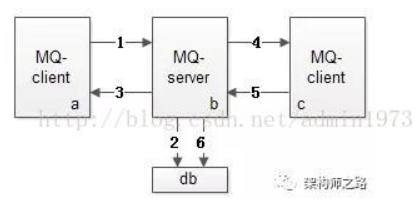

[TOC]


# 课堂主题

activemq消息中间件

# 课堂目标

* 理解JMS规范？
* 理解MOM是什么？
* 理解ActiveMQ是什么？
* 掌握生产者和消费者的使用（java api）
* 理解ActiveMQ的事务处理

# 知识要点

[TOC]

# ActiveMQ介绍篇

## JMS介绍

### JMS是什么

JMS的全称是**Java Message Service**，即Java消息服务。

JMS是SUN提出的旨在统一各种**MOM（Message-Oriented Middleware，面向消息服务）**系统接口的规范，它包含**点对点（Point to Point，PTP）**和**发布/订阅（Publish/Subscribe，pub/sub）**两种消息模型，提供**可靠消息传输、事务和消息过滤**等机制。

简单的说，**JMS制定了一套收发消息的规范**。是一套与具体平台无关的API，绝大多数MOM提供商都对JMS提供支持。


> **ActiveMQ是Apache出品的开源项目，它是JMS规范的一个实现。**

### MOM是什么

**MOM（Message-Oriented Middleware ）** ：**面向消息的中间件**，使用**消息中间件**来协调消息传输操作。

MOM需要提供API和管理工具。

* **客户端**调用api, 把消息发送到**消息中间件**指定的目的地。在消息发送之后，客户端会继续执行其他的工作。
* **接收方**收到这个消息确认之前，**消息中间件**一直保留该消息。


### JMS的作用是什么

在不同应用之间进行通信或者从一个系统传输数据到另外一个系统。两个应用程序之间，或[分布式系统](http://baike.baidu.com/view/991489.htm)中发送消息，进行**异步通信，完成程序或者应用之间的解耦**。

它主要用于在【生产者】和【消费者】之间进行消息传递，生产者负责产生消息，而消费者负责接收消息。把它应用到实际的业务需求中的话我们可以在特定的时候利用生产者生成消息，并进行发送，对应的消费者在接收到对应的消息后去完成对应的业务逻辑。

###  JMS的应用场景

主要可以应用于规模和复杂度较高的分布式系统：

* **异步通信**：客户发出调用后，不用等待服务对象完成处理并返回结果后就能继续执行；

* **客户和服务对象的生命周期解耦合**：客户进程和服务对象进程不需要都正常运行；如果由于服务对象崩溃或者网络故障导致客户的请求不可达，不会影响客户端想正常响应；

* **一对一或者一对多通信**：客户的一次调用可以发送给一个或者多个目标对象。


### JMS中的角色

JMS规范中存在三种角色：**生产者、消费者、消息中间件**

### JMS的消息模型

Java消息服务应用程序结构支持两种模型： 

#### 点对点模型(基于队列)

* **消息的生产者和消费者之间没有时间上的相关性。**
* 生产者把消息发送到队列中(**Queue**)，可以有多个发送者，但只能被一个消费者消费。一个消息只能被一个消费者消费一次 
* 消费者无需订阅，当消费者未消费到消息时就会处于阻塞状态 

#### 发布者/订阅者模型（基于主题的）

* **生产者和消费者之间有时间上的相关性**，订阅一个主题的消费者只能消费自它订阅之后发布的消息.
* 生产者将消息发送到主题上(**Topic**) 
* 消费者必须先订阅 ，**JMS规范允许提供客户端`创建持久订阅`**


> 注:持久化订阅者：特殊的消费者，告诉主题，我一直订阅着，即使网络断开，消息服务器也记住所有持久化订阅者，如果有新消息，也会知道必定有人会来消费。


### JMS消息发送模式

 

 

JMS消息发送模式有两种：**Queue模式（点对点模型）和Topic模式（发布订阅模型）**。

JMS消息有四个消息域：**Queue region、Topic region**、TempQueue域、TempTopic域。

这两种发送模式各自有对应的**Destination**（目的地）：**Queue（队列）和Topic（主题）**。

* **队列模式（Queue）**是对应点对点模型（Point To Point），即一个生产者对应一个消费者，可以有多个生产者，但只能拥有一个消费者。

  一个生产者向一个特定的队列发布消息，一个消费者从该队列中读取消息。这里，生产者知道消费者的队列，并直接将消息发送到消费者的队列。这种模式被概括为：只有一个消费者将获得消息。生产者不需要在接收者消费该消息期间处于运行状态，接收者也同样不需要在消息发送时处于运行状态。每一个成功处理的消息都由接收者签收。

* **主题模式（Topic）**是一对多的发布/订阅模式。即一个生产者可以对应多个消费者，消费者只需要订阅指定生产者的消息即可。

  **发布者／订阅者模式**支持向一个特定的消息主题发布消息。0或多个订阅者可能对接收来自特定消息主题的消息感兴趣。在这种模型下，发布者和订阅者彼此不知道对方。这种模式好比是匿名公告板。这种模式被概括为：多个消费者可以获得消息.在发布者和订阅者之间存在时间依赖性。发布者需要建立一个订阅（subscription），以便客户能够购订阅。订阅者必须保持持续的活动状态以接收消息，除非订阅者建立了持久的订阅。在那种情况下，在订阅者未连接时发布的消息将在订阅者重新连接时重新发布。


Topic发送模式


### JMS 消息组成

#### 消息头

#### 消息正文

JMS定义了五种不同的消息正文格式，以及调用的消息类型，允许你发送并接收以一些不同形式的数据，提供现有消息格式的一些级别的兼容性。

- StreamMessage -- Java原始值的数据流

- MapMessage--一套名称-值对

- **TextMessage**--一个字符串对象

- ObjectMessage--一个序列化的 Java对象

- BytesMessage--一个字节的数据流

#### 消息属性


###  JMS规范接口

* **ConnectionFactory** **接口**（连接工厂）

  用户用来创建到JMS提供者的连接的被管对象。JMS客户通过可移植的接口访问连接，这样当下层的实现改变时，代码不需要进行修改。 管理员在JNDI名字空间中配置连接工厂，这样，JMS客户才能够查找到它们。根据消息类型的不同，用户将使用队列连接工厂，或者主题连接工厂。

* **Connection** **接口**（连接）

  连接代表了应用程序和消息服务器之间的通信链路。在获得了连接工厂后，就可以创建一个与JMS提供者的连接。根据不同的连接类型，连接允许用户创建会话，以发送和接收队列和主题到目标。

* **Session** **接口**（会话）

  表示一个单线程的上下文，用于发送和接收消息。由于会话是单线程的，所以消息是连续的，就是说消息是按照发送的顺序一个一个接收的。会话的好处是它支持事务。如果用户选择了事务支持，会话上下文将保存一组消息，直到事务被提交才发送这些消息。在提交事务之前，用户可以使用回滚操作取消这些消息。一个会话允许用户创建消息生产者来发送消息，创建消息消费者来接收消息。

* **Destination** **接口**（目标）

  目标是一个包装了消息目标标识符的被管对象，消息目标是指消息发布和接收的地点，或者是队列，或者是主题。JMS管理员创建这些对象，然后用户通过JNDI发现它们。和连接工厂一样，管理员可以创建两种类型的目标，点对点模型的队列，以及发布者／订阅者模型的主题。

* **MessageConsumer** **接口**（消息消费者）

  由会话创建的对象，用于接收发送到目标的消息。消费者可以同步地（阻塞模式），或异步（非阻塞）接收队列和主题类型的消息。

* **MessageProducer** **接口**（消息生产者）

  由会话创建的对象，用于发送消息到目标。用户可以创建某个目标的发送者，也可以创建一个通用的发送者，在发送消息时指定目标。

* **Message** **接口**（消息）

  是在消费者和生产者之间传送的对象，也就是说从一个应用程序创送到另一个应用程序。一个消息有三个主要部分：

  * 消息头（必须）：包含用于识别和为消息寻找路由的操作设置。

  * 一组消息属性（可选）：包含额外的属性，支持其他提供者和用户的兼容。可以创建定制的字段和过滤器（消息选择器）。

  * 一个消息体（可选）：允许用户创建五种类型的消息（文本消息，映射消息，字节消息，流消息和对象消息）。

  消息接口非常灵活，并提供了许多方式来定制消息的内容。


### 小结

JMS是什么？是制定消息发送和接受的一套标准。

JMS的角色：生产者、消费者、MOM消息中间件

JMS消息模型：点对点模型、发布订阅模型

JMS消息域：Queue Region （存储点对点模型下发送的消息）、Topic Region（存储发布订阅模型下发送的信息）

JMS目的地（destination）：Queue中的目的地、Topic中的目的地

JMS消息正文：Stream、Map、Text、Byte、Object


## ActiveMQ介绍

### 什么是ActiveMQ

MQ，即Message Queue,就是消息队列的意思。

ActiveMQ 是**Apache**出品，最流行的，能力强劲的开源**消息总线**。ActiveMQ 是一个完全支持JMS1.1和J2EE 1.4规范的 **JMS Provider**实现，尽管JMS规范出台已经是很久的事情了,但是JMS在当今的J2EE应用中间仍然扮演着特殊的地位。

 

### ActiveMQ主要特点

1. 多种语言和协议编写客户端。语言: **Java**, C, C++, C#, Ruby, Perl, Python, PHP。应用协议: OpenWire,Stomp 、REST,WS Notification,XMPP,AMQP

2. 完全支持JMS1.1和J2EE 1.4规范 (持久化,XA消息,事务)

3. **对Spring的支持**,ActiveMQ可以很容易内嵌到使用Spring的系统里面去,而且也支持Spring2.0的特性

4. 通过了常见J2EE服务器(如 Geronimo,JBoss 4, GlassFish,WebLogic)的测试,其中通过JCA 1.5 resource adaptors的配置,可以让ActiveMQ可以自动的部署到任何兼容J2EE 1.4 商业服务器上

5. 支持多种传输协议:in-VM,TCP,SSL,NIO,UDP,JGroups,JXTA

6. 支持通过JDBC和journal提供高速的消息持久化

7. 从设计上保证了高性能的集群

8. 支持Ajax

9. 支持与Axis的整合

10. 可以很容易得调用内嵌JMS provider,进行测试


# ActiveMQ安装使用篇

## ActiveMQ安装

### 下载

下载地址：http://activemq.apache.org/download-archives.html

下载版本：5.15.2


### 安装

* **第一步：安装JDK，ActiveMQ是使用Java开发的**

  * 使用rz命令上传jdk-8u141-linux-x64.tar.gz压缩包

  * 解压缩

    ```bash
    tar -zxf jdk-8u141-linux-x64.tar.gz
    ```

  * 修改/etc/profile文件

    ```bas
    vim /etc/profile
    ```

    在最底部添加两行代码

    ```bash
    export JAVA_HOME=/kkb/soft/jdk1.8.0_141
    export PATH=$JAVA_HOME/bin:$PATH
    ```

  * 执行source操作

    ```bash
    source /etc/profile
    ```

  * 检查是否安装成功

    ```bash
    java -version
    ```

* **第二步：在线下载ActiveMQ或者上传已经下载好的ActiveMQ安装包**

  ```bash
  wget https://archive.apache.org/dist/activemq/5.15.2/apache-activemq-5.15.2-bin.tar.gz
  ```

* **第三步：解压缩**

  ```bash
  tar -zxf apache-activemq-5.15.2-bin.tar.gz
  ```

* **第四步：启动ActiveMQ**

  ```bash
  cd apache-activemq-5.15.2/bin/
  
  ./activemq start 
  ```

* **第五步：访问ActiveMQ后台**

  ```
  访问地址：http://192.168.10.135:8161/admin/
  用户名：admin
  密码：admin
  ```


### 访问出错问题解决

访问ActiveMQ后台管理系统出现Service Unavailable，解决步骤如下：

* 第一步：停止ActiveMQ

  ```bash
  /kkb/server/apache-activemq-5.12.0/bin/activemq stop
  ```

* 第二步：查看ActiveMQ后台

  ```bash
  /kkb/server/apache-activemq-5.12.0/bin/activemq console
  ```

   **查看控制台消息，找出错误原因：主机名未能正确解析**

* 第三步：修改hosts文件，添加本机hostname和ip地址的映射

  ```bash
  vim /etc/hosts
  ```


## ActiveMQ使用

### 创建demo工程

* 消息生产者：activemq-producer-demo工程（jar）

* 消息消费者：activemq-consumer-demo工程（jar）

### 添加maven依赖

在生产者和消费者所在的工程中，都需要添加ActiveMQ的依赖。

```xml
	<dependencies>
		<dependency>
			<groupId>org.apache.activemq</groupId>
			<artifactId>activemq-all</artifactId>
			<version>5.15.2</version>
		</dependency>
		<dependency>
			<groupId>junit</groupId>
			<artifactId>junit</artifactId>
			<version>4.12</version>
		</dependency>
	</dependencies>

	<build>
		<plugins>
			<plugin>
				<groupId>org.apache.maven.plugins</groupId>
				<artifactId>maven-compiler-plugin</artifactId>
				<configuration>
					<source>1.7</source>
					<target>1.7</target>
				</configuration>
			</plugin>
		</plugins>
	</build>  
```


 

### 点对点模式演示

#### Producer代码

activemq-producer-demo代码实现如下：

```java
	@Test
	public void testQueueProducer() throws Exception {
		// 第一步：创建ConnectionFactory，用于连接broker
		String brokerURL = "tcp://192.168.10.135:61616";
		ConnectionFactory connectionFactory = new 									
            							ActiveMQConnectionFactory(brokerURL);
		// 第二步：通过工厂，创建Connection
		Connection connection = connectionFactory.createConnection();
		// 第三步：连接启动
		connection.start();
		// 第四步：通过连接获取session会话
		// 第一个参数：是否启用ActiveMQ的事务，如果为true，第二个参数无用。
		// 第二个参数：应答模式,AUTO_ACKNOWLEDGE为自动应答
		Session session = connection.createSession(false, Session.AUTO_ACKNOWLEDGE);
		// 第五步：通过session创建destination，两种目的地：Queue、Topic
		// 参数：消息队列的名称，在后台管理系统中可以看到
		Queue queue = session.createQueue("kkb-queue");
		// 第六步：通过session创建MessageProducer
		MessageProducer producer = session.createProducer(queue);
		// 第七步：创建Message
		// 方式1：
		// TextMessage message = new ActiveMQTextMessage();
		// message.setText("queue test");
		// 方式2：
		TextMessage message = session.createTextMessage("你有男朋友吗？");
		// 第八步：通过producer发送消息
		producer.send(message);
		// 第九步：关闭资源
		producer.close();
		session.close();
		connection.close();
	}

```


#### Consumer代码

activemq-consumer-demo代码实现如下：

```java
	@Test
	public void testQueueConsumer() throws Exception {
		// 第一步：创建ConnectionFactory
		String brokerURL = "tcp://192.168.10.135:61616";
		ConnectionFactory connectionFactory = new 
            						ActiveMQConnectionFactory(brokerURL);
		// 第二步：通过工厂，创建Connection
		Connection connection = connectionFactory.createConnection();
		// 第三步：打开连接
		connection.start();
		// 第四步：通过Connection创建session
		Session session = connection.createSession(false, Session.AUTO_ACKNOWLEDGE);
		// 第五步：通过session创建Consumer
		Queue queue = session.createQueue("kkb-queue");
		MessageConsumer consumer = session.createConsumer(queue);
		// 第六步：通过consumer接收信息（两种方式：一种是receive方法接收，一种通过监听器接收）
		// 方式1：receive方法接收信息
		// while (true) { 
		// 		Message message = consumer.receive(100000); 
        //		if (message == null) break; 
        // 		第七步：处理信息 
        //		if (message instanceof TextMessage) {
		// 	 		TextMessage tm = (TextMessage) message;
		// 			System.out.println(tm.getText()); 
    	//		} 
		//	}
		
		// 方式2：监听器接收信息
		consumer.setMessageListener(new MessageListener() {

			@Override
			public void onMessage(Message message) {
				// 第七步：处理信息
				if (message instanceof TextMessage) {
					TextMessage tm = (TextMessage) message;
					try {
						String text = tm.getText();
						System.out.println(text);
					} catch (JMSException e) {
						// TODO Auto-generated catch block
						e.printStackTrace();
					}
				}
			}
		});
        // 如果使用监听器接收消息的话，消费者需要一直启动，方便监听器监听消息
		System.in.read();
		// 第八步：关闭资源
		consumer.close();
		session.close();
		connection.close();
	}
```

 

#### P2P模型特点(待完善)

* 如果session关闭时，有一些消息已经收到，但还没有被签收，那么当消费者下次连接到相同的队列时，消息还会被签收

* 如果用户在`receive`方法中设定了消息选择条件，那么不符合条件的消息会留在队列中不会被接收。

* 队列可以长久保存消息直到消息被消费者签收。消费者不需要担心因为消息丢失而时刻与jms provider保持连接状态


### 发布订阅模式演示

#### Producer代码

在activemq-producer-demo工程中编写测试代码

```java
	@Test
	public void testTopicProducer() throws Exception {
		// 第一步：创建ConnectionFactory
		String brokerURL = "tcp://192.168.10.135:61616";
		ConnectionFactory connectionFactory = new 
           	 						ActiveMQConnectionFactory(brokerURL);
		// 第二步：通过工厂，创建Connection
		Connection connection = connectionFactory.createConnection();
		// 第三步：连接启动
		connection.start();
		// 第四步：通过连接获取session会话
		// 第一个参数：是否启用ActiveMQ的事务，如果为true，第二个参数失效。
		// 第二个参数：应答模式,AUTO_ACKNOWLEDGE为自动应答
		Session session = connection.createSession(false, Session.AUTO_ACKNOWLEDGE);
		// 第五步：通过session创建destination，两种方式：Queue、Topic
		// 参数：主题的名称，在后台管理系统中可以看到
		Topic topic = session.createTopic("kkb-topic");
		// 第六步：通过session创建MessageProducer
		MessageProducer producer = session.createProducer(topic);
		// 第七步：创建Message
		TextMessage message = session.createTextMessage("我想找个女朋友");
		// 第八步：通过producer发送消息
		producer.send(message);
		// 第九步：关闭资源
		producer.close();
		session.close();
		connection.close();
	}

```

#### Consumer代码

在activemq-consumer-demo工程中编写测试代码：

```java
	@Test
	public void testTopicConsumer() throws Exception {
		// 第一步：创建ConnectionFactory
		String brokerURL = "tcp://192.168.10.135:61616";
		ConnectionFactory connectionFactory = new 
            						ActiveMQConnectionFactory(brokerURL);
		// 第二步：通过工厂，创建Connection
		Connection connection = connectionFactory.createConnection();
		// 第三步：打开连接
		connection.start();
		// 第四步：通过Connection创建session
		Session session = connection.createSession(false, Session.AUTO_ACKNOWLEDGE);
		// 第五步：通过session创建Consumer
		Topic topic = session.createTopic("kkb-topic");
		MessageConsumer consumer = session.createConsumer(topic);
		// 第六步：通过consumer接收信息:通过监听器接收
		consumer.setMessageListener(new MessageListener() {
			@Override
			public void onMessage(Message message) {
				// 第七步：处理信息
				if (message instanceof TextMessage) {
					TextMessage tm = (TextMessage) message;
					try {
						String text = tm.getText();
						System.out.println(text);
					} catch (JMSException e) {
						// TODO Auto-generated catch block
						e.printStackTrace();
					}
				}
			}
		});
        // 如果使用监听器接收消息的话，消费者需要一直启动，方便监听器监听消息
		System.in.read();
		// 第八步：关闭资源
		consumer.close();
		session.close();
		connection.close();
	}

```


### 自定义BrokerServer

**编写代码：**

```java
public class MyBrokerServer{
    public static void main(String[] args){
        BrokerService brokerService = new BrokerService();
        try{
            brokerService.setUseJmx(true);
            brokerService.addConnector("tcp://localhost:61616");
            brokerService.start();
        }catch(Exception e){
            e.printStackTrace();
        }
    }
}
```

**测试思路：**

1. 测试P2P模型的消息。
2. 修改生产者的brokerURL为：tcp://localhost:61616
3. 修改消费者的brokerURL为：tcp://localhost:61616


## ActiveMQ整合Spring

### ConnectionFactory配置

不管是生产者还是消费者都需要配置ConnectionFactory，在activemq-producer-demo和activemq-consumer-demo工程中分创建applicationContext-activemq.xml，添加以下内容：

```xml
<?xml version="1.0" encoding="UTF-8"?>
<beans xmlns="http://www.springframework.org/schema/beans"
	xmlns:xsi="http://www.w3.org/2001/XMLSchema-instance"
	xsi:schemaLocation="http://www.springframework.org/schema/beans http://www.springframework.org/schema/beans/spring-beans-4.0.xsd">

	<!-- 真正可以产生Connection的ConnectionFactory，由对应的 JMS服务厂商提供 -->
	<bean id="targetConnectionFactory" 
          			class="org.apache.activemq.ActiveMQConnectionFactory">
		<property name="brokerURL" value="tcp://192.168.10.135:61616" />
        <property name="userName" value="admin"></property>  
        <property name="password" value="admin"></property>  
        <property name="useAsyncSend" value="true" />  
	</bean>
    
    <!-- ActiveMQ为我们提供了一个PooledConnectionFactory -->
    <!-- 通过往里面注入一个ActiveMQConnectionFactory，它可以用来将Connection、Session和MessageProducer池化，这样可以大大的减少我们的资源消耗 -->
    <!-- 要依赖于 activemq-pool包 -->  
    <bean id="pooledConnectionFactory" 	
          			class="org.apache.activemq.pool.PooledConnectionFactory">  
        <property name="connectionFactory" ref="targetConnectionFactory" />  
        <property name="maxConnections" value="100" />  
    </bean>
    
	<!-- Spring用于管理真正的ConnectionFactory的ConnectionFactory -->
	<bean id="connectionFactory"
		class="org.springframework.jms.connection.SingleConnectionFactory">
		<!--消费者标示id -->  
        <property name="clientId" value="clientId_002" />  
        <!-- 目标ConnectionFactory对应真实的可以产生Connection的ConnectionFactory --> 
        <property name="targetConnectionFactory" ref="pooledConnectionFactory" /> 
	</bean>
</beans>


```

 

### 生产者配置

#### 测试代码

```java
@RunWith(SpringJunit4ClassRunner.class)
@ContextConfiguration(locations="classpath:spring/applicationContext-activemq.xml")
public class TestProducer{
    
	@Resource
    private JmsTemplate jmsTemplate ; 
	
    @Resource(name="kkb-queue")
    private Destination destination ;
        
	@Test
	public void testSpringProducer() {		
		// 通过jmstemplate发送消息
		jmsTemplate.send(destination, new MessageCreator() {
			@Override
			public Message createMessage(Session session) throws JMSException {
				return session.createTextMessage("hello activemq);
			}
		});
	}
}
```

 

#### Spring配置文件

 在生产者的applicationContext-activemq.xml中添加以下内容：  

```xml
	<!-- 配置生产者 -->
	<!-- Spring提供的JMS工具类，它可以进行消息发送、接收等 -->
	<bean class="org.springframework.jms.core.JmsTemplate">
		<!--这个connectionFactory对应的是我们定义的Spring提供的那个ConnectionFactory对象-->
		<property name="connectionFactory" ref="connectionFactory" />
	</bean>
	<!--这个是队列目的地，点对点的 -->
	<bean id="kkb-queue" class="org.apache.activemq.command.ActiveMQQueue">
		<constructor-arg>
			<value>kkb-queue</value>
		</constructor-arg>
	</bean>
	<!--这个是主题目的地，一对多的 -->
	<bean id="topicDestination" class="org.apache.activemq.command.ActiveMQTopic">
		<constructor-arg value="topic" />
	</bean>

```


### 消费者配置

那么消费者是通过Spring为我们封装的消息监听容器MessageListenerContainer实现的，它负责接收信息，并把接收到的信息分发给真正的MessageListener进行处理。每个消费者对应每个目的地都需要有对应的MessageListenerContainer。

对于消息监听容器而言，除了要知道监听哪个目的地之外，还需要知道到哪里去监听，也就是说它还需要知道去监听哪个JMS服务器，这是通过在配置MessageConnectionFactory的时候往里面注入一个ConnectionFactory来实现的。

所以在配置一个MessageListenerContainer的时候有三个属性必须指定：

1、一个是表示从哪里监听的ConnectionFactory

2、一个是表示监听什么的Destination；

3、一个是接收到消息以后进行消息处理的MessageListener。

常用的MessageListenerContainer实现类是DefaultMessageListenerContainer。

 

#### 测试代码

  

```java
@RunWith(SpringJunit4ClassRunner.class)
@ContextConfiguration(locations="classpath:spring/applicationContext-activemq.xml")
public class TestConsumer{
    
	@Test
	public void testSpringConsumer() {		
		System.in.read();
	}
}
```

 

#### Spring配置文件

 

```xml
	<!-- 配置消费者 -->
	<!-- 配置MessageListener -->
	<bean id="myMsgListener" class="cn.edu.activemq.listener.MyMessageListener"/>

     <bean id="kkb-queue" class="org.apache.activemq.command.ActiveMQQueue">
		<constructor-arg>
			<value>kkb-queue</value>
		</constructor-arg>
	</bean>

	<!-- 配置MessageListenerContainer -->
	<bean id="jmsContainer"
		class="org.springframework.jms.listener.DefaultMessageListenerContainer">
		<property name="connectionFactory" ref="connectionFactory" />
		<property name="destination" ref="kkb-queue" />
		<property name="messageListener" ref="myMsgListener" />
                                                                
  	</bean>
```


#### MessageListener

```java
public class MyMessageListener implements MessageListener {

	@Override
	public void onMessage(Message message) {
		// 根据不同业务逻辑进行相应处理
		System.out.println(message);
	}
}
```


# 可靠性消息机制

## 一条消息的生命周期


图片中简单的描述了一条消息的生命周期,一条消息从producer端发出之后，一旦被broker正确保存，那么它将会被consumer消费，然后ACK，broker端才会删除；不过当消息过期或者存储设备溢出时，也会终结它。

## ACK模式

JMS API中约定了Client端可以使用四种ACK模式：

- *AUTO_ACKNOWLEDGE* = 1    客户端自动确认
- *CLIENT_ACKNOWLEDGE* = 2    客户端手动确认   
- *DUPS_OK_ACKNOWLEDGE* = 3    自动批量确认
- *SESSION_TRANSACTED* = 0    事务提交时确认

此外AcitveMQ补充了一个自定义的ACK模式:

- *INDIVIDUAL_ACKNOWLEDGE* = 4    单条消息确认


> 我们在开发JMS应用程序的时候,会经常使用到上述ACK模式,其中"INDIVIDUAL_ACKNOWLEDGE "只有ActiveMQ支持,当然开发者也可以使用它. ACK模式描述了Consumer与broker确认消息的方式(时机),比如当消息被Consumer接收之后,Consumer将在何时确认消息。对于broker而言，只有接收到ACK指令,才会认为消息被正确的接收或者处理成功了,通过ACK，可以在consumer（/producer）与Broker之间建立一种简单的“担保”机制. 

## ACK类型

Client端指定了ACK模式,但是在Client与broker在交换ACK指令的时候,还需要告知ACK_TYPE,ACK_TYPE表示此确认指令的类型，不同的ACK_TYPE将传递着消息的状态，broker可以根据不同的ACK_TYPE对消息进行不同的操作。

比如Consumer消费消息时出现异常,就需要向broker发送ACK指令,ACK_TYPE为"REDELIVERED_ACK_TYPE",那么broker就会重新发送此消息。在JMS API中并没有定义ACT_TYPE,因为它通常是一种内部机制,并不会面向开发者。ActiveMQ中定义了如下几种ACK_TYPE(参看MessageAck类):

 

- *DELIVERED_ACK_TYPE* = 0	  消息"已接收"，但尚未处理结束
- *STANDARD_ACK_TYPE* = 2     "标准"类型,通常表示为消息"处理成功"，broker端可以删除消息了
- *POSION_ACK_TYPE* = 1       消息"错误",通常表示"抛弃"此消息，比如消息重发多次后，都无法正确处理时，消息将会被删除或者DLQ(死信队列)
- *REDELIVERED_ACK_TYPE* = 3   消息需"重发"，比如consumer处理消息时抛出了异常，broker稍后会重新发送此消息
- *INDIVIDUAL_ACK_TYPE* = 4    表示只确认"单条消息",无论在任何ACK_MODE下    
- *UNMATCHED_ACK_TYPE* = 5    在Topic中，如果一条消息在转发给“订阅者”时，发现此消息不符合Selector过滤条件，那么此消息将 不会转发给订阅者，消息将会被存储引擎删除(相当于在Broker上确认了消息)。


到目前为止,我们已经清楚了大概的原理: 

```
Client端在不同的ACK模式时,将意味着在不同的时机发送ACK指令,每个ACK Command中会包含ACK_TYPE,那么broker端就可以根据ACK_TYPE来决定此消息的后续操作. 接下来,我们详细的分析ACK模式与ACK_TYPE.
```


我们需要在创建Session时指定ACK模式,由此可见,ACK模式将是session共享的,意味着一个session下所有的 consumer都使用同一种ACK模式。在创建Session时,开发者不能指定除ACK模式列表之外的其他值。

* 如果此session为事务类型,用户指定的ACK模式将被忽略,而强制使用"SESSION_TRANSACTED"类型;
* 如果session非事务类型时,也将不能将 ACK模式设定为"SESSION_TRANSACTED",毕竟这是相悖的。   


消费者消费消息的方式有两种: **同步/异步**

* 使用consumer.receive()就是同步，使用messageListener就是异步；
* 在同一个consumer中，我们不能同时使用这2种风格，比如在使用listener的情况下，当调用receive()方法将会获得一个Exception。


两种风格下，消息确认时机有所不同：

* 同步调用时，在消息从receive方法返回之前，就已经调用了ACK；因此如果Client端没有处理成功，此消息将丢失(可能重发，与ACK模式有关)。
* 基于异步调用时，消息的确认是在onMessage方法返回之后，如果onMessage方法异常，会导致消息不能被ACK，会触发重发。


## ACK模式详解

### AUTO_ACKNOWLEDGE

自动确认,这就意味着消息的确认时机将有consumer择机确认."择机确认"似乎充满了不确定性,这也意味着,开发者必须明确知道"择机确认"的具体时机,否则将有可能导致消息的丢失,或者消息的重复接收.

那么在ActiveMQ中,AUTO_ACKNOWLEDGE是如何运作的呢?

1. 对于consumer而言，optimizeAcknowledge属性只会在AUTO_ACK模式下有效。

2. 其中DUPS_ACKNOWLEGE也是一种潜在的AUTO_ACK,只是确认消息的条数和时间上有所不同。 

3. 在“同步”(receive)方法返回message之前,会检测optimizeACK选项是否开启，如果没有开启，此单条消息将立即确认，所以在这种情况下，message返回之后，如果开发者在处理message过程中出现异常，会导致此消息也不会redelivery,即"潜在的消息丢失"；如果开启了optimizeACK，则会在unAck数量达到prefetch * 0.65时确认，当然我们可以指定prefetchSize = 1来实现逐条消息确认。

4. 在"异步"(messageListener)方式中,将会首先调用listener.onMessage(message),此后再ACK,如果onMessage方法异常,将导致client端补充发送一个ACK_TYPE为REDELIVERED_ACK_TYPE确认指令；如果onMessage方法正常,消息将会正常确认(STANDARD_ACK_TYPE)。此外需要注意，消息的重发次数是有限制的，每条消息中都会包含“redeliveryCounter”计数器，用来表示此消息已经被重发的次数，如果重发次数达到阀值，将会导致发送一个ACK_TYPE为POSION_ACK_TYPE确认指令,这就导致broker端认为此消息无法消费,此消息将会被删除或者迁移到"dead letter"通道中。

​    

​    因此当我们使用messageListener方式消费消息时，通常建议在onMessage方法中使用try-catch,这样可以在处理消息出错时记录一些信息，而不是让consumer不断去重发消息；如果你没有使用try-catch,就有可能会因为异常而导致消息重复接收的问题,需要注意你的onMessage方法中逻辑是否能够兼容对重复消息的判断

 

### CLIENT_ACKNOWLEDGE 

客户端手动确认，这就意味着AcitveMQ将不会“自作主张”的为你ACK任何消息，开发者需要自己择机确认。在此模式下，开发者需要需要关注几个方法：

1) message.acknowledge()

2) ActiveMQMessageConsumer.acknowledege()

3) ActiveMQSession.acknowledge()

其1)和3)是等效的，将当前session中所有consumer中尚未ACK的消息都一起确认，2)只会对当前consumer中那些尚未确认的消息进行确认。开发者可以在合适的时机必须调用一次上述方法。为了避免混乱，对于这种ACK模式下，建议一个session下只有一个consumer。

 

我们通常会在基于Group(消息分组)情况下会使用CLIENT_ACKNOWLEDGE，我们将在一个group的消息序列接受完毕之后确认消息(组)；不过当你认为消息很重要，只有当消息被正确处理之后才能确认时，也可以使用此模式。

 

如果开发者忘记调用acknowledge方法，将会导致当consumer重启后，会接受到重复消息，因为对于broker而言，那些尚未真正ACK的消息被视为“未消费”。


开发者可以在当前消息处理成功之后，立即调用message.acknowledge()方法来"逐个"确认消息，这样可以尽可能的减少因网络故障而导致消息重发的个数；当然也可以处理多条消息之后，间歇性的调用acknowledge方法来一次确认多条消息，减少ack的次数来提升consumer的效率，不过这仍然是一个利弊权衡的问题。

 

除了message.acknowledge()方法之外，ActiveMQMessageConumser.acknowledge()和ActiveMQSession.acknowledge()也可以确认消息，只不过前者只会确认当前consumer中的消息。其中sesson.acknowledge()和message.acknowledge()是等效的。

 

无论是“同步”/“异步”，ActiveMQ都不会发送STANDARD_ACK_TYPE，直到message.acknowledge()调用。如果在client端未确认的消息个数达到prefetchSize * 0.5时，会补充发送一个ACK_TYPE为DELIVERED_ACK_TYPE的确认指令，这会触发broker端可以继续push消息到client端。

 

在broker端，针对每个Consumer，都会保存一个因为"DELIVERED_ACK_TYPE"而“拖延”的消息个数，这个参数为prefetchExtension，事实上这个值不会大于prefetchSize * 0.5,因为Consumer端会严格控制DELIVERED_ACK_TYPE指令发送的时机(参见ActiveMQMessageConsumer.ackLater方法)，broker端通过“prefetchExtension”与prefetchSize互相配合，来决定即将push给client端的消息个数，count = prefetchExtension + prefetchSize - dispatched.size()，其中dispatched表示已经发送给client端但是还没有“STANDARD_ACK_TYPE”的消息总量；由此可见，在CLIENT_ACK模式下，足够快速的调用acknowledge()方法是决定consumer端消费消息的速率；如果client端因为某种原因导致acknowledge方法未被执行，将导致大量消息不能被确认，broker端将不会push消息，事实上client端将处于“假死”状态，而无法继续消费消息。我们要求client端在消费1.5*prefetchSize个消息之前，必须acknowledge()一次；通常我们总是每消费一个消息调用一次，这是一种良好的设计。

 

此外需要额外的补充一下：所有ACK指令都是依次发送给broker端，在CLIET_ACK模式下，消息在交付给listener之前，都会首先创建一个DELIVERED_ACK_TYPE的ACK指令，直到client端未确认的消息达到"prefetchSize * 0.5"时才会发送此ACK指令，如果在此之前，开发者调用了acknowledge()方法，会导致消息直接被确认(STANDARD_ACK_TYPE)。broker端通常会认为“DELIVERED_ACK_TYPE”确认指令是一种“slow consumer”信号，如果consumer不能及时的对消息进行acknowledge而导致broker端阻塞，那么此consumer将会被标记为“slow”，此后queue中的消息将会转发给其他Consumer。

 

### DUPS_OK_ACKNOWLEDGE

"消息可重复"确认，意思是此模式下，可能会出现重复消息，并不是一条消息需要发送多次ACK才行。它是一种潜在的"AUTO_ACK"确认机制，为批量确认而生，而且具有“延迟”确认的特点。对于开发者而言，这种模式下的代码结构和AUTO_ACKNOWLEDGE一样，不需要像CLIENT_ACKNOWLEDGE那样调用acknowledge()方法来确认消息。

 

1. 在ActiveMQ中，如果在Destination是Queue通道，我们真的可以认为DUPS_OK_ACK就是“AUTO_ACK + optimizeACK + (prefetch > 0)”这种情况，在确认时机上几乎完全一致；此外在此模式下，如果prefetchSize =1 或者没有开启optimizeACK，也会导致消息逐条确认，从而失去批量确认的特性。

2. 如果Destination为Topic，DUPS_OK_ACKNOWLEDGE才会产生JMS规范中诠释的意义，即无论optimizeACK是否开启，都会在消费的消息个数>=prefetch * 0.5时，批量确认(STANDARD_ACK_TYPE),在此过程中，不会发送DELIVERED_ACK_TYPE的确认指令,这是1)和AUTO_ACK的最大的区别。

 

这也意味着，当consumer故障重启后，那些尚未ACK的消息会重新发送过来。

 

### SESSION_TRANSACTED

当session使用事务时，就是使用此模式。在事务开启之后，和session.commit()之前，所有消费的消息，要么全部正常确认，要么全部redelivery。这种严谨性，通常在基于GROUP(消息分组)或者其他场景下特别适合。在SESSION_TRANSACTED模式下，optimizeACK并不能发挥任何效果,因为在此模式下，optimizeACK会被强制设定为false，不过prefetch仍然可以决定DELIVERED_ACK_TYPE的发送时机。

 

因为Session非线程安全，那么当前session下所有的consumer都会共享同一个transactionContext；同时建议，一个事务类型的Session中只有一个Consumer，以避免rollback()或者commit()方法被多个consumer调用而造成的消息混乱。

​    

当consumer接受到消息之后，首先检测TransactionContext是否已经开启，如果没有，就会开启并生成新的transactionId，并把信息发送给broker；此后将检测事务中已经消费的消息个数是否 >= prefetch * 0.5,如果大于则补充发送一个“DELIVERED_ACK_TYPE”的确认指令；这时就开始调用onMessage()方法，如果是同步(receive),那么即返回message。上述过程，和其他确认模式没有任何特殊的地方。

   

当开发者决定事务可以提交时，必须调用session.commit()方法，commit方法将会导致当前session的事务中所有消息立即被确认；事务的确认过程中，首先把本地的deliveredMessage队列中尚未确认的消息全部确认(STANDARD_ACK_TYPE)；此后向broker发送transaction提交指令并等待broker反馈，如果broker端事务操作成功，那么将会把本地deliveredMessage队列清空，新的事务开始；如果broker端事务操作失败(此时broker已经rollback)，那么对于session而言，将执行inner-rollback，这个rollback所做的事情，就是将当前事务中的消息清空并要求broker重发(REDELIVERED_ACK_TYPE),同时commit方法将抛出异常。

 

当session.commit方法异常时，对于开发者而言通常是调用session.rollback()回滚事务(事实上开发者不调用也没有问题)，当然你可以在事务开始之后的任何时机调用rollback(),rollback意味着当前事务的结束，事务中所有的消息都将被重发。需要注意，无论是inner-rollback还是调用session.rollback()而导致消息重发，都会导致message.redeliveryCounter计数器增加，最终都会受限于brokerUrl中配置的"jms.redeliveryPolicy.maximumRedeliveries",如果rollback的次数过多，而达到重发次数的上限时，消息将会被DLQ(dead letter)。

 

### INDIVIDUAL_ACKNOWLEDGE

单条消息确认，这种确认模式，我们很少使用，它的确认时机和CLIENT_ACKNOWLEDGE几乎一样，当消息消费成功之后，需要调用message.acknowledege来确认此消息(单条)，而CLIENT_ACKNOWLEDGE模式先message.acknowledge()方法将导致整个session中所有消息被确认(批量确认)。


## optimizeACK

"可优化的ACK"，这是ActiveMQ对于consumer在消息消费时，对消息ACK的优化选项，也是consumer端最重要的优化参数之一，

1) 在**brokerUrl**中，设置`optimizeAcknowledge`、`optimizeAcknowledgeTimeOut`及`redeliveryPolicy`： 

```java
String brokerUrl = "tcp://localhost:61616?" +   "jms.optimizeAcknowledge=true" +   "&jms.optimizeAcknowledgeTimeOut=30000" +   "&jms.redeliveryPolicy.maximumRedeliveries=6";  

ActiveMQConnectionFactory factory = new ActiveMQConnectionFactory(brokerUrl); 
```

 2) 在**destinationUri**中，设置**prefetchSize**：

```java
String queueName = "test-queue?customer.prefetchSize=100";  
Session session = connection.createSession(false, Session.AUTO_ACKNOWLEDGE);  
Destination queue = session.createQueue(queueName); 
```

我们需要在brokerUrl指定optimizeACK选项，在destinationUri中指定prefetchSize(预获取)选项，其中brokerUrl参数选项是全局的，即当前factory下所有的connection/session/consumer都会默认使用这些值；而destinationUri中的选项，只会在使用此destination的consumer实例中有效；如果同时指定，brokerUrl中的参数选项值将会被覆盖。optimizeAck表示是否开启“优化ACK”，只有在为true的情况下，prefetchSize(下文中将会简写成prefetch)以及optimizeAcknowledgeTimeout参数才会有意义。此处需要注意"optimizeAcknowledgeTimeout"选项只能在brokerUrl中配置。

prefetch值建议在destinationUri中指定，因为在brokerUrl中指定比较繁琐；在brokerUrl中，queuePrefetchSize和topicPrefetchSize都需要单独设定："&jms.prefetchPolicy.queuePrefetch=12&jms.prefetchPolicy.topicPrefetch=12"等来逐个指定。

 

如果prefetchACK为true，那么prefetch必须大于0；当prefetchACK为false时，你可以指定prefetch为0以及任意大小的正数。不过，当prefetch=0是，表示consumer将使用PULL(拉取)的方式从broker端获取消息，broker端将不会主动push消息给client端，直到client端发送PullCommand时；当prefetch>0时，就开启了broker push模式，此后只要当client端消费且ACK了一定的消息之后，会立即push给client端多条消息。

 

当consumer端使用receive()方法同步获取消息时，prefetch可以为0和任意正值；当prefetch=0时，那么receive()方法将会首先发送一个PULL指令并阻塞，直到broker端返回消息为止，这也意味着消息只能逐个获取(类似于Request<->Response)，这也是Activemq中PULL消息模式；当prefetch > 0时，broker端将会批量push给client 一定数量的消息(<= prefetch),client端会把这些消息(unconsumedMessage)放入到本地的队列中，只要此队列有消息，那么receive方法将会立即返回，当一定量的消息ACK之后，broker端会继续批量push消息给client端。

 

当consumer端使用MessageListener异步获取消息时，这就需要开发设定的prefetch值必须 >=1,即至少为1；在异步消费消息模式中，设定prefetch=0,是相悖的，也将获得一个Exception。

 

此外，我们还可以brokerUrl中配置“redelivery”策略，比如当一条消息处理异常时，broker端可以重发的最大次数；和下文中提到REDELIVERED_ACK_TYPE互相协同。当消息需要broker端重发时，consumer会首先在本地的“deliveredMessage队列”(Consumer已经接收但还未确认的消息队列)删除它，然后向broker发送“REDELIVERED_ACK_TYPE”类型的确认指令，broker将会把指令中指定的消息重新添加到pendingQueue(亟待发送给consumer的消息队列)中，直到合适的时机，再次push给client。

 

到目前为止，或许你知道了optimizeACK和prefeth的大概意义，不过我们可能还会有些疑惑！！optimizeACK和prefetch配合，将会达成一个高效的消息消费模型：**批量获取消息，并“延迟”确认(ACK)**。**prefetch表达了“批量获取”消息的语义**，broker端主动的批量push多条消息给client端，总比client多次发送PULL指令然后broker返回一条消息的方式要优秀很多，它不仅减少了client端在获取消息时阻塞的次数和阻塞的时间，还能够大大的减少网络开支。**optimizeACK表达了“延迟确认”的语义(ACK时机)**，client端在消费消息后暂且不发送ACK，而是把它缓存下来(pendingACK)，等到这些消息的条数达到一定阀值时，只需要通过一个ACK指令把它们全部确认；这比对每条消息都逐个确认，在性能上要提高很多。由此可见，prefetch优化了消息传送的性能，optimizeACK优化了消息确认的性能。

 

当consumer端消息消费的速率很高(相对于producer生产消息)，而且消息的数量也很大时(比如消息源源不断的生产)，我们使用optimizeACK + prefetch将会极大的提升consumer的性能。不过反过来：

1) 如果consumer端消费速度很慢(对消息的处理是耗时的)，过大的prefetchSize，并不能有效的提升性能，反而不利于consumer端的负载均衡(只针对queue)；按照良好的设计准则，当consumer消费速度很慢时，我们通常会部署多个consumer客户端，并使用较小的prefetch，同时关闭optimizeACK，可以让消息在多个consumer间“负载均衡”(即均匀的发送给每个consumer)；如果较大的prefetchSize，将会导致broker一次性push给client大量的消息，但是这些消息需要很久才能ACK(消息积压)，而且在client故障时，还会导致这些消息的重发。

 

2) 如果consumer端消费速度很快，但是producer端生成消息的速率较慢，比如生产者10秒钟生成10条消息，但是consumer一秒就能消费完毕，而且我们还部署了多个consumer！！这种场景下，建议开启optimizeACK，但是需要设置的prefetchSize不能过大；这样可以保证每个consumer都能有"活干"，否则将会出现一个consumer非常忙碌，但是其他consumer几乎收不到消息。

 

3) 如果消息很重要，特别是不愿意接收到”redelivery“的消息，那么我们需要将optimizeACK=false，prefetchSize=1

 

既然optimizeACK是”延迟“确认，那么就引入一种潜在的风险：在消息被消费之后还没有来得及确认时，client端发生故障，那么这些消息就有可能会被重新发送给其他consumer，那么这种风险就需要client端能够容忍“重复”消息。

 

prefetch值默认为1000，当然这个值可能在很多场景下是偏大的；我们暂且不考虑ACK模式(参见下文)，通常情况下，我们只需要简单的统计出单个consumer每秒的最大消费消息数即可，比如一个consumer每秒可以处理100个消息，我们期望consumer端每2秒确认一次，那么我们的prefetchSize可以设置为100 * 2 /0.65大概为300。无论如何设定此值，client持有的消息条数最大为：prefetch + “DELIVERED_ACK_TYPE消息条数”(DELIVERED_ACK_TYPE参见下文)

 

**即使当optimizeACK为true，也只会当session的ACK模式为AUTO_ACKNOWLEDGE时才会生效**，即在其他类型的ACK模式时consumer端仍然不会“延迟确认”，即:

　　

```java
consumer.optimizeAck = connection.optimizeACK && session.isAutoAcknowledge()
```

当consumer.optimizeACK有效时，如果客户端已经消费但尚未确认的消息(deliveredMessage)达到prefetch * 0.65，consumer端将会自动进行ACK；同时如果离上一次ACK的时间间隔，已经超过"optimizeAcknowledgeTimout"毫秒，也会导致自动进行ACK。

 

此外简单的补充一下，批量确认消息时，只需要在ACK指令中指明“firstMessageId”和“lastMessageId”即可，即消息区间，那么broker端就知道此consumer(根据consumerId识别)需要确认哪些消息。

## 消息重复消费

**最后让我们想一下，如何保证消息队列做最终一致性的时候消息不会丢失和重复消费呢？**

**我们可以通过幂等的方式实现。所谓的幂等就是多次调用，结果和一次调用一致。即我们通过生产者发送消息带一个MessageID来到Broker，Broker已经收到了，返回ACK给生产者，如果此时发生网络故障了，生产者没收到ACK，生产者以为Broker没收到ACK,生产者重传消息。这样造成重复消费，如果我们通过通过生产者发送消息带一个MessageID来到Broker，Broker记录这个MessageID，Broker已经收到了，返回ACK给生产者，如果此时发生网络故障了，生产者没收到ACK，生产者以为Broker没收到ACK,生产者重传消息并再次附带MessageID,Broker根据这个MessageID核对本地是否有这个MessageID,如果有，返回ACK给生产者，对生产者再次发来的Message丢弃不管。这样就解决了队列做最终一致性的时候消息不会丢失和重复消费。**

### 缘起

　　《[消息总线消息必达](http://mp.weixin.qq.com/s?__biz=MjM5ODYxMDA5OQ==&mid=2651959966&idx=1&sn=068a2866dcc49335d613d75c4a5d1b17&chksm=bd2d07428a5a8e54162ad8ea8e1e9302dfaeb664cecc453bd16a5f299820755bd2e1e0e17b60&scene=21#wechat_redirect)》所述，MQ消息必达，架构上有两个核心设计点：

　　（1）消息落地

　　（2）消息超时、重传、确认

 

　　

 

　　再次回顾消息总线核心架构，它由**发送端、服务端、固化存储、接收端**四大部分组成。

 

　　为保证消息的可达性，超时、重传、确认机制可能导致消息总线、或者业务方**收到重复的消息**，从而对业务产生影响。

 

　　举个例子：

　　购买会员卡，上游支付系统负责给用户扣款，下游系统负责给用户发卡，通过MQ异步通知。不管是上半场的ACK丢失，导致MQ收到重复的消息，还是下半场ACK丢失，导致购卡系统收到重复的购卡通知，都可能出现，上游扣了一次钱，下游发了多张卡。

 

　　**消息总线的幂等性设计**至关重要，是本文将要讨论的重点。

 

### 上半场的幂等性设计

　　

 

　　MQ消息发送上半场，即上图中的1-3

　　1，发送端MQ-client将消息发给服务端MQ-server

　　2，服务端MQ-server将消息落地

　　3，服务端MQ-server回ACK给发送端MQ-client

　　如果3丢失，发送端MQ-client超时后会重发消息，可能导致服务端MQ-server收到重复消息。

 

　　此时重发是MQ-client发起的，消息的处理是MQ-server，为了避免步骤2落地重复的消息，对每条消息，**MQ系统内部必须生成一个inner-msg-id**，作为去重和幂等的依据，这个内部消息ID的特性是：

　　（1）全局唯一

　　（2）MQ生成，具备业务无关性，对消息发送方和消息接收方屏蔽

 

　　**有了这个inner-msg-id，就能保证上半场重发，也只有1条消息落到MQ-server的DB中，实现上半场幂等。**

 

### 下半场的幂等性设计



 

MQ消息发送下半场，即上图中的4-6

4，服务端MQ-server将消息发给接收端MQ-client

5，接收端MQ-client回ACK给服务端

6，服务端MQ-server将落地消息删除

需要强调的是，接收端MQ-client回ACK给服务端MQ-server，是消息消费业务方的主动调用行为，不能由MQ-client自动发起，因为MQ系统不知道消费方什么时候真正消费成功。

如果5丢失，服务端MQ-server超时后会重发消息，可能导致MQ-client收到重复的消息。

 

此时重发是MQ-server发起的，消息的处理是消息消费业务方，消息重发势必导致业务方重复消费（上例中的一次付款，重复发卡），为了保证业务幂等性**，业务消息体中，必须有一个biz-id**，作为去重和幂等的依据，这个业务ID的特性是：

（1）对于同一个业务场景，全局唯一

（2）由业务消息发送方生成，业务相关，对MQ透明

（3）由业务消息消费方负责判重，以保证幂等

 

最常见的业务ID有：支付ID，订单ID，帖子ID等。

 

具体到支付购卡场景，发送方必须将支付ID放到消息体中，消费方必须对同一个支付ID进行判重，保证购卡的幂等。

 

**有了这个业务ID，才能够保证下半场消息消费业务方即使收到重复消息，也只有1条消息被消费，保证了幂等。**

 

**三、总结**

MQ为了保证消息必达，消息上下半场均可能发送重复消息，如何保证消息的幂等性呢？

**上半场**

MQ-client生成inner-msg-id，保证上半场幂等。

这个ID全局唯一，业务无关，由MQ保证。

 

**下半场**

业务**发送方**带入biz-id，业务**接收方去重**保证幂等。

这个ID对单业务唯一，业务相关，对MQ透明。

 

结论：幂等性，不仅对MQ有要求，对业务上下游也有要求。

　　

 

 

**结语：**到目前为止，我们已经已经简单的了解了ActiveMQ中消息传送机制，还有JMS中ACK策略，重点分析了optimizeACK的策略，希望开发者能够在使用activeMQ中避免一些不必要的错误。


## 消息确认

JMS消息只有在被消费者确认之后,才认为已经被成功地消费了。

**消息的【成功消费】通常包含三个阶段:** 

 - 客户接收消息
 - 客户处理消息
 - 消息被确认


**消息如何被确认呢？**

* 在事务性会话中,当一个事务被提交的时候,消息确认会自动发生，和应答模式没关系，这个值可以随便写。
* 在非事务性会话中,消息何时被确认取决于创建会话时的应答模式（acknowledgment mode）：
  * *AUTO_ACKNOWLEDGE* = 1    客户端自动确认
  * *CLIENT_ACKNOWLEDGE* = 2    客户端手动确认   
  * *DUPS_OK_ACKNOWLEDGE* = 3    自动批量确认


# ActiveMQ高级应用篇

## 消息生产者高级应用

### 消息的持久和非持久传输

ActiveMQ支持两种传输模式：**持久传输和非持久传输**(persistent and non-persistent delivery)，**默认情况下使用的是持久传输**。


**持久传输和非持久传输最大的区别是**：

* 采用**持久传输**时，传输的**消息会保存到磁盘中**(messages are persisted to disk/database)，即“存储转发”方式。先把消息存储到磁盘中，然后再将消息“转发”给订阅者。**当Borker宕机 恢复后，消息还在（消费者还没有来得及消费的情况下）**。

* 采用**非持久传输**时，发送的**消息不会存储到磁盘中**。**当Borker宕机重启后，消息丢失**。


**可以通过`MessageProducer` 类的 `setDeliveryMode`方法设置传输模式。**

```java
producer.setDeliveryMode(DeliveryMode.NON_PERSISTENCE);
```


### 消息同步发送和异步发送

producer**`发送消息有同步和异步两种模式`**


**在不考虑事务的情况下：**

- producer发送**持久化消息是同步发送**，发送是阻塞的，直到收到确认。
- producer发送**非持久化消息是异步发送**，异步发送不会等待broker的确认。


消息生产者使用持久传输模式发送消息的时候，**`producer.send(message)`** 方法会被阻塞，直到 broker 发送一个确认消息给生产者(**`ProducerAck`**)，这个确认消息暗示broker已经成功接收到消息并把消息保存到二级存储中。这个过程通常称为**同步发送**。

如果应用程序**能够容忍一些消息的丢失，那么可以使用异步发送**。异步发送不会在受到 broker 的确认之前一直阻塞 **`Producer.send`** 方法。


可以通过以下方式设置：

1. 设置ConnectionFactory时指定使用异步

   ```java
   cf=new ActiveMQConnectionFactory("tcp://locahost:61616?jms.useAsyncSend=true");
   ```

2. 不在构造函数中指定，而是修改ConnectionFactory的配置

   ```java
   ((ActiveMQConnectionFactory)connectionFactory).setUseAsyncSend(true);
   ```

3. 在实例化后的ActiveMQConnection对象中设置异步发送

   ```java
   ((ActiveMQConnection)connection).setUseAsyncSend(true);
   ```


### 生产者流量控制

#### ProducerWindowSize

在ActiveMQ5.0版本中，我们可以分别对一个共享连接上的各个生产者进行流量控制，而不需要挂起整个连接。**“流量控制”意味着当代理(broker)检测到目标(destination)的内存，或临时文件空间或文件存储空间超过了限制，消息的流量可以被减慢**。生产者将会被阻塞直至资源可用，或者收到一个JMSException异常：这种行为是可配置的，下面的《broker高级配置中的<systemUsage>章节》会描述到。


> 值得注意的是，当内存限制或<systemUsage>限制达到的时候，<systemUsage>默认的设置会**引起生产者阻塞**：这种阻塞行为有时会被误解为“挂起的生产者”，而事实是生产者只是勤奋地等着空间可用。


* **同步发送的消息将会自动对每一个生产者使用流量控制**；除非你使能了`useAsyncSend`标志，否则这将对同步发送的持久化消息都适用。

* 使用**异步发送的生产者**（*一般来说，就是发送非持久化消息的生产者*）不需要等候来自代理的任何确认消息；**所以，如果内存限制被超过了，你不会被通知。**如果你真的想知道什么时候代理的限制被超过了，你需要配置**`ProducerWindowSize`**这一连接选项，这样就算是异步消息也会对每一个生产者进行**流量控制**。


> 每次发送消息之后，都将会导致**broker**中的`memoryUsage`尺寸增加(`+message.size`)，当broker返回`producerAck`时，`memoryUsage`尺寸减少(`producerAck.size`，此size表示先前发送消息的大小)。

可以通过如下3种方式设置**`ProducerWindowSize`**:

* **方式一：**

  ```java
  ActiveMQConnectionFactory factory = new ActiveMQConnectionFactory(brokerUrl);
  factory.setProducerWindowSize(int producerWindowSize);
  ```

* **方式二：**

  在**brokerUrl**中设置: "**`tcp://localhost:61616?jms.producerWindowSize=1048576`**",这种设置将会对所有的producer生效。

- **方式三：**

  在**destinationUri**中设置: "**`test-queue?producer.windowSize=1048576`**",此参数只会对使用此Destination实例的producer生效，**将会覆盖brokerUrl中的producerWindowSize值**。

> **配置说明：**
>
> **`ProducerWindowSize`**是一个生产者在等到确认消息之前，可以**发送给代理的数据的最大byte数**，这个确认消息用来告诉生产者，代理已经收到之前发送的消息了。
>
> 它主要用来约束在异步发送时producer端允许异步发送的(尚未ACK)的消息的尺寸，**且只对异步发送有意义**。
>
> **此值越大，意味着消耗Broker服务器的内存就越大。**


至此我们已经清楚，任何发送到broker端的消息，broker总会在存储成功后回传ProducerAck信息，并且在ACK中包含消息的size。**当producer发送消息时，会首先检测broker中的memoryUsage中是否有足够的空间(根据message.size判断)，如果空间足够，则消息正常发送；否则将会阻塞，直到收到producerACK且memoryUsage空间释放足够多。**(注意，对于持久化消息，只要broker存储消息成功即立即发送ProcuerAck)


#### alwaysSyncSend

**或者，如果你要发送非持久化的消息（该消息默认是异步发送的），并且想要每次都得到队列或者主题的内存限制是否达到，你只需将连接工厂配置为“`alwaysSyncSend`”。虽然这样会变得稍微慢一点，但是这将保证当出现内存问题时，你的消息生产者能够及时得到通知。**

```java
((ActiveMQConnectionFactory)connectionFactory).setAlwaysSyncSend();
```


### 如何提升消息发送效率?

> * 在某些场景下，我们的Producer的个数是非常有限的，可能只有几个，比如基于Queue的“订单接入网关”(生成订单原始信息并负责传递)，但是相应的Consumer的个数相对较多，在整体上Producer效能小于Consumer。
> * 还有一些场景，Producer的数量非常多，消息量也很大，但是Consumer的个数或者效能相对较低，比如“用户点击流”、“用户消息Push系统”等。

 

究竟该如何提高消息发送的效率，参考上文，几个因素值得我们考虑：

#### 消息非持久化

```
持久化类型的消息，对broker端性能消耗远远大于非持久化类型；
这归结于ActiveMQ本身对持久化消息确保“最终一致性”，持久化意味着“消息不丢失”(无论过期，还是DLQ)，即当broker接收到消息后需要一次强制性磁盘同步(fsync)[备注：不过基于日志的存储器kahadb/levelDB提供延迟写入的特性，如果开启延迟写入，将会在broker物理失效时有丢失数据的潜在风险]；
对于Consumer在消费消息后，也会触发磁盘写入(通常为标记消息已消费，或者移除消息的相关索引信息；这个过程通常是延迟写入)；
此外，通常broker端还会开启相关的“过期消息检测”线程，将存储器中的数据载入内存并检测，这个过程也是内存、磁盘IO消耗的。由此可见，持久化类型的消息从始至终，都在“拖累”着系统的性能和吞吐能力。
```


**这就要求，开发者根据实际需要定夺消息的传输模式(持久化、非持久化)，对于数据可靠性要求较低，容忍数据在极端情况下丢失的场景中，我们需要果断的使用NON_PERSISTENT。**

 

#### 少携带消息属性

```
通过Producer发送的消息(Message)中，除了消息本身的负荷体之外(content)，还有大量的JMS属性和Properties可以设置，比如timestamp、priority等。因为JMS中，支持对JMS属性和properties使用selector，那么这些内容将会加大和复杂化message header，我们尽可能的在properties中携带更少、更小的数据。

此外，我们还不能通过Message传递较大的文本、流数据，尽管activeMQ支持这些特性，但是它会对broker带来更多消息存储、控制成本，事实上，较大数据的传递，使用activeMQ是不理智的。

此外，我们需要慎重的使用Priority，这会对底层的存储器带来额外的性能开支。
```

#### 采用异步发送

```
如果消息是非持久化的，或者Session是基于事务的，建议开发者不要关闭异步发送；这是提升Producer发送效率的重要的策略。
设定合适的windowSize，开启Broker端“Flow Control”等，这既可以提高Produer发送效率，还能避免因Producer数据过大造成Broker不稳定的问题。
```

 

#### 尽早提交事务

```
对于Producer而言，使用事务并不会消耗Broker太多的性能，主要是会占用内存，所有未提交的事务消息，都会保存在内存中，有些基于日志的存储存储器，事务类型的持久化消息暂存在额外的文件中，直到日志提交或者回滚后清除。
所以，Producer端不要在事务中，积压太多的消息，尽可能早的提交事务。
```

#### 提升消费者消费速率

```
无论是Queue还是Topic，快速的Consumer，无疑是提升整体效能的最好的手段。

开发者需要在Consumer个数和消费耗时等多个方面权衡，尽可能通过良好的架构设计，让Consumer的消费速率和Producer的生产速率保持同步。
```

#### 选择合适的存储器

```
activeMQ目前支持JDBC/kahadb/LevelDB三种主要的存储器：
	JDBC主要面向基于RDBMS方向，通常如果消息不仅面向ActiveMQ，还可能被用于第三方平台的操作，JDBC的特点就是透明度高，可扩展方案较多(但扩展成本较高)。
	
	kahadb和LevelDB，同属于日志存储 + BTree索引，性能很好，对于消息较多(单位尺寸较小)，消费速度较快的应用，是最好的选择，这两种存储器也是最常用的，其中LevelDB是被推荐使用的。
```


## Broker高级配置

### 流量控制

#### 设置指定队列和主题失效

**如果你喜欢，你可以通过在代理的配置中，将适当的目的地（destination）的策略（policy）中的producerFlowControl标志设置为false，使代理上特定的JMS队列和主题不使用流量控制，例如：**

```xml
<destinationPolicy>
  <policyMap>
    <policyEntries>
      <policyEntry topic="FOO.>" producerFlowControl="false"/>
    </policyEntries>
  </policyMap>
</destinationPolicy>
```

#### 生效内存限制

**注意，自从ActiveMQ 5.x中引入新的文件游标之后，非持久化消息被分流到了临时文件存储中，以此来减少非持久化消息传送使用的内存总量。结果就是，你可能会发现一个队列的内存限制永远达不到，因为游标不需要使用太多的内存。如果你真的想把所有的非持久化消息存放在内存中，并在达到内存限制的时候停掉生产者，你需要配置<vmQueueCursor>。**

```xml
<policyEntry queue=">" producerFlowControl="true" memoryLimit="1mb">    
  <pendingQueuePolicy>
    <vmQueueCursor/>
  </pendingQueuePolicy>
</policyEntry>
```

**上面的片段可以保证所有的非持久化队列消息都保存在内存中，每一个队列的内存限制为1Mb。**

### 配置生产者客户端的异常

**应对Broker代理空间不足，而导致不确定的阻塞 send()操作的一种替代方案，就是将其配置成客户端抛出的一个异常。通过将sendFailIfNoSpace属性设置为true，代理将会引起send()方法失败，并抛出javax.jms.ResourceAllocationException异常，传播到客户端。下面是一个配置的示例：**

```xml
<systemUsage>
 <systemUsage sendFailIfNoSpace="true">
   <memoryUsage>
     <memoryUsage limit="20 mb"/>
   </memoryUsage>
 </systemUsage>
```

**这个属性的好处是，客户端可以捕获`javax.jms.ResourceAllocationException`异常，稍等一下，并重试send()操作，而不是无限期地傻等下去。**


**从5.3.1版本之后，`sendFailIfNoSpaceAfterTimeout` 属性被加了进来。这个属性同样导致send()方法失败，并在客户端抛出异常，但仅当等待了指定时间之后才触发。如果在配置的等待时间过去之后，代理上的空间仍然没有被释放，仅当这个时候send()方法才会失败，并且在客户端抛出异常。下面是一个示例：**

```xml
<systemUsage>
 <systemUsage sendFailIfNoSpaceAfterTimeout="3">
   <memoryUsage>
     <memoryUsage limit="20 mb"/>
   </memoryUsage>
 </systemUsage>
</systemUsage>
```


定义超时的`单位是毫秒`，所以上面的例子将会在使send()方法失败并对客户端抛出异常之前，等待三秒。这个属性的优点是，**它仅仅阻塞配置指定的时间，**而不是立即令发送失败，或者无限期阻塞。这个属性不仅在代理端提供了一个改进，还对客户端提供了一个改进，使得客户端能捕获异常，等待一下并重试send()操作。


### 使流量控制无效（参考）

**一个普遍的需求是使流量控制无效，使得消息分发能够持续，直到所有可用的磁盘被挂起(pending)的消息耗尽（无论是持久化的还是配置了非持久化的）。要这样做，你可以使用消息游标（Message Cursors）。**

**ActiveMq的`消息游标`分为三种类型：**

- Store-based
- VM基于虚拟内存
- File-based基于文件

------

#### store-based
从activeMq 5.0开始**默认使用这种类型的游标**，他有两种模式

* **第一种：**消费者能够跟上生产者的脚步，这种情况下message会在存储之后直接传递给消费者。


​	

* **第二种：消费者处理速度低于生产者**，这种情况下message存储之后会在pending cursor保存消息的引用，等待消费者消费，虽然一个引用本身并不大，它仍然占用了能够挂起等待发送的消息数的一点限度。


​	

#### VM Cursor

消息引用保存在内存中，需要的时候就传递非分发队列，这种方式速度非常快，但是**如果消费较慢的情况会导致pending cursor过多，对内存占用较大，一旦超过设定的最大值，可能会导致一些问题**。


#### File based Cursor

基于文件的游标是从虚拟内存中衍生出来的，当代理的内存达到设置的最大值时候，会将消息写入到临时文件中。这种类型的游标适用的场景是，**消息存储相对要慢，但是消费者要快一些**。通过在磁盘上做缓冲，消息代理可以在应对消息爆发的时候，不需要从慢存储中读取。


### 系统占用

**你还可以通过<systemUsage>元素的一些属性来减慢生产者。来看一眼下面的例子：**

```xml
<systemUsage>
  <systemUsage>
    <memoryUsage>
      <memoryUsage limit="64 mb" />
    </memoryUsage>
    <storeUsage>
      <storeUsage limit="100 gb" />
    </storeUsage>
    <tempUsage>
      <tempUsage limit="10 gb" />
    </tempUsage>
  </systemUsage>
</systemUsage>
```

你可以**`为非持久化的消息（NON_PERSISTENT messages）设置内存限制，为持久化消息（PERSISTENT messages）设置磁盘空间，以及为临时消息设置总的空间`**，代理将在减慢生产者之前使用这些空间。使用上述的默认设置，代理将会一直阻塞send()方法的调用，直至一些消息被消费，并且代理有了可用空间。默认值如上例所述，你可能需要根据你的环境增加这些值。


### 解决消费缓慢及无法消费的问题

其实broker中还可以单独配置生产者使用的**`producerSystemUsage`** 和消费者使用的**`consumerSystemUsage`**，格式跟**`systemUsage`**一样。

**默认情况下，没有配置`producerSystemUsage` 和 `consumerSystemUsage`，则生产者和消费者都使用`systemUsage`。**


> **问题：**
>
> 可能会因为生产者线程把内存用完，导致消费者线程处理缓慢甚至无法消费的问题。这种情况下，添加消费端的机器和消费者数量可能都无法增加消费的速度。


**解决办法就是：**

在broker上设置**`splitSystemUsageForProducersConsumers=”true”`**，使得生产者线程和消费者线程各使用各的内存。

默认是 **`生产者线程内存：消费者线程内存 = 6:4`**。

也可以通过如下两个参数设置生产者线程内存和消费者线程内存各一半：

```
producerSystemUsagePortion = 50
consumerSystemUsagePortion = 50
```

**配置格式如下:**

```xml
<broker xmlns="<http://activemq.apache.org/schema/core>" brokerName="localhost" dataDirectory="${activemq.data}" splitSystemUsageForProducersConsumers="true" producerSystemUsagePortion="50" consumerSystemUsagePortion="50">
```


### 消息定时删除（重点）

```xml
<broker xmlns="http://activemq.apache.org/schema/core" 
        							schedulePeriodForDestinationPurge="10000">
    <destinationPolicy>
       <policyMap>
          <policyEntries>
             <policyEntry topic=">" gcInactiveDestinations="true" 
                          					inactiveTimoutBeforeGC="30000"/>
          </policyEntries>
       </policyMap>
    </destinationPolicy>     
  </broker>

```

实现定时自动清理无效的Topic和Queue需要设置三个属性。

- **schedulePeriodForDestinationPurge**：执行清理任务的周期，单位是毫秒
- **gcInactiveDestinations**="true"：启用清理功能
- **inactiveTimoutBeforeGC**="30000" ：Topic或Queue超时时间，在规定的时间内，无有效订阅，没有入队记录，超时后就会被清理

### 持久化存储方式


 

#### kahaDB基于文件的存储

KahaDB是从ActiveMQ 5.4开始**默认的持久化插件**，也是我们项目现在使用的持久化方式。

KahaDb恢复时间远远小于其前身AMQ并且使用更少的数据文件，所以**可以完全代替AMQ**。
kahaDB的持久化机制同样是基于**日志文件，索引和缓存**。

**配置方式：**

```xml
<persistenceAdapter>   
    <kahaDB directory="${activemq.data}/activemq-data" journalMaxFileLength="16mb"/>
</persistenceAdapter>
```

**配置说明：**

* directory : 指定持久化消息的存储目录

* journalMaxFileLength : 指定保存消息的日志文件大小，具体根据你的实际应用配置

**（1）KahaDB主要特性**
1、日志形式存储消息；
2、消息索引以B-Tree结构存储，可以快速更新；
3、完全支持JMS事务；
4、支持多种恢复机制；

**（2）KahaDB的结构**

**消息存储在基于文件的数据日志中。**如果消息发送成功，变标记为可删除的。系统会周期性的清除或者归档日志文件。
**消息文件的位置索引存储在内存中，这样能快速定位到**。**定期将内存中的消息索引保存到metadata store中，避免大量消息未发送时，消息索引占用过多内存空间**。


**Data logs：**
**Data logs用于存储消息日志，消息的全部内容都在Data logs中。**
同AMQ一样，一个Data logs文件大小超过规定的最大值，会新建一个文件。同样是文件尾部追加，写入性能很快。
每个消息在Data logs中有计数引用，所以当一个文件里所有的消息都不需要了，系统会自动删除文件或放入归档文件夹。

**Metadata cache ：**
**缓存用于存放在线消费者的消息。如果消费者已经快速的消费完成，那么这些消息就不需要再写入磁盘了。**
Btree索引会根据MessageID创建索引，用于快速的查找消息。这个索引同样维护持久化订阅者与Destination的关系，以及每个消费者消费消息的指针。

**Metadata store** 
在db.data文件中保存消息日志中消息的元数据，也是以B-Tree结构存储的，定时从Metadata cache更新数据。Metadata store中也会备份一些在消息日志中存在的信息，这样可以让Broker实例快速启动。
即便metadata store文件被破坏或者误删除了。broker可以读取Data logs恢复过来，只是速度会相对较慢些。


#### AMQ 基于文件的存储

**性能高于JDBC，写入消息时，会将消息写入日志文件，由于是顺序追加写，性能很高。**为了提升性能，创建消息主键索引，并且提供缓存机制，进一步提升性能。每个日志文件的大小都是有限制的（**默认32m**，可自行配置）。
当超过这个大小，系统会重新建立一个文件。当所有的消息都消费完成，系统会删除这个文件或者归档（取决于配置）。
**主要的缺点是：**

* AMQ Message会为每一个Destination创建一个索引，如果使用了大量的Queue，索引文件的大小会占用很多磁盘空间。
* 而且由于索引巨大，一旦Broker崩溃，重建索引的速度会非常慢。

**配置片段如下：**

```xml
<persistenceAdapter>
    <amqPersistenceAdapter directory="${activemq.data}/activemq-data" maxFileLength="32mb"/>
</persistenceAdapter>
```

**虽然AMQ性能略高于下面的Kaha DB方式，但是由于其重建索引时间过长，而且索引文件占用磁盘空间过大，所以已经不推荐使用。**

#### JDBC 基于数据库的存储

* **第一步**

你首先需要把MySql的驱动放到ActiveMQ的Lib目录下，我用的文件名字是：mysql-connector-java-5.0.4-bin.jar

- **第二步**

接下来你修改配置文件

```xml
  <persistenceAdapter>
     <jdbcPersistenceAdapter createTablesOnStartup="true" dataSource="#mysql-ds"/>
  </persistenceAdapter>
```

dataSource指定持久化数据库的bean，createTablesOnStartup是否在启动的时候创建数据表，默认值是true，这样每次启动都会去创建数据表了，**一般是第一次启动的时候设置为true，之后改成false**。

- #### 第三步

在配置文件中的broker节点外增加以下内容

```xml
<bean id="mysql-ds" class="org.apache.commons.dbcp.BasicDataSource" destroy-method ="close">
    <property name="driverClassName" value="com.mysql.jdbc.Driver"/>
    <property name="url" value="jdbc:mysql://localhost:3306/activemq?relaxAutoCommit=true"/>
    <property name="username" value="root"/>
    <property name="password" value="root"/>
    <property name="maxActive" value="200"/>
    <property name="poolPreparedStatements" value="true"/>
</bean>
```


- #### 第四步

从配置中可以看出数据库的名称是activemq，你需要手动在MySql中增加这个库。

然后重新启动消息队列，你会发现多了3张表：

```
1：activemq_acks  	存储持久订阅的信息

2：activemq_lock		锁表（用来做集群的时候，实现master选举的表）

3：activemq_msgs	    消息表
```


#### LevelDB

从ActiveMQ 5.8版本之后，又推出了LevelDB的持久化引擎。
目前默认的持久化方式仍然是KahaDB，不过LevelDB持久化性能高于KahaDB，可能是以后的趋势。
在ActiveMQ 5.9版本提供了基于LevelDB和Zookeeper的数据复制方式，用于Master-slave方式的首选数据复制方案。

**配置方式如下：**

```xml
<persistenceAdapter>      
	<levelDB	directory="${activemq.data}/activemq-data"/> 
</persistenceAdapter>
```

#### Memory基于内存

顾名思义，基于内存的消息存储，就是消息存储在内存中。**`persistent=”false”`**：表示不设置持久化存储，直接存储到内存中 。

**在broker标签处设置：**

```xml
<beans> 
    <broker brokerName="test-broker" persistent="false" xmlns="http://activemq.apache.org/schema/core"> 
    <transportConnectors> 
    	<transportConnector uri="tcp://localhost:61616"/> 
    </transportConnectors> 
    </broker>
 </beans>
```

#### JDBC Message store with ActiveMQ Journal 

**这种方式克服了JDBC Store的不足，JDBC存储每次消息过来，都需要去写库和读库。 ActiveMQ Journal，使用延迟存储数据到数据库，当消息来到时先缓存到文件中，延迟后才写到数据库中。**

**当消费者的消费速度能够及时跟上生产者消息的生产速度时，journal文件能够大大减少需要写入到DB中的消息。** 

> 举个例子，生产者生产了1000条消息，这1000条消息会保存到journal文件，如果消费者的消费速度很快的情况 下，在journal文件还没有同步到DB之前，消费者已经消费了90%的以上的消息，那么这个时候只需要同步剩余的 10%的消息到DB。 如果消费者的消费速度很慢，这个时候journal文件可以使消息以批量方式写到DB。 

> 注意事项：JDBC Message store with activeMQ journal 不能应用于master/slave模式。

**配置方式，先把原来的jdbc持久化配置去掉，加入以下配置：**

```xml
<persistenceFactory>      
    <journalPersistenceAdapterFactory  dataSource="#mysql-ds" dataDirectory="${activemq.data}/activemq-data"/> 
</persistenceFactory>
```


### ActiveMQ支持的传输协议

配置Transport Connector的文件在activeMQ安装目录的conf/activemq.xml中的<transportConnectors>标签之内。

```xml
<transportConnectors>
    <!-- DOS protection, limit concurrent connections to 1000 and frame size to 100MB -->
    <transportConnector name="openwire" uri="tcp://0.0.0.0:61616?maximumConnections=1000&amp;wireFormat.maxFrameSize=104857600"/>
    <transportConnector name="amqp" uri="amqp://0.0.0.0:5672?maximumConnections=1000&amp;wireFormat.maxFrameSize=104857600"/>
    <transportConnector name="stomp" uri="stomp://0.0.0.0:61613?maximumConnections=1000&amp;wireFormat.maxFrameSize=104857600"/>
    <transportConnector name="mqtt" uri="mqtt://0.0.0.0:1883?maximumConnections=1000&amp;wireFormat.maxFrameSize=104857600"/>
    <transportConnector name="ws" uri="ws://0.0.0.0:61614?maximumConnections=1000&amp;wireFormat.maxFrameSize=104857600"/>
</transportConnectors>
```

ActiveMQ支持的client-broker通讯协议有：**TCP、NIO、UDP、SSL、Http(s)、VM。**

#### TCP协议

1：这是默认的Broker配置，TCP的Client监听端口是61616。
2：在网络传输数据前，必须要序列化数据，消息是通过一个叫wire protocol的来序列化成字节流。默认情况下，ActiveMQ把wire protocol叫做OpenWire，它的目的是促使网络上的效率和数据快速交互。
3：TCP连接的URI形式：tcp://hostname:port?key=value&key=value，加粗部分是必须的
4：TCP传输的优点：
**(1)TCP协议传输可靠性高，稳定性强**
**(2)高效性：字节流方式传递，效率很高**
**(3)有效性、可用性：应用广泛，支持任何平台**
5：所有关于Transport协议的可配置参数，可以参见：
http://activemq.apache.org/configuring-version-5-transports.html 

```xml
<transportConnector name="openwire" uri="tcp://0.0.0.0:61616?maximumConnections=1000&amp;wireFormat.maxFrameSize=104857600"/>
```

#### NIO协议

1. NIO协议和TCP协议类似，但NIO更侧重于底层的访问操作。它允许开发人员对同一资源可有更多的client调用和服务端有更多的负载。 
2. 适合使用NIO协议的场景：
   (1)可能有大量的Client去链接到Broker上一般情况下，大量的Client去链接Broker是被操作系统的线程数所限制的。因此，NIO的实现比TCP需要更少的线程去运行，所以建议使用NIO协议
   (2)可能对于Broker有一个很迟钝的网络传输NIO比TCP提供更好的性能
3. NIO连接的URI形式：`nio://hostname:port?key=value`
4. Transport Connector配置示例： 

```xml
<transportConnectors>
　　<transportConnector
　　　　name="tcp"
　　　　uri="tcp://localhost:61616?trace=true" />
　　<transportConnector
　　　　name="nio"
　　　　uri="nio://localhost:61618?trace=true" />
</transportConnectors>
```

上面的配置，示范了一个TCP协议监听61616端口，一个NIO协议监听61618端口 

#### UDP协议

1：UDP和TCP的区别
(1)TCP是一个原始流的传递协议，意味着数据包是有保证的，换句话说，数据包是不会被复制和丢失的。UDP，另一方面，它是不会保证数据包的传递的
(2)TCP也是一个稳定可靠的数据包传递协议，意味着数据在传递的过程中不会被丢失。这样确保了在发送和接收之间能够可靠的传递。相反，UDP仅仅是一个链接协议，所以它没有可靠性之说
2：从上面可以得出：TCP是被用在稳定可靠的场景中使用的；UDP通常用在快速数据传递和不怕数据丢失的场景中，还有ActiveMQ通过防火墙时，只能用UDP
3：UDP连接的URI形式：udp://hostname:port?key=value
4：Transport Connector配置示例： 

```xml
<transportConnectors>
    <transportConnector
        name="udp"
        uri="udp://localhost:61618?trace=true" />
</transportConnectors>
```

#### SSL协议

1：连接的URI形式：ssl://hostname:port?key=value
2：Transport Connector配置示例： 

```xml
<transportConnectors>
    <transportConnector name="ssl" uri="ssl://localhost:61617?trace=true"/>
</transportConnectors>
```

#### HTTP/HTTPS协议

1：像web和email等服务需要通过防火墙来访问的，Http可以使用这种场合
2：连接的URI形式：http://hostname:port?key=value或者https://hostname:port?key=value
3：Transport Connector配置示例：

```xml
<transportConnectors>
    <transportConnector name="http" uri="http://localhost:8080?trace=true" />
</transportConnectors>
```

#### VM协议

1、VM transport允许在VM内部通信，从而避免了网络传输的开销。这时候采用的连 接不是socket连接，而是直接的方法调用。 

2、第一个创建VM连接的客户会启动一个embed VM broker，接下来所有使用相同的 broker name的VM连接都会使用这个broker。当这个broker上所有的连接都关闭 的时候，这个broker也会自动关闭。 

3、连接的URI形式：vm://brokerName?key=value 

4、[Java](http://lib.csdn.net/base/javase)中嵌入的方式： vm:broker:(tcp://localhost:6000)?brokerName=embeddedbroker&persistent=false ， 定义了一个嵌入的broker名称为embededbroker以及配置了一个 tcptransprotconnector在监听端口6000上 

5、使用一个加载一个配置文件来启动broker vm://localhost?brokerConfig=xbean:activemq.xml


## 消息消费者高级应用


### ACK模型和类型介绍

#### ACK模型

***ACK模型是确定应答的方式***，如下：

- *AUTO_ACKNOWLEDGE* = 1    客户端自动确认
- *CLIENT_ACKNOWLEDGE* = 2    客户端手动确认   
- *DUPS_OK_ACKNOWLEDGE* = 3    自动批量确认
- *SESSION_TRANSACTED* = 0    事务提交时确认

#### ACK类型

***ACK类型是确定应答的类型，客户端根据ACK类型的不同，需要不同的处理***，比如消息重发。

Client端指定了ACK模式,但是在Client与broker在交换ACK指令的时候,还需要告知ACK_TYPE,ACK_TYPE表示此确认指令的类型，不同的ACK_TYPE将传递着消息的状态，broker可以根据不同的ACK_TYPE对消息进行不同的操作。在JMS API中并没有定义ACT_TYPE,因为它通常是一种内部机制,并不会面向开发者。

ActiveMQ中定义了如下几种ACK_TYPE(参看MessageAck类):

- ***DELIVERED_ACK_TYPE* = 0**    消息"已接收"，但尚未处理结束
- ***STANDARD_ACK_TYPE* = 2**    "标准"类型,通常表示为消息"处理成功"，broker端可以删除消息了
- ***POSION_ACK_TYPE* = 1**    消息"错误",通常表示"抛弃"此消息，比如消息重发多次后，都无法正确处理时，消息将会被删除或者DLQ(死信队列)
- ***REDELIVERED_ACK_TYPE* = 3**    消息需"重发"，比如consumer处理消息时抛出了异常，broker稍后会重新发送此消息
- ***INDIVIDUAL_ACK_TYPE* = 4**    表示只确认"单条消息",无论在任何ACK_MODE下    
- ***UNMATCHED_ACK_TYPE* = 5**    在Topic中，如果一条消息在转发给“订阅者”时，发现此消息不符合Selector过滤条件，那么此消息将 不会转发给订阅者，消息将会被存储引擎删除(相当于在Broker上确认了消息)。

 

> 例如:
>
> Consumer消费消息时出现异常,就需要向broker发送ACK指令,ACK_TYPE为"REDELIVERED_ACK_TYPE",那么broker就会重新发送此消息。


### 重发机制

我们可以在brokerUrl中配置“redelivery”策略，告知broker端可以重发的最大次数；和上文中提到`REDELIVERED_ACK_TYPE`互相协同。

当消息需要broker端重发时，consumer会首先在本地的“deliveredMessage队列”(Consumer已经接收但还未确认的消息队列)删除它，然后向broker发送“REDELIVERED_ACK_TYPE”类型的确认指令，broker将会把指令中指定的消息重新添加到pendingQueue(亟待发送给consumer的消息队列)中，直到合适的时机，再次push给client。

配置“redelivery”策略，如下：

```java
String brokerUrl = "tcp://localhost:61616?" + 
                   "&jms.redeliveryPolicy.maximumRedeliveries=6";
ActiveMQConnectionFactory factory = new ActiveMQConnectionFactory(brokerUrl);
```


### prefetch机制

prefetch即在activemq中消费者**预获取消息数量**，重要的调优参数之一。

当消费者存活时，broker将会批量push **`prefetchSize`**条消息给消费者，消费者也可以配合**`optimizeAcknowledge`**来批量确认它们。由于broker批量push消息给消费者，提高了网络传输效率，**此值默认为1000**。

通过上述我们对broker消息转发机制的了解，可以知道，broker端将会根据consumer指定的prefetchSize来决定`pendingBuffer`的大小，prefetchSize越大，broker批量发送的消息就会越多，如果消费者消费速度较快，再配合optimizeAck，这将是相对完美的消息传送方案。

不过，prefetchSize也会带来一定的问题，在**Queue**中(Topic中没有效果)，broker将使用“轮询”的方式来平衡多个消费者之间的消息传送数量。如果消费者消费速度较慢，而且prefetchSize较大，这将不利于消息量在多个消费者之间平衡。通常情况下，如果consumer数量较多，或者消费速度较慢，或者消息量较少时，我们应该设定prefetchSize为较小的值。


> - 默认情况下，mq服务器（broker）采用异步方式向客户端**主动推送消息(push)**。也就是说broker在向某个消费者会话推送消息后，不会等待消费者响应消息，直到消费者处理完消息以后，主动向broker返回处理结果。
> - 当**prefetchSize=0** . 此时对于consumer来说，就是一个**pull模式**。


**消费者设置prefetchSize的方式如下：**

```java
Session session = connection.createSession(false, Session.AUTO_ACKNOWLEDGE);  
String queueName = "test-queue?customer.prefetchSize=100";  
Destination queue = session.createQueue(queueName);  
```

> prefetch值建议在destinationUri中指定，因为在brokerUrl中指定比较繁琐；在brokerUrl中，queuePrefetchSize和topicPrefetchSize都需要单独设定："&jms.prefetchPolicy.queuePrefetch=12&jms.prefetchPolicy.topicPrefetch=12"等来逐个指定。

### optimizeACK机制

**optimizeACK，可优化的消息ACK策略，关系到是否批量确认消息的策略**。

这个是Consumer端最重要的调优参数之一。

**optimizeAcknowledge** 表示是否开启“优化ACK选项”，当开启optimizeAck策略后，**只有当optimizeACK为true，也只会当session的ACK_MODE为AUTO_ACKNOWLEDGE时才会生效**。

该参数的具体含义和消费端的处理如下：

- 当**consumer.optimizeACK**有效时，如果客户端已经消费但尚未确认的消息(**deliveredMessage**)达到**prefetch * 0.65**，**consumer端将会自动进行ACK**；
- 同时如果离上一次ACK的时间间隔，已经超过"**optimizeAcknowledgeTimout**"毫秒，也会导致自动进行ACK。

**开启optimizeAck方式如下：**

```java
String brokerUrl = "tcp://localhost:61616?" + 
                   "jms.optimizeAcknowledge=true" + 
                   "&jms.optimizeAcknowledgeTimeOut=30000";
ActiveMQConnectionFactory factory = new ActiveMQConnectionFactory(brokerUrl);
```


### 同步接收和异步接收

#### 同步接收

当consumer端使用**receive()**方法同步获取消息时，prefetch可以为0和任意正值；

* 当prefetch=0时，那么receive()方法将会首先发送一个PULL指令并阻塞，直到broker端返回消息为止，这也意味着消息只能逐个获取(类似于Request<->Response)，这也是Activemq中**PULL消息模式**；
* 当prefetch > 0时，broker端将会批量push给client 一定数量的消息(<= prefetch),client端会把这些消息(unconsumedMessage)放入到本地的队列中，只要此队列有消息，那么receive方法将会立即返回，当一定量的消息ACK之后，broker端会继续批量push消息给client端。

#### 异步接收

当consumer端使用**MessageListener**异步获取消息时，这就**需要开发设定的prefetch值必须 >=1**,即至少为1；在异步消费消息模式中，设定prefetch=0,是相悖的，也将获得一个Exception。


### 持久订阅和非持久订阅

> **注意事项：**
>
> 1. 持久订阅和非持久订阅针对的消息模型是**Pub/Sub**，而不是P2P。
> 2. 持久订阅需要消费者先执行订阅，然后生产者再发送消息。
> 3. 如果消费者宕机，而又**不想丢失它宕机期间的消息**，就需要开启持久订阅。如果对于同一个消息有多个消费者需要开启持久订阅的情况，则设置的`clientID`不能相同。

```java
	@Test
	public void testTopicConsumer2() throws Exception {
		String brokerURL = "tcp://192.168.10.135:61616";
		ConnectionFactory connectionFactory = new 
            								ActiveMQConnectionFactory(brokerURL);
		Connection connection = connectionFactory.createConnection();
		/** 设置持久订阅的客户端ID   start **/
		String clientId = "client-1";
		connection.setClientID(clientId);
		/** 设置持久订阅的客户端ID   end **/
		
		connection.start();
		Session session = connection.createSession(false, 
                                                   Session.AUTO_ACKNOWLEDGE);
		
		//持久订阅必须是针对Topic进行设置
		Topic topic = session.createTopic("kkb-topic");
		
		// 创建持久订阅的消费者客户端
		// 第一个参数是指定Topic
		// 第二个参数是指定自定义的clientId
		MessageConsumer consumer = session.createDurableSubscriber(topic, 
                                                                   		clientId);
		TextMessage message = (TextMessage)consumer.receive();
        System.out.println(message.getText());

		consumer.close();
		session.close();
		connection.close();
	}
```


# ActiveMQ集群篇

官方文档：<http://activemq.apache.org/clustering.html>

ActiveMQ官方文档中给出了很多ActiveMQ集群的方案：

```
1、Queue consumer clusters

2、Broker clusters

3、Discovery of brokers

4、Networks of brokers

5、Master Slave

6、Replicated Message Stores
```

 

而本章节要研究的是Networks of brokers这种方案。

 

(注：上图中箭头的方法并非数据流向，而应该理解成调用关系，即：Producer调用Broker1，Consumer调用Broker2...)

 

Producer将消息发送给Broker1，而Consumer从另一个Broker2接收消息，有点类似数据库读写分离的意思，这样系统的性能可以提升一定程度的提升，但是问题来了，Broker1上的消息，如何"同步"（见下面的注释）到Broker2呢，这就依赖networkConnector的配置。

 

注：

```
同步这个词用在这里可能不太准确，但也找不到一个更精确的词来描述，实际上，二个**broker**用上述机制组建成小集群后，如果生产者连接到**broker1**，消费者连接到**broker2**，当消息发送到**broker1**后，**broker1**不会将该消息复制一份到**broker2**，而是等消费者从**broker2**上消费该消息时，这条消息才从**broker1**取到**broker2**上，相当于此时**broker2**是消费者，从**broker1**消费了一条消息，然后**broker2**上就有这条消息了，最终消费者才能**broker2**上拿到这条消息。
```

 

 

## NetworkConnector介绍

主要用来配置broker与broker之间的通信连接

|  | 如上图所示，服务器S1和S2通过NewworkConnector相连，则生产者P1发送消息，消费者C3和C4都可以接收到，而生产者P3发送的消息，消费者C1和C2同样也可以接收到 |
| ------------------------------------------------------------ | ------------------------------------------------------------ |
|                                                              |                                                              |

 

 

### 静态网络连接

修改activemq.xml，增加如下内容：

* 单向连接：**每台机器都需要配置其他机器的地址**

```xml
        <networkConnectors>
            <networkConnector uri="static:(tcp://localhost:61616)"/>
        </networkConnectors>
```


* 双向连接：

```xml
        <networkConnectors>
            <networkConnector uri="static:(tcp://localhost:61616)" duplex="true"/>
        </networkConnectors>
```

静态路由支持failover，如：static:failover://(tcp://host1:61616,tcp://host2:61616)。 

|  | 两个Brokers通过一个static的协议来进行网络连接。一个Consumer连接到BrokerB的一个地址上，当Producer在BrokerA上以相同的地址发送消息是，此时消息会被转移到BrokerB上，也就是说BrokerA会转发消息到BrokerB上 |
| ------------------------------------------------------------ | ------------------------------------------------------------ |
|                                                              |                                                              |

 

### 动态网络连接

注意动态方式只会发现集群内加了multicast配置的机器

 动态路由配置，每个mq都需要配置如下：

```xml
<networkConnectors>
    <networkConnector uri="multicast://default" />
</networkConnectors>
 
<transportConnectors>
    <transportConnector name="openwire" uri="tcp://0.0.0.0:61616" discoveryUri="multicast://default" />
</transportConnectors>
```


## ActiveMQ集群配置

* 在135和136两台机器上面安装ActiveMQ

* 修改135机器的conf/activemq.xml文件

  在broker标签下，添加以下内容：

  ```xml
      <networkConnectors>
        <networkConnector uri="static:(tcp://127.0.0.1:61616)" duplex="true"/>
      </networkConnectors>
  ```

* 重启135的ActiveMQ

 

## ActiveMQ集群测试

分别编写生产者和消费者的测试代码

### 添加依赖

```xml
<dependencies>
		<dependency>
			<groupId>org.apache.activemq</groupId>
			<artifactId>activemq-all</artifactId>
			<version>5.11.2</version>
		</dependency>
		<dependency>
			<groupId>junit</groupId>
			<artifactId>junit</artifactId>
			<version>4.10</version>
		</dependency>
		<!-- spring的包 -->
		<dependency>
			<groupId>org.springframework</groupId>
			<artifactId>spring-context</artifactId>
			<version>4.1.3.RELEASE</version>
		</dependency>
		<dependency>
			<groupId>org.springframework</groupId>
			<artifactId>spring-beans</artifactId>
			<version>4.1.3.RELEASE</version>
		</dependency>
		<dependency>
			<groupId>org.springframework</groupId>
			<artifactId>spring-context-support</artifactId>
			<version>4.1.3.RELEASE</version>
		</dependency>
		<dependency>
			<groupId>org.springframework</groupId>
			<artifactId>spring-jms</artifactId>
			<version>4.1.3.RELEASE</version>
		</dependency>
		<dependency>
			<groupId>org.springframework</groupId>
			<artifactId>spring-test</artifactId>
			<version>4.1.3.RELEASE</version>
			<scope>test</scope>
		</dependency>
	</dependencies>

```

 

### 生产者

spring配置文件applicationContext-activemq-producer.xml

```xml
<?xml version="1.0" encoding="UTF-8"?>
<beans xmlns="http://www.springframework.org/schema/beans"
	xmlns:context="http://www.springframework.org/schema/context" xmlns:p="http://www.springframework.org/schema/p"
	xmlns:aop="http://www.springframework.org/schema/aop" xmlns:tx="http://www.springframework.org/schema/tx"
	xmlns:xsi="http://www.w3.org/2001/XMLSchema-instance"
	xsi:schemaLocation="http://www.springframework.org/schema/beans http://www.springframework.org/schema/beans/spring-beans-4.0.xsd
	http://www.springframework.org/schema/context http://www.springframework.org/schema/context/spring-context-4.0.xsd
	http://www.springframework.org/schema/aop http://www.springframework.org/schema/aop/spring-aop-4.0.xsd http://www.springframework.org/schema/tx http://www.springframework.org/schema/tx/spring-tx-4.0.xsd
	http://www.springframework.org/schema/util http://www.springframework.org/schema/util/spring-util-4.0.xsd">

	<bean id="targetConnectionFactory" class="org.apache.activemq.ActiveMQConnectionFactory">
		<constructor-arg name="brokerURL"
			value="failover:(tcp://192.168.242.139:61616,tcp://192.168.242.139:61617)"></constructor-arg>
	</bean>
	
	<bean id="connectionFactory"
		class="org.springframework.jms.connection.SingleConnectionFactory">
		<!-- 真实的目标ConnectionFactory -->
		<property name="targetConnectionFactory" ref="targetConnectionFactory"></property>
	</bean>

	<!-- JMSTemplate -->
	<bean class="org.springframework.jms.core.JmsTemplate">
		<!-- 注入ConnectionFactory -->
		<property name="connectionFactory" ref="connectionFactory"></property>
	</bean>

	<!-- 测试使用的点对点目的地 -->
	<bean id="testQueue" class="org.apache.activemq.command.ActiveMQQueue">
		<constructor-arg name="name" value="test-queue"></constructor-arg>
	</bean>


</beans>
```


单元测试代码：

```java
@RunWith(SpringJUnit4ClassRunner.class)
@ContextConfiguration(locations = { "classpath:spring/applicationContext-activemq-producer.xml" })
public class TestActivemqProducer {

	@Autowired
	private JmsTemplate template;

	@Autowired
	private Destination destination;

	@Test
	public void testProducer() throws Exception {
		template.send(destination, new MessageCreator() {
			public Message createMessage(Session session) throws JMSException {
				return session.createTextMessage("message");
			}
		});
	}

}

```


 

 

 

### 消费者

spring配置文件applicationContext-activemq-producer.xml

```xml
<?xml version="1.0" encoding="UTF-8"?>
<beans xmlns="http://www.springframework.org/schema/beans"
	xmlns:context="http://www.springframework.org/schema/context" xmlns:p="http://www.springframework.org/schema/p"
	xmlns:aop="http://www.springframework.org/schema/aop" xmlns:tx="http://www.springframework.org/schema/tx"
	xmlns:xsi="http://www.w3.org/2001/XMLSchema-instance"
	xsi:schemaLocation="http://www.springframework.org/schema/beans http://www.springframework.org/schema/beans/spring-beans-4.0.xsd
	http://www.springframework.org/schema/context http://www.springframework.org/schema/context/spring-context-4.0.xsd
	http://www.springframework.org/schema/aop http://www.springframework.org/schema/aop/spring-aop-4.0.xsd http://www.springframework.org/schema/tx http://www.springframework.org/schema/tx/spring-tx-4.0.xsd
	http://www.springframework.org/schema/util http://www.springframework.org/schema/util/spring-util-4.0.xsd">

	<bean id="targetConnectionFactory" class="org.apache.activemq.ActiveMQConnectionFactory">
		<constructor-arg name="brokerURL"
			value=" tcp://192.168.242.139:61617"></constructor-arg>
	</bean>
	<bean id="connectionFactory"
		class="org.springframework.jms.connection.SingleConnectionFactory">
		<!-- 真实的目标ConnectionFactory -->
		<property name="targetConnectionFactory" ref="targetConnectionFactory"></property>
	</bean>

	<bean id="testQueue" class="org.apache.activemq.command.ActiveMQQueue">
		<constructor-arg name="name" value="test-queue"></constructor-arg>
	</bean>

	<bean id="myMessageListener" class="listener.MyMessageListener"></bean>

	<bean
		class="org.springframework.jms.listener.DefaultMessageListenerContainer">
		<property name="connectionFactory" ref="connectionFactory" />
		<property name="destination" ref="testQueue" />
		<property name="messageListener" ref="myMessageListener" />
	</bean>
</beans>
```

 

单元测试代码：

```java
@RunWith(SpringJUnit4ClassRunner.class)
@ContextConfiguration(locations = { "classpath:spring/applicationContext-activemq-consumer.xml" })
public class TestActivemqConsumer {

	@Test
	public void testConsumer() throws Exception {
		System.in.read();
	}
}
```

 MessageListener:

```java
public class MyMessageListener implements MessageListener {

	public void onMessage(Message message) {
		try {
			if (message instanceof TextMessage) {
				TextMessage textMsg = (TextMessage) message;
				System.out.println(textMsg.getText());
			}
		} catch (Exception e) {
			e.printStackTrace();
		}
	}

}
```


  


### 测试场景

生产者控制台输出：

**failover:(tcp://192.168.242.139:61616,tcp://192.168.242.139:61617)消息可能发给61616也可能发给61617**


消息发送给61616，看看消费者从61617能不能得到

 

消费者控制台输出：

**tcp://192.168.242.139:61617 消费者只针对61617进行消费**


 

**tcp://192.168.242.139:61616 消费者只针对61616进行消费**


 

 

测试结果：

发送给61616的消息，在61617上面也能得到，而且得到之后，61616上面的消息也就没有了。

 


 


 

 