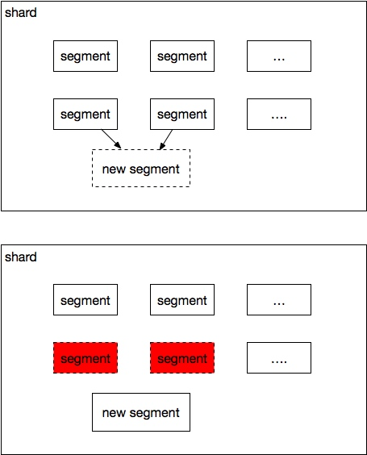

ES课程01

[TOC]

## 课堂主体

分三节课

ES简介，ES工作原理
集群搭建和使用，Java API 讲解
ELK综合使用，优化点

## 课堂目标

本节课
ES简介，ES工作原理
索引的搜索逻辑

## 知识要点

### 学习一门不会的技术

#### 理论上的步骤

* 看说明书
	官方文档
	博客，书

* 练习/实践
	做例子
	实战中应用

* 掌握
	解决实际问题
	解决bug
	调优

#### 实际步骤

	上代码，部署
	网上的例子拷贝下来用
	出问题了网上搜
	
	实在解决不了的看'说明书'


### 整体简介 

#### 常见数据

| 类型               | 名称           | 介绍                         |
| -------------------- | ---------------- | ------------------------------ |
| 关系型数据库   | MySQL，Oracle   | 存储日常信息的记录，关系性较强 |
| 非关系型，大数据相关 | MongoDB，Hbase  | 面向文档，大量的大表数据，无关联性 |
| 缓存               | memcached，Redis | 常用数据，结构化好的数据 |
| 索引               | solr，ES        | 全文检索                   |


#### 官方资料

```url
https://www.elastic.co/cn/learn
```

#### 由来

ES是由外国一个程序员(Shay Banon)想帮媳妇写一个搜索菜谱的系统，觉得Lucene版本中有很多重复工作自己做了一个系统演变成现在的ES；Shay Banon现在是ES公司的ceo，承诺ES以后永久开源.

#### 发展

Elastic为主体的公司提供很多优秀方案，那到了很多投资，现在已经上市了。
ES公司后来收购了logstash ，kibana还有一些其他服务。

* Elasticsearch：是检索的主体项目。
* logstash：主要作用是日志收集，和格式化数据；
* kibana：主要是数据展示
* filebeat：go编写的日志采集工具，比jvm上跑的logstash更轻量级随后仔细讲解

#### 著名使用者

现在使用ES的平台:维基百科，微软，Facebook，易拍(eBay)，阿里云，github等等

```url
https://www.elastic.co/cn/use-cases
```

#### ES具体是什么

从我们程序员的角度看

```
解决海量数据量实时搜索设计的一套框架，稳定，可靠，快速；
ES是基于lucene基础上的分布式搜索引擎
对索引自动分片负载，
主要用java开发，基于RESTful web接口；
```

#### ES能解决什么问题

ES就一种分布搜索服务，对应文件检索有很多优势。

##### 站内数据搜索
##### 全文检索
##### 数据分析统计


#### 相比solr

* 横向扩展
* 不依赖zk
* 实时性高
* 插件多
* 返回格式少，支持协议少
* 后起之秀，功能高速发展的同时，bug肯定多

#### 使用的场景

    大数据量实时生成索引，
    数据增量频繁需要拓展，
    如果数据定量不长期维护solr稍微好一些

ES团队目前发展越来越壮大，公司已经上市，合作公司也多，贡献者多，产品更新很快，对新兴搜索服务有很好的支持


#### 常见应用方式

* 直接使用
  直接对应用提供服务，由应用对ES做操作

  比如爬虫抓取功能。

  图片A
  


* 日志采集/数据库
ELK方式使用，写入和查询分开
由logstash提供数据源或者数据库都可以


### 整体架构


* Transport: 内部节点或和客户端交互方式，默认内部是tcp协议，外部是http REST。还支持thrift、servlet、memcached、zeroMQ等的传输协议，需要插件实现

* Disvcovery: 复制集群master节点发现，两种服务发现方式；节点增加或
减少时传播接下来的分片.默认的是单播和多播的形式Zen；插件的形式是EC2.

* RESTful Style API:是接口风格，通过RESTful方式来实现API

* Scripting: 脚本语言支持

* jmx : 监控

* java(Netty):开发框架，ES可以使用NettyTransport通信

* 3rd plugins: 第三方插件。

* Index  和 Search Moudle : 索引存储模型和检索模型

* mapping:映射关系

* river:数据源的意思，比如可以直接从mysql获取数据，其他river官方还有couchDB，RabbitMQ等

* DistributedLucene Directory : 索引文件的目录，会管理和维护索引目录

* Gateway : 据持久化模块，ES 默认把索引存储到内存中，内存满的时候持久化到

#### 基本概念

ES 是分布式的检索系统

##### 集群:

整个ES 是一个大集群，集群中分一个或多个节点，来存储索引信息，和检索索引；自身有备份容灾机制，在一个或多个节点出现问题后可以确保整体的工作情况.

##### 节点:

每个节点有自己唯一的名称，集群通过名称管理通信

节点类型：
* 主节点:主要工作节点负载索引的维护和搜索功能
* 数据节点:存储数据索引
* 客户端节点:负责路由客户的情况，算是负载
* 部落节点:解决跨集群搜索问题
  ​      
  ​      
##### 分片:

primary和replicaes，主要分片和副本分片
中一个索引可能会分多个片，每个分片可以有自己的一个或多个副本


##### 索引包涵的基础概念

打开head 或者url 讲解

| 关系数据库   | Elasticsearch  |
| --- | --- |
| 数据库Database   | 索引 Index  |
| 表 Table   | 类型TYPE  |
| 数据行Row   | 文档 Document |
| 关系数据库   | Elasticsearch  |
| 数据列Column| 字段Field |
| 模式Schema | 映像Mapping |


##### 类型TYPE 

在6.0后删除了TYPE概念，一个索引中只能有一个类型，注意现在网上的老文章或书都还存在。
官方解释：

```url
https://www.elastic.co/guide/en/Elasticsearch/reference/current/removal-of-types.html
```

  删除原因：type本来就跟表的概念不一样，table在数据库中是独立存储的，ES中不同的type存储在同一个索引中相同的字段会映射到一起，例如：学生表中的name，和班级表中的name，索引中会指向同一处，而且数据类型不能不同


##### 倒序索引


#### RESTful 接口风格

REST是英文representational state transfer(表象性状态转变)或者表述性状态转移;是web服务的一种架构风格

以http方式请求
有GET, POST, PUT, DELETE四种常用方式
对应我们 CRUD (Create, Read, Update, Delete) 四种数据操作

### 小结1

总结一下现在对ES的理解，对ES的服务模式和作用做一些归纳


### 工作原理

ES是分布式的框架，以下是在分布式框架中操作的流转过程

#### 增删

无论是对索引的增删改，这些操作都是先到primary shard再往replicas上复制，默认情况下主等待索引的备份成功后才算成功。


- 具体步骤

1. 客户端向master节点node1发送请求    
2. master 根据id路由算出在哪个分片，分配到primary分片A【P0】（或者B【P0】）
3. A【P0】（或者B【P0】）执行完毕后发送到所有的replice 上 A【R0】和A【R1】（或者B【R0】和B【R1】）
4. 当所有的replice完成后返回给客户端成功

#### 搜索


- 具体步骤单片

1. 客户端向master节点node1发送请求
2. master算出数据属于那个分片然后路由到其中一个replice分片上
3. 由replice处理后返回查询结果
4. 下一次查询来的时候轮询到另外一个replice每次选择不同分片达到负载效果

- 需要多片查询
  master会在第二步发送给不同的分片，然后各分片返回后合并数据
  
  ### 索引工作原理

索引为了能够高效的工作加入了很多优化
ES又在Lucene的基础上做了很多优化

#### 不变性

索引一旦写入到硬盘是不可变更的，这样有很多好处

- 操作索引时不需要加锁，减少了线程资源的消耗，加快速度
- 文件加入缓存中不需要频繁的修改
- 访问时可以直接到缓存访问

有好处就有坏处

- 文档有改动时需要更新整个索引

#### 索引动态变更，如何实现实时搜索

每个分片索引下面分成了多个segment
检索时会检索所有的segment，当新数据来的时候创建新的segment，一定时间后合并


 具体步骤

1. 当前有3个segment数据块，请求会检索3个segment
2. 来新的数据被写入到内存buffer中
3. 内存写入到新的segment
4. 4个segment都是可检索状态

#### 实时性检索（ES优化特点）

通过内存一定时间内往磁盘写效率太慢，保证不了数据的实时性。所以在写入文件的第三步做了优化。
把数据先写入到缓存不到磁盘，一定时间后再往磁盘写


#### 数据安全性

如果定期写入到磁盘，在写入磁盘前如果服务挂了要防止数据丢失，ES做了translog

1. 当索引被建立的时候，写入内存（in-merory buffer）并且添加到Translog中
   
2. 内存每秒都会输入到新的segment中，内存被清空，但是没有进入磁盘前，translog会保存
   
3. 新的文档会继续写入到内存中
   
4. 当log过大，或者一定时间后，内存会往磁盘写入，写入后log会被清空
   

- 容错
  期间如果服务出现故障，重启时会读取持久化的Translog来恢复数据

#### segment归并

当数量过多时会对这些segment(个数不定)做合并


- 具体步骤

1. 创建新的segment，N个小的segment合并到大的segment，小的segment不间断提供服务
2. 新的segment完成，开始提供服务，老的关闭服务
3. 删除老的segment

- 注意事项
  虽然整个merge（归并）过程不影响使用，但是也会消耗一定的cpu和io对集群的影响很大，需要设置好归并策略，已经线程数等配置


#### 检索类型

为了加快检索的效率ES在检索上有自己独特的方式；大类分为：查询DSL(query DSL)和过滤DSL(filter DSL)

- filter DSL
  过滤器，直接根据类型过滤，或者对结果匹配，查询结果会缓存起来
- query DSL
  查询器，会对内容做相似性比较，计算分值匹配度等等
- 选择
  全文检索，排序，评分query合适；
  精确匹配，不需要模糊匹配用filter
- 总述
  根据不同的查询类型选择与配置会加快查询，类似于sql优化
  官方地址

```url
https://www.elastic.co/guide/en/Elasticsearch/reference/current/query-filter-context.html
```

### 数据结构/压缩方案

为了提供性能Lucene是创建索引上下很大的功夫，ES还在Lucene的基础上又做了一些优化

#### segment结构

- Inverted Index（倒排索引）
  有序字典表，Term（单词）和出现的频率；
  Term（单词）所对应的Postings（文件）。
  


- 描述
  我们举例说下倒序索引的执行流程和具体的流程；

 现在有几句话需要存储

```url
文档1-NBA篮球联赛
文档2-CBA篮球联赛
文档3-西甲足球联赛
```

【1】 map（拆分）
提取分词拿出我们有用的数据

| 单词 | 文档  |
| ---- | ----- |
| NBA  | 文档1 |
| 篮球 | 文档1 |
| 篮球 | 文档2 |
| 联赛 | 文档1 |
| 联赛 | 文档2 |
| 联赛 | 文档3 |
| CBA  | 文档2 |
| 西甲 | 文档3 |

【2】reduce（合并）

| 单词 | 文档                |
| ---- | ------------------- |
| NBA  | 文档1               |
| 篮球 | 文档1，文档2        |
| 联赛 | 文档1，文档2，文档3 |
| CBA  | 文档2               |
| 西甲 | 文档3               |

- Stored Fields
  key-value形式用于存储整个文件内容，key-value形式。存储整个JSON source
  
- Document Values
  列式存储解决排序聚合等操作
  
- Cache
  上面讲的实时搜索使用的内容

#### Frame Of Reference

大数变小按照字节存储，尽力压缩空间


- 具体步骤

1. 第二个数转换前一个id的差值300-73=227，302-300=2
2. 然后把值分为块
3. 取最大的值需要占的bit数，73 227 2中 最大的227 占8bit，都按照8bit存储，三个数字只占用3bytes，加上前边的计数8 1byte，一共4个byte

#### bitmap

该数据结构是以空间换时间为概念
例如：
​    [1,3,5,6,9,10]
转换后为
​    [1,0,1,0,1,1,0,0,1,1]
就是把存储最大数长的大数组，每个数字对应自己数字的位数，5对应第5位，10对应第10位，0或表示是否存在。

- 优点
  省下大数字占的空间，查询快
- 缺点
  数字太大空间会变大，而且如果数字间空隙大太浪费空间

#### Roaring bitmaps

解决了bitmap空间不断拉长的缺点
将数据按照区块划分，第一个存储0~65535，第二个存储65536~131071，以此类推。然后再用<商，余数>的结构存储。


- 具体步骤

1. 计算出数字N/65536和N%65536
2. 根据商划分区块
3. 分块存储

- 应用
  上边最后一句话

```
If a block has more than 4096 values, encode as a bit set, and otherwise as a simple array using 2 bytes per value”
```

如果是大块超过4096，用节省点用bitset存，小块就使用每个值占用两个字节的数组。
4096 因为bitmap需要的空间是恒定的: 65536/8 = 8192bytes
8192能存4096大小的数组，如果大于4096那么空间肯定使用比bitmap大


#### 跳表

ES内部的一种快速查询结构


- 具体实现

- 创建：有序链表level0，那其中几个元素到level1及level2中，越往上元素越少

- 查找：从上往下查找，查询到范围往下一级走，道理和二叉树一样，时间复杂度和二叉树相似

- 应用方向

  - 联合索引的查找
  - 多个filter查询合并时（随后降）

  #### 联合索引

  联合索引查询方式两种

  1. 跳表
  2. bitset逐个索引匹配

#### FST

FST(Finite State Transducer),又称Mealy Machine


- 具体实现
- 创建，输入Alice和Alan，相同是字母路线公用，不同的分开
- 检索，直接根据字母往下匹配
- 优势
  如果是根据前缀检索效率会很快

#### BKD tree


- 具体实现
  上边树的部分存储在内存中，block在磁盘中，id无须，对应值按照对应范围来存储
- 优劣
  值range（范围查询）效率会高，其他情况都不太好


### 小结2

是否理解了ES的工作原理，对于ES的优势以及工作模式，刚才讲解的数据结构回想吸收一下。


## 资源配置

### 环境搭建

#### 服务安装

#### 【第一步】下载安装包

文件有点大，可以用迅雷下载好了放到指定位置

```
curl -L -O https://artifacts.elastic.co/downloads/Elasticsearch/Elasticsearch-6.4.2.zip
```

#### 【第二步】修改配置文件

- 配置外网访问
  默认配置外网通过无法访问，需修改配置

```
config/Elasticsearch.yml
```

中这一行打开并且改成0.0.0.0

```
network.host: 0.0.0.0
```


- 修改系统环境变量
  vm.max_map_count和允许打开的最大文件描述符数量
  【1】 vm.max_map_count 设置 

```shell
 vi /etc/sysctl.conf
```

 增加以下内容   

```
 vm.max_map_count=262144
```

 【2】 修改允许打开的最大文件描述符数量

```shell
vim /etc/security/limits.conf
```

加入

```shell
* soft nofile 65536
* hard nofile 65536
* soft nproc 4096
* hard nproc 4096
```

#### 【第三步】启动

```shell
./bin/Elasticsearch
```

后台运行

```shell
bin/Elasticsearch -d
```

***切记要用非root用户运行***
否则会报错，ES不让使用root账户启动


#### 【第四步】验证环境

```
curl http://localhost:9200/?pretty
```


#### 可能遇到的报错

如果不改配置文件直接启动，可能会遇到以下几个错误


**max file descriptors [4096] for Elasticsearch process is too low， increase to at least [65536]**

当前用户拥有的建文件描述的权限太低，知道需要65536个

解决办法

切换到root用户下面，

vim /etc/security/limits.conf

在最后添加
前面的* 号是所有用户，可以指定单个用户把* 替换成用户名

```
* soft nofile 65536
* hard nofile 65536
```


 **max virtual memory areas vm.max_map_count [65530] is too low， increase to at least [262144]**
内存权限太小了

换到root 用户

```shell
sysctl -w vm.max_map_count=262144
```


**max number of threads [3790] for user [coder] is too low， increase to at least [4096]**
用户最大线程数 不够
解决办法
vim /etc/security/limits.conf

```
* soft nproc 4096
* hard nproc 4096
```

**注，修改后需要从新登陆当前用户才能生效**


远程访问成功，ES搭建成功

### 基本操作操作

ES 是对外提供的restful 协议接口
一种情况是可以直接用url 操作，
一种是页面操作，页面的话需要安装插件

#### head插件安装

##### 【第一步】下载文件

从git下载插件

```shell
git clone git://github.com/mobz/Elasticsearch-head.git
```

head依赖node.js，需要在之前安装好node.js

##### 【第二步】node.js 安装

- 下载node.js

```url
https://nodejs.org/en/download/
```


- zx格式安装
  下载下来是 zx格式 需要在系统添加

```shell
yum -y install xz
```

- 解压缩包

```shell
xz -d node*.tar.xz 
tar -xvf node*.tar
```

- 配置环境变量

```shell
vi /etc/profile
export NODE_HOME=/home/coder/server/node-v8.12.0-linux-x64
export PATH=$PATH:$NODE_HOME/bin
source /etc/profile
```

##### 【第三步】grunt 安装

head 6 以后使用grunt 构建

- npm 安装

```shell
tar -zxvf npm-1.4.9.tgz
cd npm/
./configure
make && make install
放到node目录下试试
```


```shell
sudo npm install -g grunt-cli
```

进入目录执行找到package.json 所在目录
参考:
*/node_modules/grunt/node_modules/grunt-cli/package.json

- 构建

```shell
sudo npm install grunt --save-dev
```

- 验证

```shell
grunt -version
```

安装成功


##### 【第四步】head配置文件修改

- Gruntfile.js
  Elasticsearch-head/Gruntfile.js
  
  设置为 

```shell
hostname: '*'
```

- app.js
  Elasticsearch-head/_site/app.js
  

```shell
app-base_uri") || "http://172.16.86.101:9200"
```

- Elasticsearch.yml
  config/Elasticsearch.yml

```shell
http.cors.enabled: true
http.cors.allow-origin: "*"
```

##### head 安装成功


#### 索引基本操作

##### 添加索引


选择分片数 和副本数；
由于我们现在是一台机器副本没有用，选择成0；
如果选择非0个副本，索引状态里会有索引连接不到


```shell
curl -XPUT -H 'Content-Type: application/json' 'http://localhost:9200/test_url/test_url/1' -d '{
    "user" : "kkb"，
    "shards":0
    "post_date" : "2018-10-15T14:12:12"，
    "message" : " Elastic Search"
}'
```

##### 删除索引

url

```shell
curl -XDELETE 'http://172.16.86.101:9200/test/'
```

页面删除


##### 查询

```shell
curl -i -XPOST  'http://172.16.86.101:9200/_count?pretty' -H 'Content-Type: application/json' -d '{"query":{"match_all":{}}}'
```

```
HTTP/1.1 200 OK
content-type: application/json； charset=UTF-8
content-length: 116
{
  "count" : 1，     索引1个
  "_shards" : {    分区0个
    "total" : 15，
    "successful" :15， 成功15个
    "failed" : 0      失败0个
  }
}

```

防火墙关闭

```shell
systemctl stop firewalld.service
```

## 拓展点、未来计划、行业趋势

- 发展
  ES主体服务很轻，相对于其他的服务来说；有太多的插件提供给我们使用，非常方便，现在越多越多的公司在使用，大家基本上都认可由ES来处理日志收集。
- 行业趋势
  ES现在使用越来多
  我们可以看下 

```url
https://db-engines.com/en/ranking
```


ES排名在稳健的上升中，已经把solr，hbase等远远的甩下

在搜索引擎中稳居第一


## 总结

ES 是什么
ES基本结构概念
索引的存储方式逻辑，数据结构等
ES环境安装

## 作业

- 思考题
  对ES的工作模式优劣复习一下，毕竟讲的理论多；思考下工作模式有什么优劣，自己有没有觉得有什么可以优化的地方。
- 动手题
  搭建好ES环境。


