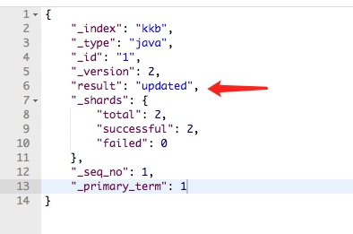
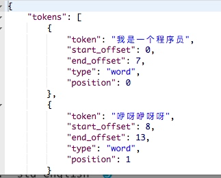
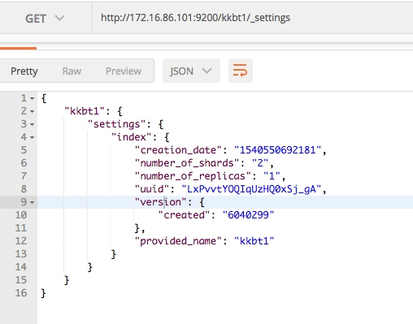

ES课程02

[TOC]

## 课堂主题
ES的应用

## 课程目标

ES集群搭建
文档和索引管理
高级检索的使用

## 知识要点

### 配置讲解

先讲解一下配置文件里的主要配置，然后再搭建集群，这样也能明白搭建集群都需要修改什么配置

#### 集群原理
##### 服务发现
##### 数据分片
##### 添加节点
##### 容灾处理

#### 系统环境配置

elasticserch 启动时需要设置
vm.max_map_count和允许打开的最大文件描述符数量
【1】 vm.max_map_count 设置 

```shell
vi /etc/sysctl.conf
```
 增加以下内容   
 ```      
 vm.max_map_count=262144
 ```
【2】 修改允许打开的最大文件描述符数量

```shell
vim /etc/security/limits.conf
```
加入
```shell
* soft nofile 65536
* hard nofile 65536
* soft nproc 4096
* hard nproc 4096
```
#### elasticsearch.yml
##### 基本信息设置
* cluster.name: es
集群的名称，ES会检查同一网段下的ES根据name加入到同一集群中，如果同一网段需要多个集群，则通过该字段区分 

* node.name: node-1
节点的名称，每个节点名字不同，默认情况下自动生成，从ES的jar中config文件下name.txt中随机取出名字

* node.master: true 
是否允许该节点成为master(默认开启)；ES启动时使用第一个节点为master，如果挂掉会从允许为master节点中选举出一个来当master

* node.data: true 
允许该节点存储数据(默认开启) ，注意访问的目录权限

* search.remote.connect：true
开启跨群集搜索（默认启用） 

* node.max_local_storage_nodes=3
该节点上允许出现的实例数，如果一个节点一个ES服务就不需要，如果需要在单台多开就要改

* path.data: /var/data/elasticsearch
数据存储位置

* path.logs: /var/log/elasticsearch 
日志文件的路径 

* network.host: 127.0.0.1
节点将绑定到此主机名或IP地址，我们设置成0.0.0.0为当前主机，允许ip映射访问

* http.port: 9200 
服务指定的端口号，接受单个值或范围。如果指定了范围，则节点将绑定到范围中的第一个可用端口。默认为9200-9300.探测到端口已经占有往下轮询一个端口使用

* transport.tcp.port
集群内数据通讯使用的端口,接受单个值或范围。如果指定了范围，则节点将绑定到范围中的第一个可用端口。默认为9300-9400
##### 分片信息设置

* index.number_of_shards: 5 
设置索引的分片数,默认为5 

* index.number_of_replicas: 1 
设置索引的副本数,默认为1
##### segment归并设置
* index.merge.scheduler.max_thread_count
归并线程数，一般设置为cpu核数的，最多为4就够否则影响性能
* index.merge.policy.floor_segment 
默认 2MB，小于这个大小的 segment，优先被归并。
* index.merge.policy.max_merge_at_once 
默认一次最多归并 10 个 segments
* index.merge.policy.max_merge_at_once_explicit 
默认 force merge 时一次最多归并 30 个 segments
* index.merge.policy.max_merged_segment 
默认 5 GB，大于这个大小的 segment，不用参与归并。force merge 除外
* 注意事项
当实时性要求不高的话就加大flush的间隔，没必要默认设置成1秒，这样减少合并次数消耗，视情况而定
##### Discovery
集群配置，配置错误就不能建立集群
* discovery.zen.ping.unicast.hosts: ["host1:port", "host2:port", "host3:port"]
集群的初始化列表，默认会探索，但是如果网络不稳定的话，会出现脑裂，最好加上node的信息


* discovery.zen.ping.unicast.hosts.resolve_timeout: 5s
在每轮ping中等待DNS查找的时间量。指定为 时间单位。默认为5秒

*  discovery.zen.ping_timeout: 3s
确定节点将多久决定开始选举或加入现有的群集之前等待,默认3s

* discovery.zen.join_timeout: 
一旦一个节点决定加入一个现有的已形成的集群，它将发送一个加入请求给主设备，默认值是ping超时的20倍

* discovery.zen.minimum_master_nodes: 2
集群中最小主节点数，防止脑裂一般为：节点数/2+1。例如：网络中5个节点最小master是2，当网络故障后形成了两个集群，通了后又变成一个，数据会严重错乱或无法工作

* 允许head插件访问

    ```shell
    http.cors.enabled: true
    http.cors.allow-origin: "*"
    ```
```

### 集群搭建
ES集群由多台node组成，实际情况下都是每台机器上一个实例，这样负载好容灾好。
现在就以端口号为区别搭建单机多实例，演示下集群搭建，可以多改写配置方便熟悉ES架构。
#### 实验架构
| 集群名称 | 节点名称 |端口号|transport.tcp|主节点|
| --- | --- | --- | --- | --- |
| es_cluster | node0 |9200|9300|是|
| es_cluster | node1 |9201|9301|是|
| es_cluster | node2 |9202|9302|是|
#### 修改配置文件
* 【node0】的elasticsearch.yml

 ```shell
cluster.name: es_cluster
node.name: node0
node.master: true
#本地开启3个实例
node.max_local_storage_nodes: 3
network.host: 0.0.0.0
http.port: 9200
transport.tcp.port: 9300
discovery.zen.ping.unicast.hosts: ["127.0.0.1:9300","127.0.0.1:9301","127.0.0.1:9302"]
discovery.zen.minimum_master_nodes: 2 
#head访问
http.cors.enabled: true
http.cors.allow-origin: "*"
```

* 【node1】的elasticsearch.yml

 ```shell
cluster.name: es_cluster
node.name: node1
node.master: true
#本地开启3个实例
node.max_local_storage_nodes: 3
network.host: 0.0.0.0
http.port: 9201
transport.tcp.port: 9301
discovery.zen.ping.unicast.hosts: ["127.0.0.1:9300","127.0.0.1:9301","127.0.0.1:9302"]
discovery.zen.minimum_master_nodes: 2 
#head访问
http.cors.enabled: true
http.cors.allow-origin: "*"
 ```
* 【node2】的elasticsearch.yml

 ```shell
cluster.name: es_cluster
node.name: node2
node.master: true
#本地开启3个实例
node.max_local_storage_nodes: 3
network.host: 0.0.0.0
http.port: 9202
transport.tcp.port: 9302
discovery.zen.ping.unicast.hosts: ["127.0.0.1:9300","127.0.0.1:9301","127.0.0.1:9302"]
discovery.zen.minimum_master_nodes: 2 
#head访问
http.cors.enabled: true
http.cors.allow-origin: "*"
 ```

#### 启动服务
##### 逐个启动
各个服务单独启动
```shell
./bin/elasticsearch
```
后台运行
```shell
bin/elasticsearch -d
```
##### 脚本启动
像这种一台机器多个服务的的可以写个脚本启动
编辑一个shell文件
```shell
 vi start_es.sh
```
文件内容
```shell
for i in 0 1 2 ; do
sh /home/coder/server/es0$i/bin/elasticsearch -d
done
```
赋权
```shell
chmod 777 start_es.sh
```
启动
```shell
./start_es.sh 
```
#### 验证服务
* 访问head插件页面

* 查看集群状态

```shell
curl -i -XGET -H 'Content-Type: application/json'  'http://172.16.86.101:9200/_cat/health?v'
```
返回结果
```
epoch      timestamp cluster    status node.total node.data shards pri relo init unassign pending_tasks max_task_wait_time active_shards_percent
1540451769 15:16:09  es_cluster green           3         3      0   0    0    0        0             0                  -                100.0%
```
集群的基本信息
* 参数字面意思很明白了
* status:集群状态有三种

||primary shard(分片)| replica shard（副本）|
|---| --- | --- |
| green   | 所有可用  |所有可用|
| yellow   | 所有可用 |部分可用|
| red   | 部分可用  |部分可用|

#### 可能遇到的报错
1. jvm
ES默认分配的1g内存，如果启动多实例可能出现内存不够；需要修改 

 ```
vi config/jvm.options 
 ```
-Xms1024m 
-Xmx1024m
切记Xms和需要配置相同的大小Xmx
2. 没有情况data数据

 ```
[2018-10-25T14:52:45,657][INFO ][o.e.d.z.ZenDiscovery     ] [node0] failed to send join request to master [{node1}{yxQ_mL5PRFKnkP-0__pQrQ}{3wAwU23GRSaznqaCFSn7qg}{172.16.86.101}{172.16.86.101:9301}{ml.machine_memory=1913536512, ml.max_open_jobs=20, xpack.installed=true, ml.enabled=true}], reason [RemoteTransportException[[node1][172.16.86.101:9301][internal:discovery/zen/join]]; nested: NotMasterException[Node [{node1}{yxQ_mL5PRFKnkP-0__pQrQ}{3wAwU23GRSaznqaCFSn7qg}{172.16.86.101}{172.16.86.101:9301}{ml.machine_memory=1913536512, xpack.installed=true, ml.max_open_jobs=20, ml.enabled=true}] not master for join request]; ], tried [3] times
 ```

* 解决办法
节点data文件下的文件清空

### 小结1
搭建好集群环境，回顾下有哪些配置会影响随后的系统性能。
对于分片，segment合并，发现机制要有清晰的理解。

### 基本操作
#### 操作返回码
```
http status code : 404 does not exist 200 means it does exists
1开头 消息
2开头 成功    200
3开头 重定向 302
4 请求错误     404 401 403
5 6 服务器错误 500
```

* ES默认支持是json请求，所以请求需要修改head为json格式：Content-Type:application/json

 curl 操作最好加上有时候会报错

 ```
-H 'Content-Type: application/json'
 ```


* url操作我都使用本机的ip写了，随后自己测试都改自己的；
#### 集群服务信息查看
* 集群状态
上面用过了
```url
GET
http://172.16.86.101:9200/_cat/health?v
```
* node状态信息

 ```url
GET
http://172.16.86.101:9200/_nodes/stats/process?pretty
 ```
* 查看个node的机器使用情况
```url
GET
http://172.16.86.101:9200/_cat/nodes?v
```


* 查看集群的索引信息
```url
GET
http://172.16.86.101:9200/_cat/indices?v
```

只显示状态为黄色的
```url
GET 
/_cat/indices?v&health=yellow
```
根据文档数降序排列
```url
GET 
/_cat/indices?v&s=docs.count:desc
```
显示每个索引占的内存
```url
GET 
/_cat/indices?v&h=i,tm&s=tm:desc
```
* node使用的磁盘情况
```url
GET 
http://172.16.86.101:9200/_cat/allocation?v
```
* 查看文档数
```url
GET 
http://172.16.86.101:9200/_cat/count?v
```
* fieldData的大小
 ```url
GET 
http://172.16.86.101:9200/_cat/fielddata?v
 ```
查看指定的字段
```url
GET 
http://172.16.86.101:9200/_cat/fielddata?v&fields=kkb
```
* 主节点信息
```url
GET 
http://172.16.86.101:9200/_cat/master?v
```


* 分片的恢复
里边包涵了很多信息，文件信息和translog信息等
```url
GET 
http://172.16.86.101:9200/_cat/recovery?v
```
结果：
```
 index     shard time  type        stage source_host   source_node target_host   target_node repository snapshot files files_recovered files_percent files_total bytes bytes_recovered bytes_percent bytes_total translog_ops translog_ops_recovered translog_ops_percent
kkb-es002 0     80ms  empty_store done  n/a           n/a         172.16.86.101 node2       n/a        n/a      0     0               0.0%          0           0     0               0.0%          0           0            0                      100.0%
kkb-es002 0     188ms peer        done  172.16.86.101 node2       172.16.86.101 node1       n/a        n/a      1     1               100.0%        1           230   230             100.0%        230         0            0                      100.0%
kkb-es002 1     109ms empty_store done  n/a           n/a         172.16.86.101 node0       n/a        n/a      0     0               0.0%          0           0     0               0.0%          0           0            0                      100.0%
kkb-es002 1     597ms peer        done  172.16.86.101 node0       172.16.86.101 node1       n/a        n/a      1     1               100.0%
```


* 集群信息查询列表
返回所有的信息查询url
```url
GET 
http://172.16.86.101:9200/_cat/
```
* 页面查询信息
head插件页面上的信息按钮都可以查看基本信息


#### 索引管理
##### 字段类型
| 一级分类 | 二级分类 | 具体类型                         |
| -------- | ------------ | ------------------------------------ |
| 核心类型 | 字符串类型 | string,text,keyword                  |
|          | 整数类型 | integer,long,short,byte              |
|          | 浮点类型 | double,float,half_float,scaled_float |
|          | 逻辑类型 | boolean                              |
|          | 日期类型 | date                                 |
|          | 范围类型 | range                                |
|          | 二进制类型 | binary                               |
| 复合类型 | 数组类型 | array                                |
|          | 对象类型 | object                               |
|          | 嵌套类型 | nested                               |
| 地理类型 | 地理坐标类型 | geo_point                            |
|          | 地理地图 | geo_shape                            |
| 特殊类型 | IP类型     | ip                                   |
|          | 范围类型 | completion                           |
|          | 令牌计数类型 | token_count                          |
|          | 附件类型 | attachment                           |
|          | 抽取类型 | percolator                           |

* 字符串
主要讲下分词的种类
 * string
 新版本不再用
 * text 
 全文搜索的内容，会模糊匹配，会被拆分然后建立倒序索引，不用于排序，聚合也少用
 * keyword 
 也是会拆分，适用于排序聚合等，精确匹配

##### 创建索引
* 带文档id

 ```url
PUT 
http://172.16.86.101:9200/kkb/java/1
{
    "user" : "wang",
    "post_date" : "2018-10-15T14:12:12",
    "message" : "Elastic Search"
}
 ```

 /kkb/java/1 链接的三个部分

|url|说明|
|---|---|
|kkb|索引名称|
|java|类型名称|
|1|员工的ID|

 * 类型在6以后就取消了，一个索引只能有一种类型

* 采用默认的配置创建索引

```url
PUT 
http://172.16.86.101:9200/kkb_default
```
* 自定义配置创建索引

```shell
curl -XPUT "http://172.16.86.101:9200/kkb_diy" -H 'Content-Type: application/json' -d '
{
    "settings": {
      "index": {
        "number_of_replicas": "1", #副本集数量
        "number_of_shards": "5", #分片数量
        "analysis": {
          "analyzer": {
            "default": { #定义名字为default的分词器
              "type": "custom",
              "tokenizer": "ik_max_word", #使用ik_max_word分词
              "filter": ["stemmer"]
            }
          }
        }
      }
    },
    "mappings": {
      "typename": { #类型名称
        "properties: {
          "name": {
            "type": "text",
            "store": false,  
            "analyzer": "default", #使用default分词
            "search_analyzer": "default", 
            "boost": 1 #定义文档中该字段的重要性，越高越重要
          },
          "date": {
            "type": "date",
            "format": "yyyy-MM-dd" #格式化时间格式
          },
          "age": {
            "type": "integer"
          },
          "innertypename": { #内联类型名称
            "properties: {
              "address": {
                "index": false,
                "type": "keyword" #keyword不分词,保存完整的数据到倒排索引中
              }
            }
          }
        }
      }
    }
  }'
```
这是创建索引的一些配置，其中分词器需要安装了才能试用，我们随后将
##### 查询索引
* 普通查询

 ```url
GET 
http://172.16.86.101:9200/kkb1/java/1
 ```

* 条件查询
 ```url
GET 
http://172.16.86.101:9200/kkb/java/_search?q=user:wang
 ```
* DSL 语句查询

 ```url
GET 
http://172.16.86.101:9200/kkb/java/_search
{
    "query" : {
        "match" : {
            "user" : "wang"
        }
    }
}
 ```

##### DSl语法

DSL语句查询有很多种类，有一套自己的语法，这里简单举几个例子

* term
主要用于精确匹配，对英文字符串，数字，日期时间等
直接在查询语句里使用

 ```json
{
    "user" : "wang"
}
 ```
* terms
可以理解成多条件的term，和union all一样
```json
{
   "query": {
       "user": {"date": ["li","wang"]}
   }
}
```
* range
范围查询，指定一个范围查询
```json
{
   "query": {
       "range":{
           "age":{   //age字段
               "gte":20, //大于60
               "lt":30 //小于70
           }
       }
   }
}
```
* exists
 所有值不为空，相当于 is not null
 ```json
 {
   "query": {
       "exists":{
           "field":"user"  
       }
   }
}
 ```
* missing
所有值为空，相当于 is null
 ```json
 {
   "query": {
       "missing":{
           "field":"user"  
       }
   }
}
 ```
* bool
bool有三个值
 * must 必须匹配相对 “=”
 * must_not 不匹配相当于 “<>”/"!="
 * should 或许等于 相当于 "or"

 ```json
{
   "query": {
       "bool":{
           "must":{  
               "term":{"age":50} 
           },
           "must_not":{  
               "term":{"date": "2014-09-01"} 
           },
           "should":[ 
               {"term":{"_id":8}},
               {"term":{"_id":19}}
           ]
       }
   }
}
 ```
* match
可以实现模糊匹配，可以理解成like，但是不像like那么没有效率
```json
{
   "query": {
       "match":{
           "title":"开课吧"
       }
   }
}
```
* multi_match
对多个字段match
```json
{
   "query": {
       "multi_match":{
           "title":"开课吧"，
           "user":"w"
       }
   }
}
```
* regexp
正则表达式匹配
```json
{
   "query": {
       "regexp":{
           "phone":".+[0-9]*.+" 
       }
   }
}
```
* prefix
前缀搜索
```json
{
   "query": {
       "prefix":{
           "user":"w"
       }
   }
}
```
* phrase_match
篇幅匹配，不拆词匹配
```json
{
   "query": {
       "match_phrase":{
           "content":"开课吧 java"  // content中包含开课吧 java而不是开课吧 或 java
       }
   }
}
```
* 其他方法
 ```
query,search_type 
term,terms, match,match_phrase,multi_match,fuzzy 
bool,and,or,not,limit,must,must_not,should 
range,size,from,to,gt,gte,lt,lte 
field,fields 
aggs,count,sum,min,max,avg
 ```

* 官方地址

 ```url
https://www.elastic.co/guide/en/elasticsearch/reference/current/query-dsl.html
 ```

##### 删除索引
* 指定索引删除

 ```url
DELETE 
http://172.16.86.101:9200/kkb1
 ```

##### 更新索引

直接对文档做同样的添加put请求

```url
PUT 
http://172.16.86.101:9200/kkb/java/1
'{
    "user" : "wang123",
    "post_date" : "2018-10-15T14:12:12",
    "message" : "Elastic Search"
}'
```



##### 打开关闭索引
* 打开

 ```url
POST
 http://172.16.86.101:9200/kkb/_open
 ```
* 关闭

 ```url
POST
 http://172.16.86.101:9200/kkb/_close
 ```
##### 索引详细状态查看
```url
POST
 http://172.16.86.101:9200/kkb/_stats
 所有
 http://172.16.86.101:9200/_stats
```
##### 设置索引配置
* 更新配置
更新索引的配置，可以修改很多关于索引的参数
 ```url
PUT
http://172.16.86.101:9200/kkb/_settings/
 ‘index’: {
		“number_of_replicas”:4
	}
 ```
* 获取配置
 ```url
GET
http://172.16.86.101:9200/all/_settings
 ```
##### segments使用情况
索引都是在segment中存储的，查看索引在segment中的情况
```url
GET
http://172.16.86.101:9200/kkb/_segments
```
好多信息


### 高级使用

#### 分词
##### 使用
在创建mapping的时候对指定的字段添加分词器

##### 自带分词器
ES 有自带的分词器，但是对中文的支持很不友好，下面我们简单说下自带的几个分词器；
可以通过analyzer 字段来选择分词器
* standard
默认的分词器，对词汇转换成小写切割，去掉标点和助词（a/an/the），支持中文但是是根据文字单个切分
 ```url
POST 
http://172.16.86.101:9200/_analyze
{
  "analyzer": "standard",
  "text": "我是一个程序员，咿呀咿呀呀！"
}
 ```

 ```url
POST 
http://172.16.86.101:9200/_analyze
{
  "analyzer": "standard",
  "text": "I'm a programmer！o my god!"
}
 ```
会看到结果,中文直接按照每个字拆分
* simple
通过非字母字符来切割，会过滤掉数字
```url
POST 
http://172.16.86.101:9200/_analyze
{
  "analyzer": "simple",
  "text": "我是一个程序员，咿呀咿呀呀！"
}
```
这个分词粒度比较大，如果不需要太细的搜索，力度大了效率会高，具体看实际场景来使用


* Whitespace
去空格
* lowercase
小写转换
* language
特定语言选择，不支持中文
* custom
用户自定义分词器
* 官方地址

 ```url
https://www.elastic.co/guide/en/elasticsearch/reference/current/analysis-analyzers.html
 ```

##### ayalysis-ik
ik是一个中文分词器
###### 安装
* 命令安装

 ```shell
./bin/elasticsearch-plugin install https://github.com/medcl/elasticsearch-analysis-ik/releases/download/v6.4.2/elasticsearch-analysis-ik-6.4.2.zip
 ```
* 下载安装
 * 下载文件

 ```url
https://github.com/medcl/elasticsearch-analysis-ik/releases/download/v6.4.2/elasticsearch-analysis-ik-6.4.2.zip
 ```
 * 解压

    ```shell
    unzip elasticsearch-analysis-ik-6.4.2.zip
    复制到 ES目录/plugins下
    ```
 ```
 * 复制到其他节点
 
 ```shell
scp -r analysis-ik coder@**
 ```
 演示的单机
  ```shell
  scp -r analysis-ik ES目录/plugins/
  ```
* 重启ES服务

* 测试使用
```url
POST 
http://172.16.86.101:9200/_analyze
{
  "analyzer": "ik_smart",
  "text": "我是一个程序员，咿呀咿呀呀！"
}
```

###### 使用
ik_smart，ik_max_word是ik 的两种分词器
* ik_max_word: 会将文本做最细粒度的拆分，比如会将“中华人民共和国国歌”拆分为“中华人民共和国,中华人民,中华,华人,人民共和国,人民,人,民,共和国,共和,和,国国,国歌”，会穷尽各种可能的组合；

* ik_smart: 会做最粗粒度的拆分，比如会将“中华人民共和国国歌”拆分为“中华人民共和国,国歌”。

* 创建ik的mapping
对kkb索引下的text字段设置分词器
```url
POST 
http://172.16.86.101:9200/kkb/java/_mapping
{
        "properties: {
            "info": {
                "type": "text",
                "analyzer": "ik_max_word",
                "search_analyzer": "ik_max_word"
            }
        }
}
```
* 存放多个文档值
```url
POST
http://172.16.86.101:9200/kkb/java/1
{"info": "我是一个程序员，咿呀咿呀呀！"}
```
```url
POST
http://172.16.86.101:9200/kkb/java/2
{"info": "我是一个产品，咿呀咿呀呀！"}
```
```url
POST
http://172.16.86.101:9200/kkb/java/3
{"info": "程序员要揍产品！"}
```
* 查询
```url
POST
http://172.16.86.101:9200/kkb/fulltext/_search
{
    "query" : { "match" : { "info" : "程序" }}
}
```
结果会根据词库去匹配去匹配
* 词库配置
词库配置在IKAnalyzer.cfg.xml
位置
```
{conf}/analysis-ik/config/IKAnalyzer.cfg.xml
或者jar里
{plugins}/elasticsearch-analysis-ik-*/config/IKAnalyzer.cfg.xml
```
文件内容
```xml
<?xml version="1.0" encoding="UTF-8"?>
<!DOCTYPE properties SYSTEM "http://java.sun.com/dtd/properties.dtd">
<properties>
	<comment>IK Analyzer 扩展配置</comment>
	<!--用户可以在这里配置自己的扩展字典 -->
	<entry key="ext_dict">custom/mydict.dic;custom/single_word_low_freq.dic</entry>
	 <!--用户可以在这里配置自己的扩展停止词字典-->
	<entry key="ext_stopwords">custom/ext_stopword.dic</entry>
 	<!--用户可以在这里配置远程扩展字典 -->
	<entry key="remote_ext_dict">location</entry>
 	<!--用户可以在这里配置远程扩展停止词字典-->
	<entry key="remote_ext_stopwords">http://xxx.com/xxx.dic</entry>
</properties>
```
* 官方网站
```url
https://github.com/medcl/elasticsearch-analysis-ik
```
###### 可能遇到的错误
* java.net.SocketPermission
网络访问权限问题
修改jdk/lib/java.policy文件
```
permission java.net.SocketPermission "*", "connect,resolve";
```
重启

#### 高亮查询 highlight

##### 类型
ES有三种高亮
* plain highlight（默认）
* posting highlight（性能）
对磁盘消耗少，切割的片大
* fast vector highlight（文件）
对大文件检索快
##### 使用

 ```url
POST
http://172.16.86.101:9200/kkb/fulltext/_search
{
    "query" : { "match" : { "info" : "程序" }},
    "highlight" : {
        "pre_tags" : ["<tag1>", "<tag2>"],
        "post_tags" : ["</tag1>", "</tag2>"],
        "fields" : {
            "info" : {}
        }
    }
}
 ```


#### Mapping映射
如果不添加，生成时系统会默认指定mapping（映射）结构，检索时会系统会猜测你想要的类型，如果对系统反馈的不满意，我们就可以手动设置
* 添加

 ```
PUT
http://172.16.86.101:9200/kkb
{
    "mappings": {
      "java": {
        "properties: {
          "age": { "type": "long"}
        }
      }
    }
 ```
* 获取

 ```
GET
http://172.16.86.101:9200/kkb/_mapping
模糊匹配
http://172.16.86.101:9200/kkb/_all/_mapping/k*’
 ```
* 配置
mapping是对索引字段的映射配置，可以直接对索引文档字段设置
 ```
{
　  "type" : "text", #是数据类型一般文本使用text(可分词进行模糊查询)；keyword无法被分词(不需要执行分词器)，用于精确查找

    "analyzer" : "ik_max_word", #指定分词器，一般使用最大分词：ik_max_word
    
    "normalizer" : "normalizer_name", #字段标准化规则；如把所有字符转为小写；具体如下举例

    "boost" : 1.5, #字段权重；用于查询时评分，关键字段的权重就会高一些，默认都是1；另外查询时可临时指定权重

    "coerce" : true, #清理脏数据：1，字符串会被强制转换为整数 2，浮点数被强制转换为整数；默认为true

    "copy_to" : "field_name", #自定_all字段；指定某几个字段拼接成自定义；具体如下举例

    "doc_values : true, #加快排序、聚合操作，但需要额外存储空间；默认true，对于确定不需要排序和聚合的字段可false

    "dynamic" : true, #新字段动态添加 true:无限制 false:数据可写入但该字段不保留 'strict':无法写入抛异常

    "enabled" : true, #是否会被索引，但都会存储;可以针对一整个_doc

    "fielddata" : false, #针对text字段加快排序和聚合（doc_values对text无效）；此项官网建议不开启，非常消耗内存

    "eager_global_ordinals": true, #是否开启全局预加载,加快查询；此参数只支持text和keyword，keyword默认可用，而text需要设置fielddata属性
    
    "format" : "yyyy-MM-dd HH:mm:ss||yyyy-MM-dd||epoch_millis" ,#格式化 此参数代表可接受的时间格式 3种都接受

    "ignore_above" : 100, #指定字段索引和存储的长度最大值，超过最大值的会被忽略

    "ignore_malformed" : false ,#插入文档时是否忽略类型 默认是false 类型不一致无法插入

    "index_options" : "docs" ,
    # 4个可选参数
    # docs（索引文档号）,
    # freqs（文档号 + 词频），
    # positions（文档号 + 词频 + 位置，通常用来距离查询），
    # offsets（文档号 + 词频 + 位置 + 偏移量，通常被使用在高亮字段）
    # 分词字段默认是position，其他的默认是docs

    "index" : true, #该字段是否会被索引和可查询 默认true

    "fields": {"raw": {"type": "keyword"}} ,#可以对一个字段提供多种索引模式，使用text类型做全文检索，也可使用keyword类型做聚合和排序

    "norms" : true, #用于标准化文档，以便查询时计算文档的相关性。建议不开启

    "null_value" : "NULL", #可以让值为null的字段显式的可索引、可搜索

    "position_increment_gap" : 0 ,#词组查询时可以跨词查询 既可变为分词查询 默认100

    "properties : {}, #嵌套属性，例如该字段是音乐，音乐还有歌词，类型，歌手等属性

    "search_analyzer" : "ik_max_word" ,#查询分词器;一般情况和analyzer对应
    
    "similarity" : "BM25",#用于指定文档评分模型，参数有三个：
    # BM25 ：ES和Lucene默认的评分模型
    # classic ：TF/IDF评分
    # boolean：布尔模型评分

    "store" : true, #默认情况false,其实并不是真没有存储，_source字段里会保存一份原始文档。
    # 在某些情况下，store参数有意义，比如一个文档里面有title、date和超大的content字段，如果只想获取title和date

    "term_vector" : "no" #默认不存储向量信息，
    # 支持参数yES（term存储），
    # with_positions（term + 位置）,
    # with_offsets（term + 偏移量），
    # with_positions_offsets(term + 位置 + 偏移量)
    # 对快速高亮fast vector highlighter能提升性能，但开启又会加大索引体积，不适合大数据量用
}
 ```

#### 索引模板
##### 介绍
当索引和文档变多后，我们不能每一个一个都是手动的设置，这就用到了模板。模板包涵了settings和mappings信息，通过模式匹配的方式使得多个索引重用一个模板
* settings
索引的相关配置信息，例如分片数、副本数、tranlog、refresh等
一般使用elasticsearch.yml中配置
* mappings
说明信息，索引是否需要检索，字段类型等等，就是映射的内容设置

##### 使用
* 创建模板

 ```url
POST
http://172.16.86.101:9200/_template/tkkb1
{
  "template": "kkbt*",
  "settings": {
    "index.number_of_shards": 2,
    "number_of_replicas": 1
  },
  "mappings": {
    "_default_": {
      "_source": {
        "enabled": true
      }
    },
    "java": {
      "properties: {
        "age": {
          "type": "long"
        },
        "info": {
          "search_analyzer": "ik_max_word",
          "analyzer": "ik_max_word",
          "type": "text"
        }
      }
    }
  }
}
 ```
* 创建索引

 ```url
PUT
http://172.16.86.101:9200/kkbt1/java/1
{
    "age" : "18",
    "info" : "我是程序员"
}
 ```
* 查看索引信息

 ```url
GET
http://172.16.86.101:9200/kkbt1/_settings
http://172.16.86.101:9200/kkbt1/_mapping
 ```



* 删除模板

 ```url
DELETE
http://172.16.86.101:9200/_template/tkkb1
 ```

#### 别名
##### 介绍
类似于数据库的视图，单索引视图可以直接操作，多索引的只能查
##### 单索引

```url
PUT
http://172.16.86.101:9200/_aliases
{
    "actions":[
        {
            "add":{
                "index":"kkb",
                "alias":"alias"
            }
        }
    ]
}
```
别名查询
```url
GET
http://172.16.86.101:9200/alias/_search
```
##### 多索引

```url
PUT
http://172.16.86.101:9200/_aliases

{
  "actions": [
    {
      "add": {
        "index": "kkb",
        "alias": "alias"
      }
    },
    {
      "add": {
        "index": "kkbt1",
        "alias": "alias"
      }
    }
  ]
}
```
别名查询
```url
GET
http://172.16.86.101:9200/alias/_search
```


* 删除别名

 ```url
POST
http://172.16.86.101:9200/_aliases
{
    "actions":[
        {
            "remove":{
                "index":"kkb",
                "alias":"alias"
            }
        }
    ]
}
 ```
需要一个一个删除，更新的话先删除后添加

#### 缓存管理
前边我们讲到了ES是先写入缓存然后再到磁盘，使用过程中会用到一些缓存类的操作

* 强制刷新
虽然ES设置是1秒写一次内存segment，但是可能出现延时

 ```url
POST
单个
http://172.16.86.101:9200/kkb/_refresh
全量
http://172.16.86.101:9200/_refresh
 ```
* 清理缓存
缓存过大会引起效率低等情况

 ```url
POST
单个
http://172.16.86.101:9200/kkb/_cache/clear
全量
http://172.16.86.101:9200/_cache/clear
 ```


## 检查点
ES集群搭建成功
完成常规的索引操作
了解掌握高级查询
## 拓展点、未来计划、行业趋势

对于集群的配置，segment合并等后期会直接影响系统的性能。
发现机制会影响系统的高可用。

ES官方还会在这些功能上做近一步的优化；可能会加入一些新的索引管理方式，或者集群的选举机制等等。

## 总结
我们本节课搭建成功了ES集群环境，对配置和使用做了进一步深入的了解。

## 作业
集群环境搭建好，集群不够的，就jvm调小一点，单机多端口练习一下。
对于课堂上使用的高级查询自己都创建索引练习一遍。