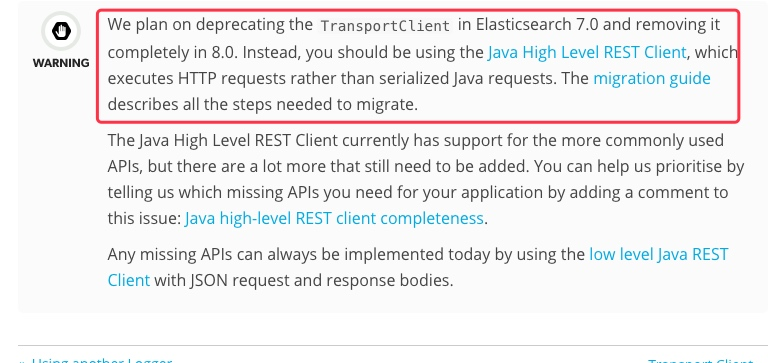
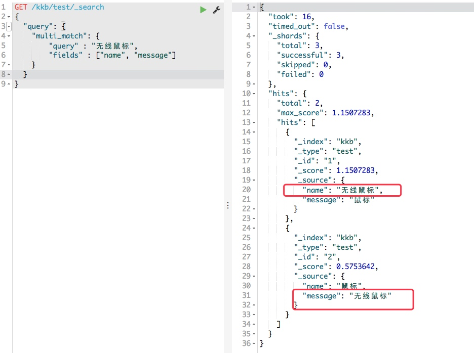
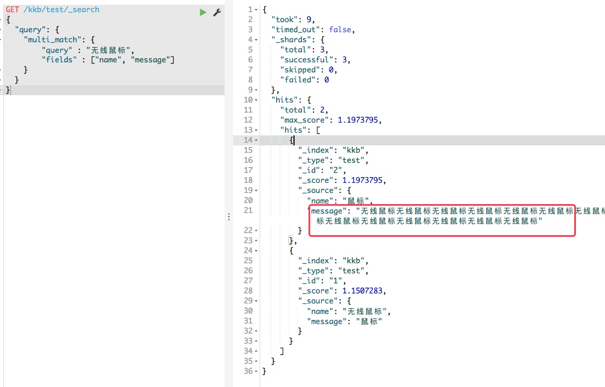
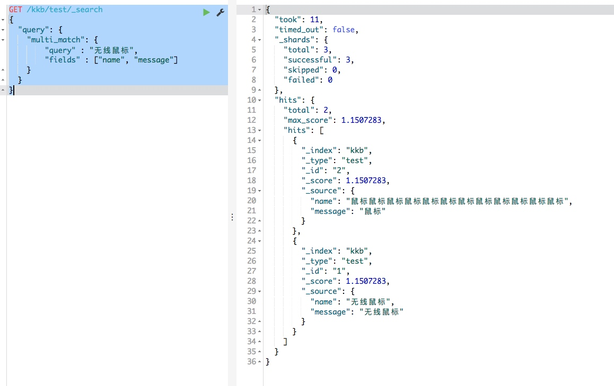
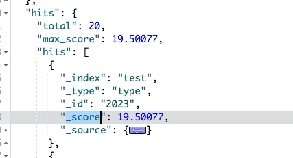
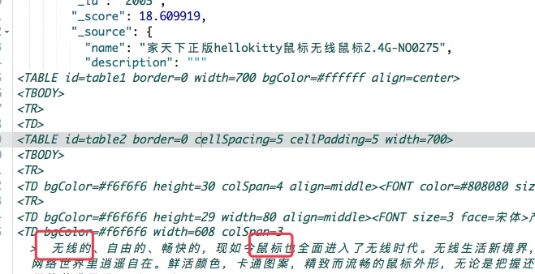
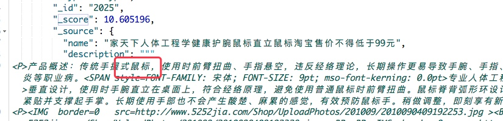
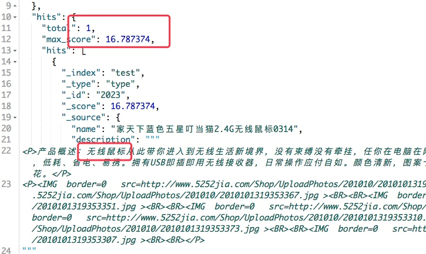

ES课程3


[TOC]
## 课堂主题
javaAPI使用ES
## 课程目标
使用javaAPI操作ES
了解搜索的评分规则
## 知识要点
javaAPI使用和类型
使用过程中的参数配置语法
干预排序的因素
## 资源配置
### java使用ES
#### API介绍
##### 重点
学会看官方api，官方api永远是最新最可靠的
```url
主页面
https://www.elastic.co/guide/index.html
client分页面
https://www.elastic.co/guide/en/elasticsearch/client/java-rest/6.4/index.html
```

##### 老的API：TransportClient
之前我们操作API都是用的TransportClient，官网上说TransportClient内容落后太多，7以后就打算推荐使用，8以后就会删除；

##### 新的API：Java High/Low Level REST Client
* Java High Level REST Client
 * 目前还有很多地方需要完善，基于Java Low Level REST Client来使用的。
 * 后期会提供更强大的API方便使用，比如允许客户端自己处理编解码过程，同步异步的调用更好的支持高级程序的开发。
 * 返回内容和参数与TransportClient一样，可以做迁移
 * 需要java 1.8
* Java Low Level REST Client
 * 官方目前主推的API，做一些常规的操作
 


##### API的兼容性
ES支持向后兼容性，大版本间的客户端基本上可以通用，由于新版本有新内容，可能对老的版本支持不是很好，但是老版本兼容新版本。
建议不要夸版本太大，如果太大就直接重新建立索引

#### TransportClient
工具
[EsClientTool](media/15404317415098/EsClientTool.java)
测试类
[Test](media/15404317415098/Test.java)
##### 创建连接
```java
private static TransportClient client = null;

	public static TransportClient getClient() {
		if (client != null) {
			return client;
		}
		try {
			/**
			 * 在此处通过put的方式给ES集群添加属性
			 */
			Settings settings = Settings.builder()
					// 设置集群名称
					.put("cluster.name", ES.CLUSTER_NAME)
					// 自动嗅探集群
					.put("client.transport.sniff", true).build();
			// 创建client
			client = new PreBuiltTransportClient(settings);
			String[] nodes = ES.NODES.split(SEPARATOR.Str_);
			for (String node : nodes) {
				if (node.length() > 0) {
					String[] hostPort = node.split(":");
					try {
						client.addTransportAddress(new TransportAddress(InetAddress.getByName(hostPort[0]),
								// 此处注意浏览器暴露的9200，客户端（client）暴露的9300
								Integer.parseInt(hostPort[1])));
					} catch (Exception e) {
						e.printStackTrace();
					}
				}
			}
			return client;
		} catch (Exception e) {
			// TODO: handle exception
			e.printStackTrace();
			return null;
		}
	}
```

##### 集群信息查看
```java
/** --------------集群状态查询-------------- **/

	/**
	 * 获取集群管理的ClusterAdminClient对象
	 */
	public static ClusterAdminClient getClusterAdminClient() {
		return getClient().admin().cluster();
	}

	/**
	 * 查看集群的健康信息
	 */
	public static ClusterHealthResponse getClusterHealth() {
		return getClusterAdminClient().prepareHealth().get();
	}

	/**
	 * 查看索引所在节点的健康信息 集群状态有个枚举类 ClusterHealthStatus
	 */
	public static ClusterHealthStatus getNodeStateByIndex(String index) {
		ClusterHealthResponse response = getClusterAdminClient().prepareHealth(index).setWaitForGreenStatus().get();
		ClusterHealthStatus status = response.getIndices().get(index).getStatus();
		return status;
	}

	/**
	 * 打印集群健康信息
	 */
	public static void printClusterHealth(ClusterHealthResponse healths) {
		String clusterName = healths.getClusterName();
		System.out.println("clusterName=" + clusterName);
		int numberOfDataNodes = healths.getNumberOfDataNodes();
		System.out.println("numberOfDataNodes=" + numberOfDataNodes);
		int numberOfNodes = healths.getNumberOfNodes();
		System.out.println("numberOfNodes=" + numberOfNodes);

		for (ClusterIndexHealth health : healths.getIndices().values()) {
			String index = health.getIndex();
			int numberOfShards = health.getNumberOfShards();
			int numberOfReplicas = health.getNumberOfReplicas();
			System.out.printf("index=%s,numberOfShards=%d,numberOfReplicas=%d\n", index, numberOfShards,
					numberOfReplicas);
			ClusterHealthStatus status = health.getStatus();
			System.out.println(status.toString());
		}
	}
```
* getClient().admin().cluster()
client里边的admin管理模块下边有专门的针对集群的操作


##### 索引操作

```java
/**
	 * 获取索引管理的IndicesAdminClient
	 */
	public static IndicesAdminClient getAdminClient() {
		return getClient().admin().indices();
	}

	/**
	 * 判定索引是否存在
	 * 
	 * @param indexName
	 * @return
	 */
	public static boolean isExists(String indexName) {
		IndicesExistsResponse response = getAdminClient().prepareExists(indexName).get();
		return response.isExists() ? true : false;
	}

	/**
	 * 创建索引
	 * 
	 * @param indexName索引名
	 * @return
	 */
	public static boolean createIndex(String indexName) {
		CreateIndexResponse createIndexResponse = getAdminClient().prepareCreate(indexName.toLowerCase()).get();
		return createIndexResponse.isAcknowledged() ? true : false;
	}

	/**
	 * 创建索引
	 * 
	 * @param indexName
	 *            索引名
	 * @param shards
	 *            分片数
	 * @param replicas
	 *            副本数
	 * @return
	 */
	public static boolean createIndex(String indexName, int shards, int replicas) {
		Settings settings = Settings.builder().put("index.number_of_shards", shards)
				.put("index.number_of_replicas", replicas).build();
		CreateIndexResponse createIndexResponse = getAdminClient().prepareCreate(indexName.toLowerCase())
				.setSettings(settings).execute().actionGet();
		return createIndexResponse.isAcknowledged() ? true : false;
	}

	/**
	 * 位索引indexName设置mapping
	 * 
	 * @param indexName
	 * @param typeName
	 * @param mapping
	 */
	public static void setMapping(String indexName, String typeName, String mapping) {
		getAdminClient().preparePutMapping(indexName).setType(typeName).setSource(mapping, XContentType.JSON).get();
	}

	/**
	 * 删除索引
	 * 
	 * @param indexName
	 * @return
	 */
	public static boolean deleteIndex(String indexName) {
		DeleteIndexResponse deleteResponse = getAdminClient().prepareDelete(indexName.toLowerCase()).execute()
				.actionGet();
		return deleteResponse.isAcknowledged() ? true : false;
	}
```
* 测试操作
```java
//判定索引是否存在 OK
	        boolean flag=EsClientTool.isExists("index1");
	        System.out.println("isExists:"+flag);
	        //创建索引 OK
	        flag=EsClientTool.createIndex("index1", 3, 0);
	        System.out.println("createIndex:"+flag);
	        //设置Mapping OK
	    	setMapper();
	    	
	    	//查询索引 OK
	    	EsClientTool.testQuery("twitter", "tweet", "3");
	    	//删除索引 OK
	    	EsClientTool.deleteIndex("index1");
```
* mapper操作
```java
public static void setMapper(){
	    	try {
	            XContentBuilder builder = jsonBuilder()
	                    .startObject()
	                    .startObject("properties")
	                    .startObject("id")
	                    .field("type", "long")
	                    .endObject()
	                    .startObject("title")
	                    .field("type", "text")
	                    .field("analyzer", "ik_max_word")
	                    .field("search_analyzer", "ik_max_word")
	                    .field("boost", 2)
	                    .endObject()
	                    .startObject("content")
	                    .field("type", "text")
	                    .field("analyzer", "ik_max_word")
	                    .field("search_analyzer", "ik_max_word")
	                    .endObject()
	                    .startObject("postdate")
	                    .field("type", "date")
	                    .field("format", "yyyy-MM-dd HH:mm:ss")
	                    .endObject()
	                    .startObject("url")
	                    .field("type", "keyword")
	                    .endObject()
	                    .endObject()
	                    .endObject();
	            String json  = Strings.toString(builder);
	            System.out.println(json);
	            //索引、类型、json串EsClientTool.setMapping("index1", "blog",json);
	        } catch (IOException e) {
	            e.printStackTrace();
	        }
	    }
```
* XContentBuilder
是ES提供的一个生产json的工具，满足ES中使用的方式。
startObject()就相当于是开始的一个括号，endObject()结尾的括号。
field()对应key value值

##### 文档管理
```java
/**
	 * 插入文档 详细数据指定type id
	 * 
	 * @param index
	 * @param type
	 * @param object
	 * @return
	 */
	public static String addDoc(String index, String type, String id, JSONObject object) {
		try {
			IndexResponse response = getClient().prepareIndex(index, type, id)
					.setSource(object.toJSONString(), XContentType.JSON).get();
			return response.getId();
		} catch (Exception e) {
			e.printStackTrace();
		}
		return null;
	}

	/**
	 * 
	 * 此方法描述的是： 批量添加文档
	 */
	public static boolean addDocs(List<Doc> docList) {
		TransportClient client = getClient();
		BulkRequestBuilder bulkRequest = client.prepareBulk();

		for (int i = 0; i < docList.size(); i++) {
			Doc doc = docList.get(i);
			bulkRequest
					.add(client.prepareIndex(doc.getIndex(), doc.getType(), doc.getId()).setSource(doc.getBuilder()));
		}
		BulkResponse bulkResponse = bulkRequest.get();
		// 这里返回的是否有错误，所以返回的是非值
		return !bulkResponse.hasFailures();
	}
```
调用
```java
 //文档插入
	    public static void addData() throws ParseException{
	    	 JSONObject jsonObject = new JSONObject();
	         jsonObject.put("id", 2);
	         jsonObject.put("age", 18);
	         jsonObject.put("name", "li");
	         jsonObject.put("date", new Date());
	         String id=EsClientTool.addDoc("index1", "type", jsonObject.getString("id"), jsonObject);
	         System.out.println(id);
	    }
	    public static void addDocs() throws IOException{
	    	List<Doc> docList = new ArrayList<>();
	    	Doc doc1 = new Doc();
	    	doc1.setIndex("kkb-test1");
	    	doc1.setType("tweet");
	    	doc1.setId("1");
	    	XContentBuilder builder1 = jsonBuilder()
                    .startObject()
                    .field("user", "kimchy")
                    .field("postDate", new Date())
                    .field("message", "trying out Elasticsearch111")
                    .endObject();
	    	doc1.setBuilder(builder1);
	    	docList.add(doc1);
	    	
	    	Doc doc2 = new Doc();
	    	doc2.setIndex("kkb-test1");
	    	doc2.setType("tweet");
	    	doc2.setId("2");
	    	XContentBuilder builder2 = jsonBuilder()
                    .startObject()
                    .field("user", "kimchy2")
                    .field("postDate", new Date())
                    .field("message", "another post")
                    .endObject();
	    	doc2.setBuilder(builder2);
	    	docList.add(doc2);
	    	boolean isOK = EsClientTool.addDocs(docList);
	    	System.out.println(isOK);
	    }
```
##### 批量操作
ES自提供了BulkProcessor处理批量方法，可以在调用的时候设置提交量，大小等

```java
private static BulkProcessor bulkProcessor = null;

	/**
	 * 批处理组件
	 * Using Bulk Processor
	 */
	public static BulkProcessor getBulkProcessor() {
		if (bulkProcessor == null) {

			bulkProcessor = BulkProcessor.builder(getClient(), new BulkProcessor.Listener() {
				@Override
				public void beforeBulk(long executionId, BulkRequest request) {
					System.out.println("请求数:" + request.numberOfActions());
				}

				@Override
				public void afterBulk(long executionId, BulkRequest request, BulkResponse response) {
					if (!response.hasFailures()) {
						System.out.println("执行成功！");
					} else {
						System.out.println("执行失败！");
						System.out.println(response.buildFailureMessage());
					}
				}

				@Override
				public void afterBulk(long executionId, BulkRequest request, Throwable failure) {
					// 设置bulk批处理的异常处理工作
					System.out.println(failure);
				}
			}).setBulkActions(1000)// 设置提交批处理操作的请求阀值数
					.setBulkSize(new ByteSizeValue(5, ByteSizeUnit.MB))// 设置提交批处理操作的请求大小阀值
					.setFlushInterval(TimeValue.timeValueSeconds(5))// 设置刷新索引时间间隔
					.setConcurrentRequests(1)// 设置并发处理线程个数
					// 设置回滚策略，等待时间100ms,retry次数为3次
					.setBackoffPolicy(BackoffPolicy.exponentialBackoff(TimeValue.timeValueMillis(100), 3)).build();
		}
		return bulkProcessor;
	}
	/**
	 * 批处理组件插入
	 */
	public static void addDocsBukProcessor(List<Doc> docList) {
		BulkProcessor bulkProcessor = getBulkProcessor();
		for (int i = 0; i < docList.size(); i++) {
			Doc doc = docList.get(i);
			bulkProcessor.add(new IndexRequest(doc.getIndex(), doc.getType(), doc.getId()).source(doc.getBuilder()));
		}
		// 刷新所有请求
		bulkProcessor.flush();
		// 关闭bulkProcessor
		bulkProcessor.close();
		// 刷新索引
		getClient().admin().indices().prepareRefresh().get();
		// Now you can start searching!
		getClient().prepareSearch().get();
	}
```

##### 复杂检索
```java
/**
	 * 此方法描述的是： 更加query查询条件 分页查询index
	 * 
	 * @param index
	 *            索引
	 * @param query
	 *            查询条件
	 * @param size
	 *            条数
	 */
	public static List<Map<String, Object>> query(String index, QueryBuilder query, Integer size) {
		List<Map<String, Object>> returnList = new ArrayList<Map<String, Object>>();
		// 搜索结果存入SearchResponse
		SearchResponse response = getClient().prepareSearch(index).setQuery(query) // 设置查询器
				.setSize(size) // 一次查询文档数
				.get();
		returnList = responseToList(response);
		return returnList;
	}

	/**
	 * 根据文档名、字段名、字段值查询某一条记录的详细信息；query查询
	 * 
	 * @param type
	 *            文档名，相当于oracle中的表名，例如：ql_xz；
	 * @param key
	 *            字段名，例如：bdcqzh
	 * @param value
	 *            字段值，如：“”
	 * @return List
	 */
	public static List<Map<String, Object>> getQueryDataBySingleField(String index, String type, String key,
			String value) {

		List<Map<String, Object>> returnList = new ArrayList<Map<String, Object>>();
		TransportClient client = null;
		try {
			client = getClient();
			QueryBuilder qb = QueryBuilders.termQuery(key, value);
			SearchResponse response = client.prepareSearch(index).setTypes(type).setQuery(qb).setFrom(0).setSize(10000)
					.setExplain(true).execute().actionGet();
			returnList = responseToList(response);
		} catch (Exception e) {
			e.printStackTrace();
		} finally {
			if (client != null) {
				client.close();
			}
		}
		return returnList;
	}

	/**
	 * 多条件 文档名、字段名、字段值，查询某一条记录的详细信息
	 * 
	 * @param type
	 *            文档名，相当于oracle中的表名，例如：ql_xz
	 * @param map
	 *            字段名：字段值 的map
	 * @return List
	 * @author Lixin
	 */
	public static List<Map<String, Object>> getBoolDataByMuchField(String index, String type, Map<String, String> map) {

		List<Map<String, Object>> returnList = new ArrayList<Map<String, Object>>();
		TransportClient client = null;
		try {
			client = getClient();
			BoolQueryBuilder boolQueryBuilder = QueryBuilders.boolQuery();
			for (String in : map.keySet()) {
				// map.keySet()返回的是所有key的值
				String str = map.get(in);// 得到每个key多对用value的值
				boolQueryBuilder.must(QueryBuilders.termQuery(in, str));
			}
			SearchResponse response = client.prepareSearch(index).setTypes(type).setQuery(boolQueryBuilder).setFrom(0)
					.setSize(10000).setExplain(true).execute().actionGet();
			returnList = responseToList(response);
		} catch (Exception e) {
			e.printStackTrace();
		} finally {
			if (client != null) {
				client.close();
			}
		}
		return returnList;
	}

	/**
	 * 单条件 模糊查询
	 * 
	 * @param type
	 *            文档名，相当于oracle中的表名，例如：ql_xz
	 * @param key
	 *            字段名，例如：bdcqzh
	 * @param value
	 *            字段名模糊值：如 *123* ;?123*;?123?;*123?;
	 * @return List
	 * @author Lixin
	 */
	public static List<Map<String, Object>> getDataByillegible(String index, String type, String key, String value) {

		List<Map<String, Object>> returnList = new ArrayList<Map<String, Object>>();
		TransportClient client = null;
		try {
			client = getClient();
			WildcardQueryBuilder wBuilder = QueryBuilders.wildcardQuery(key, value);
			SearchResponse response = client.prepareSearch(index).setTypes(type).setQuery(wBuilder).setFrom(0)
					.setSize(10000).setExplain(true).execute().actionGet();
			returnList = responseToList(response);
		} catch (Exception e) {
			e.printStackTrace();
		} finally {
			if (client != null) {
				client.close();
			}
		}
		return returnList;
	}

	/**
	 * 多条件 模糊查询
	 * 
	 * @param type
	 *            type 文档名，相当于oracle中的表名，例如：ql_xz
	 * @param map
	 *            包含key:value 模糊值键值对
	 * @return List
	 * @author Lixin
	 */
	public static List<Map<String, Object>> getDataByMuchillegible(String index, String type, Map<String, String> map) {

		List<Map<String, Object>> returnList = new ArrayList<Map<String, Object>>();
		TransportClient client = null;
		try {
			client = getClient();
			BoolQueryBuilder boolQueryBuilder = QueryBuilders.boolQuery();
			for (String in : map.keySet()) {
				// map.keySet()返回的是所有key的值
				String str = map.get(in);// 得到每个key多对用value的值
				boolQueryBuilder.must(QueryBuilders.wildcardQuery(in, str));
			}
			SearchResponse response = client.prepareSearch(index).setTypes(type).setQuery(boolQueryBuilder).setFrom(0)
					.setSize(10000).setExplain(true).execute().actionGet();
			returnList = responseToList(response);
		} catch (Exception e) {
			e.printStackTrace();
		} finally {
			if (client != null) {
				client.close();
			}
		}
		return returnList;
	}

	/**
	 * 将查询后获得的response转成list
	 * 
	 * @param client
	 * @param response
	 * @return
	 */
	public static List<Map<String, Object>> responseToList(SearchResponse response) {
		SearchHits hits = response.getHits();
		List<Map<String, Object>> list = new ArrayList<Map<String, Object>>();
		for (int i = 0; i < hits.getHits().length; i++) {
			Map<String, Object> map = hits.getAt(i).getSourceAsMap();
			list.add(map);
		}
		return list;
	}
```
### 小结1
复习刚才讲解的使用方法，需要能够以后在用ES的时候熟练的使用TransportClient对ES做操作

#### RestLowLevelClient
操作类
[ElasticsearchUti](media/15404317415098/ElasticsearchUtil.java)
工厂类
[EsHighLevelFactory](media/15404317415098/EsHighLevelFactory.java)
其实跟TransportClient操作大致是一样的，很相似，可以设置一些参数和多一些方法满足高级开发。

以下是从官网考出来的一个例子
```url
/**
     * 创建索引
     *
     * @param index
     * @return
     */
    public static boolean createIndex(String index) {
        //index名必须全小写，否则报错
        CreateIndexRequest request = new CreateIndexRequest(index);
        try {
            CreateIndexResponse indexResponse = client.indices().create(request);
            if (indexResponse.isAcknowledged()) {
                System.out.println("创建索引成功");
            } else {
            	System.out.println("创建索引失败");
            }
            return indexResponse.isAcknowledged();
        } catch (IOException e) {
            e.printStackTrace();
        }
 
        return false;
    }
 
    /**
     *https://www.elastic.co/guide/en/elasticsearch/client/java-rest/6.4/java-rest-high.html
     */
    public static void addIndexByHight() throws IOException{
        CreateIndexRequest request = new CreateIndexRequest("twitter_two");//创建索引
        //创建的每个索引都可以有与之关联的特定设置。
        request.settings(Settings.builder()
                .put("index.number_of_shards", 3)
                .put("index.number_of_replicas", 2)
        );
        //创建索引时创建文档类型映射
        request.mapping("tweet",
                "  {\n" +
                        "    \"tweet\": {\n" +
                        "      \"properties\": {\n" +
                        "        \"message\": {\n" +
                        "          \"type\": \"text\"\n" +
                        "        }\n" +
                        "      }\n" +
                        "    }\n" +
                        "  }",
                XContentType.JSON);

        //为索引设置一个别名
        request.alias( new Alias("twitter_alias"));
        //可选参数
        request.timeout(TimeValue.timeValueMinutes(2));//超时,等待所有节点被确认(使用TimeValue方式)
        //request.timeout("2m");//超时,等待所有节点被确认(使用字符串方式)

        request.masterNodeTimeout(TimeValue.timeValueMinutes(1));//连接master节点的超时时间(使用TimeValue方式)
        //request.masterNodeTimeout("1m");//连接master节点的超时时间(使用字符串方式)

        request.waitForActiveShards(2);//在创建索引API返回响应之前等待的活动分片副本的数量，以int形式表示。
        //request.waitForActiveShards(ActiveShardCount.DEFAULT);//在创建索引API返回响应之前等待的活动分片副本的数量，以ActiveShardCount形式表示。

        //同步执行
        CreateIndexResponse createIndexResponse = client.indices().create(request);
        //异步执行
        //异步执行创建索引请求需要将CreateIndexRequest实例和ActionListener实例传递给异步方法：
        //CreateIndexResponse的典型监听器如下所示：
        //异步方法不会阻塞并立即返回。
        ActionListener<CreateIndexResponse> listener = new ActionListener<CreateIndexResponse>() {
            @Override
            public void onResponse(CreateIndexResponse createIndexResponse) {
                //如果执行成功，则调用onResponse方法;
            }
            @Override
            public void onFailure(Exception e) {
                //如果失败，则调用onFailure方法。
            }
        };
        client.indices().createAsync(request, listener);//要执行的CreateIndexRequest和执行完成时要使用的ActionListener

        //返回的CreateIndexResponse允许检索有关执行的操作的信息，如下所示：
        boolean acknowledged = createIndexResponse.isAcknowledged();//指示是否所有节点都已确认请求
        boolean shardsAcknowledged = createIndexResponse.isShardsAcknowledged();//指示是否在超时之前为索引中的每个分片启动了必需的分片副本数
    }
```

#### 评分影响
下面我们根据刚才的查询，看看怎么影响评分
```url
PUT /kkb
{
    "mappings": {
      "test": {
        "properties": {
          "name": { "type": "text",
                "analyzer": "ik_max_word",
                "search_analyzer": "ik_max_word",
            "boost":2},
           "message": { "type": "text",
                "analyzer": "ik_max_word",
                "search_analyzer": "ik_max_word",
            "boost":1}
        }
      }
    },
      "settings": {
      "index": {
        "number_of_replicas": "1", 
        "number_of_shards": "3"
        }
      }
    }

```
插入值
```url
POST /kkb/test/1
{
    "name" : "无线鼠标",
    "message" : "鼠标"
}
```
* boost

 name和maessage都匹配
```url
GET /kkb/test/_search
{
  "query": {
    "multi_match": {
        "query" : "无线鼠标",
        "fields" : ["name", "message"]
    }
  }
}
```

我们创建索引的时候加入了评分: boost
boost 字段，这个字段会影响最后查询后评分，评分越高分数越高
我们的mapping中name的"boost": 2 （默认是1），所以name中有的分就高了


如果manage中的匹配次数多了分数也会上去，这个就是需要加大分配name的boost权重了


还有一种情况非匹配数量太多导致到过全匹配数
```url
POST /kkb/test/2
{
		"name" : "鼠标鼠标鼠标鼠标鼠标鼠标鼠标鼠标鼠标鼠标",
    "message" : "鼠标"
}
```



这个时候就用到了弱化其他选择
* best_fields

 降低非完全匹配的评分，评分系数0.1
这样让完全匹配的分数高，防止多次不完全匹配到完全匹配前边
```url
GET /kkb/test/_search
{
  "query": {
    "multi_match": {
      "query": "无线鼠标",
      "type": "best_fields",
      "fields": [
        "name",
        "message"
      ],
      "tie_breaker": 0.1
    }
  }
}
```
##### match查询实例

* query

 基本查询
```
GET test/type/_search
{
  "query": {
    "match": {
        "description" : {
            "query" : "无线鼠标"
        }
    }
  }
}
```

 会有max_score 最高分
每个单独的分数 _score





下边会有些不是无线鼠标的，分数低些


* match_phrase
 精确匹配查询
```url
GET test/type/_search
{
  "query": {
    "match_phrase": {
        "description" : {
            "query" : "无线鼠标"
        }
    }
  }
}
```
这样就只有一条了



* multi_match

 两个字段
其中一个字段有这个文档就满足
```url
GET test/type/_search
{
  "query": {
    "multi_match": {
        "query" : "无线鼠标",
        "fields" : ["name", "description"]
    }
  }
}
```

* best_fields

 降低非完全匹配的评分，评分系数0.1
这样让完全匹配的分数高，防止多次不完全匹配到完全匹配前边
```url
GET test/type/_search
{
  "query": {
    "multi_match": {
      "query": "无线鼠标",
      "type": "best_fields",
      "fields": [
        "name",
        "description"
      ],
      "tie_breaker": 0.1
    }
  }
}
```

* multi_match

 匹配字段多的前面
```url
GET test/type/_search
{
  "query": {
    "multi_match": {
      "query": "无线鼠标",
      "type": "most_fields",
      "fields": [
        "name",
        "description"
      ]
    }
  }
}
```

* cross_fields
字段分别匹配到不同的字段

 ```url
GET test/type/_search
{
  "query": {
    "multi_match": {
      "query": "无线鼠标",
      "type": "cross_fields",
      "fields": [
        "name",
        "description"
      ]
    }
  }
}
```
##### 算法规则
| 要素       | 描述                 |
| ------------ | ---------------------- |
| tf           | 词频                 |
| idf          | 逆文档频率        |
| coord        | 匹配到多个词的处理策略 |
| lengthnorm   | 短field的处理策略 |
| querynorm    | query标准化因素   |
| boost(index) | index阶段的boost要素 |
| boost(query) | query阶段的boost要素 |

* 词频（TF）：一个词在文档的内容中出现次数。如果出现次数多，得分就高。

* 逆文档频率（IDF）：对搜索的词在文档集中出现的频率的衡量。如果一个搜索词在很多文档中都普遍的出现，得分就比较低。如果在文档中频繁出现，又需要使用，就需要把boost设置较高。

* 共现因子（Coord）：对出现多个搜索词的衡量，query中的词共现的越多，整体的得分就越高。比如搜索这两个词“woolen（羊毛）”&“jacket（夹克）”。两个词放在一起搜也没啥问题：在内部会转化为bool查询，每个词都会单独的去搜索。两个词都包含的文档比那些只包含一个词的文档得分高。如果你给query的权重是2，那么两个词都包含的词的coord是2*2 = 4。只包含一个词的coord权重就是2 * 1 = 2。

* 长度标准化（lengthnorm）：会衡量短field的匹配，给出更高的权重。
 lucene考虑了文章的长度，因为考虑到更长的文章会包含更多的词，从而通过lengthnorm进行标准化。所以lucene会跟偏向于短标题。 
比如：title，短文本的标准化因子0.5，而较长的标题可能只有0.01。所以标准化因子可能极大的影响得分。
 比如，如果搜索词在title中，那它比在content中更相关，得分更高。

*  query标准化（querynorm）：虽然不直接与文档相关度相关，querynorm在你对query类型的组合时，可以对query进行衡量。
* Index时boost（index time boost）&Query时boost（query time boost）：可以在索引时和查询时进行boost。对特定的field进行boost时，会让得分的计算更加明显。

###### 公式
```
score(q,d)= 
queryNorm(q)∗coord(q,d)∗∑t∈q(tf(t∈q)∗idf(t)2∗t.getBoost()∗norm(t,d))
```

### 可能出现的报错
#### 配置错误
```
NoNodeAvailableException[None of the configured nodes are available: [{#transport#-1}{172.16.86.101}{172.16.86.101:9300}]]
```
集群名称或者ip端口不对
#### 序列号问题
```
NotXContentException: Compressor detection can only be called on some xcontent
```
序列化问题，是不是多序列化，或者是没有序列化
#### 缺少jar包
```
java.lang.ClassNotFoundException: org.elasticsearch.common.transport.InetSocketTransportAddress
```
* 解决方法
 切记版本要一致
 
 ```xml
<dependency>
			<groupId>org.elasticsearch.plugin</groupId>
			<artifactId>transport-netty4-client</artifactId>
			<version>6.4.2</version>
</dependency>
```


## 总结
我们本节课讲述了，用java对ES的操作，以及排序上的干预项；
需要我们可以熟练使用javaAPI操作ES，了解排序和算法规则
## 作业
使用javaAPI 对索引操作；
对索引做干预排序