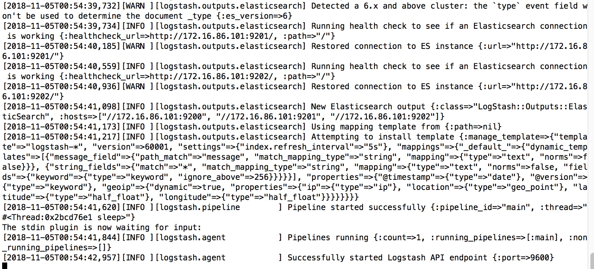

ES课程4


[TOC]
## 课堂主题
熟悉使用ELK

## 课程目标
使用Logstash日志收集
使用kibana做可视化管理和报表
## 知识要点
### ELK是什么
ELK是Elasticsearch , Logstash, Kibana三个软件的缩写。
* Elasticsearch
我们已经很熟悉了；
* Logstash
是用来日志做收集分析的，可以直接将收集来的数据格式化后存入到ES当中去。
* Filebeat
隶属于Beats。用go写的一套采集工具，可以和Logstash结合使用，专门做采集，然后Logstash去做格式化写索引等操作。
* Kibana
一套可视化开源的管理工具，可以对ES进行页面管理，可以生产报表等。

### 为什么要用ELK
首先Elasticsearch能为我们解决大数据的检索问题；
Logstash可以对庞大的分布式系统做日志采集，可以统一话的去管理和分析我们的日志；
Kibana是一套可视化工具，能够给他们提供完整的可视化操作，可以清醒的将分析内容展示给我们。

ELK体系是一整套开源的解决方案，可以对我们整体系统做完美的适配

### logstash 和filebeat
* 资源消耗
logstash是用java启动，比较耗资源，filebeat是go写的；

* 分工
filebeat负责收集发送日志，交给Logstash处理，如下图


### kibana
可视化操作平台
## 资源配置
### 集群搭建使用

### Logstash 搭建
#### 【第一步】下载软件
```url
https://artifacts.elastic.co/downloads/logstash/logstash-6.4.2.tar.gz
```
#### 【第二步】解压文件
```shell
tar -xvf logstash-6.4.2.tar.gz
```
#### 【第三步】修改配置文件
```shell
vi config/logback-es.conf
```
```shell
input {                                ##input 输入源配置
    tcp {                              ##使用tcp输入源      官网有详细文档
        port => 9601                   ##服务器监听端口9061 接受日志  默认ip localhost
        codec => json_lines            ##使用json解析日志    需要安装json解析插件
    }
} 
filter ｛                              ##数据处理
｝                                
output {                               ##output 数据输出配置
        elasticsearch {                ##使用elasticsearch接收
            hosts => ["172.16.86.101:9200","172.16.86.101:9201","172.16.86.101:9202"]  ##集群地址  多个用，隔开
            index => "kkb-log-01_%{+YYYY.MM.dd}" ##指定输出索引
        }
        stdout { codec => rubydebug}   ##输出到命令窗口
}
```
#### 【第四步】安装插件
```shell
./bin/logstash-plugin install logstash-codec-json_lines
```


#### 【第四步】启动服务
```shell
./bin/logstash -f config/logback-es.conf
```


#### 【第五步】添加日志输入源
我们使用logback输出日志
##### 【第1步】添加pom文件

```xml
<dependency>
			<groupId>net.logstash.logback</groupId>
			<artifactId>logstash-logback-encoder</artifactId>
			<version>5.2</version>
</dependency>
```
##### 【第2步】logback.xml文件

放在系统的跟目录下，直接在/src/main/resources下，系统会自动加载
```xml
<configuration>
	<appender name="stash"
		class="net.logstash.logback.appender.LogstashTcpSocketAppender">
		<destination>172.16.86.101:9601</destination>
		<encoder charset="UTF-8"
			class="net.logstash.logback.encoder.LogstashTcpEncoder" />
	</appender>
	<root level="INFO">
		<appender-ref ref="stash" />
	</root>
</configuration>
```
##### 【第3步】写log
在项目中任何地方加log
```java
import org.slf4j.Logger;
import org.slf4j.LoggerFactory;

private final static Logger logger = LoggerFactory.getLogger(MySpringBootApplication.class);

logger.info("---test---"+i);
```

##### 【第4步】启动项目
放到tomcat 或者springboot自启动

#### 【第六步】
查看数据


#### 配置使用
##### 基本组成
```json
input {
    #输入
}
filter {
    #过滤匹配
}
output {
    #输出
}
```

##### 值类型语法
* bool　　
debug => true
* string　　
host => "localhost"
* number　　
port => 80
* array　　
match => ["hello","message"]
* hash　　
options => {name => "xiaoming", age => 55}

##### 判断条件
| -                      | 操作符             |
| ---------------------- | --------------------- |
| 比较                 | ==、!=、<、>、<=、>= |
| 正则是否匹配     | =~、!~               |
| 包含（字符串/数组） | in、not in           |
| 布尔操作符        | and、or、nand、xor、! |
| 分组操作符        | ()                    |

##### 输入
###### 本地log读取
```json
input {
    file {
        path => ["/var/log/access.log", "/var/log/message"]      #监听文件路径
        type => "system_log"                                     #定义事件类型
        start_position => "beginning"                             #检查时间戳
    }
}
```


###### 监听端口
```json
  tcp {                              ##使用tcp输入源      官网有详细文档
        port => 9601                   ##服务器监听端口9061 接受日志  默认ip localhost
        codec => json_lines            ##使用json解析日志    需要安装json解析插件
    }
} 
```

##### 输出
###### action
* index 给一个文档建立索引
* delete 通过id值删除一个文档（这个action需要指定一个id值）
* create 插入一条文档信息，如果这条文档信息在索引中已经存在，那么本次插入工作失败
* update 通过id值更新一个文档。更新有个特殊的案例upsert，如果被更新的文档还不存在，那么就会用到upsert
* 实例
```shell
action => "index"
```
###### index
写入事件所用的索引。可以动态的使用%{foo}语法，它的默认值是：
"logstash-%{+YYYY.MM.dd}"，以天为单位分割的索引，使你可以很容易的删除老的数据或者搜索指定时间范围内的数据。

 索引不能包含大写字母。推荐使用以周为索引的ISO 8601格式，例如logstash-%{+xxxx.ww}
* 实例
```shell

```
###### hosts
是一个数组类型的值
* 实例
```shell
hosts => ["172.16.86.101:9200","172.16.86.101:9201","172.16.86.101:9202"]
```
###### document_type
定义es索引的type，一般你应该让同一种类型的日志存到同一种type中，比如debug日志和error日志存到不同的type中
如果不设置默认type为logs
###### template
你可以设置指向你自己模板的路径。如果没有设置，那么默认的模板会被使用
###### template_name
这个配置项用来定义在Elasticsearch中模板的命名

### 小结1
回顾下刚才讲解的日志收集，思考一下自己项目的日志那些可以收集，应该如何收集好，怎样去对日志做统一的规划。

### beats/Filebeat搭建
#### 【第一步】下载解压文件
```url
https://www.elastic.co/downloads/beats/filebeat
```
#### 【第二步】修改配置文件
filebeat.yml
修改yml文件特别要注意空格问题！

* 添加读取源

```yml
- type: log
  enabled: true
  paths:
    - /Users/wangyudi/server/logs/es_java_01/*.log
```

* 添加输出源

```yml
output.logstash:
  # The Logstash hosts
 hosts: ["192.168.10.20:5044"]
```

* Logstash配置修改

```json
beats {
        port => 5044
        type => "beats"
        codec => json_lines
     }  
```
* Logstash完整配置文件

 ```json
input {
    tcp {
        port => 9601
        type => "tcp"
        codec => json_lines
    }
    beats {
        port => 5044
        type => "beats"
        codec => json_lines
     }   
}
output {

		if [type] == "beats"{
 				elasticsearch {
                hosts => ["192.168.10.204:9200","192.168.10.204:9201","192.168.10.204:9202"]
                index => "kkb-log-01_beats%{+YYYY.MM.dd}"
        }
		}

 		if [level] == "ERROR" {
 				elasticsearch {
                hosts => ["172.16.86.101:9200","172.16.86.101:9201","172.16.86.101:9202"]
                index => "kkb-log-01_tcp_error%{+YYYY.MM.dd}"
        }
 		}
    elasticsearch {
            hosts => ["172.16.86.101:9200","172.16.86.101:9201","172.16.86.101:9202"]
            index => "kkb-log-01_tcp%{+YYYY.MM.dd}"
    }
    stdout { codec => rubydebug}
}
 ```

#### 【第三步】启动服务
```shell
./filebeat -e -c filebeat.yml -d "publish"
```

### kibana搭建
#### 【第一步】下载文件
```url
https://artifacts.elastic.co/downloads/kibana/kibana-6.4.2-linux-x86_64.tar.gz
```
#### 【第二步】修改配置文件

```shell
vi kibana-6.4.2-linux-x86_64/config/kibana.yml
```

```shell
server.port: 5600       ##服务端口
server.host: "0.0.0.0"  ##服务器ip  本机
elasticsearch.url: "http://localhost:9200" ##elasticsearch服务地址
```
#### 【第三步】启动项目
```shell
./bin/kibana
```
注意端口占用，特别是重启时看看进程有没有消除掉
#### 【第四步】验证


#### 简单使用
##### 主要模块
* Discover（发现）
与es的交互和展示
操作单个索引，或者设置可视化查询
* Visualize（可视化）
生成报表实用，多种图表
* Dashboard（仪表板）
* Settings（设置）
* management
可视化管理es和kibana内容


索引管理模块

* Dev Tools
命令使用界面，直接用url json执行


* 监视页面
```url
http://172.16.86.101:5600/status
```


##### discover使用
添加索引


查询条件设置


点击EditQueryDSL出现json查询语句，类似navcat的条件查询

选择有么有time字段


有就会按照时间过滤

##### Visualize图表生成

各种图表模块


然后选择索引


## 拓展点、未来计划、行业趋势

ELK体系对于大型集群的项目来说是个很好的解决方案，国内很多公司都加入了使用，未来ELK的应用将更广。

## 总结
本节课对于Logstash, Kibana了解；
环境搭建，基本使用，和高级使用。

## 作业
* 动手题
搭建好Logstash, Kibana并且使用
* 思考题
对日志收集做一次规划
