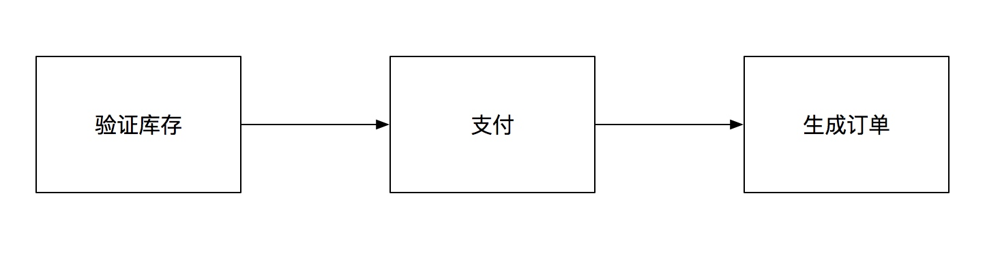
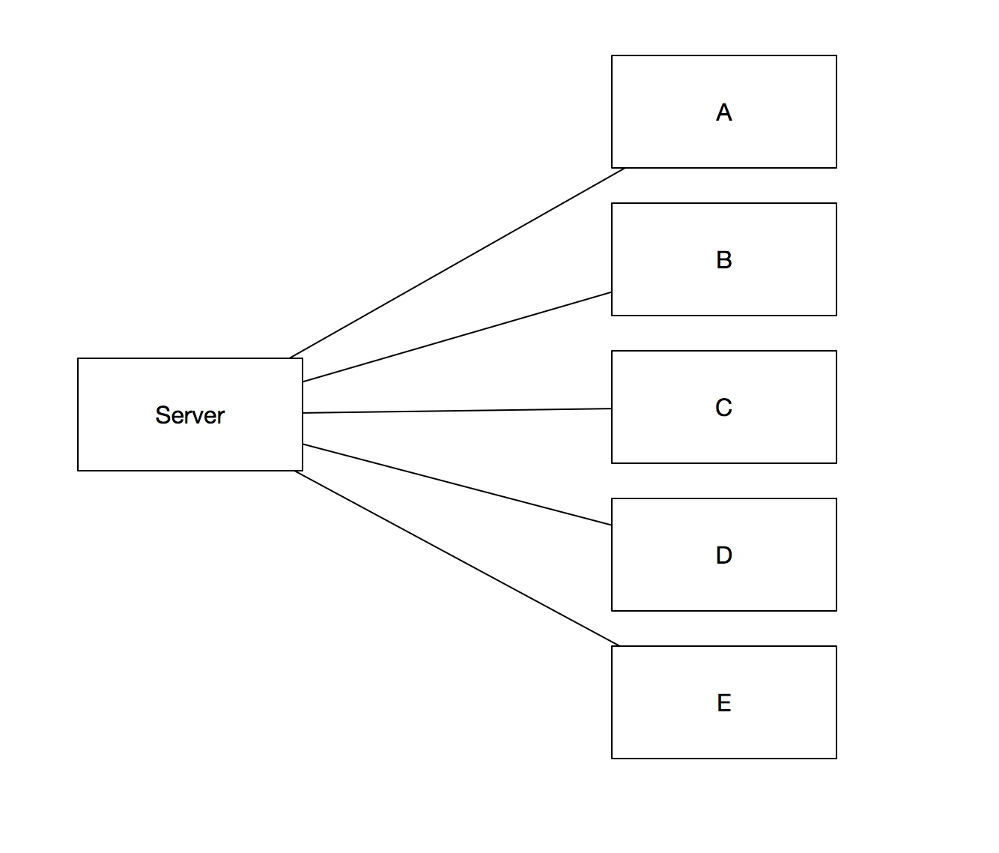
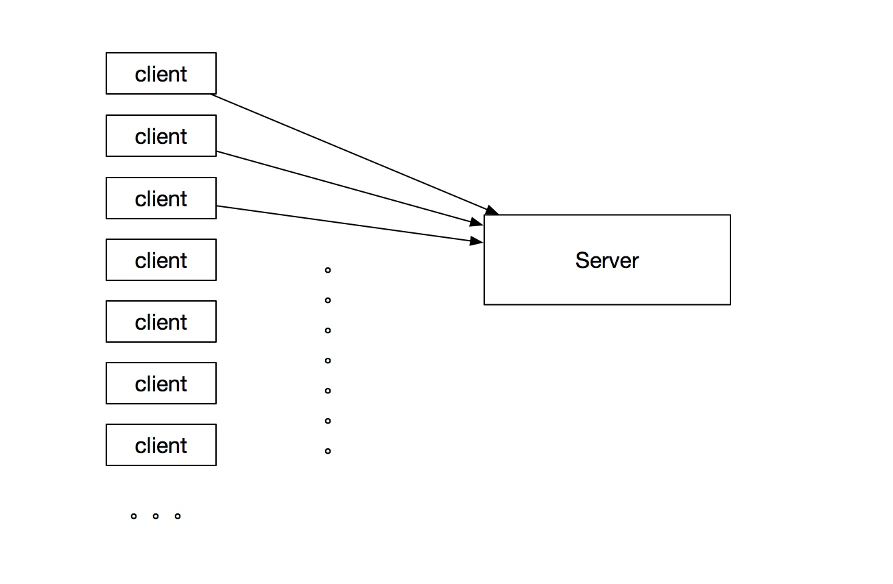
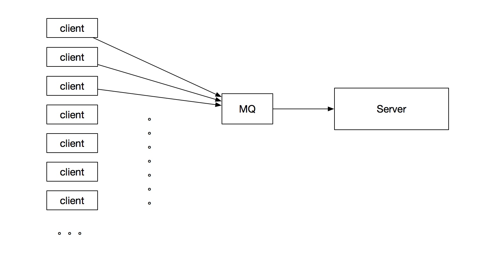
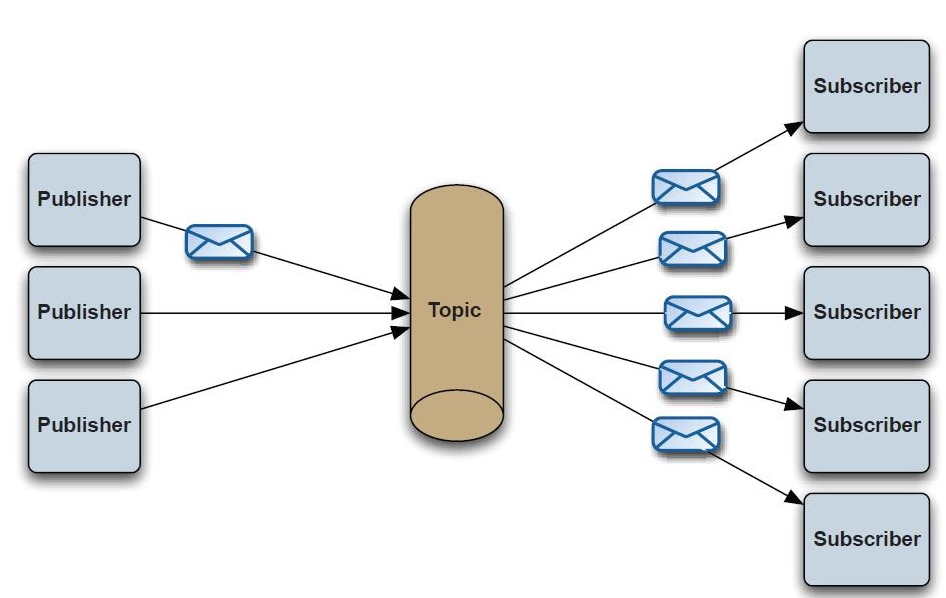
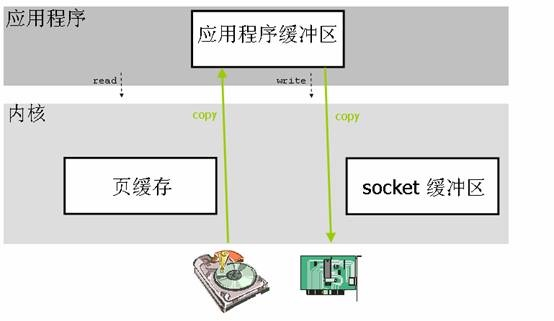

# MQ（讲师版）

## 课堂主题

MQ相关内容讲解

## 课堂目标

能够适当的使用MQ

## 知识要点

MQ的由来作用
世面上MQ对比
RocketMQ原理

### 什么是MQ

本来给大家讲activeMQ，大家说想听RocketMQ，其实我们后边的课程有kafka；
RocketMQ和kafka 有很多相识的地方，最开始RocketMQ就是仿制的kafka，后来经历的阿里双11的一次次洗礼，已经完成向不同的方向不同的高度发展了，kafka现在更适合日志信息，分布式大MQ处理现在基本上就是RocketMQ。

我们这节课先了解下MQ，花个半个小时左右给大家说下由来，和基本的几个MQ服务。前边我讲的可能简单一些，会把由来和MQ需要处理的处理的事情，分工等简单说一下，然后介绍几个MQ。

之后我们就讲MQ 的原理，讲如何解决我们前期需要解决的问题；深度不一，过程中我会讲到其他关联的服务知识点肯定有些大家不会的，当然都会了更好，希望大家能够好好把握一下，有不懂的地方自己先解决下，然后交流；要享受解决问题的过程！

好，我们先开始看看MQ几种场景，什么情况演变过来的。

#### 使用场景(10-20分钟)

参考资料

```url
https://www.aliyun.com/product/rocketmq?spm=a2c4g.11174283.2.1.22d7449cU9m8K1
```

##### 业务解耦

###### 场景

* 下单方法
 * 验证库存
 * 支付验证
 * 生成订单

###### 原始方法


###### 演变1




###### 演变2



##### 最终一致性

###### 场景

更新热点数据，可能db需要更新多张表，或者大表

###### 原始使用


###### 演变



##### 广播

###### 场景

需要通知多个服务相同的消息

###### 原始使用




###### 演变



##### 错峰流控等

###### 场景

高并发服务

###### 原始使用




###### 演变
 
 

 
##### 其他场景

* 顺序保证
在大多使用场景下，数据处理的顺序都很重要。大部分消息队列本来就是排序的，并且能保证数据会按照特定的顺序来处理。

* 数据流处理
分布式系统产生的海量数据流，如：业务日志、监控数据、用户行为等，针对这些数据流进行实时或批量采集汇总，然后进行大数据分析是当前互联网的必备技术，通过消息队列完成此类数据收集是最好的选择。
 
##### 总结 

中心思想：异步处理。

#### MQ构成（5-10分钟）

既然上边我们说了这么多的MQ使用场景，那具体用起来哪种方式？和具体怎么分工能实现那些场景我们就看看。

##### 使用模型

###### PTP点对点

使用queue作为通信载体


###### Pub/Sub发布订阅（广播）

使用topic作为通信载体，给subsciber广播消息





##### 使用类型

刚才说大的方式是两种，我们再细化一下具体可能使用到的点有哪些？

* 优先级队列
消息有堆积的情况下，并且生产者是多个；

* 延迟队列
不需要马上消费的队列，有新消息就会根据时间排序

* 死信队列
消息无法被正常消费，防止无故丢失

* 回退队列
消息消费失败后需要放回，如果再放回顶部回出现死循环，由回退队列存储该类消息；
可以用死信和重试实现。

* 重试队列
对回退的消息做重复消费，设置重试（延时）时间，多次重试

##### 基本组件

* Broker
消息服务器，作为server提供消息核心服务

* Producer
消息生产者，业务的发起方，负责生产消息传输给broker
 
* Consumer
消息消费者，业务的处理方，负责从broker获取消息并进行业务逻辑处理

* Topic
主题，发布订阅模式下的消息统一汇集地，不同生产者向topic发送消息，由MQ服务器分发到不同的订阅者，实现消息的广播

* Queue
队列，PTP模式下，特定生产者向特定queue发送消息，消费者订阅特定的queue完成指定消息的接收

* Message
消息体，根据不同通信协议定义的固定格式进行编码的数据包，来封装业务数据，实现消息的传输

##### 通讯协议


* AMQP协议
应用层协议的一个开放标准,为面向消息的中间件设计

* MQTT协议
格式简洁、占用带宽小、移动端通信、PUSH、嵌入式系统 基于TCP的二进制协议

* STOMP协议
简单文本协议

* XMPP协议
基于XML的协议

* 其他基于TCP/IP自定义的协议
有些特殊框架（如：redis、kafka、zeroMq等）根据自身需要未严格遵循MQ规范，而是基于TCP\IP自行封装了一套协议，通过网络socket接口进行传输，实现了MQ的功能。


### 常见MQ（5-10分钟）


#### RocketMQ

阿里系下开源的一款分布式、队列模型的消息中间件，原名Metaq，3.0版本名称改为RocketMQ，是阿里参照kafka设计思想使用java实现的一套mq。同时将阿里系内部多款mq产品（Notify、metaq）进行整合，只维护核心功能，去除了所有其他运行时依赖，保证核心功能最简化，在此基础上配合阿里上述其他开源产品实现不同场景下mq的架构，目前主要多用于订单交易系统。

具有以下特点：

能够保证严格的消息顺序
提供针对消息的过滤功能
提供丰富的消息拉取模式
高效的订阅者水平扩展能力
实时的消息订阅机制
亿级消息堆积能力

#### RabbitMQ

使用Erlang编写的一个开源的消息队列，本身支持很多的协议：AMQP，XMPP, SMTP,STOMP，也正是如此，使的它变的非常重量级，更适合于企业级的开发。同时实现了Broker架构，核心思想是生产者不会将消息直接发送给队列，消息在发送给客户端时先在中心队列排队。对路由(Routing)，负载均衡(Load balance)、数据持久化都有很好的支持。多用于进行企业级的ESB整合。

#### ActiveMQ

Apache下的一个子项目。使用Java完全支持JMS1.1和J2EE 1.4规范的 JMS Provider实现，少量代码就可以高效地实现高级应用场景。可插拔的传输协议支持，比如：in-VM, TCP, SSL, NIO, UDP, multicast, JGroups and JXTA transports。RabbitMQ、ZeroMQ、ActiveMQ均支持常用的多种语言客户端 C++、Java、.Net,、Python、 Php、 Ruby等


#### Kafka

Apache下的一个子项目，使用scala实现的一个高性能分布式Publish/Subscribe消息队列系统，具有以下特性：

快速持久化：通过磁盘顺序读写与零拷贝机制，可以在O(1)的系统开销下进行消息持久化；
高吞吐：在一台普通的服务器上既可以达到10W/s的吞吐速率；
高堆积：支持topic下消费者较长时间离线，消息堆积量大；
完全的分布式系统：Broker、Producer、Consumer都原生自动支持分布式，依赖zookeeper自动实现复杂均衡；
支持Hadoop数据并行加载：对于像Hadoop的一样的日志数据和离线分析系统，但又要求实时处理的限制，这是一个可行的解决方案。


#### ZeroMQ

号称最快的消息队列系统，专门为高吞吐量/低延迟的场景开发，在金融界的应用中经常使用，偏重于实时数据通信场景。ZMQ能够实现RabbitMQ不擅长的高级/复杂的队列，但是开发人员需要自己组合多种技术框架，开发成本高。因此ZeroMQ具有一个独特的非中间件的模式，更像一个socket library，你不需要安装和运行一个消息服务器或中间件，因为你的应用程序本身就是使用ZeroMQ API完成逻辑服务的角色。但是ZeroMQ仅提供非持久性的队列，如果down机，数据将会丢失。如：Twitter的Storm中使用ZeroMQ作为数据流的传输。

ZeroMQ套接字是与传输层无关的：ZeroMQ套接字对所有传输层协议定义了统一的API接口。默认支持 进程内(inproc) ，进程间(IPC) ，多播，TCP协议，在不同的协议之间切换只要简单的改变连接字符串的前缀。可以在任何时候以最小的代价从进程间的本地通信切换到分布式下的TCP通信。ZeroMQ在背后处理连接建立，断开和重连逻辑。

特性：

无锁的队列模型：对于跨线程间的交互（用户端和session）之间的数据交换通道pipe，采用无锁的队列算法CAS；在pipe的两端注册有异步事件，在读或者写消息到pipe的时，会自动触发读写事件。
批量处理的算法：对于批量的消息，进行了适应性的优化，可以批量的接收和发送消息。
多核下的线程绑定，无须CPU切换：区别于传统的多线程并发模式，信号量或者临界区，zeroMQ充分利用多核的优势，每个核绑定运行一个工作者线程，避免多线程之间的CPU切换开销。


#### 属性对比

RocketMQ官方对比

```url
https://rocketmq.apache.org/docs/motivation/
```


#### 性能对比

| 特性     | ActiveMQ     | RabbitMQ     | RocketMQ           | kafka              |
| ---------- | ------------ | ------------ | ------------------ | ------------------ |
| 开发语言 | java         | erlang       | java               | scala              |
| 单机吞吐量 | 万级       | 万级       | 10万级           | 10万级           |
| 时效性  | ms级        | us级        | ms级              | ms级以内        |
| 可用性  | 高(主从架构) | 高(主从架构) | 非常高(分布式架构) | 非常高(分布式架构) |


### RocketMQ

讲解过程中我会加入一些kafka的相关信息做对比

#### 集群原理（10-20分钟）


##### 工作流程

* 启动 Name Server 
启动监听，等其他服务连接，相当于注册中心；


* Broker注册
向 <font color=#FF0000>  每一个</font> Name Server 注册topic，通过长链接的心跳信息维持


* Producer获取信息
和<font color=#FF0000>其中一个</font>Name Server 建立长链接，获取topic 消息，然后和<font color=#FF0000>需要的一些</font>Broker建立长链接，然后存储消息。


* Consumer获取信息
和Producer逻辑一样
和<font color=#FF0000>其中一个</font>Name Server 建立长链接，获取topic 消息，然后和<font color=#FF0000>需要的一些</font>Broker建立长链接，然后消费。
具体和Master、Slave哪个消费由Broker决定。


##### 集群工作逻辑

###### Name Server 

注册中心，存储关联信息；
无状态节点，宕机不影响其他工作；
宕机不影响已经建立的topic关系；
压力在心跳监控上。

***** 这个时候想一下zk的原理，利比在哪？

###### Broker

* 工作模式
消息载体服务，有Master和Slave；
  * remoting（远程） 模块
  broker的入口，处理从客户端发起的请求。
  * client manager（客户端管理）
  管理各个客户端（生产者/消费者）还有维护消费者主题订阅。
  * Slave同步过程
  启动一条线程不断从Master拉取CommitLog，然后异步的创建Consume Queue；
  类试MySQL的主从同步

* store（存储服务）（下边详解）
 * 读写逻辑
消息顺序写，所以Topic同时只写一个文件，文件满了后创建另一个；完全的顺序执行增加了效率。
随机读，读命中 PAGECACHE，减少 IO 读操作
 * 持久化（下边详解）
异步写盘

* 负载
Topic由队列组成，队列会平均分配到多个Broker中（就是分片）；

* 拓展
Topic过大的化，就增加队列（等于增加分片数）；
集群承载过大的化，增加Borker数量。

* HA

 * 容灾
主挂了，从继续提供读服务，不提供写；


 * 心跳
Borker向Name Server提供信息，Name Server会验证，不存在调整和Topic关系，不会通知其他Producer和Consumer


* 索引
为消息建立索引提供消息快速查询


###### Producer

* 工作模式
无状态

* 写入流程
轮询写入Borker

* 心跳
和Name Server连接，隔几十秒获取一次信息，会有延迟，Borker失败后重试；
Borker也有心跳，会断开连接；

###### Consumer

* 工作模式
无状态，集群消费，广播消费
 * 集群消费
 集群下节点平分Topic
 * 广播消费
 所有Consumer都消费一遍

* 心跳
和Producer策略一样

 

###### 解释

* Name Server 
是一个几乎无状态节点，可集群部署，节点之间无任何信息同步。
即使整个Namesrv集群宕机，已经正常工作的Producer，Consumer，Broker仍然能正常工作，但新起的Producer, Consumer，Broker就无法工作
topic太多的化，传输时间长可能会误认为broker失效。

* Broker 部署相对复杂，Broker 分为 Master 与 Slave，一个 Master 可以对应多个 Slave，但是一个 Slave 只能对应一个 Master，Master 与 Slave 的对应关系通过指定相同的 BrokerName，不同的 BrokerId 来定义，BrokerId 为 0 表示 Master，非 0 表示 Slave。Master 也可以部署多个。每个 Broker 与 Name Server 集群中的所有节点建立长连接，定时注册 Topic 信息到所有 Name Server

收发消息前，先创建topic，创建topic时需要指定该topic要存储在哪些Broker上。也可以在发送消息时自动创建Topic

* Producer 与 Name Server 集群中的其中一个节点(随机选择)建立长连接，定期从 Name Server 取 Topic 路由信息，并向提供 Topic 服务的 Master 建立长连接，且定时向 Master 发送心跳。Producer 完全无状态，可集群部署。

* Consumer 与 Name Server 集群中的其中一个节点(随机选择)建立长连接，定期从 Name Server 取 Topic 路由信息，并向提供 Topic 服务的 Master、Slave 建立长连接，且定时向 Master、Slave 发送心跳。Consumer 既可以从 Master 订阅消息，也可以从 Slave 订阅消息，订阅规则由 Broker 配置决定。


#### 存储

##### 0 copy（5-10分钟）

参考文章

```url
https://www.linuxjournal.com/article/6345
```


```url
https://www.ibm.com/developerworks/cn/java/j-zerocopy/
```

```url
https://www.ibm.com/developerworks/cn/linux/l-cn-zerocopy1/index.html
https://www.ibm.com/developerworks/cn/linux/l-cn-zerocopy2/index.html
```

###### 传统方式


可以大致理解成，jvm中JMM主内存和工作内存；中间有很多不同之处！！！


###### 直接内存




###### mmap


* 建立映射
调用map方法建立用户进程与内核内存的<font color=#FF0000> 映射</font>，映射范围是某个文件。这个是阻塞的

* 映射写到socket
调用write方法，将之前建立的<font color=#FF0000> 映射 </font>，写到socket；
这里nio的方式异步去做，netty就是这个实现


小文件传输快，需要四次用户态与内核态的切换。文件到内核缓存，内核缓存到socket buffer，socket buffer到网卡内存。cpu介入多，用户态与内核态切换多。
分成两个阶段，
阶段一：调用map方法，建立用户进程与内核内存的映射，映射范围是某个文件。这个是阻塞的。
阶段二：调用write方法，将之前建立的映射，写到socket。
阶段二可以设计成nio形式。实现就是将要写的内容封装成消息发给io线程。io线程异步去做。这方面netty框架就是这么做的。


###### sendfile


* 建立映射
内核缓存拷贝映射（内核缓存的地址）到socket buffer

* 写网卡
写网卡直接通过映射读取原来的信息，无法实现nio异步操作


大文件传输比mmap快，原因是只存在二次用户态与内核态的切换。并且之后少了内核缓存到socket buffer的拷贝。
分成一个阶段：
发送者阻塞调用sendfile方法，sendfile(socket, file, len);
接着会完成file到内核缓存，内核缓存拷贝个消息在内核缓存的地址到socket buffer。然后dma从socket buffer指示的内核缓存拷贝数据到网卡内存。
这里分成一个阶段，优点很明显少了用户态与内核态切换，及内核到socket buffer的拷贝，并且相应的cpu介入少了。但缺点也是因为这个原因，导致不能nio进行消息发送。


###### NIO

参考资料
《鸟哥的Linux私房菜》
```
https://segmentfault.com/a/1190000003063859
https://blog.csdn.net/historyasamirror/article/details/5778378
```

* BIO


* NIO 多路复用


* 多路复用


##### 数据存储（10分钟左右）

###### 请求总体流程


###### 消息存储


* Commit Log
消息存储单元长度不固定，文件顺序写，随机读（订阅消息先顺序读取 Consume Queue）

* Consume Queue
相当于字典的目录，指定Commit Log上的文件地址
 * CommitLog Offset
 是指这条消息在Commit Log文件中的实际偏移量，就是开始位置
 * Size
 存储中消息的大小
 * Message Tag HashCode
 存储消息的Tag的哈希值：主要用于订阅时消息过滤（订阅时如果指定了Tag，会根据HashCode来快速查找到订阅的消息）


这样做的好处如下:
(1). 队列轻量化，单个队列数据量非常少。
(2). 对磁盘的访问串行化，避免磁盘竟争，不会因为队列增加导致IOWAIT增高。
每个方案都有缺点，它的缺点如下:
(1). 写虽然完全是顺序写，但是读却变成了完全的随机读。
(2). 读一条消息，会先读ConsumeQueue，再读CommitLog，增加了开销。
(3). 要保证CommitLog与ConsumeQueue完全的一致，增加了编程的复杂度。


##### PageCache


系统会拿出一部分文件放到缓存中，加速读写。


* Broker拉取流程
 * 检查
 检查是否在上一次的cache中
 * 不在
 从磁盘读取数据页，一次把连续几页拿出来（一般3页）；判定为跳跃读取，同步预读。
 * 在
 说明上次内容有效，系统会扩大page页；判定为顺序读取，异步读取。


* 数据结构window


-----

a状态：操作系统等待应用读请求时的缓存状态。
b状态：客户端发起读操作，broker发现所读数据不在Cache中，即不在前次预读的group中，则表明文件访问不是顺序访问（场景有可能是不消费中间的某部分消息，直接消费最新的消息），系统采用同步预读，直接从磁盘中读取页面+缓存页到内存。
c状态：客户端继续发起读操作，系统发现所读数据在Cache中，则表明前次预读命中，操作系统把预读group扩大一倍，并让底层文件系统读入group中剩下尚不在Cache中的文件数据块，异步预读。

所以Broker的机器需要大内存，尽量缓存足够多的commitLog，让Broker读写消息基本在PageCache中操作。在运行时，如果数据量非常大，可以看到broker的进程占用内存比较多，其实大部分是被缓存住的commitlog

* 官方资料

```url
https://rocketmq.apache.org/rocketmq/how-to-support-more-queues-in-rocketmq/
```

* wiki上的解释


```url
https://en.wikipedia.org/wiki/Page_cache
```


* 课后作业
PageCache机制有空搞明白，最好再把清理机制搞一下。

###### 刷盘策略

rocketmq先写入pagecache然后刷盘，消息都是持久化的；内存和磁盘都有一份数据，读取时直接从内存读取


* 异步刷盘
 * 读写速度
 内存>磁盘>带宽，异步刷盘从这个角度可能不会堆积。
 * 消息堆积
 如果压力大，有读有写，磁盘就会落后；
 如果出现堆积，方法1：LRU方式淘汰干净page腾地方，方法2：干净page不足，阻塞，刷部分数据，再找足够的page

* 同步刷盘
等等刷盘完成后再返回


##### 查询消息

###### id查询


###### key查询

这时候就用到索引了，上面我们提到会存储的时候回存储索引；


##### 消息可靠性

* Broker挂了

* Broker写入异常

* 机房断电

* 磁盘坏了

这几种情况没问题吧，有slave，或者持久化恢复


#### 场景问题解决

##### 顺序队列


将不同订单的消息路由到不同的分区中，把单独消息发到同一个队列（queue），不只是同一个topic，默认情况下一个topic包括4个queue

Consumer消费时通过一个分区只能有一个线程消费的方式来保证消息顺序


FailOver失败逻辑无法做
并行处理问题
个别队列由于哈希不均导致消息过多，消费速度跟不上
产生消息堆积问题遇到消息失败的消息，无法跳过，当前队列消费暂停

##### 消息重复消费

网络不可达，Consumer消费到相同的msg

* 幂等
消费端去重，通过msgID做幂等；

* 状态机
业务层面的状态机去重


RocketMQ不保证消息不重复，如果你的业务需要保证严格的不重复消息，需要你自己在业务端去重


##### 事务消息

###### 常见分布式

* 最终一致性

上图MQ场景

* 2PC/3PC

分两个阶段提交,提交过程中会锁住过多的资源


* TCC

基于补偿型事务的AP系统的一种实现, 具有最终一致性,使用场景分布式服务系统


* RocketMQ


3.2.6之前老的版本实现，3.2.6后关闭了方法，4.0后又开放了


 * 第一步
 发送Prepared消息时，会拿到消息的地址
 * 第二步
 执行本地事物
 * 第三步
 通过第一阶段拿到的地址去访问消息，并修改消息的状态


参考文章


```url
https://blog.csdn.net/qq_28632173/article/details/83790243
```


#### 其他

定时消息

消息重试

回溯消费

消息过滤

等等。。。

#### 使用


```url
http://rocketmq.apache.org/docs/quick-start/
```

### 选型方向

##### 消息堆积+持久化

MQ经常用来做流量消峰，所以必须堆积能力强

###### 对比

* RocketMQ
支持异步实时刷盘，同步刷盘，同步复制，异步复制

* kafka
直接用的磁盘堆积，磁盘顺序读写与零拷贝机制快速持久化;

* RabbitMQ
主要是内存堆积，
到一定量后会做换页动作把内存里的东西刷到磁盘里，换页影响吞吐量；
或者用惰性队列持久化到磁盘

###### RocketMQ解决方案

* 容量
依赖磁盘大小，对磁盘和内存都有要求

* 吞吐量
消息集群topic和队列配置，对slave服务的正确使用


##### 性能

* kafka
单机写入TPS约在百万，消息大小10个字节
* RocketMQ
单机写入TPS单实例约7万条/秒，单机部署3个Broker，可以跑到最高12万条/秒，消息大小10个字节

为什么

制片人通常使用的Java语言，缓存过多消息，GC是个很严重的问题
Producer调用发送消息接口，消息未发送到Broker，向业务返回成功，此时Producer宕机，会导致消息丢失，业务出错
Producer通常为分布式系统，且每台机器都是多线程发送，我们认为线上的系统单个Producer每秒产生的数据量有限，不可能上万。
缓存的功能完全可以由上层业务完成。
单机支持的队列数

Kafka单机超过64个队列/分区，Load会发生明显的飙高现象，队列越多，load越高，发送消息响应时间变长。Kafka分区数无法过多的问题

RocketMQ单机支持最高5万个队列，负载不会发生明显变化

队列多有什么好处？
单机可以创建更多话题，因为每个主题都是由一批队列组成
消费者的集群规模和队列数成正比，队列越多，消费类集群可以越大

##### 其他

投递实时性、消息追踪、消息过滤、多租户、顺序、定时、分布式事务、回溯消息、多协议支持、安全机制、跨语言支持


## 拓展点、未来计划、行业趋势

 
```url
https://www.aliyun.com/product/rocketmq?utm_content=se_1001344887
```
 
 
```url
https://yq.aliyun.com/articles/622171?utm_content=m_1000012630
```

## 总结

知道MQ由来做什么的；
能给在适当的场合使用MQ；
对RocketMQ的基本工作和存储原理掌握；


## 作业

搭建RocketMQ集群使用
自己拓展下，对MQ线型得心应手




