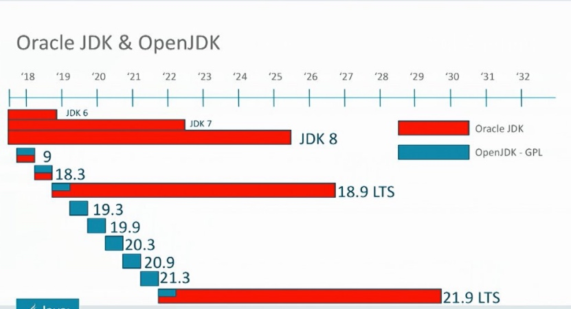
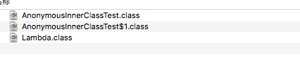

java 各版本的区别


[TOC]


## 课堂主题
## 课堂目标

## 知识要点

### JAVA基本信息

#### JAVA SE,JAVA EE ,JAVA ME

* Java SE （standard edition）标准版
简单的说就是电脑上运行java程序，包涵了java基本开发的规则、数据库连接、IO、网络传输等等基础jar包类。
* java EE （enterprise edition）企业版
可以提供web服务，比SE多的最明显的部分是servlet、JSP；其他还多了XML解析，事务解析等等
* javaME （micro edition）小型版
之前开发手机用的，现在用的很少了，包涵了SE核心类和一些自己的应用类API等等

* 关系图
    

#### JDK,JRE

* JRE
java语言的运行环境，包括了jvm，运行类库，应用库等必备组件。
* JDK
包括了整个官方java相关内容，包括编译器，监控Jconsole，visualVM等。目录结构的话jre就是jdk离的一个目录。
最常见的问题，有时候看jar包里的类，如果项目引用的jre就看不了源码，jdk就可以直接点进去变成源码。
* 图例（java 7）


#### openJDK，OracleJDK

* OpenJDK
是全开源的项目用的是GPLv2协议，相比于原来的JDK缺少一部分东西。
没有部署的功能：Browser Plugin、Java Web Start、以及Java控制面板。
由于有些功能是有产权问题，所以无法完全公开。
可以理解OpenJDK就是精简版的JDK。

 因为有很多商业上的问题，Android用的dalvik，art，未来用openJDK。后续会有很多公司对openJDK做修改。

 网址
 ```url
http://jdk.java.net/
```

* Oracle JDK
使用自己
Oracle JDK采用了商业实现，而OpenJDK使用的是开源的FreeType。当然，“相同”是建立在两者共有的组件基础上的，Oracle JDK中还会存在一些Open JDK没有的、商用闭源的功能，例如从JRockit移植改造而来的Java Flight Recorder

* 开源协议
所有的协议有五六十种
 ```url
https://opensource.org/licenses%20/alphabetical
```
常见的协议
 ```url
http://www.open-open.com/solution/view/1319816219625
```

#### 发展史

09年被oracle收购这个大家也都知道了，oracle收购后对java做了一些改进，但是也做很多扯淡的事情。

之前java由于各种问题在1.6后到1.8 经历很长一段时间才更新，随后1.9发布后，oracle宣布半年更新一版，每三年提供一个稳定的版本，给予长期的补丁支持；小版本不会提供免费的维护和升级。

里边有一定的陷阱，用11的时候如果你们公司涉及到比较牛逼的业务，一定要读懂License（官方许可证）再大规模使用。

国内的公司阿里有自己的Alibaba JDK，亚马逊有 Corretto，IBM的AdoptOpenJDK，他们都是基于Open JDK，随后还会更多的合作，而且长期维护。


* 官方版本表


* 维护周期


* 官方历史存档

 ```url
https://www.oracle.com/technetwork/cn/java/archive-139210-zhs.html
```

### jvm改动
### forkjoin
### Lambda
#### 介绍
这是jdk8的一大改动项，我们先例举下如何使用，再讲讲实现原理。
官方描述以及语法使用等
```url
https://docs.oracle.com/javase/tutorial/java/javaOO/lambdaexpressions.html
```
一篇不错的译文
```url
https://www.jianshu.com/p/f76f0a0dc5c1
```
##### 简介
平时我们使用匿名类的时候，如果匿名类很简单，只有一个方法，那使用起来就会有点费劲（这句是官方写的）。
这也是主要原因吧，还有就是平时for语句什么会很简便。

##### 优缺点
* 优点
使用简便；
可以并行计算，效率会快，因为在使用中对传递进去的对象是不变的，这样也不需要我们加锁同步等，效率会好很多（下边会讲例子）；
结合新的stream对集合排序过滤等非常便捷；
* 缺点
不好调试；
不并行计算的话效率不如常规；
强类型转换支持不好；

#### 使用

##### 启动一个线程

* 老的方式
 
 ```java
Thread t = new Thread(new Runnable() {
			@Override
			public void run() {
				System.out.println("start...old ");
			}
		});
		t.start();
```

* 新的方式

 ```java
Thread tL = new Thread(() -> System.out.println("start...Lambda1"));
		tL.start();
```

##### 一个string字母排序

* 老的方式

 ```java
List<String> list = Arrays.asList(new String[]{"h","e","d","n"});
		Collections.sort(list, new Comparator<String>() {
		    @Override
		    public int compare(String a, String b) {
		        return b.compareTo(a);
		    }
		});
```
* 新的方式
 ```java		
		Collections.sort(list, (String a, String b) -> {
		    return b.compareTo(a);
		});
		/**
		 * 如果只有一行代码可以省去return 大括号等
		 */
		Collections.sort(list, (a, b) -> b.compareTo(a));
```

##### 修改集合内容
```java
List<String> list = Arrays.asList(new String[]{"AShjDhe","Egdwer","Test","Java"});
List<String> lowerCaseList = new ArrayList<>();
for (String value:list) {lowerCaseList.add(value.toLowerCase());
		}
List<String> lowerCaseListL =  list.stream().map(name ->name.toLowerCase()).collect(Collectors.toList());
```
##### 改变输出集合内容
这样修改时输出，不需要考虑多线程问题，也没有锁同步问题，并行效率会快很多。
```java
int[] ints ={1,2,3,4,5,6,7,8,9,0};
Arrays.stream(ints).map((x)->x=x+10).forEach(System.out::println);
System.out.println();
Arrays.stream(ints).forEach(System.out::println);
```
##### 结合stream使用
stream有很多工具方法，这里简单举个例子，随后可以看看API了解更多详情。
```java
List<Integer> nums = Arrays.asList(new Integer[]{1,null,3,4,null,6,9});
		long count =  nums.stream().filter(num -> num != null).count();
```


* 步骤
 * 创建Stream
 * 转换Stream，每次转换的对象对原理的对象都是不可变的，而且可以多次转换
 * 聚合操作

#### 语法
##### 组成部分
* 参数部分
可以多个参数或一个参数，多个参数需要括号，单参数可以省略掉括号也是合法的。
 * 示例
多参数

 ```java
(Type1 param1, Type2 param2, ..., TypeN paramN) -> {
//code
}
```
 单参数
```java
p -> {
//code
}
```
* 箭头符号->
* 主体
由单独的表达式或者语句块组成；
 * 表达式
 如果单行代码也可以省去大括号
 
 ```java
p.getGender() == Person.Sex.MALE 
    && p.getAge() >= 18
    && p.getAge() <= 25
```
 * 带返回表达式
 
 ```java
p -> {
    return p.getGender() == Person.Sex.MALE
        && p.getAge() >= 18
        && p.getAge() <= 25;
}
```
 * 没有类型的排序
 
 ```java
(h1, h2) -> h1.getName().compareTo(h2.getName())
```
##### 完整例子
* 一般标准
参数 -> 处理方法，return

 ```java
(Type1 param1, Type2 param2, ..., TypeN paramN) -> {
  statment1;
  statment2;
  //.............
  return statmentM;
}
```
* 单参数
如果只有一个形参，小括号也可以省略。例如下面的lambda表达式依然是合法的
```java
p -> p.getGender() == Person.Sex.MALE 
    && p.getAge() >= 18
    && p.getAge() <= 25
```


#### 方法引用
* 静态方法引用
ClassName::methodName
* 实例上的实例方法引用
instanceReference::methodName
* 超类上的实例方法引用
super::methodName
* 类型上的实例方法引用
ClassName::methodName
* 构造方法引用
Class::new
* 数组构造方法引用
TypeName[]::new

#### 实现原理
Lambda不需要声明类或者方法，简单看来就像是一个匿名内部类；其实lambda和匿名内部类是两码事，它是通过invokedynamic 指令来实现的。也就是说是函数式接口。下边我们仔细讲解
* 参考链接

 ```java
https://blog.csdn.net/valleychen1111/article/details/78038353
```

#####编译方式
和匿名内部不同，可以直接从编译方式上看出来。
[AnonymousInnerClassTest](media/15445086502123/AnonymousInnerClassTest.java)
[Lambda](media/15445086502123/Lambda.java)
两个文件一个匿名内部类，一个是Lambda。编译过后如下：

内部类生成了$1.class，Lambda没有

#####函数式接口（functional interface）
参考资料

```url
https://blog.csdn.net/lz710117239/article/details/76192629
```
可以理解为包含一个抽象的方法的普通接口，

!!!根据图片详细整理


#####字节码/源码解析！！！
参考资料
```url
https://blog.csdn.net/valleychen1111/article/details/78038353
```
!!!待详细整理

### http


### java7

#### 二进制

整形都可以用直接用二进制表示，包括byte，short，int，long

* 示例

 ```java
int num = 0b1001;
int num2 = 0B1001;
```

####下划线

数字中间可以加下划线，这样可以一目了然的看到数字大小

* 示例

 ```java
int num = 1_0000_0000;
```

####switch 对String 的支持

之前在switch中不能用string，现在可以使用

* 示例

 ```java
String key = "a";
		
		switch (key) {
		case "a":
			
			break;

		default:
			break;
		}
```


####泛型的自动识别

对泛型示例化的时候可以自动识别类型

* 示例

 ```java
//List
List<String> list = new ArrayList<String>();
List<String> list2 = new ArrayList<>();
//Map
Map<String , Object> map = new HashMap<String , Object>();
Map<String , Object> map2 = new HashMap<>();
```

####try-with-resources 

try-with-resources 自动实现了java.lang.AutoCloseable和java.io.Closeable，无论try中执行如何都会结束资源；

* 示例

 ```java
static String readFirstLineFromFile(String path) throws IOException {
		try (BufferedReader br = new BufferedReader(new FileReader(path))) {
			return br.readLine();
		}
	}
```

* finally
之前的finally，有一些问题，JDK 9会不推荐使用（deprecated）。

 * 发生异常
如果finally中出现了异常无法保证正常资源的回收

 * 执行不可控
 不是所有的情况下都是try报错后然后finally最后执行catch，以下就是一种特例
  ```java
try {
			System.exit(1);
		} catch (Exception e) {
			// 错误处理
		}finally {
			//关闭连接
		}
```
 
####catch多个异常 | 分隔
 
之前我们需要些多个catch，现在一个catch可以捕获多个

* 示例

 ```java
//之前
		catch (IOException ex) {
			// 错误处理
		catch (SQLException ex) {
			// 错误处理
		}catch (Exception ex) {
			// 错误处理
		}
		
		//现在
		catch (IOException | SQLException | Exception ex) {
			// 错误处理
		}
```

###java8
####lambada表达式(Lambda Expressions)
####方法引用（Method references）
####默认方法（Default methods）
####重复注解（Repeating Annotations）
####类型注解（Type Annotation）
####类型推断增强
####方法参数反射（Method Parameter Reflection）
####Stream API 。新添加的Stream API（java.util.stream）
####HashMap改进
####Date Time API
####java.util 包下的改进
####java.util.concurrent 包下增加了新的类和方法
####HotSpot

###java9
####java模块系统 （Java Platform Module System）
####新的版本号格式。
$MAJOR.$MINOR.$SECURITY.$PATCH
####java shell
####在private instance methods方法上可以使用@SafeVarargs注解
####diamond语法与匿名内部类结合使用
####下划线不能用在变量名中
####支持私有接口方法
(您可以使用diamond语法与匿名内部类结合使用)
####Javadoc
简化Doclet API。
支持生成HTML5格式。
加入了搜索框,使用这个搜索框可以查询程序元素、标记的单词和文档中的短语。
支持新的模块系统。

####JVM
增强了Garbage-First(G1)并用它替代Parallel GC成为默认的垃圾收集器。
统一了JVM 日志，为所有组件引入了同一个日志系统。
删除了JDK 8中弃用的GC组合。（DefNew + CMS，ParNew + SerialOld，Incremental CMS）。

####properties文件支持UTF-8编码,之前只支持ISO-8859-1
####支持Unicode 8.0，在JDK8中是Unicode 6.2


###java10 

####局部变量类型推断（Local-Variable Type Inference）
####Optional类添加了新的方法orElseThrow。相比于已经存在的get方法，这个方法更推荐使用。
###java11 
支持Unicode 10.0,在jdk10中是8.0。
标准化HTTP Client
编译器线程的延迟分配。添加了新的命令-XX:+UseDynamicNumberOfCompilerThreads动态控制编译器线程的数量。
新的垃圾收集器—ZGC。一种可伸缩的低延迟垃圾收集器(实验性)。
Epsilon。一款新的实验性无操作垃圾收集器。Epsilon GC 只负责内存分配，不实现任何内存回收机制。这对于性能测试非常有用，可用于与其他GC对比成本和收益。
Lambda参数的局部变量语法。java10中引入的var字段得到了增强，现在可以用在lambda表达式的声明中。如果lambda表达式的其中一个形式参数使用了var，那所有的参数都必须使用var。


####a

a

* 示例

 ```java
a
```


#### What

#### Why

#### How

#### 课堂练习1
#### 课堂练习n
#### 小结1
#### 小结n

## 拓展点、未来计划、行业趋势

## 总结

## 作业


