# jvm公开课

[toc]

## 课堂主题

jvm相关知识讲解

## 课堂目标

jvm基本运行原理
基础面试问题延伸
0 copy原理
jvm简单优化

## 知识要点

### Java发展史

#### JAVA SE,JAVA EE ,JAVA ME

* Java SE （standard edition）标准版
简单的说就是电脑上运行java程序，包涵了java基本开发的规则、数据库连接、IO、网络传输等等基础jar包类。

* java EE （enterprise edition）企业版
可以提供web服务，比SE多的最明显的部分是servlet、JSP；其他还多了XML解析，事务解析等等

* javaME （micro edition）小型版
之前开发手机用的，现在用的很少了，包涵了SE核心类和一些自己的应用类API等等


#### JDK,JRE

* JRE
java语言的运行环境，包括了jvm，运行类库，应用库等必备组件。

* JDK
包括了整个官方java相关内容，包括编译器，监控Jconsole，visualVM等。目录结构的话jre就是jdk离的一个目录。
最常见的问题，有时候看jar包里的类，如果项目引用的jre就看不了源码，jdk就可以直接点进去变成源码。

* 图例（java 7）
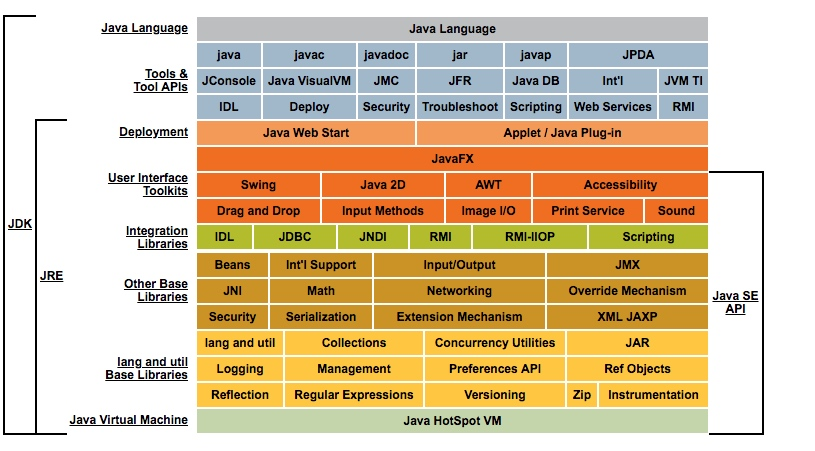

#### openJDK，OracleJDK

* OpenJDK
是全开源的项目用的是GPLv2协议，相比于原来的JDK缺少一部分东西。
没有部署的功能：Browser Plugin、Java Web Start、以及Java控制面板。
由于有些功能是有产权问题，所以无法完全公开。
可以理解OpenJDK就是精简版的JDK。

 因为有很多商业上的问题，Android用的dalvik，art，未来用openJDK。后续会有很多公司对openJDK做修改。

 网址
 ```url
http://jdk.java.net/
```

* Oracle JDK
使用自己
Oracle JDK采用了商业实现，而OpenJDK使用的是开源的FreeType。当然，“相同”是建立在两者共有的组件基础上的，Oracle JDK中还会存在一些Open JDK没有的、商用闭源的功能，例如从JRockit移植改造而来的Java Flight Recorder

* 开源协议
所有的协议有五六十种
 ```url
https://opensource.org/licenses%20/alphabetical
```
常见的协议
 ```url
http://www.open-open.com/solution/view/1319816219625
```

#### 发展史

09年被oracle收购这个大家也都知道了，oracle收购后对java做了一些改进，但是也做很多扯淡的事情。

之前java由于各种问题在1.6后到1.8 经历很长一段时间才更新，随后1.9发布后，oracle宣布半年更新一版，每三年提供一个稳定的版本，给予长期的补丁支持；小版本不会提供免费的维护和升级。

里边有一定的陷阱，用11的时候如果你们公司涉及到比较牛逼的业务，一定要读懂License（官方许可证）再大规模使用。

国内的公司阿里有自己的Alibaba JDK，亚马逊有 Corretto，IBM的AdoptOpenJDK，他们都是基于Open JDK，随后还会更多的合作，而且长期维护。


* 官方版本表
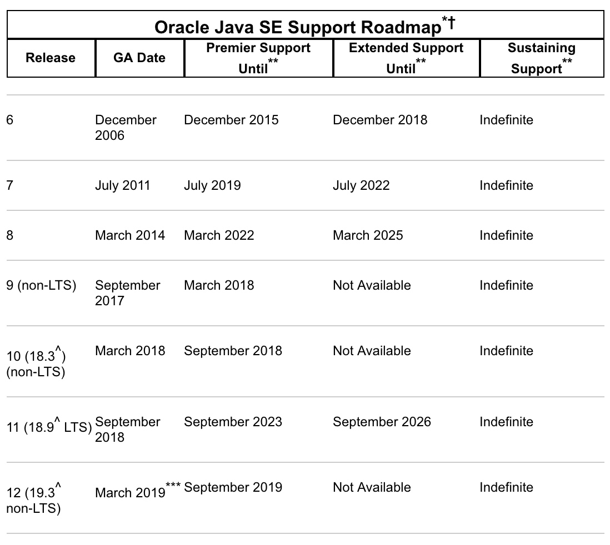

* 维护周期
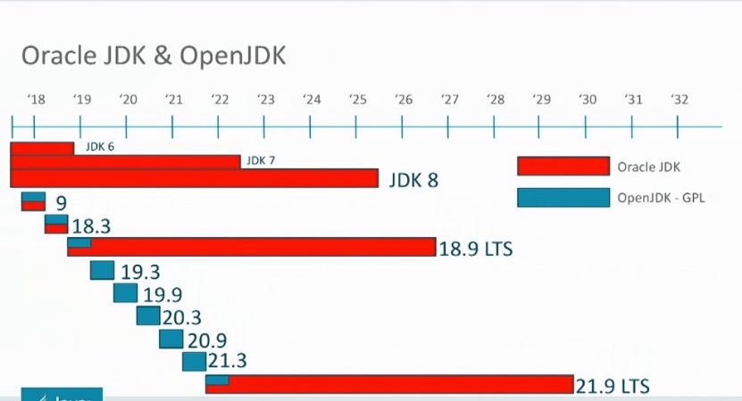

* 官方历史存档

 ```url
https://www.oracle.com/technetwork/cn/java/archive-139210-zhs.html
```

### jvm基础知识

#### 构成图谱

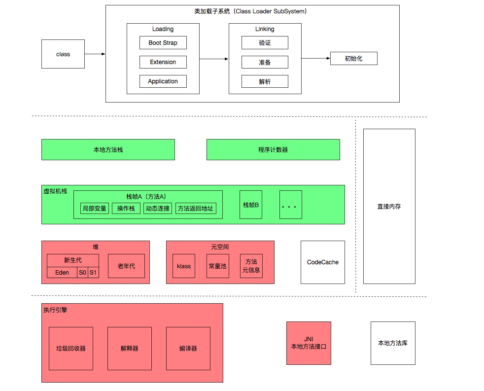


##### 类加载器子系统

###### 介绍

加载JAVA类，运行的时候（不是编译时），把类加载、链接、初始化

###### 加载

启动类加载器 (BootStrap class Loader)、扩展类加载器(Extension class Loader)和应用程序类加载器(Application class Loader) 这三种类加载器负责加载；
类加载器会遵循委托层次算法（Delegation Hierarchy Algorithm）加载类文件；

* 启动类加载器 (BootStrap class Loader)
从启动类路径中加载类（rt.jar）。这个加载器会被赋予最高优先级。
* 扩展类加载器 (Extension class Loader)
加载ext 目录(jre\lib)内的类
* 应用程序类加载器(Application class Loader)
加载应用程序级别类路径，涉及到路径的环境变量等etc

###### 链接

* 校验
字节码校验器会校验生成的字节码是否正确，如果校验失败，我们会得到校验错误。

* 准备
分配内存并初始化默认值给所有的静态变量。

* 解析
所有符号内存引用被方法区(Method Area)的原始引用所替代。

###### 初始化

所有的静态变量会被赋初始值, 并且静态块将被执行


##### 运行时数据区

###### 方法区（Method Area）
###### 堆（Heap Area）
###### 栈（Stack Area）
###### PC寄存器
###### 本地方法栈

###### Java8中MetaSpace

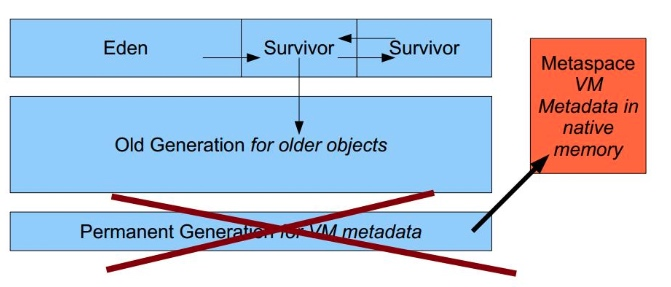


对于Java8， HotSpots取消了永久代，那么是不是也就没有方法区了呢？当然不是，方法区是一个规范，规范没变，它就一直在。那么取代永久代的就是元空间。它可永久代有什么不同的？存储位置不同，永久代物理是是堆的一部分，和新生代，老年代地址是连续的，而元空间属于本地内存；存储内容不同，元空间存储类的元信息，静态变量和常量池等并入堆中。相当于永久代的数据被分到了堆和元空间中。


在 jdk1.6（含）之前也是方法区的一部分，并且其中存放的是字符串的实例；
在 jdk1.7（含）之后是在堆内存之中，存储的是字符串对象的引用，字符串实例是在堆中；
jdk1.8 已移除永久代，字符串常量池是在本地内存当中，存储的也只是引用。

* 组成
 * Klass Metaspace
 
 * NoKlass Metaspace


* 官方解释
This is part of the JRockit and Hotspot convergence effort. JRockit customers do not need to configure the permanent generation (since JRockit does not have a permanent generation) and are accustomed to not configuring the permanent generation.

 即：移除永久代是为融合HotSpot JVM与 JRockit VM而做出的努力，因为JRockit没有永久代，不需要配置永久代。

* 永久代空间不够
永久代内存经常不够用或发生内存泄露java.lang.OutOfMemoryError: PermGen

##### 执行引擎

###### 解释器

解释器能快速的解释字节码，但执行却很慢。 解释器的缺点就是,当一个方法被调用多次，每次都需要重新解释。
 
###### 编译器

JIT编译器消除了解释器的缺点。执行引擎利用解释器转换字节码，但如果是重复的代码则使用JIT编译器将全部字节码编译成本机代码。本机代码将直接用于重复的方法调用，这提高了系统的性能。

a. 中间代码生成器 – 生成中间代码
b. 代码优化器 – 负责优化上面生成的中间代码
c. 目标代码生成器 – 负责生成机器代码或本机代码
d.  探测器(Profiler) – 一个特殊的组件，负责寻找被多次调用的方法。


###### 垃圾回收器

垃圾回收，看其他专门章节有详解

###### Java本地接口 (JNI)

JNI 会与本地方法库进行交互并提供执行引擎所需的本地库。

###### 本地方法库

它是一个执行引擎所需的本地库的集合


#### 面试基础问题

##### String相关

###### 基本问题

```java
public void str1(){
        String str1 = "abc";
        String str2 = "abc";
        String str3 = new String("abc");
        
        System.out.println(str1==str2);
        System.out.println(str1==str3);
        
}
```

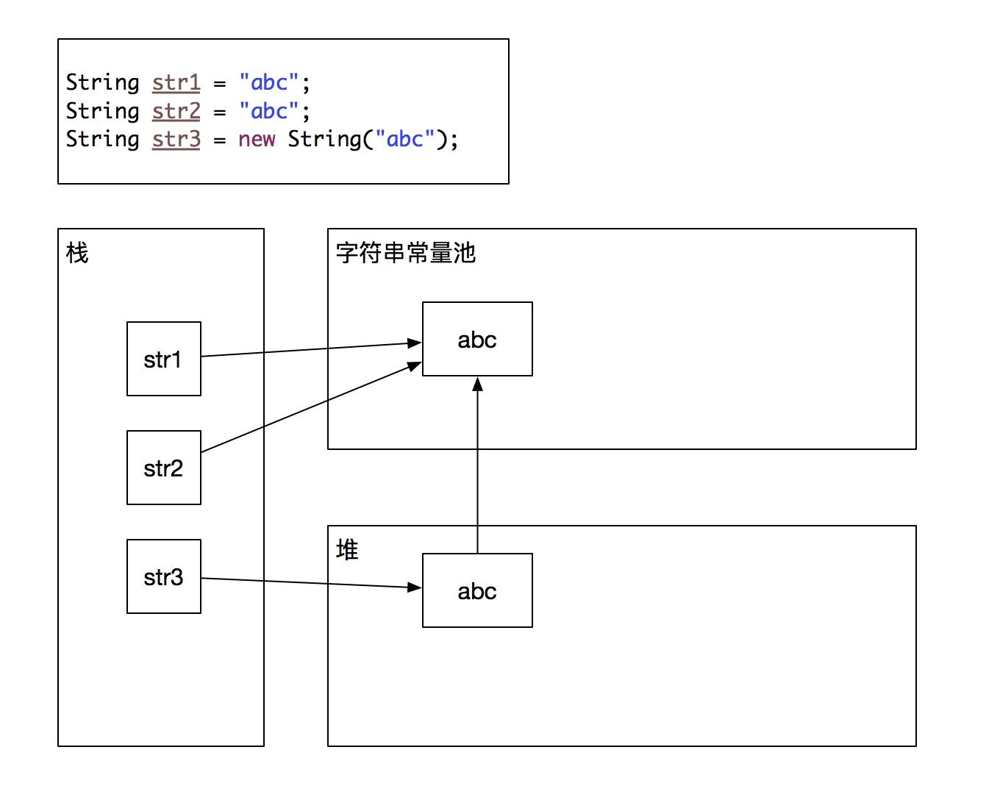


###### 问题升级

```java
public static void str2(){
        String str1 = "ab";
        String str2 = "c";
        String str3 = "ab" + "c";
        String str4 = str1 + str2;
        String str5 = "ab" + str2;
        
        System.out.println(str3 == str4);
        System.out.println(str3 == str5);
        System.out.println(str4 == str5);
        
        String str6 = "ab" +  new String("c");
        
        System.out.println(str3 == str6);
        System.out.println(str5 == str6);
        
        String str7 = "ab" +  new String("c");
        String str8 = str1 + str2;
        
        System.out.println(str7 == str6);
        System.out.println(str4 == str8);
        
    }
```

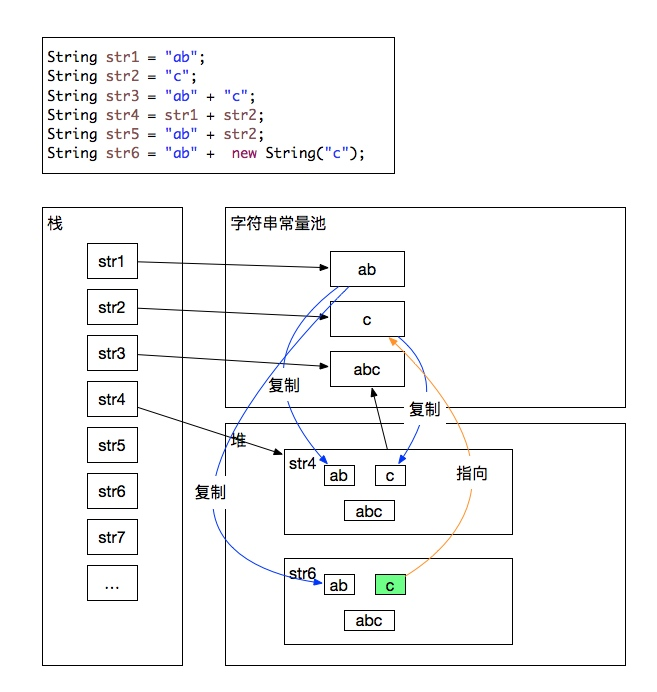


###### 类型问题

```java
 public static void str3(){
        String str1 = "a1";
        String str2 = "a"+1;
        System.out.println(str1==str2);
    }
```

###### final 问题

```java
public static void str4(){
        String str1 = "abc"; 
        final String str2 = "c"; 
        String str3 = "ab" + str2; 
        
        System.out.println(str1 == str3);
    }
```

* 小记
关系到类加载问题

###### 值传递问题


```java
class Entity{
    int a;
    int b;
    public Entity(int a,int b){
        this.a = a;
        this.b = b;
    }
}

public class TestObject {
    
    /**
     * 引用传递和值传递
     */
    
    public static void main(String[] args) {
        
        int num = 1;

        TestObject t = new TestObject();
        
        t.toNum(num);
        
        System.out.println(num);
        
        Entity e = new Entity(11,22);
        
        t.toEntityNum(e);
        
        System.out.println(e.a);
        
    }
    
    public void toNum(int num){
        num = 2;
    }
    
    public void toEntityNum (Entity e){
        e.a = 2;
    }
    
}
```

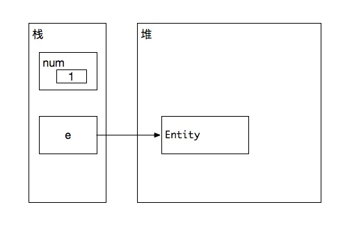


###### 小记

StringBuilder.toString() 耗内存

1.8 以后默认使用sb 拼接

```url
https://dzone.com/articles/string-concatenation-performacne-improvement-in-ja 
```


#### GC概念

##### 对象流转过程

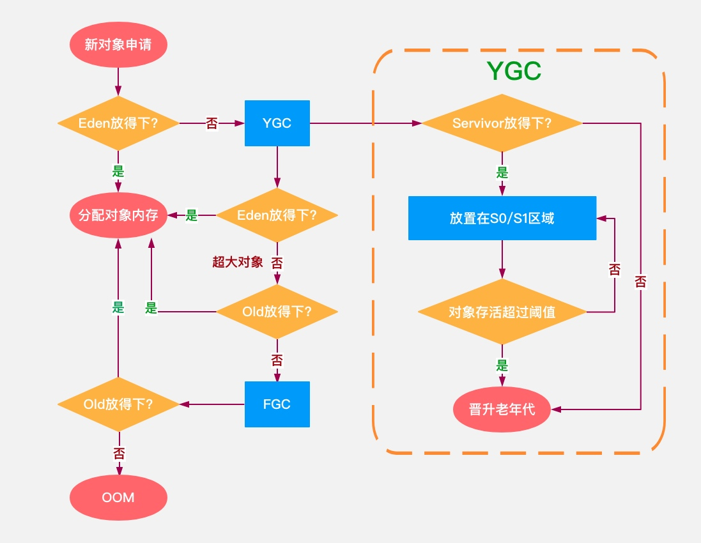

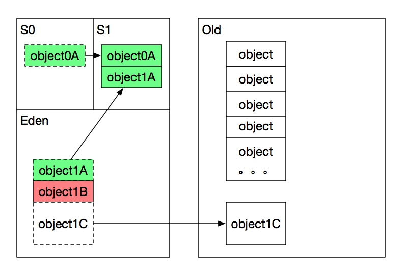


##### 回收算法

###### 引用计数器（java不用）

* 介绍
对象有一个地方引用就加1，失效时就减1，当计数器为0的时候回收。
* 应用
Python，ActionScript3
* 问题
 * 效率低
 一直加减计算效率低
 * 循环无法确定
 循环引用无法确定
 
###### 根路径搜索
 
* 介绍
以GC roots为根搜索可达对象,如果对象之间循环应用没有根引用则为不可达对象；
* 可达性
从GC roots出发搜索，经过的路径是"引用链"，不在引用链的对象不可达。

垃圾回收机制
垃圾回收确保回收的对象必然是不可达对象，但是不确保所有的不可达对象都会被回收。

###### 标记-清除

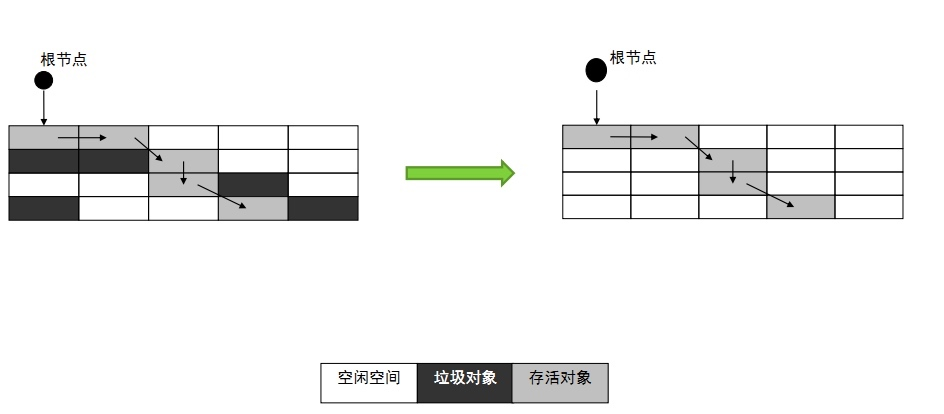


* 介绍
 * 标记阶段
 根路径搜索（遍历所有的GC Roots）可达对象标记
 * 清除阶段
 清理不可达的对象，没有被标记的全部清除
 
* Full GC
内存到临近点（即将被耗尽），GC线程会暂停程序，清理后再开始程序
 
* 缺点
 * 效率低
 全堆对象遍历效率低，而且停顿时间影响使用
 * 空间碎片多
 清理的空间不是连续空间，空间碎片多，有时总得来说空间有，但是都是零碎空间，对象无法使用，还是会触发Full GC

###### 复制算法（新生代）

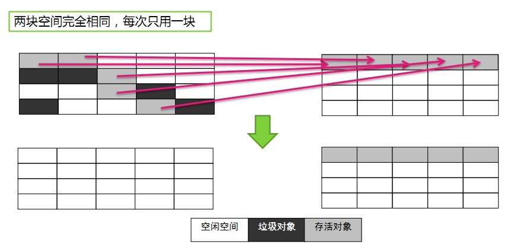


* 简介
把内存分为两块，把存活的对象复制到新的空间里，全部清空老的。
因为不需要考虑空间碎片等情况，只需要指针顺序移动指针，比标记清除要效率高好多，但是对于<font color=#FF0000>存活对象多</font>的老年代不适用
* 缺点
 * 浪费空间
 这样一份可用的空间就只有一半了；
 Eden和survivor默认是8：1，回收时会对Eden和一个Survivor对象向另外一个Survivor上复制这样只浪费了十分之一；（S0和S1或From和To）
 当遇到大的对象的时候直接复制进入老年代。

###### 标记-整理（老年代的GC）

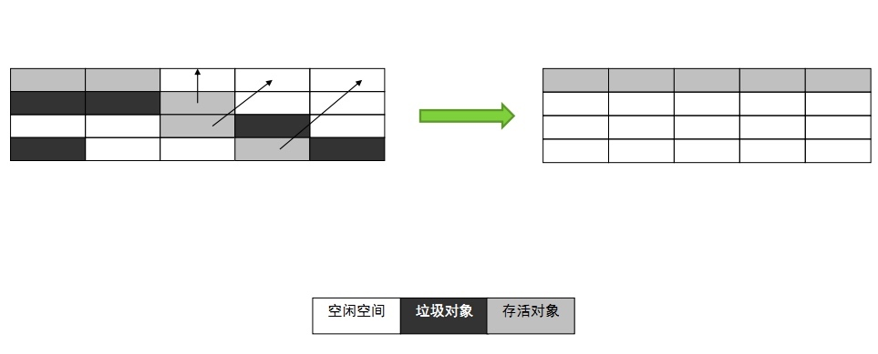


* 介绍
标记之后将存活对象按照内存顺序排列，把其他都清除掉；
相比较复制算法，这个不是维护的一个区，<font color=#FF0000>维护的是一个起始地址</font>，这样开销小很多

* 缺点
 * 效率低
 维护两套引用地址，效率明显要低于复制算法
 
##### 知识点

###### 简介

都是根据根搜索判断的，所以开发过程中要注意对象的作用域，控制好了作用域也可以防止内存溢出。
时间可空间不可兼得，需要根据情况去衡量。

###### 比较

* 效率（时间复杂度）
复制  >  标记/整理  >  标记/清除
* 整齐度
复制  =  标记/整理  >  标记/清除算法
* 利用率
标记/整理  =  标记/清除  >  复制

###### 应用场景

少了对象存活的，适合复制算法；
大量对象就是标记清除和整理

###### 可触性

* 可触
引用链中的数据都是可触的
* 可复活
释放的引用在finalize()中可能会复活对象
* 不可触
finalize()对象不可触，要回收

* finalize
不要使用finalize，调用不确定，用try-catch-finally来替代它

###### Stop-The-World

* 解释
全世界停止，全局暂停
所有的java代码停止，native代码可执行，但是不能和JVM 交互

* 场景
基本上都是GC清理照成的；
其他的有：Dump线程、死锁检查、堆Dump

* 起因
确保清理工作的完善，清理目标的一致性

* 危害
无法工作，外部认为宕机，监控服务切换服务，请求无法返回信息


#### 回收器汇总介绍

##### 介绍
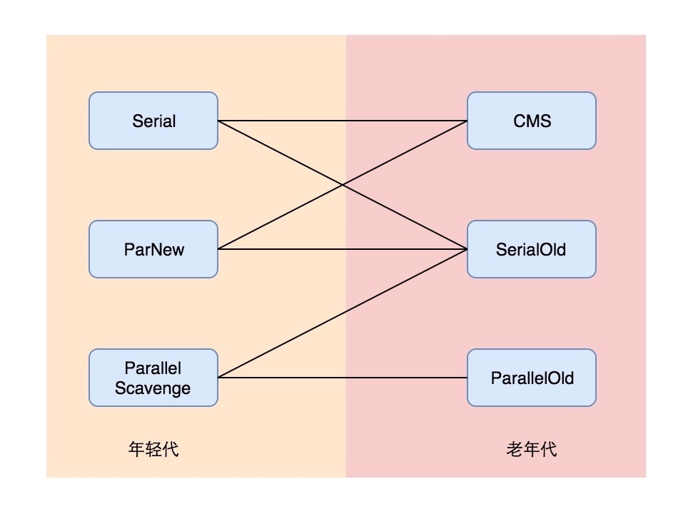

* 并行使用
连线的都可以并行使用
* 年轻代
Serial收集器、ParNew收集器、Parallel Scavenge收集器解析
* 年老代
Serial old、Parallel Old、CMS
* 新GC
G1，ZGC

##### 年轻代
###### Serial

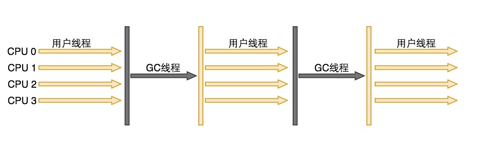


串行回收器，所有的回收都是一个线程完成的,回收的时候"Stop The World"；

是Client模式下的默认收集器

适合用户交互比较少（容易停顿），后台任务较多的系统，CPU和内存消耗不是很大

###### ParNew

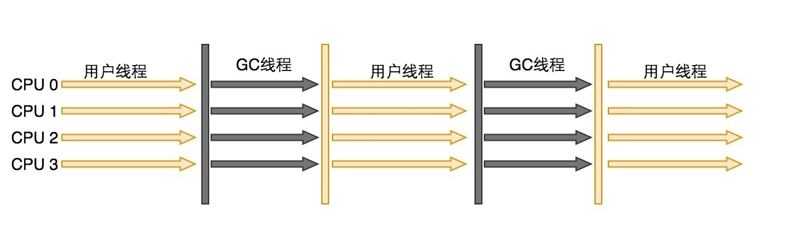


并行回收器，多线程工作，多线程版Serial，回收的时候也是"Stop The World"；

多线程工作，平均效率肯定低于单线程工作

Server模式下的默认收集器

###### Parallel Scavenge

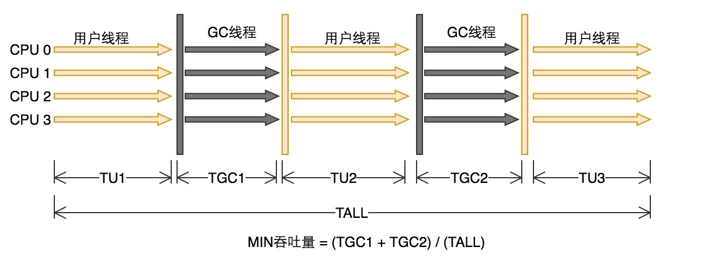


吞吐量 = 程序运行时间/(JVM执行回收的时间+程序运行时间)


##### 年老代
###### Serial old
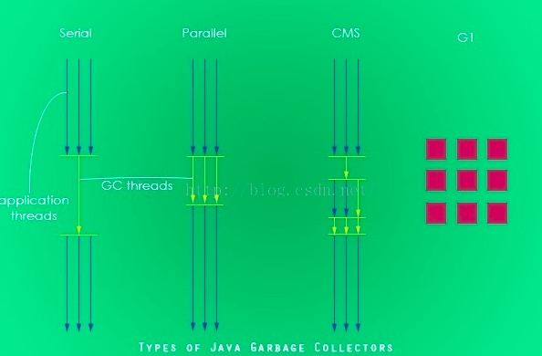

###### Parallel Old
###### CMS

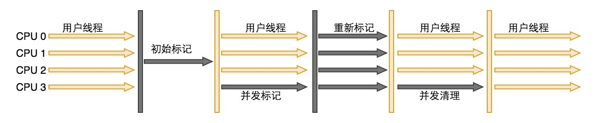


不能和Parallel Scavenge 同时使用
##### G1


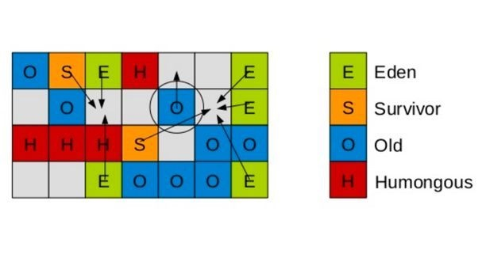


E、S、O、H 四种Region的分区类型
Eden、Survivor、Old、Humongous

Card Table 和Remember Set
Remembered Sets, 用来记录外部指向本Region的所有引用，每个Region维护一个RSet。
Card：JVM将内存划分成了固定大小的Card。这里可以类比物理内存上page的概念，每个Region被分成了多个Card。

G1将垃圾收集和内存整理活动专注于那些几乎全是垃圾的区域，并建立停顿预测模型来决定每次GC时回收哪些区域，以满足用户设定的停顿时间


##### ZGC


```url
https://mp.weixin.qq.com/s/nAjPKSj6rqB_eaqWtoJsgw
```

##### 小结

##### 参考文献

* 图书
《Java性能调优指南》


#### GC Roots

##### 什么说GC Roots

GC只对堆进行管理，其他的方法区、栈和本地方法区不被GC所管理，这些区的对象是GC Roots对象，被引用的将不会被回收。
堆内被堆外引用的对象，对外的对象属于GC Roots；因为堆内的对象是要被堆外使用的，如果没有堆外使用则是不可达对象。

##### 跨代引用GC Roots

* 说明
因为jvm分代了，堆对外都是GC Roots 记录引用，但是为了快速找到新老年代之间引用，加入了记忆集（跨代引用），也是GC Roots。

比如：找引用先从堆外引用开始，然后再通过跨代引用

* 缺点
如果没有外部引用只是新老年代之间引用，将无法确认回收，因为新老年底直接各自回收，都有GC Roots（跨代引用）可达。

垃圾回收确保回收的对象必然是不可达对象，但是不确保所有的不可达对象都会被回收。


 
##### GC Roots 种类

* Class 
由系统类加载器(system class loader)加载的对象，这些类是不能够被回收的，他们可以以静态字段的方式保存持有其它对象。我们需要注意的一点就是，通过用户自定义的类加载器加载的类，除非相应的java.lang.Class实例以其它的某种（或多种）方式成为roots，否则它们并不是roots。

* Thread 
活着的线程

* Stack Local 
Java方法的local变量或参数

* JNI Local
JNI方法的local变量或参数

* JNI Global
全局JNI引用

* Monitor Used
用于同步的监控对象

* Held by JVM 
用于JVM特殊目的由GC保留的对象，但实际上这个与JVM的实现是有关的。可能已知的一些类型是：系统类加载器、一些JVM知道的重要的异常类、一些用于处理异常的预分配对象以及一些自定义的类加载器等。然而，JVM并没有为这些对象提供其它的信息，因此需要去确定哪些是属于"JVM持有"的了

##### GC Roots 中的对象
本地变量表中引用的对象
方法区中静态变量引用的对象
方法区中常量引用的对象
Native方法引用的对象


### JMM

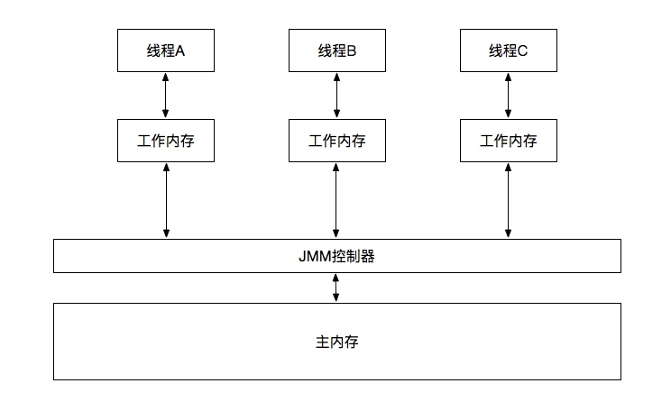


* 实例


```java
public class JmmTest extends Thread {

    private  boolean flag = false;

    public void run() {
        while (!flag);
        System.out.println("我停了"+ System.currentTimeMillis());
    }

    public static void main(String[] args) throws Exception {
        JmmTest vt = new JmmTest();
        vt.start();
        Thread.sleep(2000);
        vt.flag = true;
    }
}
```

#### volatile


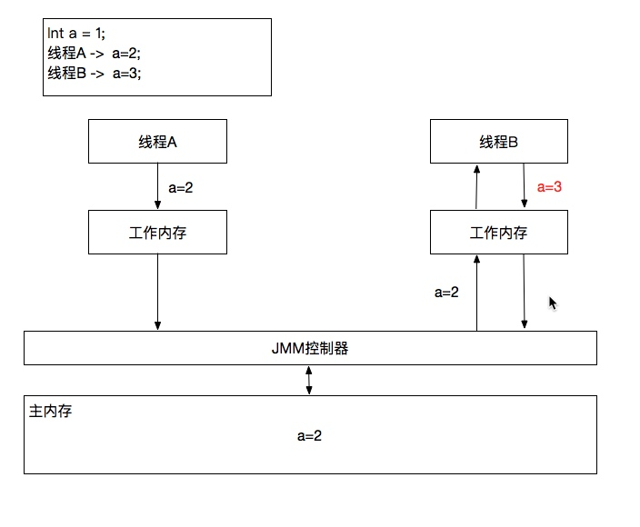


#### CAS

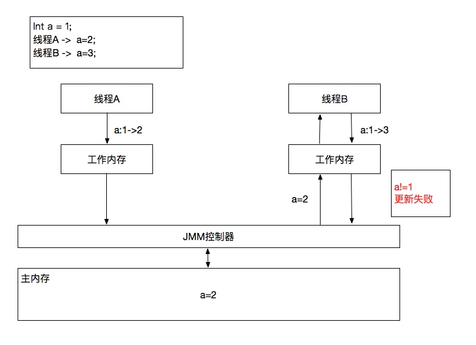

CAS状态(compare and swap)
就是每次修改的时候,有原来的值和变更后的值,如果修改时发现内存里不是原来的值修改失败;


#### synchronized


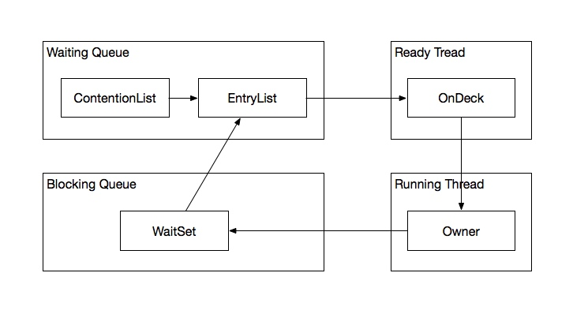

Synchronized
Contention List：所有请求锁的线程将被首先放置到该竞争队列
Entry List：Contention List中那些有资格成为候选人的线程被移到Entry List
Wait Set：那些调用wait方法被阻塞的线程被放置到Wait Set
OnDeck：任何时刻最多只能有一个线程正在竞争锁，该线程称为OnDeck
Owner：获得锁的线程称为Owner


#### 面试常见volatile和synchronized区别

##### synchronize
是对对象头加锁，偏向，轻量，重量锁慢慢升级；
synchronize 加在方法上是对象锁：不同对象（new出来）的对象不会堵塞
在静态的方法上是对整个class 的锁：只有调用该方法锁住整个类，范围对整个虚拟机

##### volatile

保证变量在线程工作内存和主存之间一致
实现原理：内存锁，cpu缓存中存储内存地址，修改时通知总线修改，实现同步；
线程有自己独立的快速缓存区(寄存器),从主内存提取;当修改时会让其他的快速缓存失效,使其去主缓存读取修改后的值; 非原子性.

#### happens-before

JMM使用happens-before的概念来阐述多线程之间的内存可见性；
如果一个操作执行的结果需要对另一个操作可见，那么这两个操作之间必须存在happens-before关系。

* volatile 可以防止指令重排


### 0 copy


#### 传统方式

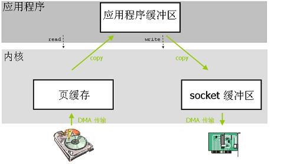


可以大致理解成，jvm中JMM主内存和工作内存；中间有很多不同之处！！！


#### 直接内存

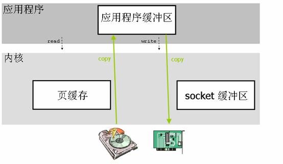


#### mmap

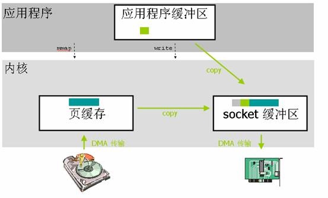


* 建立映射
调用map方法建立用户进程与内核内存的<font color=#FF0000> 映射</font>，映射范围是某个文件。这个是阻塞的

* 映射写到socket
调用write方法，将之前建立的<font color=#FF0000> 映射 </font>，写到socket；
这里nio的方式异步去做，netty就是这个实现


#### sendfile

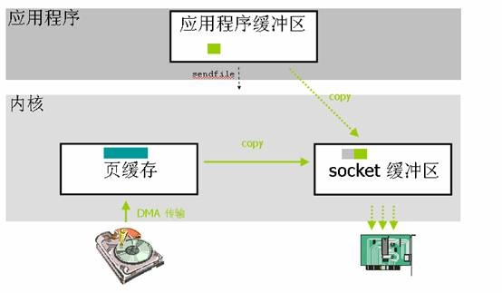


* 建立映射
内核缓存拷贝映射（内核缓存的地址）到socket buffer

* 写网卡
写网卡直接通过映射读取原来的信息，无法实现nio异步操作


#### 使用场景

直接内存：ehcache，netty(NIO)，kafka等等。。

#### 参考文章

```url
https://www.linuxjournal.com/article/6345
```

```url
https://www.ibm.com/developerworks/cn/java/j-zerocopy/
```

```url
https://www.ibm.com/developerworks/cn/linux/l-cn-zerocopy1/index.html
https://www.ibm.com/developerworks/cn/linux/l-cn-zerocopy2/index.html
```


 
### jvm优化

##### 参数选择

###### 堆大小

最大最小相等，Xmx4096m -Xms4096m

###### 年轻代大小

官方推荐3/8；视情况而定

时间响应，吞吐优先：往大了调，压缩处理对象大小，并行回收，减少中长期存活对象

###### 年老代大小

定时任务，批量处理服务等：可以调大一些，要注意回收器的类型，碎片等等问题

###### -XX:NewRatio    
年老代和新生代比例
比如NewRatio=2，表明年老代是新生代的2倍。老年代占了堆的2/3，新生代占了1/3
如果指定NewRatio还可以指定NewSizeMaxNewSize，
NewRatio=2，这个时候新生代会尝试分配整个Heap大小的1/3的大小，但是分配的空间不会小于-XX:NewSize也不会大于 –XX:MaxNewSize

###### -XX:SurvivorRatio 
新生代里面Eden和一个Servive的比例

###### -XX:NewSize –XX:MaxNewSize

NewRatio=2，这个时候新生代会尝试分配整个Heap大小的1/3的大小，但是分配的空间不会小于-XX:NewSize也不会大于 –XX:MaxNewSize

实际设置比例还是设置固定大小，固定大小理论上速度更高。

-XX:NewSize –XX:MaxNewSize理论越大越好，但是整个Heap大小是有限的，一般年轻代的设置大小不要超过年老代。


##### 业务场景考虑

###### 高频业务处理

登录，查询等服务

###### 定时任务

大忌：定时任务和处理服务放一起

###### 服务类型

HDFS，ES等

##### 软硬件环境

###### 机器配置

内存占比，cpu核数线程数等

###### 关联服务

同机内有其他服务

##### GC日志分析

###### 年轻代

[GC (Allocation Failure) [PSYoungGen:2336K->288K(2560K)] 8274K->6418K(9728K), 0.0112926 secs] [Times:user=0.06 sys=0.00, real=0.01 secs]

* [PSYoungGen:2336K->288K(2560K)]
 PSYoungGen是新生代类型，新生代日志收集器，2336K表示使用新生代GC前，占用的内存，->288K表示GC后占用的内存，(2560K)代表整个新生代总共大小
 
* 8274K->6418K(9728K), 0.0112926 secs] 
8274K（GC前整个JVM Heap对内存的占用）->6418K（MinorGC后内存占用总量）(9728K)（整个堆的大小）0.0112926 secs（Minor GC消耗的时间）] 

* [Times:user=0.06 sys=0.00, real=0.01 secs]
 用户空间，内核空间时间的消耗，real整个的消耗

###### Full GC

[Full GC (Ergonomics) [PSYoungGen: 984K->425K(2048K)] [ParOldGen:7129K->7129K(7168K)] 8114K->7555K(9216K), [Metaspace:2613K->2613K(1056768K)], 0.1022588 secs] [Times: user=0.56 sys=0.02,real=0.10 secs]


* [Full GC (Ergonomics) 
（表明是Full GC）

* [PSYoungGen: 984K->425K(2048K)]
[PSYoungGen:FullGC会导致新生代Minor GC产生]984K->425K(2048K)]

* [ParOldGen:7129K->7129K(7168K)] 8114K->7555K(9216K)
[ParOldGen:（老年代GC）7129K（GC前多大）->7129K（GC后，并没有降低内存占用，因为写的程序不断循环一直有引用）(7168K) （老年代总容量）] 8114K（GC前占用整个Heap空间大小）->7555K （GC后占用整个Heap空间大小） (9216K) （整个Heap大小，JVM堆的大小）

* [Metaspace:2613K->2613K(1056768K)], 0.1022588 secs]
[Metaspace: （java6 7是permanentspace，java8改成Metaspace，类相关的一些信息） 2613K->2613K(1056768K) （GC前后基本没变，空间很大）], 0.1022588 secs（GC的耗时，秒为单位）] 

* [Times: user=0.56 sys=0.02, real=0.10 secs]
用户空间耗时，内核空间耗时，真正的耗时时间


##### 常用jvm命令

top, iostat, vmstat, sar, tcpdump, jvisualvm, jmap, jconsole


