# zk应用场景和使用
[TOC]


## 一、课前准备
## 二、课堂主题
## 三、课堂目标
## 四、知识要点
### 简介
用原来的
### 设计特点
用原来的
### 集群搭建
用原来的
可加入一下
#### 操作文件说明

zkCleanup： 清理Zookeeper历史数据，包括日志文件和快照数据文件
zkCli         ： Zookeeper的一个简易的可交互的客户端
zkEnv       ： 设置Zookeeper的环境变量
zkServer   ：  Zookeeper服务启停脚本


#### 基本命令

* 查看状态

 ```shell
./zkServer.sh status
```
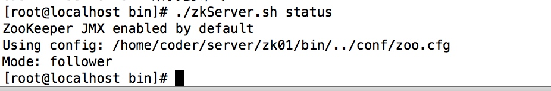
节点是follower还是leader

* 连接服务

 ```shell
zkCli.sh -server ip:port 
```

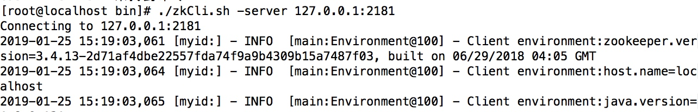


会出现一些连接信息然后连接成功

* 客户端命令帮助
可以看到所以的client命令

 ```shell
help
```
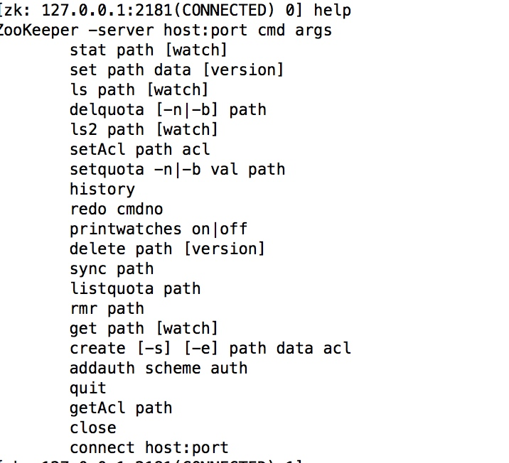


#### 四字命令 

* 介绍

| ZooKeeper 四字命令 | 功能描述                                                                                                                       |
| ------------------ | ---------------------------------------------------------------------------------------------------------------------------------- |
| conf               | 输出相关服务配置的详细信息。                                                                                         |
| cons               | 列出所有连接到服务器的客户端的完全的连接 / 会话的详细信息。包括“接受 / 发送”的包数量、会话 id 、操作延迟、最后的操作执行等等信息。 |
| dump               | 列出未经处理的会话和临时节点。                                                                                      |
| envi               | 输出关于服务环境的详细信息（区别于 conf 命令）。                                                              |
| reqs               | 列出未经处理的请求                                                                                                        |
| ruok               | 测试服务是否处于正确状态。如果确实如此，那么服务返回“imok ”，否则不做任何相应。            |
| stat               | 输出关于性能和连接的客户端的列表。                                                                                |
| wchs               | 列出服务器 watch 的详细信息。                                                                                           |
| wchc               | 通过 session 列出服务器 watch 的详细信息，它的输出是一个与watch 相关的会话的列表。                   |
| wchp               | 通过路径列出服务器 watch 的详细信息。它输出一个与 session相关的路径。           

* 用法

 ```shell
echo conf | nc 127.0.0.1 2181
```
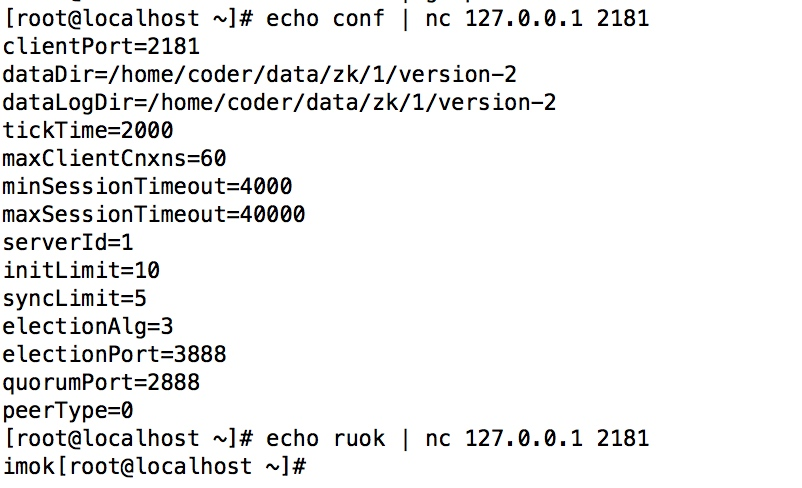


### 原理解析
选举算法用原来的

#### 会话创建过程

#### 存储结构

##### 文件结构

zookeeper 的文件系统采用树形层次化的目录结构，与 Unix 文件系统非常相似。每个目 录在 zookeeper 中叫做一个 znode，每个 znode 拥有一个唯一的路径标识，即名称。Znode 可以包含数据和子 znode(临时节点不能有子 znode)。Znode 中的数据可以有多个版本，所 以查询某路径下的数据需带上版本号。客户端应用可以在 znode 上设置监视器(Watcher)。

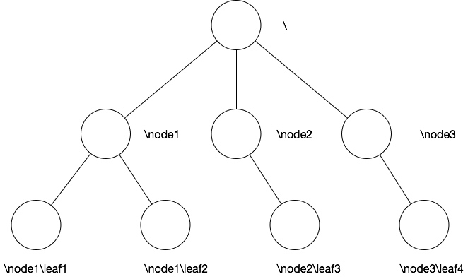


##### Znode

###### 介绍
znode相关内容大致分为

* data
与该Znode关联的数据

* children
该Znode下的子节点

* ACL 信息
节点的权限信息


###### 属性（stat）

* zxid
时间戳形势的id，每次操作都会生成新的id，通过判断zxid大小判断执行的先后；Zxid是一个64为的数字，它高32位是epoch用来标识leader关系是否改变，每次一个leader被选出来，它都会有一个 新的epoch。低32位是个递增计数。
 * czxid
 创建节点的事务zxid
 * mzxid
 最近修改的zxid
* time
记录znode相关的时间问题；以距离时间的原点（epoch）到现在的时长毫秒数。（可以理解为创建事务的开始时间到现在的时长）
 * ctime
 创建时间毫秒数
 * mtime
 最近修改的时间毫秒数
* version
znode修改次数
 * cversion
znode子节点修改次数
 * aversion
znode的ACL修改次数
* ephemeralOwner
临时节点，指示节点所有者的会话ID；不是临时节点，为零
* dataLength
znode数据长度
* numChildren
znode子节点个数


###### Znode类型

共有4中类型的节点

* PERSISTENT-持久化节点
创建这个节点的客户端在与zookeeper服务的连接断开后，这个节点也不会被删除（除非您使用API强制删除）。

* PERSISTENT_SEQUENTIAL-持久化顺序编号节点
当客户端请求创建这个节点A后，zookeeper会根据parent-znode的zxid状态，为这个A节点编写一个全目录唯一的编号（这个编号只会一直增长）。当客户端与zookeeper服务的连接断开后，这个节点也不会被删除。

* EPHEMERAL-临时目录节点
创建这个节点的客户端在与zookeeper服务的连接断开后，这个节点（还有涉及到的子节点）就会被删除。

* EPHEMERAL_SEQUENTIAL-临时顺序编号目录节点
当客户端请求创建这个节点A后，zookeeper会根据parent-znode的zxid状态，为这个A节点编写一个全目录唯一的编号（这个编号只会一直增长）。当创建这个节点的客户端与zookeeper服务的连接断开后，这个节点被删除。

* 备注
 * 重名问题
 Non-sequential节点不能有重名，Sequential可以生产节点名尾部会自动加10位长度的'递增数字'，前部补零。
 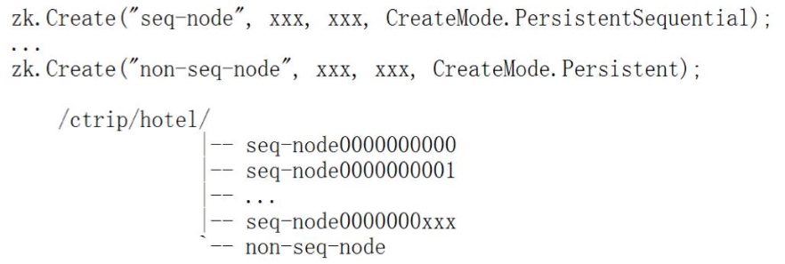
 
 * 临时删除问题
 临时节点只要是client断开，无论是正常还事异常节点都会被删除；
 临时节点是跟 Session 绑定的，sessionId 作为 key

###### 操作命令

参考博客

```url
https://blog.csdn.net/dandandeshangni/article/details/80558383
```

* 创建节点
 
 ```shell
create [-s] [-e] path data acl
```

 * -s 
节点顺序

 * -e
持久节点

 * acl
权限控制

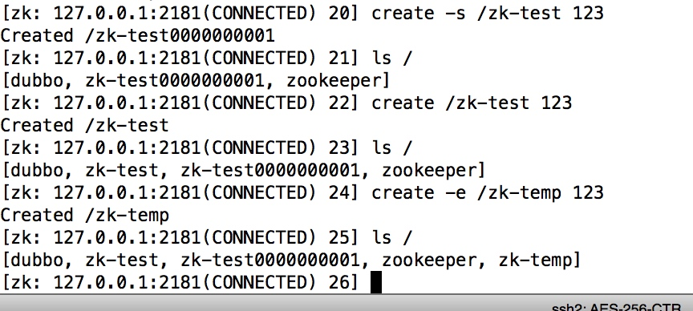


可以看到我们建的顺序节点加了一串数字


* 修改节点

 ```shell
set path data [version]
```

 * version
 可以指定版本更新

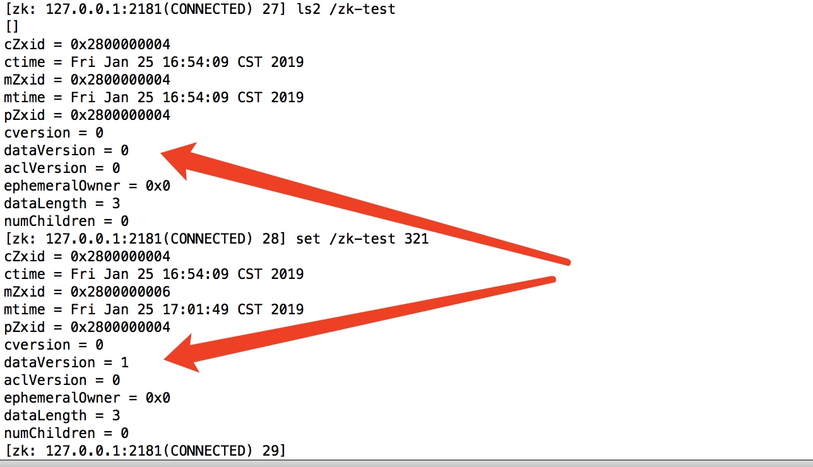

set之后dataVersion有改变

* 删除节点

 ```shell
delete path data [version]
```

 * version
 可以指定版本删除

###### 查看命令


```shell
ls path [watch]
ls2 path [watch]
get path [watch]
```

ls显示了节点信息，get查看数据信息

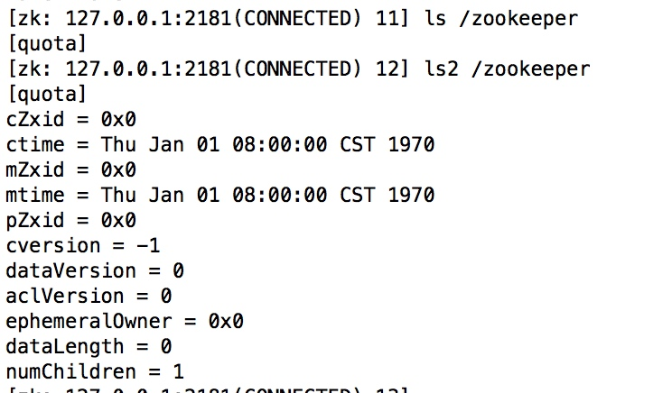


##### java对象数据结构

* org.apache.zookeeper.server.DataNode
 数据的最小表示单元,每个path最终将会以DataNode来表示

* org.apache.zookeeper.server.DataTree
DataNode的维护关系,根据path层级关系将DataNode逻辑上存储为Tree

* org.apache.zookeeper.server.ZKDatabase
ZK本地数据库,存储了DataTree,ACL,Sessions列表,Wathers列表等.

* org.apache.zookeeper.server.SessionTracker.Session
客户端和server的链接信息

* org.apache.zookeeper.server.persistence.FileTxnLog
ZK server所接收到的变更操作,以日志方式存储

#### 工作流程
##### 存储机制流程

* 参考书籍
参考《从Paxos到Zookeeper分布式一致性原理与实践》 第7章

* 参考博客
这些博客都是参照上边那本书写的，想深入了解最好读一下

 ```url
https://blog.csdn.net/varyall/article/details/79564418
https://www.cnblogs.com/hehheai/p/6506835.html
https://blog.csdn.net/weixin_39800144/article/details/79312457
```

###### 数据类型

* 内存数据
* 硬盘数据
 * 快照
 定期存储内存数据的快照
 * 事务日志
 所以执行的事务先进入日志后操作，取保数据不丢失，类似于redis日志持久化方式；
 每一条事务都有事务id
 
###### 数据初始化

* 第一步
先将磁盘中的数据快照写入内存
* 第二步 
然后拿到快照里最后一条事务的id，加1
* 第三步 
去事务日志中执行该事务id之后的操作

关系图（网上的，需要补充）
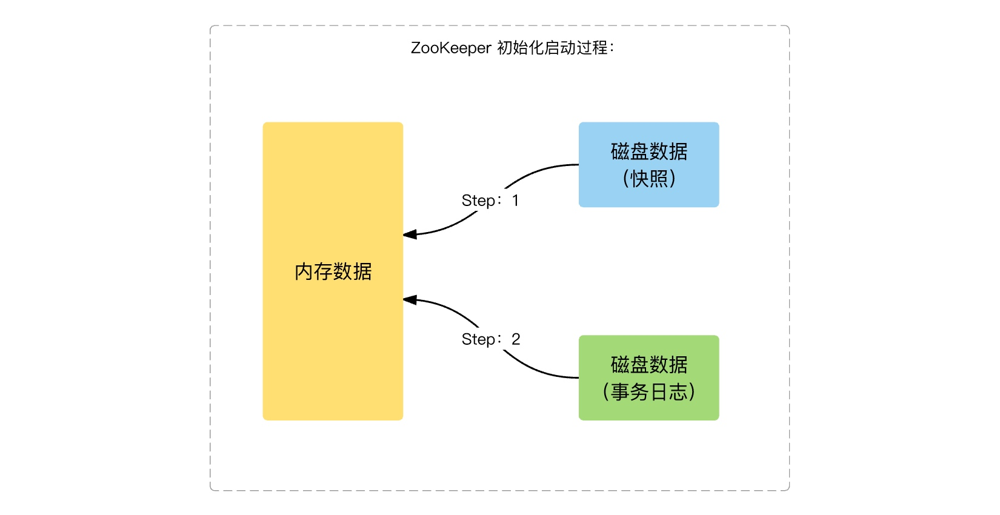

###### 磁盘写入流程

* 快照
快照写入是异步的；
快照生成时新提交的事务有可能会写入快照，快照的界限不是某一个时间段，是模糊的。

* 事务日志
 * 事务日志频繁 flush 到磁盘，消耗大量磁盘 IO
 * 磁盘空间预分配：事务日志剩余空间 < 4KB 时，将文件大小增加 64 MB
 * 磁盘预分配的目标：减少磁盘 seek 次数（搜索空间的次数）
 * 建议：事务日志，采用独立磁盘单独存放

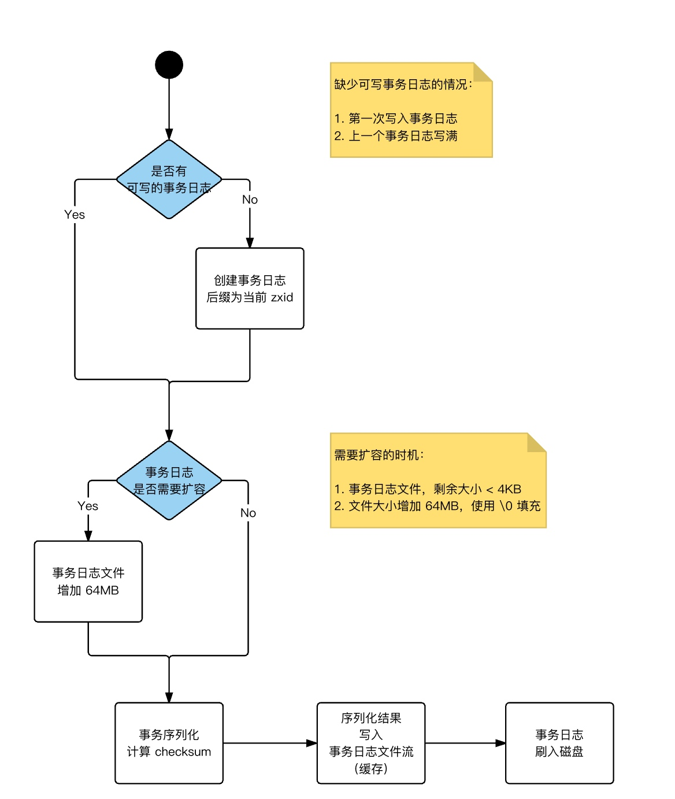


##### 整体初始化流程

待文字整理

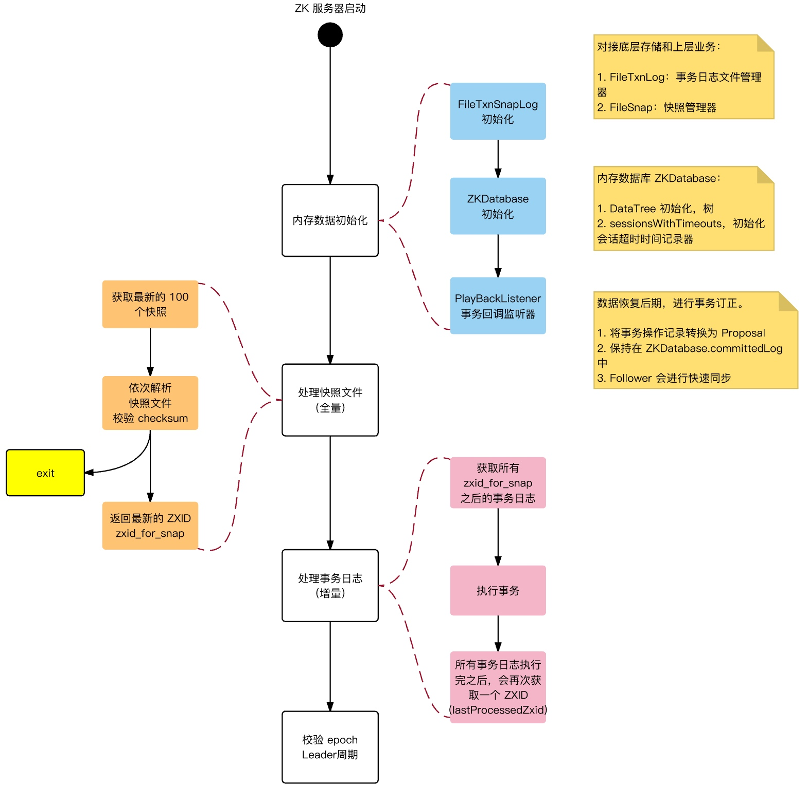

* 初始化FileTxnSnapLog。FileTxnSnapLog是Zookeeper事务日志和快照数据访问层，用于衔接上层业务和底层数据存储，底层数据包含了事务日志和快照数据两部分。FileTxnSnapLog中对应FileTxnLog和FileSnap。

* 初始化ZKDatabase。首先构建DataTree，同时将FileTxnSnapLog交付ZKDatabase，以便内存数据库能够对事务日志和快照数据进行访问。在ZKDatabase初始化时，DataTree也会进行相应的初始化工作，如创建一些默认结点，如/、/zookeeper、/zookeeper/quota三个节点。

* 创建PlayBackListener。其主要用来接收事务应用过程中的回调，在Zookeeper数据恢复后期，会有事务修正过程，此过程会回调PlayBackListener来进行对应的数据修正。

* 处理快照文件。此时可以从磁盘中恢复数据了，首先从快照文件开始加载。

* 获取最新的100个快照文件。更新时间最晚的快照文件包含了最新的全量数据。

* 解析快照文件。逐个解析快照文件，此时需要进行反序列化，生成DataTree和sessionsWithTimeouts，同时还会校验Checksum及快照文件的正确性。对于100个快找文件，如果正确性校验通过时，通常只会解析最新的那个快照文件。只有最新快照文件不可用时，才会逐个进行解析，直至100个快照文件全部解析完。若将100个快照文件解析完后还是无法成功恢复一个完整的DataTree和sessionWithTimeouts，此时服务器启动失败。

* 获取最新的ZXID。此时根据快照文件的文件名即可解析出最新的ZXID：zxid_for_snap。该ZXID代表了Zookeeper开始进行数据快照的时刻。

* 处理事务日志。此时服务器内存中已经有了一份近似全量的数据，现在开始通过事务日志来更新增量数据。

* 获取所有zxid_for_snap之后提交的事务。此时，已经可以获取快照数据的最新ZXID。只需要从事务日志中获取所有ZXID比步骤7得到的ZXID大的事务操作。

* 事务应用。获取大于zxid_for_snap的事务后，将其逐个应用到之前基于快照数据文件恢复出来的DataTree和sessionsWithTimeouts。每当有一个事务被应用到内存数据库中后，Zookeeper同时会回调PlayBackListener，将这事务操作记录转换成Proposal，并保存到ZKDatabase的committedLog中，以便Follower进行快速同步。

* 获取最新的ZXID。待所有的事务都被完整地应用到内存数据库中后，也就基本上完成了数据的初始化过程，此时再次获取ZXID，用来标识上次服务器正常运行时提交的最大事务ID。

* 校验epoch。epoch标识了当前Leader周期，集群机器相互通信时，会带上这个epoch以确保彼此在同一个Leader周期中。完成数据加载后，Zookeeper会从步骤11中确定ZXID中解析出事务处理的Leader周期：epochOfZxid。同时也会从磁盘的currentEpoch和acceptedEpoch文件中读取上次记录的最新的epoch值，进行校验。
##### 文件结构

讲解和简单优化参考博客

```url
https://www.cnblogs.com/sunxucool/p/5500758.html
```

###### 文件目录
conf/zoo.cfg （启动的配置文件）中配置的dataDir
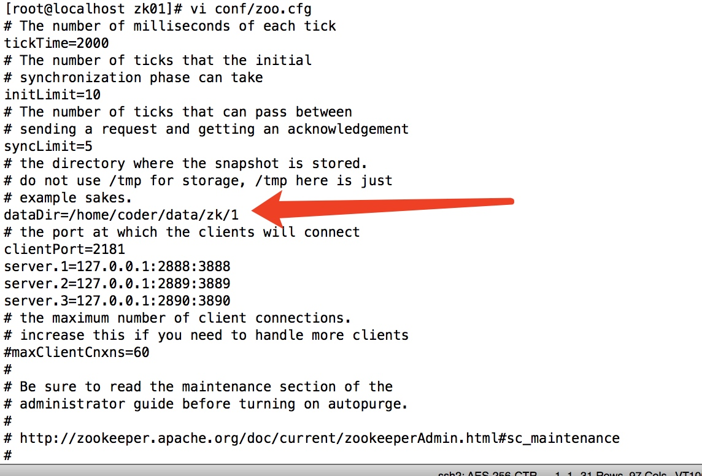

###### 文件讲解

上边讲解的log文件快照文件，Epoch记录都在这里

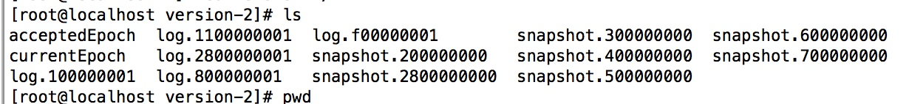

* currentEpoch
参与的Epoch

* acceptedEpoch
接收的Epoch

* log
操作的日志，类似mysql的binlog

* snapshot
内存快照


##### 数据同步

过程参考《从Paxos到Zookeeper分布式一致性原理与实践》 第7章 7.9

##### 流程描述
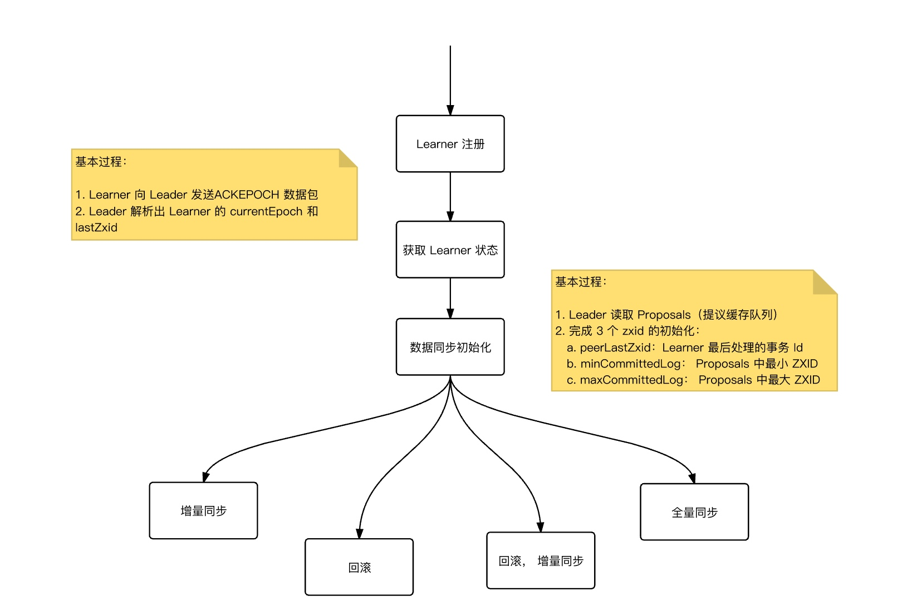


* 获取Learner状态。在注册Learner的最后阶段，Learner服务器会发送给Leader服务器一个ACKEPOCH数据包，Leader会从这个数据包中解析出该Learner的currentEpoch和lastZxid。

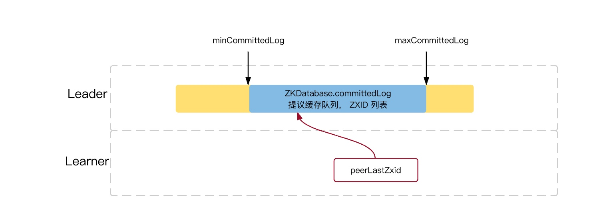
* 数据同步初始化。首先从Zookeeper内存数据库中提取出事务请求对应的提议缓存队列proposals，同时完成peerLastZxid(该Learner最后处理的ZXID)、minCommittedLog(Leader提议缓存队列commitedLog中最小的ZXID)、maxCommittedLog(Leader提议缓存队列commitedLog中的最大ZXID)三个ZXID值的初始化。

##### 同步类型

　　对于集群数据同步而言，通常分为四类，直接差异化同步(DIFF同步)、先回滚再差异化同步(TRUNC+DIFF同步)、仅回滚同步(TRUNC同步)、全量同步(SNAP同步)，在初始化阶段，Leader会优先以全量同步方式来同步数据。同时，会根据Leader和Learner之间的数据差异情况来决定最终的数据同步方式。

* 直接差异化同步(DIFF同步，peerLastZxid介于minCommittedLog和maxCommittedLog之间)。Leader首先向这个Learner发送一个DIFF指令，用于通知Learner进入差异化数据同步阶段，Leader即将把一些Proposal同步给自己，针对每个Proposal，Leader都会通过发送PROPOSAL内容数据包和COMMIT指令数据包来完成，

* 先回滚再差异化同步(TRUNC+DIFF同步，Leader已经将事务记录到本地事务日志中，但是没有成功发起Proposal流程)。当Leader发现某个Learner包含了一条自己没有的事务记录，那么就需要该Learner进行事务回滚，回滚到Leader服务器上存在的，同时也是最接近于peerLastZxid的ZXID。

* 仅回滚同步(TRUNC同步，peerLastZxid大于maxCommittedLog)。Leader要求Learner回滚到ZXID值为maxCommittedLog对应的事务操作。

* 全量同步(SNAP同步，peerLastZxid小于minCommittedLog或peerLastZxid不等于lastProcessedZxid)。Leader无法直接使用提议缓存队列和Learner进行同步，因此只能进行全量同步。Leader将本机的全量内存数据同步给Learner。Leader首先向Learner发送一个SNAP指令，通知Learner即将进行全量同步，随后，Leader会从内存数据库中获取到全量的数据节点和会话超时时间记录器，将他们序列化后传输给Learner。Learner接收到该全量数据后，会对其反序列化后载入到内存数据库中。


##### 读写操作流程

参考博客

```url
https://blog.csdn.net/wx1528159409/article/details/84633903
```

###### 读流程

相比写数据流程，读数据流程就简单得多；因为每台server中数据一致性都一样，所以随便访问哪台server读数据就行；
没有写数据流程中请求转发、数据同步、成功通知这些步骤。

###### 写流程

* 第一步
客户端连接到集群中某一个节点server1，发送写请求

* 第二步
如果该节点server1不是leader，把数据转发给leader

* 第三步
leader写入数据，并且广播其他节点写入

* 第四步
根据设定值（最少半数），大多数成功够，该请求算写成功，leader返回server1

* 第五步
server1通知客户端写入成功


读流程
客户端连接到集群中某一节点

读请求，直接返回。

#### Watch 

##### 运行机制

参考博客

```url
https://blog.csdn.net/z69183787/article/details/53023578
```

* 第一步
Watch是轻量级的，其实就是本地JVM的Callback，服务器端只是存了是否有设置了Watcher的布尔类型。（源码见：org.apache.zookeeper.server.FinalRequestProcessor）
* 第二步
在服务端，在FinalRequestProcessor处理对应的Znode操作时，会根据客户端传递的watcher变量，添加到对应的ZKDatabase（org.apache.zookeeper.server.ZKDatabase）中进行持久化存储，同时将自己NIOServerCnxn做为一个Watcher callback，监听服务端事件变化
* 第三步
Leader通过投票通过了某次Znode变化的请求后，然后通知对应的Follower，Follower根据自己内存中的zkDataBase信息，发送notification信息给zookeeper客户端。
* 第四步
Zookeeper客户端接收到notification信息后，找到对应变化path的watcher列表，挨个进行触发回调。

##### 创建和触发规则

在读操作 exists、getChildren和getData上设置观察，观察被写操作create、delete和setData触发；
以下表格，横向是操作（动作分为当前节点和子节点操作），纵向是设置观察方式

|             | create     |                     | delete      |                     | setData         |
| ----------- | ---------- | ------------------- | ----------- | ------------------- | --------------- |
|             | node       | 子节点           | node        | 子节点           |                 |
| exists      | NodeCreate |                     | NodeDeleted |                     |                 |
| getData     |            |                     | NodeDeleted |                     | NodeDataChanged |
| getChildren |            | NodeChildrenChanged | NodeDeleted | NodeChildrenChanged | NodeDataChanged |


### 应用场景

#### 数据发布/订阅
监听原理
#### 分布式锁实现 
见代码实现

### API操作

#### 提示

##### 参考资料

主要参考《从PAXOS到ZOOKEEPER分布式一致性原理与实践》这本书；
书中部分代码部分在

```url
zk Maven Webapp/src/main/java/com/kkb/zk/until/chapter05
```

源码地址在
```url
http://www.broadview.com.cn/file/resource/046057135169134240001110183147127169154058027179
```

##### 代码位置
本章节所有代码在 "zk Maven Webapp"工程中；

* 代码git地址

 ```url
git@gitlab.kaikeba.com:wyd126/class-code.git
```

##### 友情提示

讲解给学生任何方法或者构造的传值都可以通过点进去看看原版解释，自己简单翻译一下更好，不需要去到处搜。

#### 官方API

对于zk的一些操作，官方定义了API，我们先通过官方的API了解下怎么操作zk。

* 官方文档API

 ```url
http://zookeeper.apache.org/doc/r3.4.6/api/index.html
```

* 官方例子

 ```url
http://zookeeper.apache.org/doc/current/javaExample.html#sc_completeSourceCode
```

* 方法区别

API中都分为同步和异步方法，传入回掉方法和传输值（cb和ctx）得都是异步方法
StringCallback cb ：异步回掉函数
Object ctx ：异步使用的传递对象

* 代码位置
本章节代码都在com.kkb.zk.until包下

* jar包
```url
<dependency>
		<groupId>org.apache.zookeeper</groupId>
		<artifactId>zookeeper</artifactId>
		<version>3.4.5</version>
</dependency>
```

##### 创建session连接

###### 解释

我们先讲解下创建连接的类 ZooKeeper。

* 方法
主要包含了这以下几个构造方法；

```java
ZooKeeper zk = new ZooKeeper(hosts, SESSION_TIMEOUT, this);
//有多个构造方法
ZooKeeper(String connectString, int sessionTimeout, Watcher watcher)
ZooKeeper(String connectString, int sessionTimeout, Watcher watcher,
            boolean canBeReadOnly)
ZooKeeper(String connectString, int sessionTimeout, Watcher watcher,
            long sessionId, byte[] sessionPasswd)
ZooKeeper(String connectString, int sessionTimeout, Watcher watcher,
            long sessionId, byte[] sessionPasswd, boolean canBeReadOnly)
```
* 参数
涉及到了以下几个传输值：

 * String connectString
主机地址，默认端口2181；多个地址用英文逗号 "," 隔开
 * int sessionTimeout
回话超时时间，毫秒为单位
 * Watcher watcher
Watcher对象，用于接受回调和通知；
 * boolean canBeReadOnly
当前回话是否只读模式
 * long sessionId/byte[] sessionPasswd 
两个参数同时使用，可以确定会话的唯一性，可以让客户端复用会话。
使用方式就是从当前会话中获取
 long sessionId = zookeeper.getSessionId();
 byte[] passwd  = zookeeper.getSessionPasswd();
 
###### 代码实现

```java 
import org.apache.zookeeper.WatchedEvent;
import org.apache.zookeeper.Watcher;
import org.apache.zookeeper.ZooKeeper;
import java.io.IOException;
import java.util.concurrent.CountDownLatch;
/**
 * 
 * 此类描述的是：  
 * @author: Coder_Wang 
 * @version: 2019年1月15日 下午8:25:57
 */
public class ConnectionWatcher implements Watcher {
    private static final int SESSION_TIMEOUT = 5000;
    protected ZooKeeper zk;
    private CountDownLatch connectedSignal = new CountDownLatch(1);
    /**
     * 当实例备创建时，是异步连接，启动一个线程去连接zk服务器，而且是立即返回，
     * 因此在使用新建zk前要等待和zk服务之间的连接已经成功创建
     * 官方的例子用的线程启动+synchronized
     * 我们优雅一点用CountDownLatch
     */
    public void connect(String hosts) throws IOException, InterruptedException {
        zk = new ZooKeeper(hosts, SESSION_TIMEOUT, this);
        connectedSignal.await();
        long sessionId = zk.getSessionId();
        byte[] passwd  = zk.getSessionPasswd();
        //使用id和密码创建
        zk = new ZooKeeper(hosts, SESSION_TIMEOUT, this, sessionId, passwd);
        connectedSignal.await();
    }
    /**
	 * 客户端和zk连接建立后调用process；参数是连接事件的对象
	 * 然后CountDownLatch释放锁，会话可用
	 */
    public void process(WatchedEvent watchedEvent) {
        if (watchedEvent.getState() == Event.KeeperState.SyncConnected) {
            connectedSignal.countDown();
        }
    }
    public void close() throws InterruptedException {
        zk.close();
    }
```

**工程文件见 `com.kkb.zk.until.ConnectionWatcher`** 

##### 创建节点

###### 讲解

* 方法

创建方法有两个接口，一个同步一个异步；

```java
 String create(final String path, byte data[], List<ACL> acl,
            CreateMode createMode)
 void create(final String path, byte data[], List<ACL> acl,
            CreateMode createMode,  StringCallback cb, Object ctx)
```

* create参数
 * String path
路径
 * byte data[]
znode内容
 * List<ACL> acl
控制策略，在Ids里边有很多值，纸面意思就可以看出来；
 * OPEN_ACL_UNSAFE
完全控制，CREATOR_ALL_ACL创建权限，READ_ACL_UNSAFE读权限
 * CreateMode createMode
节点的类型（CreateMode中有常量），4种类型持久，持久顺序，临时，临时顺序
 * StringCallback cb
异步回掉函数
 * Object ctx
异步使用的传递对象

* 回掉参数
 * int rc
0 成功，-4连接断开，-110节点已经存在，-112会话过期
 * String path
路径
 * Object ctx
调用 时传递的参数
 * String name
实际值服务的创建的节点名（实际的完整路径），如果创建顺序节点时，在服务的创建好之前，无法得到完全路径。

###### 代码实现

```java
 public void create(String groupName, String data) throws KeeperException, InterruptedException {
        String path = "/" + groupName;
        String createPath = zk.create(path, data.getBytes(), Ids.OPEN_ACL_UNSAFE, CreateMode.PERSISTENT);
//        zk.create(path, data.getBytes(), 
//	    		Ids.OPEN_ACL_UNSAFE, CreateMode.EPHEMERAL_SEQUENTIAL, 
//	    		new IStringCallback(), "I am context.");
        System.out.println("Created " + createPath);
    }
    /**
     * 异步回掉函数
     */
    class IStringCallback implements AsyncCallback.StringCallback{
    	/**
    	 * int rc：0 成功，-4连接断开，-110节点已经存在，-112会话过期
			String path：路径
			Object ctx：调用 时传递的参数
			String name：实际值服务的创建的节点名（实际的完整路径），如果创建顺序节点时，在服务的创建好之前，无法得到完全路径。
    	 */
    	  public void processResult(int rc, String path, Object ctx, String name) {
    	    System.out.println("Create path result: [" + rc + ", " + path + ", "
    	                   + ctx + ", real path name: " + name);
    	    }
    }
```
**工程文件见 `com.kkb.zk.until.ZKOperateAPI`** 


##### 删除节点

###### 讲解

* 方法

两个方法一个同步一个异步

```java
void delete(final String path, int version)
void delete(final String path, int version, VoidCallback cb,
            Object ctx)
```

* 参数
 * String path
路径
 * int version
版本号，删除匹配的版本号（版本可以从每次查询拿到），-1 是不比较版本

###### 代码实现

```java
public void delNode(String path,String nodeName,String vesion) throws InterruptedException, KeeperException{
    	zk.delete(path + "/" + nodeName, -1);
    }
  //删除组
    public void delete(String groupName) throws KeeperException, InterruptedException {
        String path = "/" + groupName;
        try {
            List<String> children = zk.getChildren(path, false);
            for (String child : children) {
                zk.delete(path + "/" + child, -1);
            }
            zk.delete(path, -1);
        } catch (KeeperException.NoNodeException ex) {
            System.out.printf("Group %s does not exist\n", groupName);
            System.exit(1);
        }
    }
```
**工程文件见 `com.kkb.zk.until.ZKOperateAPI`**


##### 查询节点

查询目录节点信息

###### 讲解

* 方法
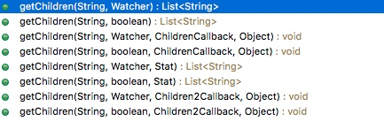

* 参数
 * String path
路径
 * boolean watch
是否设置观察标识，true：状态改变，当前对象的Watcher会被触发
 * Watcher watcher
watcher对象
 * ChildrenCallback cb
回掉函数
 * Object ctx
传输值
 * Stat stat
节点的基本属性：创建时和最后修改的事务ID，长度等等；
传入旧的对象，服务器会更新成新的对象

###### 代码实现

```java
public void list(String groupName) {
        String path = "/" + groupName;
        try {
        	List<String> children = zk.getChildren(path, false);
            if (children.isEmpty()) {
                System.out.printf("No members in group %s\n", groupName);
                System.exit(1);
            }
            for (String child : children) {
                System.out.println(child);
            }
        } catch (KeeperException.NoNodeException ex) {
            System.out.printf("Group %s does not exist\n", groupName);
            System.exit(1);
        } catch (InterruptedException e) {
            e.printStackTrace();
        } catch (KeeperException e) {
            e.printStackTrace();
        }
    }
```
**工程文件见 `com.kkb.zk.until.ZKOperateAPI`**


##### 获取数据

获取节点上的信息

###### 讲解

* 方法
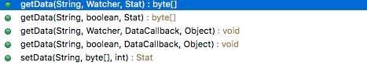

* 参数
 * String path：路径
 * Watcher watcher：注册watcher，有改变就通知
 * DataCallback cb：回掉方法
 * Object ctx：传输值
 * Stat stat：节点信息
 
###### 代码实现

```java
public String getDate(String path) throws KeeperException, InterruptedException{
    	Stat stat = new Stat();
    	String date = new String(zk.getData( path, true, stat ));
    	System.out.println(date);
        System.out.println(stat.getCzxid()+","+stat.getMzxid()+","+stat.getVersion());
        return date;
    }
```
**工程文件见 `com.kkb.zk.until.ZKOperateAPI`**

##### 更新数据

更新节点的数据

###### 讲解

* 方法

```java
Stat setData(final String path, byte data[], int version)
void setData(final String path, byte data[], int version,
            StatCallback cb, Object ctx)
```          
  
* 参数
 * String path
 路径
 * byte data[]
 数据
 * int version
 对应版本更新，-1 不判断版本；通过版本判断，可以进行原子操作
 * StatCallback cb
 回掉函数
 * Object ctx          
函数传值


###### 代码实现

```java
public void setDate(String path,String data,int version) throws KeeperException, InterruptedException{
    	zk.setData(path, data.getBytes(), version);
    }
```
**工程文件见 `com.kkb.zk.until.ZKOperateAPI`**

##### 检查节点是否存在

对节点检查存在不存在，可以直接直接加上Watcher

###### 讲解

* 方法


* 参数
 * String path
 路径
 * Watcher watcher
 监听事件：节点创建，删除，更新都会通知；也可以做创建会话的时候传入Watcher
 * boolean watch
是否复用监听
 * StatCallback cb
 回掉函数
 * Object ctx
 函数传值


###### 代码实现

实例是创建会话时传入的Watcher对象

```java
public class Exist implements Watcher {
    private static CountDownLatch connectedSemaphore = new CountDownLatch(1);
    private static ZooKeeper zk;
    public static void main(String[] args) throws Exception {

    	String path = "/zk";
    	zk = new ZooKeeper("host:2181", 
				5000, //
				new Exist());
    	connectedSemaphore.await();

    	zk.exists( path, true );
    	
    	zk.create( path, "".getBytes(), Ids.OPEN_ACL_UNSAFE, CreateMode.PERSISTENT );
    	
    	zk.setData( path, "123".getBytes(), -1 );
    	
    	zk.create( path+"/c1", "".getBytes(), Ids.OPEN_ACL_UNSAFE, CreateMode.PERSISTENT );
    	
    	zk.delete( path+"/c1", -1 );
    	
    	zk.delete( path, -1 );
    	
        Thread.sleep( Integer.MAX_VALUE );
    }
    @Override
    public void process(WatchedEvent event) {
        try {
            if (KeeperState.SyncConnected == event.getState()) {
                if (EventType.None == event.getType() && null == event.getPath()) {
                    connectedSemaphore.countDown();
                } else if (EventType.NodeCreated == event.getType()) {
                    System.out.println("Node(" + event.getPath() + ")Created");
                    zk.exists( event.getPath(), true );
                } else if (EventType.NodeDeleted == event.getType()) {
                    System.out.println("Node(" + event.getPath() + ")Deleted");
                    zk.exists( event.getPath(), true );
                } else if (EventType.NodeDataChanged == event.getType()) {
                    System.out.println("Node(" + event.getPath() + ")DataChanged");
                    zk.exists( event.getPath(), true );
                }
            }
        } catch (Exception e) {}
    }
}
```
**工程文件见 `com.kkb.zk.until.Exist`**

##### 权限控制
###### 讲解

* 权限类型
ZK的节点有5种操作权限： 
 * CREATE
创建节点以及子节点的权限
 * DELETE
删除接单以及子节点的权限
 * READ
数据节点的读取权限
 * WRITE
数据节点的写权限
 * ADMIN
数据节点的管理权限
这5种权限中，delete是指对子节点的删除权限，其它4种权限指对自身节点的操作权限。

* 身份类型
身份的认证有4种方式
 * world
 默认方式，相当于全世界都能访问；它下面只有一个id, 叫anyone, world:anyone代表任何人，zookeeper中对所有人有权限的结点就是属于world:anyone的
 * auth
代表已经认证通过的用户(cli中可以通过addauth digest user:pwd 来添加当前上下文中的授权用户) 
它不需要id, 只要是通过authentication的user都有权限（zookeeper支持通过kerberos来进行authencation, 也支持username/password形式的authentication)
 * digest
即用户名:密码这种方式认证，这也是业务系统中最常用的；
它对应的id为username:BASE64(SHA1(password))
 * ip
使用Ip地址认证。
设置的时候可以设置一个ip段，比如ip:192.168.1.0/16, 表示匹配前16个bit的IP段
 * super
在这种scheme情况下，对应的id拥有超级权限，可以做任何事情(cdrwa）
* 方法
```java
void addAuthInfo(String scheme, byte auth[]) 
```

* 参数
 * String scheme
 身份类型，上边的解释
 * byte auth[]
 具体的权限信息，按照身份类型里的解释

###### 代码实现

```java
final static String PATH = "/zk-auth_test";
    public static void main(String[] args) throws Exception {
        ZooKeeper zk = new ZooKeeper("host:2181",5000,null);
        zk.addAuthInfo("digest", "name:pwd".getBytes());
        zk.create( PATH, "init".getBytes(), //
        		           Ids.CREATOR_ALL_ACL, CreateMode.EPHEMERAL );
        //正确的密码信息
        ZooKeeper zk2 = new ZooKeeper("host:2181",50000,null);
        zk2.addAuthInfo("digest", "name:pwd".getBytes());
        System.out.println(zk2.getData( PATH, false, null ));
        //错误的密码信息
        ZooKeeper zk3 = new ZooKeeper("host:2181",50000,null);
        zk3.addAuthInfo("digest", "name:pwdEEEE".getBytes());
        //这里会报权限不足
        zk3.getData( PATH, false, null );
        /**
         * 演示赋权
         */
        List<ACL> acls = new ArrayList<ACL>();
        Id id1 = new Id("digest",DigestAuthenticationProvider.generateDigest("admin:admin"));
        ACL acl1 = new ACL(ZooDefs.Perms.ALL, id1);
        acls.add(acl1);
        //添加第二个id，所有用户可读权限
        Id id2 = new Id("world", "anyone");
        ACL acl2 = new ACL(ZooDefs.Perms.READ, id2);
        acls.add(acl2);
        zk.create("/test", "data".getBytes(), acls, CreateMode.PERSISTENT);
    }
```
**工程文件见 `com.kkb.zk.until.Auth`**


参考文档
```url
https://blog.csdn.net/sammory/article/details/82592994
https://blog.csdn.net/gangsijay888/article/details/82426475
```

#### ZkClient

看来原生的API发现很多操作都很麻烦，于是有了一些开业客户端，ZkClient是很常见的一种。

* 代码位置
在 `com.kkb.zk.zkClient`包下

* 代码参考地址
```url
https://github.com/xiajunsongfan/zkclient
```

* jar包

```xml
<dependency>
		<groupId>com.github.sgroschupf</groupId>
		<artifactId>zkclient</artifactId>
		<version>0.1</version>
</dependency>
```

该版本好久以前的了，可以用一些新的zkclient

```
<!-- https://mvnrepository.com/artifact/com.101tec/zkclient -->
<dependency>
    <groupId>com.101tec</groupId>
    <artifactId>zkclient</artifactId>
    <version>0.10</version>
</dependency>
```

##### 创建客户端

###### 讲解

又多种实现方式

* 方法
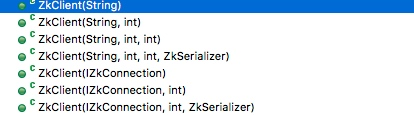

* 参数
 * String zkServers
主机地址，默认端口2181；多个地址用英文逗号 "," 隔开 int
 * sessionTimeout
session 超时时间 int connectionTimeout： 连接超时时间
 * ZkSerializer zkSerializer
序列化器，序列化方式， 默认使用的jdk的序列号方式，可以直接传入序列化的类，
例如：new SerializableSerializer()、new BytesPushThroughSerializer()、new Kryo()
 * IZkConnection connection
接口的实现类，可以直接传入实现类，实现方法就可以用了

###### 代码实现

```java
public void createSession() {
		ZkClient zkClient = new ZkClient("host:2181", 5000);
		//传入序列化方式
		zkClient.setZkSerializer(new SerializableSerializer());
	}
```
**工程文件见 `com.kkb.zk.zkClient.ZkClientTestUtil`**

##### 创建节点

创建方法封装了很多；
其中方法带Persistent是创建持久节点 方法带Ephemeral是创建临时节点 Sequential 是顺序的

###### 讲解
* 方法
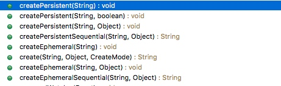

* 参数
 * String path：路径 Object data：数据内容，可以为null 
 * List<ACL> acl
控制策略，在Ids里边有很多值，纸面意思就可以看出来；
 * OPEN_ACL_UNSAFE：完全控制，CREATOR_ALL_ACL创建权限，READ_ACL_UNSAFE读权限
 * CreateMode createMode ：节点的类型（CreateMode中有常量），4种类型持久，持久顺序，临时，临时顺序
 * StringCallback cb ：异步回掉函数 
 * Object ctx ：异步使用的传递对象 
 * boolean createParents
是否创建父节点

###### 代码实现

```java
public void createNode() {
		ZkClient zkClient = new ZkClient("host:2181", 5000);
		String path = "/zk/path1";
		zkClient.createPersistent(path, true);
	}
```
**工程文件见 `com.kkb.zk.zkClient.ZkClientTestUtil`**

##### 删除数据

删除不同的jar会有些出入

###### 讲解

* 方法

 ```java
delete(final String path)
delete(final String path, final int version)
//删除目录和子节点
boolean deleteRecursive(String path) 
```

* 参数
 * String path
 路径 
 * int version
根据版本删除

###### 代码实现

```java
public void delDate() {
		ZkClient zkClient = new ZkClient("host:2181", 5000);
		String path = "/zk/path1";
		zkClient.deleteRecursive(path);
	}
```
**工程文件见 `com.kkb.zk.zkClient.ZkClientTestUtil`**
##### 节点读取/监听数据
###### 讲解
* 方法


* 参数
 * String path：路径
 * boolean returnNullIfPathNotExists：确保如果不存在返回null不报错
 * Stat stat：节点的基本属性：创建时和最后修改的事务ID，长度等等；
          传入旧的对象，服务器会更新成新的对象
          
###### 代码实现

```java
public void getDate(){
		String path = "/zk";
		ZkClient zkClient = new ZkClient("host:2181", 5000);
        zkClient.createEphemeral(path, "123");
        String value = zkClient.readData(path);
        /**
         * 对数据的监听
         * 
         * Listener只要注册一次就一直生效，可以监听不存在的节点，一旦有值了返回
         */
        zkClient.subscribeDataChanges(path, new IZkDataListener() {
        	//数据被删除
            public void handleDataDeleted(String dataPath) throws Exception {
                System.out.println("Node " + dataPath + " deleted.");
            }
            //数据发生变化
            public void handleDataChange(String dataPath, Object data) throws Exception {
                System.out.println("Node " + dataPath + " changed, new data: " + data);
            }
        });
	}
```

**工程文件见 `com.kkb.zk.zkClient.ZkClientTestUtil`**

##### 获取/监听子数据
###### 讲解
* 方法

 ```java
List<String> getChildren(String path)
List<String> getChildren(final String path, final boolean watch) 
```

* 参数
 * String path
 路径
 * boolean watch
 是否监听

###### 代码实现

```java
public void getNodes(){
		String path = "/zk";
		ZkClient zkClient = new ZkClient("host:2181", 5000);
        zkClient.createEphemeral(path, "123");
		 /**
         * 读取子节点数据
         */
        List<String> valueList = zkClient.getChildren(path);
        /**
         * 对子节点的监听
         */
        zkClient.subscribeChildChanges(path, new IZkChildListener() {
        	/**
        	 * String parentPat：父节点路径
        	 * List<String> currentChilds：子节点相对路径列表，没有null
        	 * 新增或删除子节点，传入新的子节点列表；删除的话可能是null
        	 */
            public void handleChildChange(String parentPath, List<String> currentChilds) throws Exception {
                System.out.println(parentPath + " 's child changed, currentChilds:" + currentChilds);
            }
        });
	}
```
**工程文件见 `com.kkb.zk.zkClient.ZkClientTestUtil`**

##### 更新数据

###### 讲解

* 方法
void writeData(String path, Object object) 
void writeData(final String path, Object datat, final int expectedVersion) 
* 参数
 * String path
路径
 * Object datat
数据
 *  final int expectedVersion
预期版本，老的信息都有版本

###### 代码实现

```java
public void setDate(){
		String path = "/zk";
		ZkClient zkClient = new ZkClient("host:2181", 2000);
        zkClient.createEphemeral(path, new Integer(1));
        zkClient.writeData(path, new Integer(1));
	}
```
**工程文件见 `com.kkb.zk.zkClient.ZkClientTestUtil`**

#### Curator

Curator是更强大的客户端框架

* 官网介绍
Curator是Netflix公司开源的一套Zookeeper客户端框架。了解过Zookeeper原生API都会清楚其复杂度。Curator帮助我们在其基础上进行封装、实现一些开发细节，包括接连重连、反复注册Watcher和NodeExistsException等。目前已经作为Apache的顶级项目出现，是最流行的Zookeeper客户端之一。从编码风格上来讲，它提供了基于Fluent的编程风格支持。

除此之外，Curator还提供了Zookeeper的各种应用场景：Recipe、共享锁服务、Master选举机制和分布式计数器等。 


* 官方网站

 ```url
http://curator.apache.org/index.html
```

* 官方的例子

 ```url
https://github.com/Netflix/curator
```

* 不错的例子

 ```url
https://github.com/mumudemo/mumu-zookeeper
```

前边讲解下API的简单使用，后边就具体讲如何应用了。

* jar包

 ```xml
<dependency>
    <groupId>org.apache.curator</groupId>
    <artifactId>curator-framework</artifactId>
    <version>4.1.0</version>
</dependency>
<dependency>
            <groupId>org.apache.curator</groupId>
            <artifactId>curator-recipes</artifactId>
            <version>4.1.0</version>
        </dependency>
<dependency>
            <groupId>org.apache.curator</groupId>
            <artifactId>curator-test</artifactId>
            <version>4.1.0</version>
        </dependency>
```


##### 创建客户端
一种是常规的newClient，还有一种是Fluent风格的API
###### 讲解
* 方法

```java
newClient(String connectString, RetryPolicy retryPolicy)
newClient(String connectString, int sessionTimeoutMs, int connectionTimeoutMs, RetryPolicy retryPolicy)
```

* 参数
 * @param connectString       list of servers to connect to
创建连接，ip:端口号，多个逗号隔开
 * @param sessionTimeoutMs    session timeout
session超时时间
 * @param connectionTimeoutMs connection timeout
连接超时时间
 * @param retryPolicy         retry policy to use
重试策略，用系统现成的或者自己定义

###### 重试策略
有很多策略在org.apache.curator.retry 包下可以点进去看看
BoundedExponentialBackoffRetry、RetryOneTime、RetryNTimes等

我们介绍下
* ExponentialBackoffRetry
构造器含有三个参数 ExponentialBackoffRetry(int baseSleepTimeMs, int maxRetries, int maxSleepMs)
 * baseSleepTimeMs：初始的sleep时间，用于计算之后的每次重试的sleep时间，
	公式：当前sleep时间=baseSleepTimeMs*Math.max(1, random.nextInt(1<<(retryCount+1)))
 * maxRetries：最大重试次数
 * maxSleepMs：最大sleep时间，如果上述的当前sleep计算出来比这个大，那么sleep用这个时间


###### 代码实现
```java
public void createSession() throws InterruptedException{
		RetryPolicy retryPolicy = new ExponentialBackoffRetry(1000, 3);
        CuratorFramework client =
        CuratorFrameworkFactory.newClient("host:2181",
        		5000,
        		3000,
        		retryPolicy);
        client.start();
        Thread.sleep(Integer.MAX_VALUE);
	}
	/**
	 * Fluent风格的API
	 */
	public void createSessionFluent() throws InterruptedException{
		{
	        RetryPolicy retryPolicy = new ExponentialBackoffRetry(1000, 3);
	        CuratorFramework client =
	        CuratorFrameworkFactory.builder()
	                             .connectString("host:2181")
	                             .sessionTimeoutMs(5000)
	                             .retryPolicy(retryPolicy)
	                             //创建命名空间，可以让每个连接有独立的目录
//	                             .namespace("")
	                             .build();
	        client.start();
	        Thread.sleep(Integer.MAX_VALUE);
	    }
	}
```
**工程文件见 `com.kkb.zk.curator.CuratorTest`**

##### 创建节点
###### 讲解
* 方法
Curator 创建节点都是用的client.create()，在对象后边加具体参数
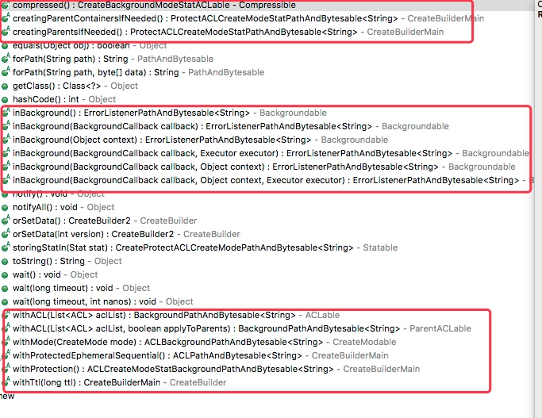

* 参数
 * forPath
 路径
 * withMode
 模式
 * creatingParentsIfNeeded 
 创建父级目录
 * CuratorEvent event
 默认是Zookeeper的EventThread线程执行，可以自己指定线程池
 
###### 代码实现

```java
/**
         * 同步创建节点
         * 默认是持久节点
         * 所有非叶子节点都是持久节点,只有最后的数据节点才是指定类型的节点,其父节点都是持久节点
         * */
        //创建一个初始内容为空的节点
        client.create().forPath("/kkb");
        //创建一个初始内容不为空的节点
        client.create().forPath("/kkb2","java".getBytes());
        //创建一个初始内容为空的临时节点
        client.create().withMode(CreateMode.EPHEMERAL).forPath("kkb3");
        //创建一个初始内容不为空的临时节点，可以实现递归创建
        client.create().creatingParentsIfNeeded().withMode(CreateMode.EPHEMERAL)
                .forPath("kkb4","web".getBytes());
                /**
         *  异步创建节点
         * 默认是Zookeeper的EventThread线程穿行执行
         * 可以自己指定线程池
         * */
        client.create().withMode(CreateMode.EPHEMERAL).inBackground(new BackgroundCallback() {
            public void processResult(CuratorFramework client, CuratorEvent event) throws Exception {
                System.out.println("当前线程：" + Thread.currentThread().getName() + ",code:"
                + event.getResultCode() + ",type:" + event.getType());
            }
        },Executors.newFixedThreadPool(10)).forPath("/async-kkb");
client.create().withMode(CreateMode.EPHEMERAL).inBackground(new BackgroundCallback() {
            public void processResult(CuratorFramework client, CuratorEvent event) throws Exception {
                System.out.println("当前线程：" + Thread.currentThread().getName() + ",code:"
                        + event.getResultCode() + ",type:" + event.getType());
            }
        }).forPath("/async-kkb2");
```

**工程文件见 `com.kkb.zk.curator.CuratorTest`**

##### 获取节点内容

###### 讲解

###### 代码实现

```java
byte[] data = client.getData().forPath("/kkb");
        System.out.println(new String(data));
        //通过传入stat获得值
        byte[] data2 = client.getData().storingStatIn(new Stat()).forPath("/kkb");
        System.out.println(new String(data2));
```
**工程文件见 `com.kkb.zk.curator.CuratorTest`**

##### 更新节点

###### 讲解

###### 代码实现

```java
Stat stat = client.setData().forPath("/kkb");
        client.setData().withVersion(4).forPath("/kkb", "java".getBytes());
```

**工程文件见 `com.kkb.zk.curator.CuratorTest`**

##### 删除节点

###### 讲解

###### 代码实现
```java
//只能删除叶子节点
        client.delete().forPath("/kkb");
        //删除一个节点,并递归删除其所有子节点
        client.delete().deletingChildrenIfNeeded().forPath("/aa");
        //强制指定版本进行删除
        client.delete().withVersion(4).forPath("/kkb2");
        //如果删除失败,会记录下来,只要会话有效,就会不断的重试,直到删除成功为止
        client.delete().guaranteed().forPath("/kkb3");
```
**工程文件见 `com.kkb.zk.curator.CuratorTest`**
##### 节点监听

###### 讲解
* 方法

```java
NodeCache(CuratorFramework client, String path)
NodeCache(CuratorFramework client, String path, boolean dataIsCompressed)
```

* 参数
 * CuratorFramework client
客户端
 * String path
路径
 * boolean dataIsCompressed
是否压缩

###### 代码实现

```java
public String nodeCache(String path){
        CuratorFramework client = new CuratorConnect().connect();
        NodeCache nodeCache;
        try {
        	nodeCache=new NodeCache(client,path);
        	//true 是立刻从对应节点获取数据，默认是false
            nodeCache.start(true);
            //如果数据节点删除无法触发监听方法
            nodeCache.getListenable().addListener(new NodeCacheListener() {
                @Override
                public void nodeChanged() throws Exception {
                	System.out.println("Node data update, new data: " + 
            			    new String(nodeCache.getCurrentData().getData()));
                }
            });
            TimeUnit.SECONDS.sleep(Integer.MAX_VALUE);
        } catch (Exception e) {
            e.printStackTrace();
        }
        return null;
    }
```
**工程文件见 `com.kkb.zk.curator.CuratorCache`**

##### 监听子节点

curator引入了Cache的观念，不需要反复的注册watcher

###### 讲解
* 方法
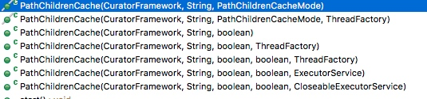

* 参数
 * 前三个和cache一样
 * @param threadFactory    factory to use when creating internal threads
ThreadFactory threadFactory：定义自己的线程池处理
 * @param executorService  ExecutorService to use for the PathChildrenCache's background thread.
    	 *  This service should be single threaded, otherwise the cache may see inconsistent results.
 定义单线程的服务对象
 
###### 代码实现
```java
public void pathChildrenCache() throws Exception{
    	String path = "/zk";
    	CuratorFramework client = new CuratorConnect().connect();
		PathChildrenCache cache = new PathChildrenCache(client, path, true);
//		ExecutorService tp = Executors.newFixedThreadPool(2);
//		PathChildrenCache cache = new PathChildrenCache(client, path,true,false,tp);
		cache.start(StartMode.POST_INITIALIZED_EVENT);
		cache.getListenable().addListener(new PathChildrenCacheListener() {
			public void childEvent(CuratorFramework client, 
					               PathChildrenCacheEvent event) throws Exception {
				switch (event.getType()) {
				case CHILD_ADDED:
					System.out.println("CHILD_ADDED," + event.getData().getData());
					break;
				case CHILD_UPDATED:
					System.out.println("CHILD_UPDATED," + event.getData().getData());
					break;
				case CHILD_REMOVED:
					System.out.println("CHILD_REMOVED," + event.getData().getPath());
					break;
				default:
					break;
				}
			}
		});
		client.create().withMode(CreateMode.PERSISTENT).forPath(path);
		Thread.sleep( 1000 );
		client.create().withMode(CreateMode.PERSISTENT).forPath(path+"/c1");
		Thread.sleep( 1000 );
		client.delete().forPath(path+"/c1");
		Thread.sleep( 1000 );
		client.delete().forPath(path);
		Thread.sleep(Integer.MAX_VALUE);
	}
```
**工程文件见 `com.kkb.zk.curator.CuratorCache`**

##### master选举

参考资料
```url
https://blog.csdn.net/weixin_39800144/article/details/79312214
```

###### 讲解

对于分布式无状态的服务，有时需要从集群中找出一台进行处理；对于这一类分布式的问题，叫做"Master选举"
 
 * 单点故障
 分布式系统中主节点挂了就玩完了，如图：
 
 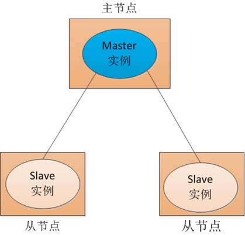
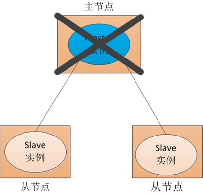

 
 * 传统解决办法
 传统解决办法增加主节点的备用节点实例
 
 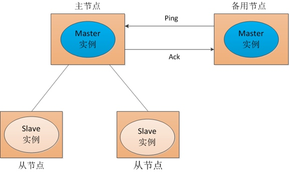
当主备master之间的网络出现问题后会有很大的隐患，考虑到局部容灾等问题，主备一般不会放在一个工作单元（同一个机柜，机房，甚至同一个城市）里。
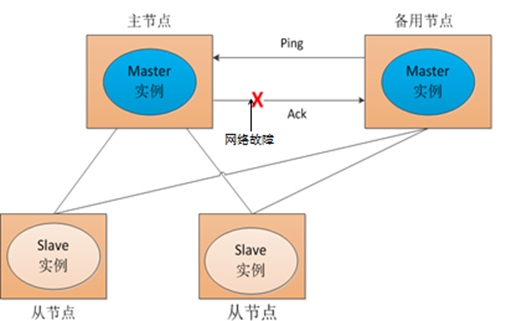

还有一个问题就是原来的主回复后如何继续工作问题。

* zk解决思路
把节点信息报到zk中，由zk决定哪个是主。


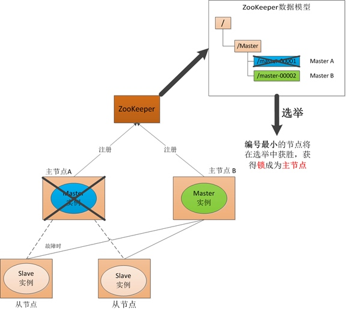

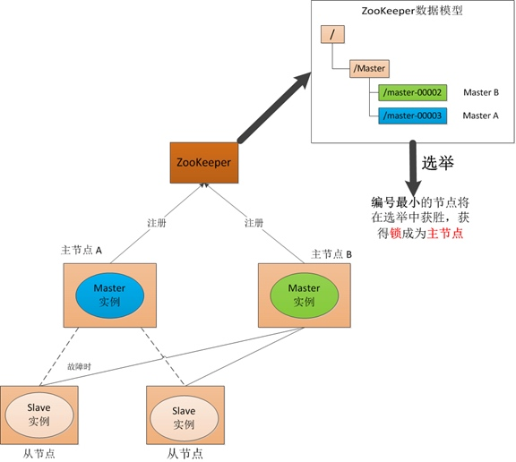

 
 
 对于分布式服务中的选举问题 curator将节点创建、事件监听、自动选举的过程进行封装，我们可以直接拿过来用
 
###### 代码实现

有兴趣的可以点进去看看他的源码具体如何实现

```java
public String leader(String path) {
		for (int i = 0; i < 3; i++) {
			new Thread(new Runnable() {
				@Override
				public void run() {
					CuratorFramework client = new CuratorConnect().connect();
					LeaderSelector leaderSelector = new LeaderSelector(client, path,
							new LeaderSelectorListener() {
								//本方法执行完，会立马释放，进行下一次的选举
								@Override
								public void takeLeadership(CuratorFramework client) throws Exception {
									System.out.println("成为master:" + Thread.currentThread().getName());
									TimeUnit.SECONDS.sleep(10);
								}
								@Override
								public void stateChanged(CuratorFramework client,
										ConnectionState connectionState) {
								}
							});
					leaderSelector.autoRequeue();
					leaderSelector.start();
				}
			}).start();
		}
		try {
			TimeUnit.SECONDS.sleep(Integer.MAX_VALUE);
		} catch (InterruptedException e) {
			e.printStackTrace();
		}
		return null;
	}
```
**工程文件见 `com.kkb.zk.curator.CuratorMaster`**
##### 分布式锁

有时候为了确保分布式系统中的数据一致性，需要对流程做同步操作；curator可以简单的让我们使用分布式锁。

###### 讲解

ZooKeeper为我们保证了数据的强一致性，zk集群中任意节点（一个zk server）上的相同znode的数据是一定是相同的。锁服务可以分为两类，一个是保持独占，另一个是控制时序。

* 保持独占
只有一个可以成功获得这把锁；
zk的做法是，所有客户端都去创建 /lock** 节点，最终成功创建的那个客户端也即拥有了这把锁
* 控制时序
所以想获得锁的客户端，被顺序执行，要求是全局的时序性要保持一致；
zk的做法是，建立好lock节点，然后再客户端下建立临时的有序节点，我们通过全局有序的获得锁节点信息来获得锁。

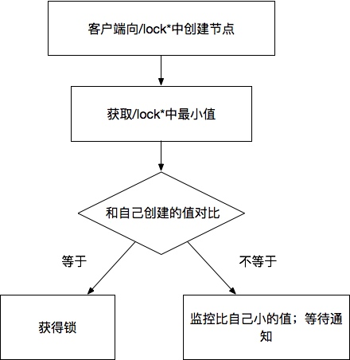


curator中定义了InterProcessMutex，可以直接用该对象的acquire和release两个方法获得和释放锁；
我们用同步输出时间做了一个例子。

###### 代码实现

有兴趣的可以点进去看看他的源码具体如何实现（留作业）

```java
public String lock(String path,int currency){
        CuratorFramework client = new CuratorConnect().connect();
        InterProcessMutex mutex=new InterProcessMutex(client,path);
        CountDownLatch latch=new CountDownLatch(currency);
        for (int i = 0; i <currency ; i++) {
            new Thread(new Runnable() {
                @Override
                public void run() {
                    try {
                    	//获得锁
                        mutex.acquire();
                        SimpleDateFormat simpleDateFormat=new SimpleDateFormat("yyyy-mm-dd HH:MM:SS");
                        System.out.println(simpleDateFormat.format(new Date()));
                        latch.countDown();
                    } catch (Exception e) {
                        e.printStackTrace();
                    }finally {
                        try {
                        	//释放锁
                            mutex.release();
                        } catch (Exception e) {
                            e.printStackTrace();
                        }
                    }
                }
            }).start();
        }
        try {
            latch.await();
        } catch (InterruptedException e) {
            e.printStackTrace();
        }
        return null;
    }
```
**工程文件见 `com.kkb.zk.curator.CuratorMutex`**


##### 分布式计数器

分布式场景中会有很多统计，比如系统在线人数，基于zk的curator实现也很简单

###### 讲解

curator有自己封装的atomic包，里边有很多原子操作的东西
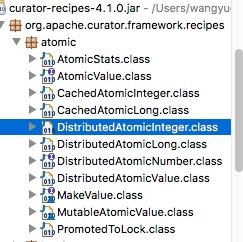

我们就用DistributedAtomicInteger简单实现一下分布式计数器。

###### 代码实现
```java
/**
     * 分布式计数器
     * @return
     */
    public String atomic(String path,int currency){
        CuratorFramework curatorFramework = new CuratorConnect().connect();
        DistributedAtomicInteger distributedAtomicInteger
        =new DistributedAtomicInteger(curatorFramework,path,new RetryNTimes(3,1000));
        CountDownLatch latch=new CountDownLatch(currency);
        for (int i = 1; i <=currency ; i++) {
            new Thread(new Runnable() {
                @Override
                public void run() {
                    try {
                        AtomicValue<Integer> add = distributedAtomicInteger.increment();
                        System.out.println("before:"+add.preValue()+",after:"+add.postValue());
                        latch.countDown();
                    } catch (Exception e) {
                        e.printStackTrace();
                    }
                }
            }).start();
        }
        try {
            latch.await();
            System.out.println("total:"+distributedAtomicInteger.get().postValue());
        } catch (Exception e) {
            e.printStackTrace();
        }
        return null;
    }
```
**工程文件见 `com.kkb.zk.curator.ZkClientTestUtil`**
##### 分布式barrier

双向路障同步，任务统一开始，统一结束

jdk有自带的barrier控件，让所有线程都准备好后执行，但是如果不是在一个jvm中就无法实现；zk就可以解决这类问题。

###### 讲解

curator有两种方式实现，DistributedBarrier和DistributedDoubleBarrier；

* DistributedBarrier
需要主线程去触发setBarrier()和removeBarrier()来实现并发；
* DistributedDoubleBarrier
通过enter()来等待，达到数量后触发，leave()调用后再次等待，到达数量后同时结束。

###### 代码实现
```java
import java.io.IOException;
import java.util.concurrent.CountDownLatch;
import java.util.concurrent.CyclicBarrier;
import java.util.concurrent.ExecutorService;
import java.util.concurrent.Executors;
import java.util.concurrent.TimeUnit;

import org.apache.curator.framework.CuratorFramework;
import org.apache.curator.framework.recipes.barriers.DistributedBarrier;
import org.apache.curator.framework.recipes.barriers.DistributedDoubleBarrier;


public class CuratorBarrier {

	
	public static void main(String[] args) {
		CuratorBarrier cb = new CuratorBarrier();
		//jdk自带
//		try {
//			cb.jdkBarrier();
//		} catch (IOException | InterruptedException e) {
//			// TODO Auto-generated catch block
//			e.printStackTrace();
//		}
		String barrier_path = "/curator_recipes_barrier_path";
//		cb.barrier(barrier_path, 5);
		
		cb.doubleBarrier(barrier_path, 5);
	}
    static  DistributedBarrier barrier=null;
    /**
     * 分布式barrier
     * @return
     */
    public String barrier(String path,int currency){
        CountDownLatch latch=new CountDownLatch(currency);
        CountDownLatch startLatch=new CountDownLatch(currency);
        for (int i = 1; i <=currency ; i++) {
            new Thread(new Runnable() {
                @Override
                public void run() {
                    try {
                        CuratorFramework curatorFramework = new CuratorConnect().connect();
                        barrier=new DistributedBarrier(curatorFramework,path);
                        System.out.println(Thread.currentThread().getName()+"准备就绪");
                        latch.countDown();
                        barrier.setBarrier();
                        barrier.waitOnBarrier();
                        System.out.println(Thread.currentThread().getName()+"开始...");
                        startLatch.countDown();
                    } catch (Exception e) {
                        e.printStackTrace();
                    }
                }
            }).start();
        }
        try {
            latch.await();
            TimeUnit.SECONDS.sleep(10);
            barrier.removeBarrier();
            startLatch.await();
        } catch (Exception e) {
            e.printStackTrace();
        }
        return null;
    }
    public String doubleBarrier(String path,int currency){
        CountDownLatch latch=new CountDownLatch(currency);
        for (int i = 1; i <=currency ; i++)
            new Thread(new Runnable() {
                @Override
                public void run() {
                    try {
                        CuratorFramework curatorFramework = new CuratorConnect().connect();
                        DistributedDoubleBarrier barrier = new DistributedDoubleBarrier(curatorFramework, path, currency);
                        System.out.println(Thread.currentThread().getName()+"进入.....");
                        TimeUnit.SECONDS.sleep(5);
                        barrier.enter();
                        System.out.println(Thread.currentThread().getName()+"启动...");
                        TimeUnit.SECONDS.sleep(5);
                        barrier.leave();
                        System.out.println(Thread.currentThread().getName()+"离开...");
                    } catch (Exception e) {
                        e.printStackTrace();
                    }finally {
                        latch.countDown();
                    }
                }
            }).start();
        try {
            latch.await();
        } catch (InterruptedException e) {
            e.printStackTrace();
        }
        return null;
    }
    
    /**
     * jdk自带的CyclicBarrier
     */
    public static CyclicBarrier jdkBarrier = new CyclicBarrier( 3 );
	public  void jdkBarrier() throws IOException, InterruptedException {
		ExecutorService executor = Executors.newFixedThreadPool( 3 );
		executor.submit( new Thread( new Runner( "1号选手" ) ) );
		executor.submit( new Thread( new Runner( "2号选手" ) ) );
		executor.submit( new Thread( new Runner( "3号选手" ) ) );
		executor.shutdown();
	}
    class Runner implements Runnable {
    	private String name;
    	public Runner( String name ) {
    		this.name = name;
    	}
    	public void run() {
    		System.out.println( name + " 准备好了." );
    		try {
    			CuratorBarrier.jdkBarrier.await();
    		} catch ( Exception e ) {}
    		System.out.println( name + " 起跑!" );
    	}
    }
}
```
**工程文件见 `com.kkb.zk.curator.CuratorBarrier`**

