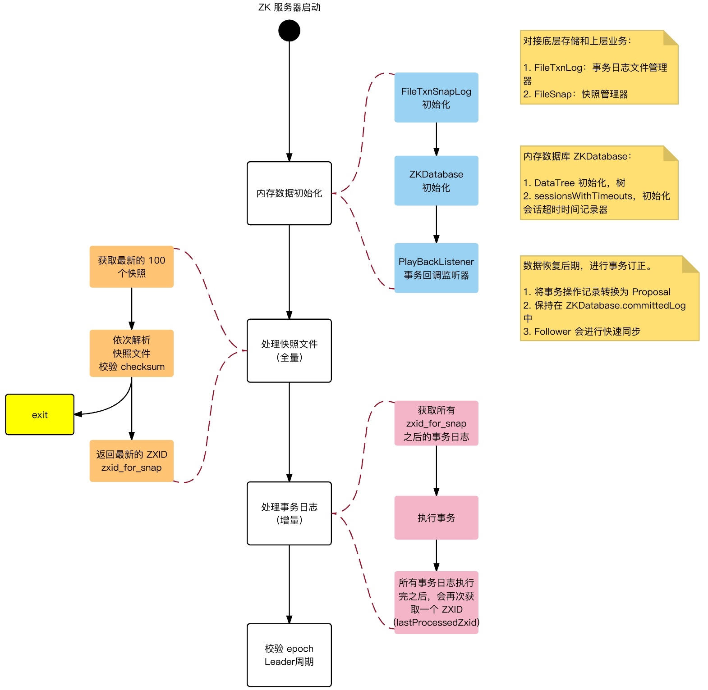

# 公开课

## 课堂主题

如何应对面试

## 课堂目标

了解面试过程中的得失
明确自己的补充方向
构思自己的知识体系

## 知识要点

### 一、基础问题

#### 1、基础问题1：ArrayList和linkedList区别

##### 30分的回答

背面试题

##### 60分的回答

 百度一下

##### 80分的回答

###### List

```java
public static List<String> list = new ArrayList<>();
```

我们看下代码，只做一点点改变。

```java
/**
 * 此类描述的是：  
 * 数据结构算法重要性实例
 * @author: Coder_Wang 
 * @version: 2019年1月28日 下午5:03:44
 */
public class ExampleList {
	static int length = 16;
	public static List<String> listNoLength = new ArrayList<>();
	public static List<String> listLength = new ArrayList<>(length);
	public static void addList(int sign){
		long start = System.currentTimeMillis();
		for (int i = 0; i < length; i++) {
			if(sign==0){
				listNoLength.add("asdf");
			}else{
				listLength.add("asdf");
			}
		}
		long end =  System.currentTimeMillis();
		System.out.println("sign: "+ sign+"   "+(end - start));
	}
	public static void main(String[] args) {
		addList(0);
		addList(1);
	}
}
```

简单几句说下代码；


因为写的数据样本小，数字肯定会有出入。

* 细节优化
长度尽量使用2的幂作为长度，计算机分配空间大都使用次幂去分配，减少碎片空间


###### 数组

以下是数组在内存中存储结构，和扩容过程。


* 新增数据空间判断
新增数据的时候需要判断当前是否有空闲空间存储数据
* 扩容需要申请新的连续空闲空间
上图为例，长度4需要扩容到8。必须找到长度为8的空间才能新建扩容数组。
* 把老的数组复制过去
* 新加内容
* 回收老的数组空间


###### 链表


* 不需要连续空间
* 大小不定


###### 对比

* 时间复杂度

| 操作   | 数组 | 链表 |
| -------- | ---- | ---- |
| 随机访问 | O(1) | O(N) |
| 头部插入 | O(N) | O(1) |
| 头部删除 | O(N) | O(1) |
| 尾部插入 | O(1) | O(1) |
| 尾部删除 | O(1) | O(1) |

* 同样查找都是O(n)数组遍历比链表快
因为数组的连续内存，会有一部分或全部数据一起进入到CPU缓存，而链表还需要再去内存中根据上下标查找；CPU缓存比内存快太多。

* 小结
数组大小固定，不适合动态存储，动态添加，内存为一连续的地址，可随机访问，查询较快，
而链表大小可变，扩展性强，只能顺着指针的方向查询，速度较慢

###### 应用

* 数组
有序数组，无序数组，多维数组，矩阵等等
* 链表
单链表，双向链表，循环链表，双向循环链表

##### 100分的回答

这个就不仅仅要了解的更彻底，还需要了解面试官想知道什么看重什么

添加删除源码实现，自己手写一个实现等等

#### 2、基础问题2：HashMap


###### 1-常问问题：环形链表


* 为什么问这个问题？
就是扩容机制，牵扯到的知识点：基本数据结构，hash算法，合并算法，并发编程，锁等


###### 哈希冲突解决方案

* 开放地址
 * 线性探测再散列
dii=1，2，3，…，m-1
顺序查看表中下一单元，直到找出一个空单元或查遍全表
 * 二次探测再散列
 di=1²，-1²，2²，-2²，…，k²，-k²    ( k<=m/2 )
 冲突时前后找，先找后边1的平方，再找前边1的平方，没有就加1继续找
 * 伪随机探测再散列
 随机找一个hash值
* 再哈希
重新用其他的方式计算一遍hash，计算hash的方法好多种算法
* 链地址
hashMap
* 建立公共溢出区
把冲突的放到一个地方，统一用其他方案处理

###### 3-弥补措施

* 扩容顺序
7 是先扩容后增加元素，8是先增加元素后扩容

* 插入顺序
在jdk8之前是插入头部的，在jdk1.8中是插入尾部的

###### 4-其他问题

* 并发下其他问题
并发操作，扩容时，老表允许插入，新插入的对象在迁移对象中没有，会造成数据丢失
并发操作，每个线程都会建立新表对象然后往共享变量赋值，会造成其他线程的新表数据丢失
并发操作，导致链表头数据被覆盖，数据丢失

* 写算法判断环形链表

```java
 public boolean isLoop(Node head){
        Node slow = head;
        Node fast = head;
        while(fast!=null && fast.next!=null)
        {
            slow = slow.next;
            fast = fast.next.next;
            if(slow==fast)
                return true;
        }

        return false;
    }
```

* concurrenthashmap原理，长度统计等
为什么比Hashtable高效，Segment，多线程锁；
volatile和synchronized，原子操作，并发包；
JMM，JVM，回收算法。

#### 需要掌握的点

##### 数据结构算法


##### Java常见知识点


### 二、架构中常见服务选型

#### 1-服务发现

##### zk的原理问题


* Server节点说明
  * Leader：响应写入请求，发起投票和决议，超过半数Follower同意写入，写入成功，广播，所有节点更新数据

  * Follower：响应查询，将写入请求发给Leader，参与选举和写入投票

  * ObServer：响应查询，将写入请求发给Leader，不参与投票，只接收写入结果。
（ObServer用来扩展读请求，不参与决策所以不会牺牲写入吞吐量，提升系统查询性能 ）

###### 选主策略

* 投票内容
vote_sid：接收到的投票中所推举Leader服务器的SID。
vote_zxid：接收到的投票中所推举Leader服务器的ZXID。
self_sid：当前服务器自己的SID。
self_zxid：当前服务器自己的ZXID

* 规则
如果vote_zxid大于self_zxid，就认可当前收到的投票，并再次将该投票发送出去。
如果vote_zxid小于self_zxid，那么坚持自己的投票，不做任何变更。
如果vote_zxid等于self_zxid，那么就对比两者的SID，如果vote_sid大于self_sid，那么就认可当前收到的投票，并再次将该投票发送出去。
如果vote_zxid等于self_zxid，并且vote_sid小于self_sid，那么坚持自己的投票，不做任何变更


###### 存储方式

* 快照
快照写入是异步的；
快照生成时新提交的事务有可能会写入快照，快照的界限不是某一个时间段，是模糊的。

* 事务日志
 * 事务日志频繁 flush 到磁盘，消耗大量磁盘 IO
 * 磁盘空间预分配：事务日志剩余空间 < 4KB 时，将文件大小增加 64 MB
 * 磁盘预分配的目标：减少磁盘 seek 次数（搜索空间的次数）
 * 建议：事务日志，采用独立磁盘单独存放


* 关联知识点
Redis持久化，ES索引持久化

###### 启动流程





###### 存储结构


znode相关内容大致分为

* data
与该Znode关联的数据

* children
该Znode下的子节点

* ACL 信息
节点的权限信息


##### 延伸问题阿里为什么不用zk

###### dubbo和zk


###### zk和rocketMq中NameService对比
 
 

* Name Server 
注册中心，存储关联信息；
无状态节点，可集群部署，节点之间无任何信息同步。
即使整个Namesrv集群宕机，已经正常工作的Producer，Consumer，Broker仍然能正常工作，但新起的Producer, Consumer，Broker就无法工作
topic太多的化，传输时间长可能会误认为broker失效。
压力在心跳监控上。


##### CAP理论

> 任何分布式系统在可用性、一致性、分区容错性方面，不能兼得，最多只能得其二，因此，任何分布式系统的设计只是在三者中的不同取舍而已。 

 + C（Consistency）：所有的节点上的数据时刻保持同步
 + A（Availability）：每个请求都能接受到一个响应，无论响应成功或失败
 + P（Partition-tolerance）：系统应该能持续提供服务，即使系统内部有消息丢失（分区）

注册中心应该是CP还是AP？
CAP
数据一致性consistency，数据可用性Availability，分区耐受性partition tolerance。
强一致，用户一致，最终一致。
BASE
Basically Available（基本可用）、Soft state（软状态）和Eventually consistent（最终一致性）
ACID
原子性(Atomicity)，一致性(Consistency)，隔离性(Isolation)，持久性(Durability). 

##### 常见的注册发现服务对比

|    特性    | ZooKeeper | ETCD |  Consul  |    Euraka    |
| :--------: | :--------: | :--: | :------: | :----------: |
|    cap     |     CP     |  CP  | CP/AP |      AP      |
| 多语言支持 |    sdk     | http | http&dns |     http     |
|   watch    |    支持    | 支持 |   支持   | long polling |
|  一致性协议  |    ZAB(paxos)    | raft |   raft   |     弱一致性     |
| 多数据中心 | 无 | 无 | 支持 | 无 |
| 社区支持 | 积极 | 积极 | 积极 | 暂停 |


#### 2-秒杀方案主要技术点


* 服务部署


* 链路流转


程序逻辑


##### 限流消峰

###### 业务限流

验证码，答题（防刷）

###### 消峰

* 紧耦合


* 松耦合


###### 负载限流


###### 容器

##### 快速处理返回

  

###### 请求数据的少

###### 减少耦合

###### 减少依赖

##### （3）服务稳定性

###### 集群部署

###### 备用节点预留

###### 服务等级

###### 开发维护/模块划分

#### （4）减库存问题

#### （5）流量消峰

#### （6）链路优化点

* 动静分离
CDN合理使用
* 传输
http，tcp;nio，netty
* 传输序列化
kryo，hession，protostuff和protobuf
* 编码优化
方法调用，对象使用，jvm影响
* 缓存使用
redis/mc，本地cache
* 并发控制
分布式锁，内部java的多线程
* jvm调优
参数调优，回收器设置等等
* 数据库优化
索引合理使用，表合理设计


## 面试问题简介

自我介绍，技术点，项目；
知识点的讲解；
满分：了解面试官想法！

面试过程：

面试官技术不好：一面（想办法过了），后边面试--这个是不是适合自己；
		
		
双向选择！！！


低调，耐心

HR
		
有没有问题问面试官
		
公司情况， 团队， 加班，加班补偿，职级发展，工作内容，社保情况，单位福利