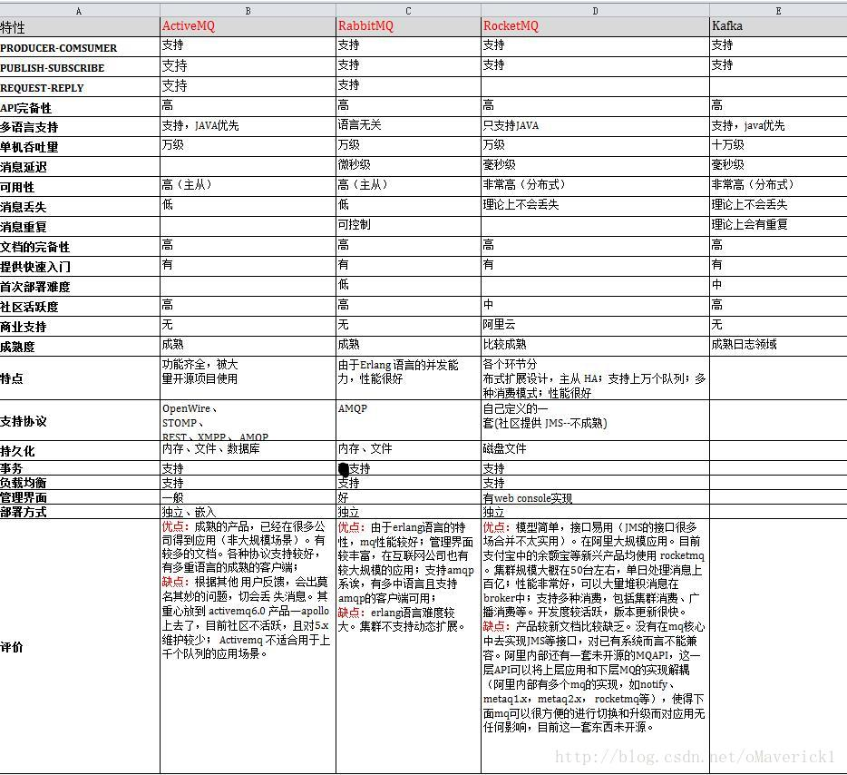
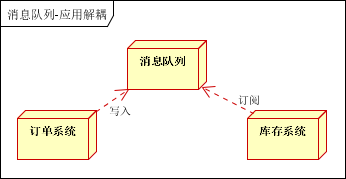

# 课堂主题

流行的消息中间件如何选项、技术特点分析、常见问题分析

# 课堂目标

# 知识要点

[TOC]

# 消息中间件介绍

## 消息中间件概述

随着互联网技术和金融科技的不断发展，从RPC到Web Service，从SOA的推行再到RESTful以及云计算中PaaS与SaaS的推广，分布式架构在金融企业中得到了广泛应用，消息中间件则在分布式系统之间的通信、集成和整合上发挥了关键作用。分布式消息中间件通过高效、可靠的消息传递机制，降低应用系统之间的耦合性，实现高性能的数据交换，保障了分布式计算网络环境下高可用和一致性。

分布式消息中间件主要用于分布式系统架构中，进行应用系统间的数据传输，已经在各种行业中广泛应用。开源分布式消息中间件种类很多，各有侧重，在引入时需要结合具体的应用场景，选择性价比最高的开源产品。因此，需要对分布式消息中间件进行全面评估，防范开源软件带来风险，为金融企业更好的应用开源软件提供支撑。

消息中间件已经逐渐成为企业IT系统内部通信的核心手段。**它具有低耦合、可靠投递、广播、流量控制、最终一致性等一系列功能，成为异步RPC的主要手段之一。**当今市面上有很多主流的消息中间件，如老牌的ActiveMQ、RabbitMQ，炙手可热的Kafka，阿里巴巴自主开发RocketMQ等。

消息队列作为高并发系统的核心组件之一，能够帮助业务系统解构提升开发效率和系统稳定性。主要具有以下优势：

- 削峰填谷（主要解决瞬时写压力大于应用服务能力导致消息丢失、系统奔溃等问题）
- 系统解耦（解决不同重要程度、不同能力级别系统之间依赖导致一死全死）
- 提升性能（当存在一对多调用时，可以发一条消息给消息系统，让消息系统通知相关系统）
- 蓄流压测（线上有些链路不好压测，可以通过堆积一定量消息再放开来压测）

## 消息中间件的组成

### Broker

消息服务器，作为server提供消息核心服务

### Producer

消息生产者，业务的发起方，负责生产消息传输给broker，

### Consumer

消息消费者，业务的处理方，负责从broker获取消息并进行业务逻辑处理

### Topic

主题，发布订阅模式下的消息统一汇集地，不同生产者向topic发送消息，由MQ服务器分发到不同的订阅者，实现消息的广播

### Queue

队列，PTP模式下，特定生产者向特定queue发送消息，消费者订阅特定的queue完成指定消息的接收

### Message

消息体，根据不同通信协议定义的固定格式进行编码的数据包，来封装业务数据，实现消息的传输

## 消息中间件模式分类

### 点对点

PTP点对点:使用**queue**作为通信载体 

**说明：** 

> 消息生产者生产消息发送到queue中，然后消息消费者从queue中取出并且消费消息。 
>
> 消息被消费以后，queue中不再存储，所以消息消费者不可能消费到已经被消费的消息。
>
> Queue支持存在多个消费者，但是对一个消息而言，只会有一个消费者可以消费。

### 发布/订阅

Pub/Sub发布订阅（广播）：使用**topic**作为通信载体 

**说明：** 

> 消息生产者（发布）将消息发布到topic中，同时有多个消息消费者（订阅）消费该消息。和点对点方式不同，发布到topic的消息会被所有订阅者消费。

> queue实现了负载均衡，将producer生产的消息发送到消息队列中，由多个消费者消费。但一个消息只能被一个消费者接受，当没有消费者可用时，这个消息会被保存直到有一个可用的消费者。 
>
> topic实现了发布和订阅，当你发布一个消息，所有订阅这个topic的服务都能得到这个消息，所以从1到N个订阅者都能得到一个消息的拷贝。

 

## 消息中间件的优势

​      **4.1 系统解耦**

交互系统之间没有直接的调用关系，只是通过消息传输，故系统侵入性不强，耦合度低。

​      **4.2 提高系统响应时间**

例如原来的一套逻辑，完成支付可能涉及先修改订单状态、计算会员积分、通知物流配送几个逻辑才能完成；通过MQ架构设计，就可将紧急重要（需要立刻响应）的业务放到该调用方法中，响应要求不高的使用消息队列，放到MQ队列中，供消费者处理。

​      **4.3 为大数据处理架构提供服务**

通过消息作为整合，大数据的背景下，消息队列还与实时处理架构整合，为数据处理提供性能支持。

​      **4.4 Java消息服务——JMS**

Java消息服务（Java Message Service，JMS）应用程序接口是一个Java平台中关于面向消息中间件（MOM）的API，用于在两个应用程序之间，或分布式系统中发送消息，进行异步通信。 
JMS中的P2P和Pub/Sub消息模式：点对点（point to point， queue）与发布订阅（publish/subscribe，topic）最初是由JMS定义的。这两种模式主要区别或解决的问题就是发送到队列的消息能否重复消费(多订阅)。

 

## 消息中间件应用场景

​       **5.1 异步通信**

有些业务不想也不需要立即处理消息。消息队列提供了异步处理机制，允许用户把一个消息放入队列，但并不立即处理它。想向队列中放入多少消息就放多少，然后在需要的时候再去处理它们。

​      **5.2 解耦**

降低工程间的强依赖程度，针对异构系统进行适配。在项目启动之初来预测将来项目会碰到什么需求，是极其困难的。通过消息系统在处理过程中间插入了一个隐含的、基于数据的接口层，两边的处理过程都要实现这一接口，当应用发生变化时，可以独立的扩展或修改两边的处理过程，只要确保它们遵守同样的接口约束。

​      **5.3 冗余**

有些情况下，处理数据的过程会失败。除非数据被持久化，否则将造成丢失。消息队列把数据进行持久化直到它们已经被完全处理，通过这一方式规避了数据丢失风险。许多消息队列所采用的”插入-获取-删除”范式中，在把一个消息从队列中删除之前，需要你的处理系统明确的指出该消息已经被处理完毕，从而确保你的数据被安全的保存直到你使用完毕。

​      **5.4 扩展性**

因为消息队列解耦了你的处理过程，所以增大消息入队和处理的频率是很容易的，只要另外增加处理过程即可。不需要改变代码、不需要调节参数。便于分布式扩容。

​      **5.5 过载保护**

在访问量剧增的情况下，应用仍然需要继续发挥作用，但是这样的突发流量无法提取预知；如果以为了能处理这类瞬间峰值访问为标准来投入资源随时待命无疑是巨大的浪费。使用消息队列能够使关键组件顶住突发的访问压力，而不会因为突发的超负荷的请求而完全崩溃。

​      **5.6 可恢复性**

系统的一部分组件失效时，不会影响到整个系统。消息队列降低了进程间的耦合度，所以即使一个处理消息的进程挂掉，加入队列中的消息仍然可以在系统恢复后被处理。

​      **5.7 顺序保证**

在大多使用场景下，数据处理的顺序都很重要。大部分消息队列本来就是排序的，并且能保证数据会按照特定的顺序来处理。

​      **5.8 缓冲**

在任何重要的系统中，都会有需要不同的处理时间的元素。消息队列通过一个缓冲层来帮助任务最高效率的执行，该缓冲有助于控制和优化数据流经过系统的速度。以调节系统响应时间。

​      **5.9 数据流处理**

分布式系统产生的海量数据流，如：业务日志、监控数据、用户行为等，针对这些数据流进行实时或批量采集汇总，然后进行大数据分析是当前互联网的必备技术，通过消息队列完成此类数据收集是最好的选择。

 

## 消息中间件常用协议

​      **6.1 AMQP协议**

AMQP即Advanced Message Queuing Protocol,一个提供统一消息服务的应用层标准高级消息队列协议,是应用层协议的一个开放标准,为面向消息的中间件设计。基于此协议的客户端与消息中间件可传递消息，并不受客户端/中间件不同产品，不同开发语言等条件的限制。 
优点：可靠、通用

​      **6.2 MQTT协议**

MQTT（Message Queuing Telemetry Transport，消息队列遥测传输）是IBM开发的一个即时通讯协议，有可能成为物联网的重要组成部分。该协议支持所有平台，几乎可以把所有联网物品和外部连接起来，被用来当做传感器和致动器（比如通过Twitter让房屋联网）的通信协议。 
优点：格式简洁、占用带宽小、移动端通信、PUSH、嵌入式系统

​      **6.3 STOMP协议**

STOMP（Streaming Text Orientated Message Protocol）是流文本定向消息协议，是一种为MOM(Message Oriented Middleware，面向消息的中间件)设计的简单文本协议。STOMP提供一个可互操作的连接格式，允许客户端与任意STOMP消息代理（Broker）进行交互。 
优点：命令模式（非topic\queue模式）

​      **6.4 XMPP协议**

XMPP（可扩展消息处理现场协议，Extensible Messaging and Presence Protocol）是基于可扩展标记语言（XML）的协议，多用于即时消息（IM）以及在线现场探测。适用于服务器之间的准即时操作。核心是基于XML流传输，这个协议可能最终允许因特网用户向因特网上的其他任何人发送即时消息，即使其操作系统和浏览器不同。 
优点：通用公开、兼容性强、可扩展、安全性高，但XML编码格式占用带宽大

​      **6.5 其他基于TCP/IP自定义的协议**

有些特殊框架（如：redis、kafka、zeroMq等）根据自身需要未严格遵循MQ规范，而是基于TCP\IP自行封装了一套协议，通过网络socket接口进行传输，实现了MQ的功能。

## 三、分布式消息中间件简介

消息中间件具有消息存储、转发、过滤和排队等功能，在分布式环境下扩展进程间的通信，主要用于业务系统解耦、消息异步传递、错峰流控等场景中。除了传统的商业产品如IBM WebSphere MQ、东方通TongLINK/Q之外，开源消息中间件技术近几年发展迅速，常见的有ActiveMQ、RabbitMQ、ZeroMQ、Kafka、MetaQ、RocketMQ等，并已经在许多行业得到广泛应用。

经过前期对金融企业应用情况和业务需求的调研，以及对当前技术发展趋势的考虑，本次我们选取了快速发展的Kafka，以及应用广泛的RabbitMQ作为评测对象，后续也将对其他消息队列中间件开展评测。

#### （一）Kafka

Kafka是由LinkedIn公司在2010年12月开源的一种高吞吐量的分布式消息系统，属于Apache软件基金会的顶级子项目之一，目前已被越来越多的开源分布式处理系统集成。Kafka适用于大规模消息处理的应用场景，具有良好的可扩展性和性能优势。与传统消息系统不同，Kafka还被广泛应用于日志聚合、流式数据处理等场景中。

Kafka具有高性能、高可用、分布式的技术特点。Kafka强大的负载均衡和副本策略保证了节点的可靠性和高可用性，支持节点的动态扩展；在设计实现上与传统消息中间件有较大差异，使用文件系统来管理消息的生命周期，能够在常数时间复杂度内提供消息持久化和数据访问，支持消息的批量发送和压缩传输，性能表现优异。由于其并非作为传统MQ设计，没有遵循主流消息服务规范，因此在事务、协议兼容等方面有所欠缺。

#### （二）RabbitMQ

2007年，基于AMQP标准的RabbitMQ 1.0版本由Rabbit技术公司发布，2010年被SpringSource收购，2013年并入Pivotal，现由Pivotal Software提供商业支持。RabbitMQ是一种基于Erlang实现AMQP协议的开源消息中间件，它提供了功能强大的消息队列服务，常用于Web服务器快速响应请求，适合跨平台、跨语言的消息传输。

RabbitMQ具有消息可靠传输、灵活路由策略、多协议支持等特点。RabbitMQ具有健壮的消息确认机制、用户角色体系、以及认证和授权管理功能，保障消息可靠传输。灵活的交换器和绑定规则设置提供了强大的消息路由功能，同时支持AMQP、HTTP、STOMP、MQTT等协议。此外，RabbitMQ多节点集群的联合不依赖外部服务，支持服务的高可用，但服务的负载均衡需要使用第三方组件。

## 常见MQ介绍

​      **7.1 RocketMQ**

阿里系下开源的一款分布式、队列模型的消息中间件，原名Metaq，3.0版本名称改为RocketMQ，是阿里参照kafka设计思想使用java实现的一套mq。同时将阿里系内部多款mq产品（Notify、metaq）进行整合，只维护核心功能，去除了所有其他运行时依赖，保证核心功能最简化，在此基础上配合阿里上述其他开源产品实现不同场景下mq的架构，目前主要多用于订单交易系统。

具有以下特点：

- 能够保证严格的消息顺序
- 提供针对消息的过滤功能
- 提供丰富的消息拉取模式
- 高效的订阅者水平扩展能力
- 实时的消息订阅机制
- 亿级消息堆积能力

官方提供了一些不同于kafka的对比差异： 
<https://rocketmq.apache.org/docs/motivation/>

​      **7.2 RabbitMQ**

使用Erlang编写的一个开源的消息队列，本身支持很多的协议：AMQP，XMPP, SMTP,STOMP，也正是如此，使的它变的非常重量级，更适合于企业级的开发。同时实现了Broker架构，核心思想是生产者不会将消息直接发送给队列，消息在发送给客户端时先在中心队列排队。对路由(Routing)，负载均衡(Load balance)、数据持久化都有很好的支持。多用于进行企业级的ESB整合。

​      **7.3 ActiveMQ**

Apache下的一个子项目。使用Java完全支持JMS1.1和J2EE 1.4规范的 JMS Provider实现，少量代码就可以高效地实现高级应用场景。可插拔的传输协议支持，比如：in-VM, TCP, SSL, NIO, UDP, multicast, JGroups and JXTA transports。RabbitMQ、ZeroMQ、ActiveMQ均支持常用的多种语言客户端 C++、Java、.Net,、Python、 Php、 Ruby等。

​      **7.4 Redis**

使用C语言开发的一个Key-Value的NoSQL数据库，开发维护很活跃，虽然它是一个Key-Value数据库存储系统，但它本身支持MQ功能，所以完全可以当做一个轻量级的队列服务来使用。对于RabbitMQ和Redis的入队和出队操作，各执行100万次，每10万次记录一次执行时间。测试数据分为128Bytes、512Bytes、1K和10K四个不同大小的数据。实验表明：入队时，当数据比较小时Redis的性能要高于RabbitMQ，而如果数据大小超过了10K，Redis则慢的无法忍受；出队时，无论数据大小，Redis都表现出非常好的性能，而RabbitMQ的出队性能则远低于Redis。

​      **7.5 Kafka**

Apache下的一个子项目，使用scala实现的一个高性能分布式Publish/Subscribe消息队列系统，具有以下特性：

- 快速持久化：通过磁盘顺序读写与零拷贝机制，可以在O(1)的系统开销下进行消息持久化；
- 高吞吐：在一台普通的服务器上既可以达到10W/s的吞吐速率；
- 高堆积：支持topic下消费者较长时间离线，消息堆积量大；
- 完全的分布式系统：Broker、Producer、Consumer都原生自动支持分布式，依赖zookeeper自动实现复杂均衡；
- 支持Hadoop数据并行加载：对于像Hadoop的一样的日志数据和离线分析系统，但又要求实时处理的限制，这是一个可行的解决方案。

​      **7.6 ZeroMQ**

号称最快的消息队列系统，专门为高吞吐量/低延迟的场景开发，在金融界的应用中经常使用，偏重于实时数据通信场景。ZMQ能够实现RabbitMQ不擅长的高级/复杂的队列，但是开发人员需要自己组合多种技术框架，开发成本高。因此ZeroMQ具有一个独特的非中间件的模式，更像一个socket library，你不需要安装和运行一个消息服务器或中间件，因为你的应用程序本身就是使用ZeroMQ API完成逻辑服务的角色。但是ZeroMQ仅提供非持久性的队列，如果down机，数据将会丢失。如：Twitter的Storm中使用ZeroMQ作为数据流的传输。

ZeroMQ套接字是与传输层无关的：ZeroMQ套接字对所有传输层协议定义了统一的API接口。默认支持 进程内(inproc) ，进程间(IPC) ，多播，TCP协议，在不同的协议之间切换只要简单的改变连接字符串的前缀。可以在任何时候以最小的代价从进程间的本地通信切换到分布式下的TCP通信。ZeroMQ在背后处理连接建立，断开和重连逻辑。

特性：

- 无锁的队列模型：对于跨线程间的交互（用户端和session）之间的数据交换通道pipe，采用无锁的队列算法CAS；在pipe的两端注册有异步事件，在读或者写消息到pipe的时，会自动触发读写事件。
- 批量处理的算法：对于批量的消息，进行了适应性的优化，可以批量的接收和发送消息。
- 多核下的线程绑定，无须CPU切换：区别于传统的多线程并发模式，信号量或者临界区，zeroMQ充分利用多核的优势，每个核绑定运行一个工作者线程，避免多线程之间的CPU切换开销。

 

## 主要消息中间件的比较

 

**综合选择RabbitMq** 

# MQ

## 一、消息队列概述

消息队列中间件是分布式系统中重要的组件，主要解决应用解耦，异步消息，流量削锋等问题，实现高性能，高可用，可伸缩和最终一致性架构。目前使用较多的消息队列有ActiveMQ，RabbitMQ，ZeroMQ，Kafka，MetaMQ，RocketMQ

## **二、消息队列应用场景**

以下介绍消息队列在实际应用中常用的使用场景。异步处理，应用解耦，流量削锋和消息通讯四个场景。

###       2.1异步处理

场景说明：用户注册后，需要发注册邮件和注册短信。传统的做法有两种 1.串行的方式；2.并行方式

      a、串行方式：将注册信息写入数据库成功后，发送注册邮件，再发送注册短信。以上三个任务全部完成后，返回给客户端。

b、并行方式：将注册信息写入数据库成功后，发送注册邮件的同时，发送注册短信。以上三个任务完成后，返回给客户端。与串行的差别是，并行的方式可以提高处理的时间

假设三个业务节点每个使用50毫秒钟，不考虑网络等其他开销，则串行方式的时间是150毫秒，并行的时间可能是100毫秒。
因为CPU在单位时间内处理的请求数是一定的，假设CPU1秒内吞吐量是100次。则串行方式1秒内CPU可处理的请求量是7次（1000/150）。并行方式处理的请求量是10次（1000/100）
小结：如以上案例描述，传统的方式系统的性能（并发量，吞吐量，响应时间）会有瓶颈。如何解决这个问题呢？

引入消息队列，将不是必须的业务逻辑，异步处理。改造后的架构如下：

按照以上约定，用户的响应时间相当于是注册信息写入数据库的时间，也就是50毫秒。注册邮件，发送短信写入消息队列后，直接返回，因此写入消息队列的速度很快，基本可以忽略，因此用户的响应时间可能是50毫秒。因此架构改变后，系统的吞吐量提高到每秒20 QPS。比串行提高了3倍，比并行提高了两倍。

###       2.2应用解耦

场景说明：用户下单后，订单系统需要通知库存系统。传统的做法是，订单系统调用库存系统的接口。如下图：

传统模式的缺点：假如库存系统无法访问，则订单减库存将失败，从而导致订单失败，订单系统与库存系统耦合

如何解决以上问题呢？引入应用消息队列后的方案，如下图：

订单系统：用户下单后，订单系统完成持久化处理，将消息写入消息队列，返回用户订单下单成功
库存系统：订阅下单的消息，采用拉/推的方式，获取下单信息，库存系统根据下单信息，进行库存操作
假如：在下单时库存系统不能正常使用。也不影响正常下单，因为下单后，订单系统写入消息队列就不再关心其他的后续操作了。实现订单系统与库存系统的应用解耦

###       2.3流量削锋

流量削锋也是消息队列中的常用场景，一般在秒杀或团抢活动中使用广泛。
应用场景：秒杀活动，一般会因为流量过大，导致流量暴增，应用挂掉。为解决这个问题，一般需要在应用前端加入消息队列。

      a、可以控制活动的人数
      b、可以缓解短时间内高流量压垮应用

用户的请求，服务器接收后，首先写入消息队列。假如消息队列长度超过最大数量，则直接抛弃用户请求或跳转到错误页面。
秒杀业务根据消息队列中的请求信息，再做后续处理

###       2.4日志处理

日志处理是指将消息队列用在日志处理中，比如Kafka的应用，解决大量日志传输的问题。架构简化如下

日志采集客户端，负责日志数据采集，定时写受写入Kafka队列
Kafka消息队列，负责日志数据的接收，存储和转发
日志处理应用：订阅并消费kafka队列中的日志数据 

###       2.5消息通讯

消息通讯是指，消息队列一般都内置了高效的通信机制，因此也可以用在纯的消息通讯。比如实现点对点消息队列，或者聊天室等
           点对点通讯：

客户端A和客户端B使用同一队列，进行消息通讯。

聊天室通讯：

客户端A，客户端B，客户端N订阅同一主题，进行消息发布和接收。实现类似聊天室效果。

以上实际是消息队列的两种消息模式，点对点或发布订阅模式。模型为示意图，供参考。

 

## **三、消息中间件示例** 

###        3.1电商系统

消息队列采用高可用，可持久化的消息中间件。比如Active MQ，Rabbit MQ，Rocket Mq。
（1）应用将主干逻辑处理完成后，写入消息队列。消息发送是否成功可以开启消息的确认模式。（消息队列返回消息接收成功状态后，应用再返回，这样保障消息的完整性）
（2）扩展流程（发短信，配送处理）订阅队列消息。采用推或拉的方式获取消息并处理。
（3）消息将应用解耦的同时，带来了数据一致性问题，可以采用最终一致性方式解决。比如主数据写入数据库，扩展应用根据消息队列，并结合数据库方式实现基于消息队列的后续处理。

 

###       3.2日志收集系统

分为Zookeeper注册中心，日志收集客户端，Kafka集群和Storm集群（OtherApp）四部分组成。
Zookeeper注册中心，提出负载均衡和地址查找服务
日志收集客户端，用于采集应用系统的日志，并将数据推送到kafka队列
Kafka集群：接收，路由，存储，转发等消息处理
Storm集群：与OtherApp处于同一级别，采用拉的方式消费队列中的数据

# RabbitMQ

## 1、**什么是RabbitMQ？**

RabbitMQ是由Erlang语言编写的实现了**高级消息队列协议**（AMQP）的开源消息代理软件（也可称为 面向消息的中间件）。支持Windows、Linux/Unix、MAC OS X操作系统和包括JAVA在内的多种编程语言。

 

AMQP，即Advanced Message Queuing Protocol，一个提供统一消息服务的应用层标准高级消息队列协议，是应用层协议的一个开放标准，为面向消息的中间件设计。基于此协议的客户端与消息中间件可传递消息，并不受 客户端/中间件 不同产品，不同的开发语言等条件的限制。

 

## 2、**RabbitMQ中的重要概念**

 

图片来源于网络

 

（1）**Broker**：经纪人。提供一种传输服务，维护一条从生产者到消费者的传输线路，保证消息数据能按照指定的方式传输。粗略的可以将图中的RabbitMQ Server当作Broker。

（2）**Exchange**：消息交换机。指定消息按照什么规则路由到哪个队列Queue。

（3）**Queue**：消息队列。消息的载体，每条消息都会被投送到一个或多个队列中。

（4）**Binding**：绑定。作用就是将Exchange和Queue按照某种路由规则绑定起来。

（5）**RoutingKey**：路由关键字。Exchange根据RoutingKey进行消息投递。

（6）**Vhost**：虚拟主机。一个Broker可以有多个虚拟主机，用作不同用户的权限分离。一个虚拟主机持有一组Exchange、Queue和Binding。

（7）**Producer**：消息生产者。主要将消息投递到对应的Exchange上面。一般是独立的程序。

（8）**Consumer**：消息消费者。消息的接收者，一般是独立的程序。

（9）**Channel**：消息通道，也称信道。在客户端的每个连接里可以建立多个Channel，每个Channel代表一个会话任务。

 

## 3、**RabbitMQ的使用流程**

AMQP模型中，消息在producer中产生，发送到MQ的exchange上，exchange根据配置的路由方式投递到相应的Queue上，Queue又将消息发送给已经在此Queue上注册的consumer，消息从queue到consumer有push和pull两种方式。

消息队列的使用过程大概如下：

（1）客户端连接到消息队列服务器，打开一个channel。

（2）客户端声明一个exchange，并设置相关属性。

（3）客户端声明一个queue，并设置相关属性。

（4）客户端使用routing key，在exchange和queue之间建立好Binding关系。

（5）生产者客户端投递消息到exchange。

（6）exchange接收到消息后，就根据消息的RoutingKey和已经设置的binding，进行消息路由（投递），将消息投递到一个或多个队列里。

（7）消费者客户端从对应的队列中获取并处理消息。

 

**工作过程：**

- **生产者客户端：**

1. 客户端连接到RabbitMQ服务器上，打开一个消息通道（channel）；
2. 客户端声明一个消息交换机（exchange），并设置相关属性。
3. 客户端声明一个消息队列（queue），并设置相关属性。
4. 客户端使用routing key在消息交换机（exchange）和消息队列（queue）中建立好绑定关系。
5. 客户端投递消息都消息交换机（exchange）上
6. 客户端关闭消息通道（channel）以及和服务器的连接。

- **服务器端：**

exchange接收到消息后，根据消息的key（这个key的产生规则暂时没研究，有知道的小伙伴可以留言告诉我）和以及设置的binding，进行消息路由，将消息投递到一个或多个消息队列中。

关于exchange也有几个类型：

(1). Direct交换机：完全根据key进行投递。例如，绑定时设置了routing key为abc，客户端提交信息提交信息时只有设置了key为abc的才会投递到队列；

(2).Topic交换机：在key进行模式匹配后进行投递。例如：符号”#”匹配一个或多个字符，符号”*”匹配一串连续的字母字符，例如”abc.#”可以匹配”abc.def.ghi”，而”abc.*”只可以匹配”abc.def”。

(3).Fanout交换机：它采取广播模式，消息进来时，将会被投递到与改交换机绑定的所有队列中。

- **消费者客户端：**待续...

 

## **4、RabbitMQ的消息持久化**

 

RabbitMQ支持数据持久化，也就是把数据写在磁盘上，可以增加数据的安全性。消息队列持久化包括三个部分：

1. 消息交换机（exchange）持久化，在声明时指定durable为1
2. 消息队列（queue）持久化，在声明时指定durable为1
3. 消息持久化，在投递时指定delivery_mode为2（1是非持久化）

如果消息交换机（exchange）和消息队列（queue）都是持久化的话，那么他们之间的绑定（Binding）也是持久化的。如果消息交换机和消息队列之间一个持久化、一个非持久化，那么就不允许绑定。

 

## **5、RabbitMQ的优缺点**

**适用场景**：

**比较适合异步传输，这里解释一下什么是异步和同步。**

异步：发送方不关心消息有没有发送成功，只发送消息，不去获取消息是否发送成功。

同步：发送方关心消息是否发送成功，发送消息后，会等待接收方返回状态码，根据状态码来判断是否发送成功，然后执行相对于的动作。

下边以Http中的同步和异步为例：

如：普通的B/S架构客户端和服务器端之间的通信就是同步的，即提交请求 ---> 等待服务器处理完毕返回消息 ---> 拿到服务器返回的消息，处理完毕。

如：Ajax技术就是异步的，请求通过事件触发 ---> 服务器处理（浏览器不用等待，仍可以做其他的事情） ---> 处理完毕。

有人可能会好奇说应用场景怎么说到了同步和异步，那说明你还不是很理解技术和应用场景之间的紧密联系。

**优点**：

（1）由Erlang语言开发，支持大量协议：AMQP、XMPP、SMTP、STOMP。

（2）支持**消息的持久化**、**负载均衡**和**集群**，且集群易扩展。

（3）具有一个Web监控界面，易于管理。

（4）安装部署简单，上手容易，功能丰富，强大的社区支持。

（5）支持消息确认机制、灵活的消息分发机制。

**缺点**：

（1）由于牺牲了部分性能来换取稳定性，比如消息的持久化功能，使得RabbitMQ在大吞吐量性能方面不及Kafka和ZeroMQ。

（2）由于支持多种协议，使**RabbitMQ非常重量级**，比较适合企业级开发。

 

因此当需要一个稳定的、高可靠性的、功能强大且易于管理的消息队列可以选择RabbitMQ。如果对消息吞吐量需求较大，且不在乎消息偶尔丢失的情况可以使用Kafka。

## **6、Exchange类型**

### **6.1、Direct Exchange**

（1）名称：直接交换器类型

（2）默认的预先定义exchange名字：**空字符串**或者**amq.direct**

（3）作用描述：根据Binding指定的Routing Key，将符合Key的消息发送到Binding的Queue。可以构建点对点消息传输模型。

 

图片源于网络

 

如图中RoutingKey分别是error、info、warning，其中error被Binding（绑定）到queue1和queue2上，info和warning被Binding到queue2上。当消息的RoutingKey是error，这条消息将被投递到queue1和queue2中（相当于消息被复制成两个分别投放到两个queue中），然后分别被Consumer1和Consumer2处理。如果消息的RoutingKey是info或者warning，这条消息只会被投递到queue2中，然后被Consumer2处理。如果消息的RoutingKey是其他的字符串，这条消息则会被丢弃。

### **6.2、Fanout Exchange**

（1）名称：广播式交换器类型

（2）默认的预先定义exchange名字：**amq.fanout**

（3）作用描述：将同一个message发送到所有同该Exchange 绑定的queue。**不论RoutingKey是什么**，这条消息都会被投递到所有与此Exchange绑定的queue中。

图片来源于网络

 

广播式交换器类型的工作方式：不使用任何参数将queue和Exchange进行Binding，发布者publisher向Exchange发送一条消息（注意：直接交换器类型中的producer变成了publisher，其中隐含了两种交换器的区别），然后这条消息被**无条件的**投递给所有和这个Exchange绑定的queue中。

如图中，没有RoutingKey的限制，只要消息到达Exchange，都会被投递到queue1和queue2中，然后被对应的Consumer处理。

### **6.3、Topic Exchange**

（1）名称：主题交换器类型

（2）默认的预先定义exchange名字：**amq.topic**

（3）作用描述：根据Binding指定的RoutingKey，Exchange对key进行**模式匹配**后投递到相应的Queue，**模式匹配时符号“#”匹配一个或多个词，符号“\*”匹配正好一个词，而且单词与单词之间必须要用“.”符号进行分隔**。此模式可以用来支持经典的**发布/订阅**消息传输模型-使用主题名字空间作为消息寻址模式，将消息传递给那些部分或者全部匹配主题模式的queue。

图片来源于网络

 

​    如图中，假如消息的RoutingKey是American.action.13，这条消息将被投递到Q1和Q2中。假如RoutingKey是American.action.13.test（注意：此处是四个词），这条消息将会被丢弃，因为没有routingkey与之匹配。假如RoutingKey是Chinese.action.13，这条消息将被投递到Q2和Q3中。假如RoutingKey是Chinese.action.13.test，这条消息只会被投递到Q3中，#可以匹配一个或者多个单词，而*只能匹配一个词。

### **6.4、Headers Exchange**

（1）名称：标题交换器类型

（2）默认的预先定义exchange名字：**amq.match**和**amq.headers**

（3）作用描述：同direct exchange类似，不同之处是不再使用Routing Key路由，而是使用headers（Message attributes）进行匹配路由到指定Queue。

Headers类型的exchange使用的比较少，它也是忽略routingKey的一种路由方式。是使用Headers来匹配的。Headers是一个键值对，可以定义成HashTable。发送者在发送的时候定义一些键值对，接收者也可以再绑定时候传入一些键值对，两者匹配的话，则对应的队列就可以收到消息。匹配有两种方式all和any。这两种方式是在接收端必须要用键值"x-mactch"来定义。all代表定义的多个键值对都要满足，而any则代码只要满足一个就可以了。fanout，direct，topic exchange的routingKey都需要要字符串形式的，而headers exchange则没有这个要求，因为键值对的值可以是任何类型。

# 阿里P8谈mq

大型分布式架构里一定会涉及到消息中间件，今天先谈谈消息中间件。

常用的消息队列有ActiveMQ，RabbitMQ，ZeroMQ，Kafka，MetaMQ，RocketMQ。

## 一、kafka 

1、不完全符合jms规范，注重吞吐量，类似udp 和 tcp

2、一般做大数据吞吐的管道 我们现在的用途就是负责在各个idc之间通信

3、量大对数据不是百分之百保证的，会有数据丢失，不是百分百送达（amq和rmq等有重发机制，而kafka没有）；在吞吐量有提升 ，在这方面就得有牺牲， 所以kafka适合大数据量流转， 比如日志数据 比如用作统计的数据。

## 二、activeMQ 

ActiveMQ居于两者之间，类似于ZemoMQ，它可以部署于代理模式和P2P模式。类似于RabbitMQ，它易于实现高级场景，而且只需付出低消耗。它被誉为消息中间件的“瑞士军刀”。

## 三：RocketMQ（阿里官方指定消息中间件） 

RocketMQ 是一款开源的分布式消息系统，基于高可用分布式集群技术，提供低延时的、高可靠的消息发布与订阅服务。同时，广泛应用于多个领域，包括异步通信解耦、企业解决方案、金融支付、电信、电子商务、快递物流、广告营销、社交、即时通信、移动应用、手游、视频、物联网、车联网等。

消息中间件使用的典型场景优四个

> 1.典型的异步处理
>
> 2.应用解耦
>
> 3.流量削锋
>
> 4.消息通讯四个场景

比如：今日头条的私信就是一个典型的消息通讯场景，因为消息通讯的数据不需要即使立即同步回来，不算是核心数据，可以延时通过异步的消息发送，这样可以降低系统的负荷。

所以，我们在架构设计的时候，有一个原则就是：消息原则上都是异步消息发送，除非涉及到交易的情况才考虑数据即使同步，否则能异步的都采用异步消息设计。

再比如：流量削锋的典型场景就有阿里的双11秒杀、团购抢购活动等。

应用场景：秒杀活动，一般会因为流量过大，导致流量暴增，应用挂掉。为解决这个问题，一般需要在应用前端加入消息队列。

> a、可以控制活动的人数
>
> b、可以缓解短时间内高流量压垮应用

用户的请求，服务器接收后，首先写入消息队列。假如消息队列长度超过最大数量，则直接抛弃用户请求或跳转到错误页面。

秒杀业务根据消息队列中的请求信息，再做后续处理。

## 总结： 

1.消息中间件的四个典型场景：典型的异步处理、应用解耦、流量削锋、消息通讯四个场景。

2.能异步就不要同步：能异步的消息原则都尽量采用异步的方式。

3.如果消息性能要求高，用rocketMQ与kafka可以更优，rocketMQ与kafka 比较就看技术选型了，各有利弊，看业务需要。

4.实现语言来看，RabbitMQ(阿里官方指定消息中间件)最高，原因是它的实现语言是天生具备高并发高可用的erlang语言。综合来看，RabbitMQ是首选。

5.典型的秒杀活动、抢购、消息通讯、邮件发送、电话短信等都是典型的采用消息中间件的业务场景。

# AMQP协议

#### 一、AMQP 是什么

AMQP（Advanced Message Queuing Protocol，高级消息队列协议）是一个进程间传递**异步消息**的**网络协议**。

#### 二、AMQP模型

##### 工作过程

发布者（Publisher）发布消息（Message），经由交换机（Exchange）。

交换机根据**路由规则**将收到的消息分发给与该交换机绑定的队列（Queue）。

最后 AMQP 代理会将消息投递给订阅了此队列的消费者，或者消费者按照需求自行获取。

##### 深入理解

1、发布者、交换机、队列、消费者都可以有多个。同时因为 AMQP 是一个网络协议，所以这个过程中的发布者，消费者，消息代理 可以分别存在于不同的设备上。

2、发布者发布消息时可以给消息指定各种消息属性（Message Meta-data）。有些属性有可能会被消息代理（Brokers）使用，然而其他的属性则是完全不透明的，它们只能被接收消息的应用所使用。

3、从安全角度考虑，网络是不可靠的，又或是消费者在处理消息的过程中意外挂掉，这样没有处理成功的消息就会丢失。基于此原因，AMQP 模块包含了一个消息确认（Message Acknowledgements）机制：当一个消息从队列中投递给消费者后，不会立即从队列中删除，直到它收到来自消费者的确认回执（Acknowledgement）后，才完全从队列中删除。

4、在某些情况下，例如当一个消息无法被成功路由时（无法从交换机分发到队列），消息或许会被返回给发布者并被丢弃。或者，如果消息代理执行了延期操作，消息会被放入一个所谓的死信队列中。此时，消息发布者可以选择某些参数来处理这些特殊情况。

#### 三、Exchange交换机

交换机是用来发送消息的 AMQP 实体。

交换机拿到一个消息之后将它**路由**给一个或零个队列。

它使用哪种路由算法是由**交换机类型**和**绑定（Bindings）规则**所决定的。

AMQP 0-9-1 的代理提供了四种交换机：

交换机可以有两个状态：持久（durable）、暂存（transient）。

持久化的交换机会在消息代理（broker）重启后依旧存在，而暂存的交换机则不会（它们需要在代理再次上线后重新被声明）。

并不是所有的应用场景都需要持久化的交换机。

##### 默认交换机

默认交换机（default exchange）实际上是一个由消息代理预先声明好的没有名字（名字为空字符串）的直连交换机（direct exchange）。

它有一个特殊的属性使得它对于简单应用特别有用处：那就是每个新建队列（queue）都会自动绑定到默认交换机上，绑定的路由键（routing key）名称与队列名称相同。

举个栗子：当你声明了一个名为 “search-indexing-online” 的队列，AMQP 代理会自动将其绑定到默认交换机上，绑定（binding）的路由键名称也是为 “search-indexing-online”。因此，当携带着名为 “search-indexing-online” 的路由键的消息被发送到默认交换机的时候，此消息会被默认交换机路由至名为 “search-indexing-online” 的队列中。换句话说，默认交换机看起来貌似能够直接将消息投递给队列，尽管技术上并没有做相关的操作。

##### 直连交换机

直连型交换机（direct exchange）是根据消息携带的路由键（routing key）将消息投递给对应绑定键的队列。直连交换机用来处理消息的单播路由（unicast routing）（尽管它也可以处理多播路由）。下边介绍它是如何工作的：

1）将一个队列绑定到某个交换机上时，赋予该绑定一个绑定键（Binding Key），假设为R；
2）当一个携带着路由键（Routing Key）为R的消息被发送给直连交换机时，交换机会把它路由给绑定键为R的队列。

直连交换机的队列通常是循环分发任务给多个消费者（我们称之为轮询）。比如说有3个消费者，4个任务。分别分发每个消费者一个任务后，第4个任务又分发给了第一个消费者。综上，我们很容易得出一个结论，在 AMQP 0-9-1 中，消息的负载均衡是发生在消费者（consumer）之间的，而不是队列（queue）之间。

直连型交换机图例：

当生产者（P）发送消息时 Rotuing key=booking 时，这时候将消息传送给 Exchange，Exchange 获取到生产者发送过来消息后，会根据自身的规则进行与匹配相应的 Queue，这时发现 Queue1 和 Queue2 都符合，就会将消息传送给这两个队列。

如果我们以 Rotuing key=create 和 Rotuing key=confirm 发送消息时，这时消息只会被推送到 Queue2 队列中，其他 Routing Key 的消息将会被丢弃。

##### 扇型交换机

扇型交换机（funout exchange）将消息路由给绑定到它身上的所有队列，而不理会绑定的路由键。如果 N 个队列绑定到某个扇型交换机上，当有消息发送给此扇型交换机时，交换机会将消息的拷贝分别发送给这所有的 N 个队列。扇型用来交换机处理消息的广播路由（broadcast routing）。

因为扇型交换机投递消息的拷贝到所有绑定到它的队列，所以他的应用案例都极其相似：

- 大规模多用户在线（MMO）游戏可以使用它来处理排行榜更新等全局事件
- 体育新闻网站可以用它来近乎实时地将比分更新分发给移动客户端
- 分发系统使用它来广播各种状态和配置更新
- 在群聊的时候，它被用来分发消息给参与群聊的用户。（AMQP 没有内置 presence 的概念，因此 XMPP 可能会是个更好的选择）

扇型交换机图例：

上图所示，生产者（P）生产消息 1 将消息 1 推送到 Exchange，由于 Exchange Type=fanout 这时候会遵循 fanout 的规则将消息推送到所有与它绑定 Queue，也就是图上的两个 Queue 最后两个消费者消费。

##### 主题交换机

前面提到的 direct 规则是严格意义上的匹配，换言之 Routing Key 必须与 Binding Key 相匹配的时候才将消息传送给 Queue.

而Topic 的路由规则是一种模糊匹配，可以通过通配符满足一部分规则就可以传送。

它的约定是：

1）binding key 中可以存在两种特殊字符 “*” 与“#”，用于做模糊匹配，其中 “*” 用于匹配一个单词，“#”用于匹配多个单词（可以是零个）

2）routing key 为一个句点号 “.” 分隔的字符串（我们将被句点号 “. ” 分隔开的每一段独立的字符串称为一个单词），如“stock.usd.nyse”、“nyse.vmw”、“quick.orange.rabbit”
binding key 与 routing key 一样也是句点号 “.” 分隔的字符串

主题交换机图例：

当生产者发送消息 Routing Key=F.C.E 的时候，这时候只满足 Queue1，所以会被路由到 Queue 中，如果 Routing Key=A.C.E 这时候会被同是路由到 Queue1 和 Queue2 中，如果 Routing Key=A.F.B 时，这里只会发送一条消息到 Queue2 中。

主题交换机拥有非常广泛的用户案例。无论何时，当一个问题涉及到那些想要有针对性的选择需要接收消息的 多消费者 / 多应用（multiple consumers/applications） 的时候，主题交换机都可以被列入考虑范围。

使用案例：

- 分发有关于特定地理位置的数据，例如销售点
- 由多个工作者（workers）完成的后台任务，每个工作者负责处理某些特定的任务
- 股票价格更新（以及其他类型的金融数据更新）
- 涉及到分类或者标签的新闻更新（例如，针对特定的运动项目或者队伍）
- 云端的不同种类服务的协调
- 分布式架构 / 基于系统的软件封装，其中每个构建者仅能处理一个特定的架构或者系统。

##### 头交换机

headers 类型的 Exchange 不依赖于 routing key 与 binding key 的匹配规则来路由消息，而是根据发送的消息内容中的 headers 属性进行匹配。

头交换机可以视为直连交换机的另一种表现形式。但直连交换机的路由键必须是一个字符串，而头属性值则没有这个约束，它们甚至可以是整数或者哈希值（字典）等。灵活性更强（但实际上我们很少用到头交换机）。工作流程：

1）绑定一个队列到头交换机上时，会同时绑定多个用于匹配的头（header）。
2）传来的消息会携带header，以及会有一个 “x-match” 参数。当 “x-match” 设置为 “any” 时，消息头的任意一个值被匹配就可以满足条件，而当 “x-match” 设置为 “all” 的时候，就需要消息头的所有值都匹配成功。

##### 交换机小结

| 类型名称 | 路由规则                                                |
| -------- | ------------------------------------------------------- |
| Default  | 自动命名的直交换机                                      |
| Direct   | Routing Key==Binding Key，严格匹配                      |
| Fanout   | 把发送到该 Exchange 的消息路由到所有与它绑定的 Queue 中 |
| Topic    | Routing Key==Binding Key，模糊匹配                      |
| Headers  | 根据发送的消息内容中的 headers 属性进行匹配             |

#### 四、Queue队列

AMQP 中的队列（queue）跟其他消息队列或任务队列中的队列是很相似的：它们存储着即将被应用消费掉的消息。

##### 队列属性

队列跟交换机共享某些属性，但是队列也有一些另外的属性。

- Name
- Durable（消息代理重启后，队列依旧存在）
- Exclusive（只被一个连接（connection）使用，而且当连接关闭后队列即被删除）
- Auto-delete（当最后一个消费者退订后即被删除）
- Arguments（一些消息代理用他来完成类似与 TTL 的某些额外功能）

##### 队列创建

队列在声明（declare）后才能被使用。如果一个队列尚不存在，声明一个队列会创建它。如果声明的队列已经存在，并且属性完全相同，那么此次声明不会对原有队列产生任何影响。如果声明中的属性与已存在队列的属性有差异，那么一个错误代码为 406 的通道级异常就会被抛出。

##### 队列持久化

持久化队列（Durable queues）会被存储在磁盘上，当消息代理（broker）重启的时候，它依旧存在。没有被持久化的队列称作暂存队列（Transient queues）。并不是所有的场景和案例都需要将队列持久化。

持久化的队列并不会使得路由到它的消息也具有持久性。倘若消息代理挂掉了，重新启动，那么在重启的过程中持久化队列会被重新声明，无论怎样，只有经过持久化的消息才能被重新恢复。

#### 五、Consumer消费者

消息如果只是存储在队列里是没有任何用处的。被应用消费掉，消息的价值才能够体现。在 AMQP 0-9-1 模型中，有两种途径可以达到此目的：

1）将消息投递给应用 (“push API”)
2）应用根据需要主动获取消息 (“pull API”)

使用 push API，应用（application）需要明确表示出它在某个特定队列里所感兴趣的，想要消费的消息。如是，我们可以说应用注册了一个消费者，或者说订阅了一个队列。一个队列可以注册多个消费者，也可以注册一个独享的消费者（当独享消费者存在时，其他消费者即被排除在外）。

每个消费者（订阅者）都有一个叫做消费者标签的标识符。它可以被用来退订消息。消费者标签实际上是一个字符串。

#### 六、消息机制

##### 消息确认

消费者应用（Consumer applications） - 用来接受和处理消息的应用 - 在处理消息的时候偶尔会失败或者有时会直接崩溃掉。而且网络原因也有可能引起各种问题。这就给我们出了个难题，AMQP 代理在什么时候删除消息才是正确的？AMQP 0-9-1 规范给我们两种建议：

1）自动确认模式：当消息代理（broker）将消息发送给应用后立即删除。（使用 AMQP 方法：basic.deliver 或 basic.get-ok）)
2）显式确认模式：待应用（application）发送一个确认回执（acknowledgement）后再删除消息。（使用 AMQP 方法：basic.ack）

如果一个消费者在尚未发送确认回执的情况下挂掉了，那 AMQP 代理会将消息重新投递给另一个消费者。如果当时没有可用的消费者了，消息代理会死等下一个注册到此队列的消费者，然后再次尝试投递。

##### 拒绝消息

当一个消费者接收到某条消息后，处理过程有可能成功，有可能失败。应用可以向消息代理表明，本条消息由于 “拒绝消息（Rejecting Messages）” 的原因处理失败了（或者未能在此时完成）。

当拒绝某条消息时，应用可以告诉消息代理如何处理这条消息——销毁它或者重新放入队列。

当此队列只有一个消费者时，请确认不要由于拒绝消息并且选择了重新放入队列的行为而引起消息在同一个消费者身上无限循环的情况发生。

在 AMQP 中，basic.reject 方法用来执行拒绝消息的操作。但 basic.reject 有个限制：你不能使用它决绝多个带有确认回执（acknowledgements）的消息。但是如果你使用的是 RabbitMQ，那么你可以使用被称作 negative acknowledgements（也叫 nacks）的 AMQP 0-9-1 扩展来解决这个问题。

##### 预取消息

在多个消费者共享一个队列的案例中，明确指定在收到下一个确认回执前每个消费者一次可以接受多少条消息是非常有用的。这可以在试图批量发布消息的时候起到简单的负载均衡和提高消息吞吐量的作用。For example, if a producing application sends messages every minute because of the nature of the work it is doing.（？？？例如，如果生产应用每分钟才发送一条消息，这说明处理工作尚在运行。）

注意，RabbitMQ 只支持通道级的预取计数，而不是连接级的或者基于大小的预取。

##### 消息属性

AMQP 模型中的消息（Message）对象是带有属性（Attributes）的。有些属性及其常见，以至于 AMQP 0-9-1 明确的定义了它们，并且应用开发者们无需费心思思考这些属性名字所代表的具体含义。例如：

- Content type（内容类型）
- Content encoding（内容编码）
- Routing key（路由键）
- Delivery mode (persistent or not)
- 投递模式（持久化 或 非持久化）
- Message priority（消息优先权）
- Message publishing timestamp（消息发布的时间戳）
- Expiration period（消息有效期）
- Publisher application id（发布应用的 ID）

有些属性是被 AMQP 代理所使用的，但是大多数是开放给接收它们的应用解释器用的。有些属性是可选的也被称作消息头（headers）。他们跟 HTTP 协议的 X-Headers 很相似。消息属性需要在消息被发布的时候定义。

##### 消息主体

AMQP 的消息除属性外，也含有一个有效载荷 - Payload（消息实际携带的数据），它被 AMQP 代理当作不透明的字节数组来对待。

消息代理不会检查或者修改有效载荷。消息可以只包含属性而不携带有效载荷。它通常会使用类似 JSON 这种序列化的格式数据，为了节省，协议缓冲器和 MessagePack 将结构化数据序列化，以便以消息的有效载荷的形式发布。AMQP 及其同行者们通常使用 “content-type” 和 “content-encoding” 这两个字段来与消息沟通进行有效载荷的辨识工作，但这仅仅是基于约定而已。

##### 消息持久化

消息能够以持久化的方式发布，AMQP 代理会将此消息存储在磁盘上。如果服务器重启，系统会确认收到的持久化消息未丢失。

简单地将消息发送给一个持久化的交换机或者路由给一个持久化的队列，并不会使得此消息具有持久化性质：它完全取决与消息本身的持久模式（persistence mode）。将消息以持久化方式发布时，会对性能造成一定的影响（就像数据库操作一样，健壮性的存在必定造成一些性能牺牲）。

#### 七、其他

##### 连接

AMQP 连接通常是长连接。AMQP 是一个使用 TCP 提供可靠投递的应用层协议。AMQP 使用认证机制并且提供 TLS（SSL）保护。当一个应用不再需要连接到 AMQP 代理的时候，需要优雅的释放掉 AMQP 连接，而不是直接将 TCP 连接关闭。

##### 通道

有些应用需要与 AMQP 代理建立多个连接。无论怎样，同时开启多个 TCP 连接都是不合适的，因为这样做会消耗掉过多的系统资源并且使得防火墙的配置更加困难。AMQP 0-9-1 提供了通道（channels）来处理多连接，可以把通道理解成共享一个 TCP 连接的多个轻量化连接。

在涉及多线程 / 进程的应用中，为每个线程 / 进程开启一个通道（channel）是很常见的，并且这些通道不能被线程 / 进程共享。

一个特定通道上的通讯与其他通道上的通讯是完全隔离的，因此每个 AMQP 方法都需要携带一个通道号，这样客户端就可以指定此方法是为哪个通道准备的。

##### 虚拟主机

为了在一个单独的代理上实现多个隔离的环境（用户、用户组、交换机、队列 等），AMQP 提供了一个虚拟主机（virtual hosts - vhosts）的概念。这跟 Web servers 虚拟主机概念非常相似，这为 AMQP 实体提供了完全隔离的环境。当连接被建立的时候，AMQP 客户端来指定使用哪个虚拟主机。

##### AMQP 是可扩展的

AMQP 0-9-1 拥有多个扩展点：

1）定制化交换机类型：可以让开发者们实现一些开箱即用的交换机类型尚未很好覆盖的路由方案。例如 geodata-based routing。)
2）交换机和队列的声明中可以包含一些消息代理能够用到的额外属性。例如 RabbitMQ 中的 per-queue message TTL 即是使用该方式实现。)
3）特定消息代理的协议扩展。例如 RabbitMQ 所实现的扩展。
新的 AMQP 0-9-1 方法类可被引入。)
4）消息代理可以被其他的插件扩展，例如 RabbitMQ 的管理前端 和 已经被插件化的 HTTP API。

这些特性使得 AMQP 0-9-1 模型更加灵活，并且能够适用于解决更加宽泛的问题。

##### AMQP 0-9-1 客户端生态系统

AMQP 0-9-1 拥有众多的适用于各种流行语言和框架的客户端。其中一部分严格遵循 AMQP 规范，提供 AMQP 方法的实现。另一部分提供了额外的技术，方便使用的方法和抽象。有些客户端是异步的（非阻塞的），有些是同步的（阻塞的），有些将这两者同时实现。有些客户端支持 “供应商的特定扩展”（例如 RabbitMQ 的特定扩展）。

因为 AMQP 的主要目标之一就是实现交互性，所以对于开发者来讲，了解协议的操作方法而不是只停留在弄懂特定客户端的库就显得十分重要。这样一来，开发者使用不同类型的库与协议进行沟通时就会容易的多。