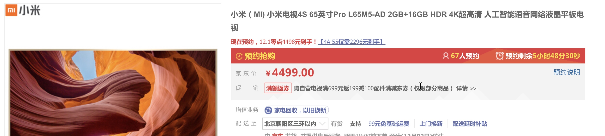
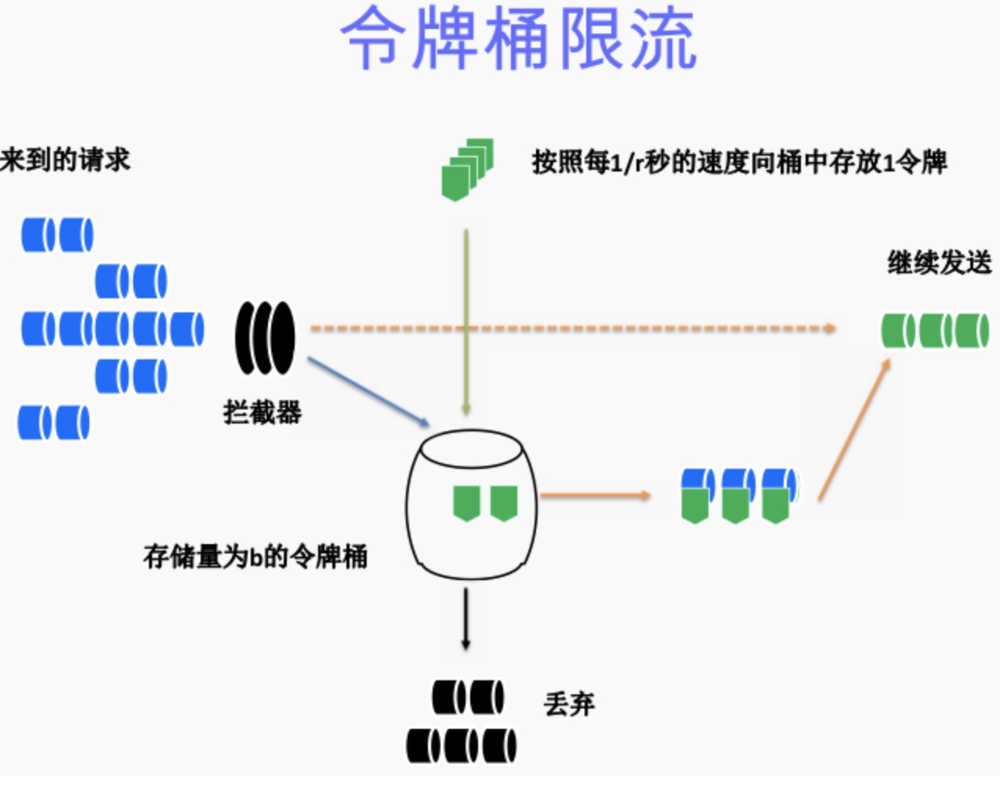
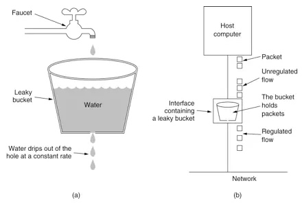
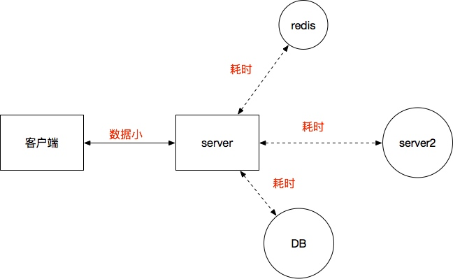
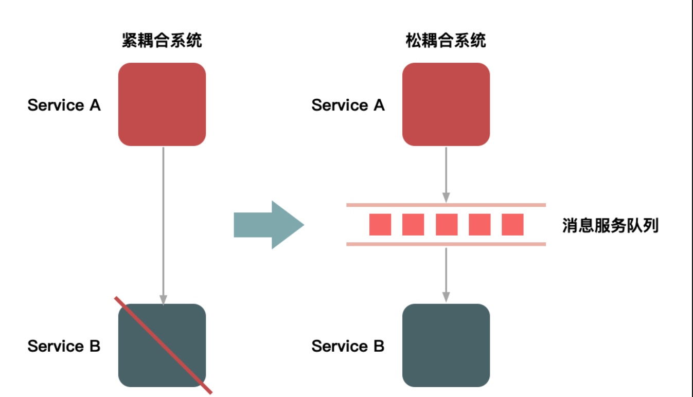
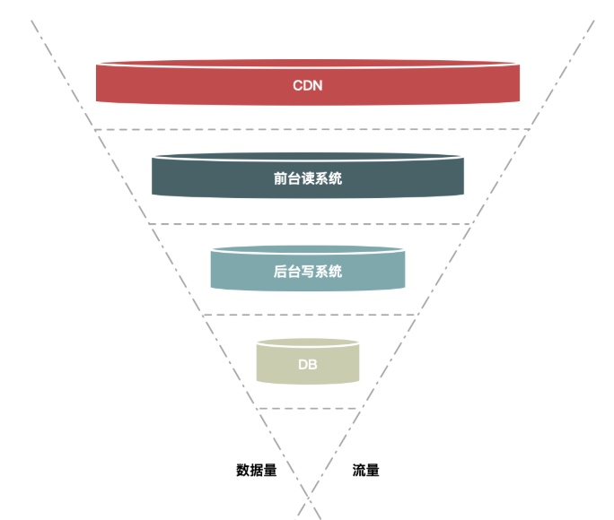
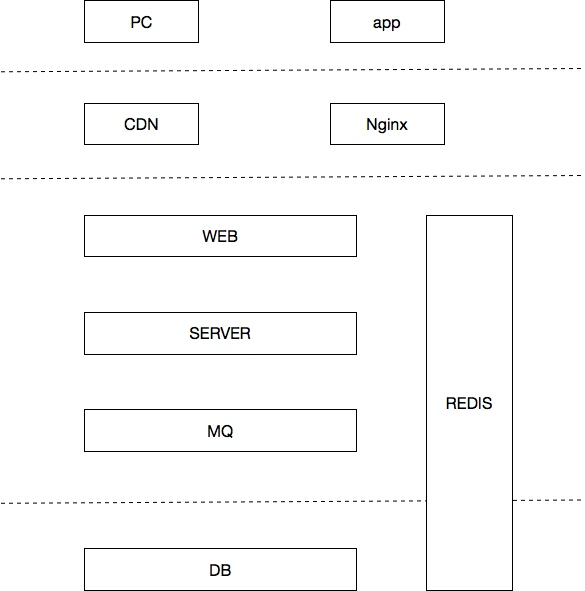
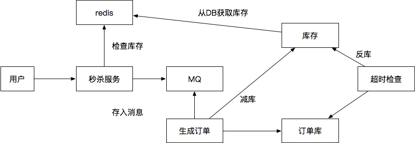

秒杀课件01


[TOC]

## 课堂主题
如何设计搭建秒杀系统
## 课堂目标
搞清楚秒杀的关键问题所在，有哪些解决办法。
## 知识要点
架构设计原理
如何最大程度分流减压
如何抵挡突发大流量
根据业务场景适当的时间减库
做好防刷设置
系统的伸缩，监控

### 什么是秒杀 （1分钟）

一个时间点开始，大批用户对少量的商品开始抢购；往往是价格会低很多，或者供货很少，秒级时间内就能抢购完

例如：一元秒杀，小米手机抢购



或者一定时间段内，对优惠的商品进行抢购，这种压力相对没有第一种那种大，更贴切的叫优惠促销


### 为什么要有秒杀（2分钟）

商家为了吸引顾客，让出一部分利益给秒杀商品，得到更多关注为以后卖出跟多的商品做铺垫。

或者就是像小米那样恶意炒作，如果放开了买大家都观望，一旦说就数量有限不买就没有了，大家就都回去抢，当然得把握这个度。

### 我们要怎么去做（120分钟）

秒杀时间点一到，流量会迅速暴增，可能是平时的几十倍上百倍，我们应该如何应对如此大的流量。

我们如何让这么多流量对一份库存做出正确操作，而不会产生超卖，少买以及防止黑客刷单 

####业务分析（10分钟）
首先秒杀需要有的功能模块有

* 商品展示
商品信息查询，商品图片展示

* 用户验证
用户信息验证，商品限制验证（商品语言，用户等级限制等）

* 订单
用户下单，创建订单，减库，订单更新

* 库存
库存同步，分布式系统中一致性保证

* 支付
订单支付，支付信息核对

###架构设计（40分钟）

为了能够抵挡如此高的并发有几点我们必须去做

####流量预估（5分钟）
首先在秒杀前我们需对流量做一定的预估，知己知彼先预估下敌人有多少，然后我们怎么对抗，方案有一下几种

* 预约抢购
要抢购就需要提前的预约，然后根据预约的数量做一定的百分比判断。
比如10万人预约，并发最高预估就是10万，也有很多人预约了不来，这就要根据商品的关注度去预估下百分比，为了更准确的预估，可以在开始前做短信或者消息推送，打开链接的参与度会高一下。

* 页面统计
真正的访问量是在开始前来到页面的人数，统计抢购页面实时的浏览人数
user view。

* 历史数据
之前的秒杀有多少流量，大致和现在有什么区别；
例如：都是手机，上次小米6这次小米8，流量差距不会特别大。

* 宣传力度
* 产品定位
* 等等。。。。。

####限流（10分钟）

并发大了我们不能让他们来多少就接受多少，得根据我们的承受能力去做承受
#####前端限流

* 验证码
用户点击抢购前需要输入验证码

* 回答问题
比验证码的安全级别更高，基本上能防住黑客攻击，恶意刷单

* 随机访问到服务器
这样有点暗箱的意思，但是很多为了限制流量都这么做；就是用户端显示的抢购了，但是会根据生产的随机数确定要不要请求到后台，比如随机生产0到10 ，只有1可以访问后台，一下流量就缩小了10倍

#####服务端

* Nginx限流
帐号、IP、系统调用逻辑等在Nginx层面做限流

* 容器
tomcat，jetty

* 业务限流
有一些限流算法，令牌桶，漏桶，计算等等
 * 令牌桶



 * 漏桶



 * 令牌桶和漏桶对比：    
1.令牌桶是按照固定速率往桶中添加令牌，请求是否被处理需要看桶中令牌是否足够，当令牌数减为零时则拒绝新的请求；    
2.漏桶则是按照常量固定速率流出请求，流入请求速率任意，当流入的请求数累积到漏桶容量时，则新流入的请求被拒绝；   
3.令牌桶限制的是平均流入速率（允许突发请求，只要有令牌就可以处理，支持一次拿3个令牌，4个令牌），并允许一定程度突发流量；   
4.漏桶限制的是常量流出速率（即流出速率是一个固定常量值，比如都是1的速率流出，而不能一次是1，下次又是2），从而平滑突发流入速率；   
5.令牌桶允许一定程度的突发，而漏桶主要目的是平滑流入速率；    
6.两个算法实现可以一样，但是方向是相反的，对于相同的参数得到的限流效果是一样的。


####快速处理返回（10分钟）

前边流量做限制了，还是会有很大的流量到我们服务器，我们就需要想法做好承受这些请求的能力。要多处理数据我们就需要处理的快。



* 请求数据的少
数据少了传输压力就下，虽然http 都以块切割，但是尽量减少数据，块少一点，随后解析参数，序列化的时候也会更快一下，如果一个请求处理时间是100毫秒，能提升10毫秒就能增加处理百分之的请求。

* 减少耦合
对我们请求的数据减少和外部的耦合，
比如我们要秒杀的商品不能试用优惠劵或积分，如果使用优惠劵或积分我们还需要对优惠劵积分系统耦合，耦合多了会拖累我们的服务。

* 减少依赖
减少对外部数据的依赖，比如用户必要的验证信息，需要和库的比对，我们就先缓存到我们的服务中，比如库存信息需要去库里去等等。

* 减少请求时间快速返回
快速处理完信息返回给请求端信息，不能让整个流程都完成了再返回，那样请求的占用时间太长了，我们需要快速的返回，为我们更多处理请求，和让更多的请求进来

####服务稳定性（10分钟）

* 集群部署
集群部署服务，多个服务来抗压；
这个时候绝对不能出现有任何的依赖服务是单点，风险太大，一点挂掉可能会影响其他服务。

* 备用节点预留
都做成无状态的服务，服务之间做好负载，预留增加服务器；
除了必要的节点不做单点之外，由于我们的并发请求量大，需要事先做好备用的节点，例如我们现在无状态秒杀服务，开始有10台机器预估承受10w并发请求，请求突然多了，或者我们的请求处理慢了无法及时解决，就需要提前预留个三五台甚至更多的机器做准备。

* 服务等级
也许我们不需要完全去准备空的机器，做好服务的等级的划分，当压力过大时停掉级别低的服务，省出来的空间带宽等到我们当前服务。
例如：双十一当天的订单无法取消，快递信息也无法查看

* 开发维护/模块划分
我们要把秒杀业务当初单独的服务来做，这样方便后期优化

####总结（5分钟）

不同的服务方式在不通的情况下适用场景，没有什么架构就肯定是好的，需要在适合的场景下运用合适的架构。
我们秒杀做成这样，不一定就适合所有的业务场景，有的时候业务流量是稳健的增加，我们就不一定用这种架构

### 小结1
架构设计讲完之后
了解秒杀过程大致解决方法;
回忆吸收下刚刚讲解的内容，看看能不能解决问题。

#### 课堂练习1
#####寻找问题
讨论下秒杀还有那些问题点困扰着我们
#####寻找难点
哪些点我们知道但是很难解决；
例如12306永远都是不好抢票，网站经常会出现剩余票的错误信息

###难点和解决方向（70分钟）

####动静分离（15分钟）

首先当抢购时间临近的时候用户习惯性的会不断的去刷新页面，因为之前老的秒杀结构都是刷新页面后开始抢购的，现在可以直接通过点击按钮。

解决这种问题就最简单做法就是动静分离；让用户在抢购前访问的都是静态数据

* 动态数据
每个用户请求的内容都不定制不一样的，会根据用户的信息做一系列处理。
例如：购物车，订单查询，个人资料等等

* 静态数据
静态数据就是每个人无论谁查看都是一样的东西；当然不仅仅是html或者图片，有些页面是根据后台信息生成出来的，但是一定时间内给用户展示是不会修改的。
例如：商品信息，图片，新闻等等

* 方案
我们要做的是把静态数据缓存，可以用的方案有
 * 用户的缓存
 可以把图片等信息直接放在客户端或浏览器上，html也可以缓存，然后我们通过后台或者前台，或者定时的控制更新
  
 * CDN
 把静态信息缓存到离用户近的CDN节点用
 
 * 连接缓存
 直接http的连接进行缓存，由代理服务器，直接根据请求的url和参数进行判断，然后返回给消息主体。
 
 最常见的mysql的缓存，同意的sql短时间重复查询结果是一样的，我们可以再web层做类似的缓存。
 
 * 服务端
 可能有些信息不完全是没个用户都一样，但是这些信息又有一定特征，我们就可以缓存到自己的服务器中当做静态资源。
 例如：用户信息，或者一些关系对照等
服务器端的我们选择就多了，可以用mc redis 或者本地cache缓存，也可以在无状态的机器上直接使用静态变量都可以的。

 * 连接跳转中间件
 Nginx、Apache 等

* 优化点
上边讲了一些应用方式，我们来讲下实际如何应用
 * URL
 URL统一成一定格式，并且要有唯一性，确保url能精确的指向缓存，我们就可以通过url来生成管理缓存。
 * 对用户相关做分离
 如果一部分用户需要动态，一部分需要静态，就需要做好区分，在访问时直接让他们对静态资源做请求
 例如，未登陆的用户不需要显示在页面上积分等信息
 
####主服务体/热点（15分钟）

我们现在要做的是服务的主体，就是处理秒杀任务的服务，这个服务的当前服务的核心点。

对应核心服务，我们需要确定那个请求访问量大，然后在上边做好优化。

对秒杀来说我们的热点数据是减库，生成订单。

* 对业务的隔离
刚才我们也讲到了，我们需要把这块业务隔离出来
 * 专注模块
 专注自己的模块业务，减少服务的其他负担；
 对需要维护缓存配置等服务和主服务分开，
 例如：服务和定时任务不要放到一起。
 * 版本迭代
 首先版本迭代的时候不会受到其他功能的影响
 * 服务部署
 服务在部署时，负载时不受其他的服务影响；在部署时也要跟其他服务隔离，防止内存cpu等资源受到其他程序的影响

* 数据隔离 
对应服务使用到的数据信息，我们要事先封装好，放到缓存当中去，决不能直接去访问数据库。首先访问满，再者访问数据库又会增加一层压力判断，如果数据库链接出现问题，出现死锁等等


####流量消峰（15分钟）

即便我们做了一系列的优化方案，但是对服务端来说还是会出现一定的峰值。我们需要对这些这个大流量做消峰，就是把流量尽量消减，把大流量平铺处理。

例如：我们的服务QPS最高是1w，前几秒过来的都是两三万，后边都是五六千递减状态。我们每秒1w QPS，10秒就是10w，而服务前两秒接受到了6w，我们的服务肯定应付不过来会死掉，但是后8秒只有3w，如果我们把流量铺开很容易解决这个问题。

一下是几种消峰方案

* 队列处理
用消息队列做缓存区，然后从缓冲区去想下一个服务；其实就类似于java线程池的工作原理，前边有Q存储信息后边有线程从Q那出信息处理

请求进来后我们可以放入队列，然后异步的去做下一步操作；每当有程序逻辑需要两个阶段时我们都可以在中间加入队列，但是要选择适当的时机。

* 答题/验证码
这个环节是为了让用户不在同一时间点内访问，每个人的答题或者输入验证码的时间都不是一致的，这样我们就可以流量相对铺开。
这个时候就需要添加验证码或题库系统来支撑。

* 分层过滤
如果流量实在是太大，用户访问的数据是我们可以在请求时采取随机接受请求的情况，可以在多个层对请求做分流或者是拒绝请求。




####服务优化（10分钟）
简单带过聊一下，具体的太多
* 传输协议
http,tcp;nio,netty
* 传输序列化
kryo,hession,protostuff和protobuf
* 编码优化
方法调用，对象使用，方法内逃逸
* 缓存使用
redis/mc，本地cache
* 并发控制
分布式锁，内部java的多线程
* jvm调优
参数调优，回收器设置等等

####减库存问题（15分钟）
减库存的时机我们需要把握好
* 下单减
用户抢购后就是等于下单，这个时候减库存，然后将库存直接分配给用户。
 * 问题：不付款
 如果用户不付款，一定时间后撤销；这种请求的问题是会造成恶意抢单的，让很多人当时抢不到，但是自己又不付款。
 * 解决方法1
 可以把秒杀的付款时间缩短，或者预付定金能稍微缓解下这种压力。
 * 解决方法2
 随机分配给请求是否抢购成功，随机分配库存。
 
* 付款减
用户付款后减库存。
 * 问题
 这个时候如果付款不付不了，会出现库存不够，在付款前用户不是真正的抢到了商品。高压力的情况下支付系统会很慢，因为支付系统需要验证太多的东西
 * 解决方法
对支付环节做优化，当用户提交支付后暂时锁库，然后我们去调支付系统，成功了返回，因为锁定了一定时间可以让用户再次支付。
 
* 减库方式
减库无论在哪个时间点都会出现问题，我们要吧减库的方式做好以减少必要或者可能的锁库时间。
用队列，或者缓存去减库。


###实践（60到90分钟）

根据我们上边讲述的内容，我们搭建一套秒杀服务；
####框架架构（3到5分钟）



####程序逻辑（5到10分钟）


* 用户请求到秒杀服务
* 秒杀服务去redis检查库存
* redis库存由库存表通过来的
* 有库存存入MQ
* 生成订单的服务去MQ消费
* 生成订单到订单表
* 去DB中做真实减库
* 订单如果没有支付，有超时服务去订单表检查
* 如果超时反库
* 反库会同步到redis中去


####静态资源（5分钟）
#####页面
缓存静态页面到CDN，我们演示直接用Nginx映射html
#####js
用js对页面请求限制
1. 限制访问时间点，到点后才可以抢购
2. 限制访问频率，一秒只能请求一次
3. 重复提交，请求回来前不能再次提交
4. 秒杀开始标识，动态获取

####服务逻辑（5分钟）
#####分流/负载
前边用Nginx做好分流限制
#####访问限制
1. 定时打开请求
2. 通过js通知前端可以接受请求
3. 同ip，同用户请求处理次数限制

#####减库存
1. 通过redis对库存做操作，成功后返回抢购成功；
2. 写入消息队列

#####生成订单
对订单支付信息、用户信息、优惠信息等做验证
生成订单，对DB做操作

####实现
我们根据刚才的逻辑实现以下

#####环境（5到10分钟，讲过就不要安装了）
* 安装Nginx
* 安装activeMQ/rabbitmq
* 安装Redis

#####代码
######前端代码（10分钟）

######后端代码（30到50分钟）
* Controller（10分钟）

 * 令牌桶算法
 RateLimiter类可以实现
  ```java
 RateLimiter rateLimiter = RateLimiter.create(10);
 ```
 
 * 超卖判断
 我们在本地缓存中加入一层记录，记录商品是否卖完了，这样超卖后我们会减少到redis的访问流量
  ```java
 RateLimiter rateLimiter = RateLimiter.create(10);
 ```
 * 初步减库
 减去redis 的库存
```java
 long stock = redisService.decr(GoodsKey.getGoodsStock, "" + goodsId);
 ```
 
 * 重复验证
 redis里记录一层
 ```java
 long stock = redisService.decr(GoodsKey.getGoodsStock, "" + goodsId);
 ```
 
 * 放入队列
 ```java
sender.sendSeckillMessage(message);
 ```
 
* Q消费（10分钟）
 
 * 效验库存
 我们刚才效验的redis里的库存，这个时候需要验证库里的库存
 ```java
int stock = goodsVo.getStockCount();
 ```
 
 * 重复判断
 插入前我们已经判断了一次，但是我们的一致性没有严格要求，为了更保险在操作库的时候再验证一次
 ```java
//判断重复秒杀
        SeckillOrder order = orderService.getOrderByUserIdGoodsId(user.getId(), goodsId);
 ```
 * 减库，生成订单
 真正的对数据库做减库，同时删除订单，两个操作要写在一个事务里。
  ```java
   @Transactional
    public OrderInfo seckill(User user, GoodsVo goods){
        /**
         * 数据库真实减库存
         */
        boolean success = goodsService.reduceStock(goods);
        if (success){
            /**
             * 生成订单
             * 里边的两步，订单主表和秒杀表也需要事务
             */
            return orderService.createOrder(user, goods);
        }else {
            setGoodsOver(goods.getId());
            return null;
        }
    }
```
 
* 状态维护（5分钟）
最简单我们的库存需要去维护
 * 库存维护
 我们就直接用spring boot 的继承implements InitializingBean 
 实现afterPropertiesSet方法来实现。
 
```java
  /**
     * 系统初始化
     * 将商品信息加载到redis和本地内存
     */
    @Override
    public void afterPropertiesSet() {
        List<GoodsVo> goodsVoList = goodsService.listGoodsVo();
        if (goodsVoList == null) {
            return;
        }
        for (GoodsVo goods : goodsVoList) {
            redisService.set(GoodsKey.getGoodsStock, "" + goods.getId(), goods.getStockCount());
            /**
             * 初始化商品状态
             */localOverMap.put(goods.getId(), false);
        }
    }
```
* 结果获取（5分钟）
 用户端通过用户id 和商品id来查询是否处理成功
 
 ```java
  /**
     * orderId：成功
     * -1：秒杀失败
     * 0： 排队中
     * 
     * 获取秒杀结果
     */
    @RequestMapping(value = "/result", method = RequestMethod.GET)
    @ResponseBody
    public Result<Long> seckillResult(Model model, User user,
                                      @RequestParam("goodsId") long goodsId) {
        model.addAttribute("user", user);
        if (user == null) {
            return Result.error(CodeMsg.SESSION_ERROR);
        }
        long orderId = seckillService.getSeckillResult(user.getId(), goodsId);
        return Result.success(orderId);
    }
 ```
 


###演示和压测（30分钟）
####运行结果演示（5到10分钟）
把项目跑起来演示一下
####监控工具jprofiler

####压测jmeater（10到20分钟）


## 拓展点、未来计划、行业趋势

之前的秒杀和现在的秒杀设计上已经都有很大的改观；很少出现那种对单一商品的秒杀，价格上优惠也没有那多了。

首先这种根据时间点的秒杀对自己服务处理起来问题特别多，再者了解业务的黑客竞争对手越来越多，还有用户的观念目前提升了。

秒杀的终极体现是，12306 抢票。


## 总结

讲述了什么是秒杀以及秒杀的问题解决方案，希望大家能够对秒杀有更充分的认识，秒杀并不难只是要一个点一个点慢慢做好就能解决问题。

## 作业
自己设计一套适当的架构，画图或者代码dome的形式写一个秒杀案例。
分析下12306当中都优化了哪些功能点来抗压，以及12306的主要问题。