# 第四章 草稿

## 课堂主题

静态资源和CDN

## 课堂目标

了解静态资源
了解CDN

## 知识要点

### 服务请求

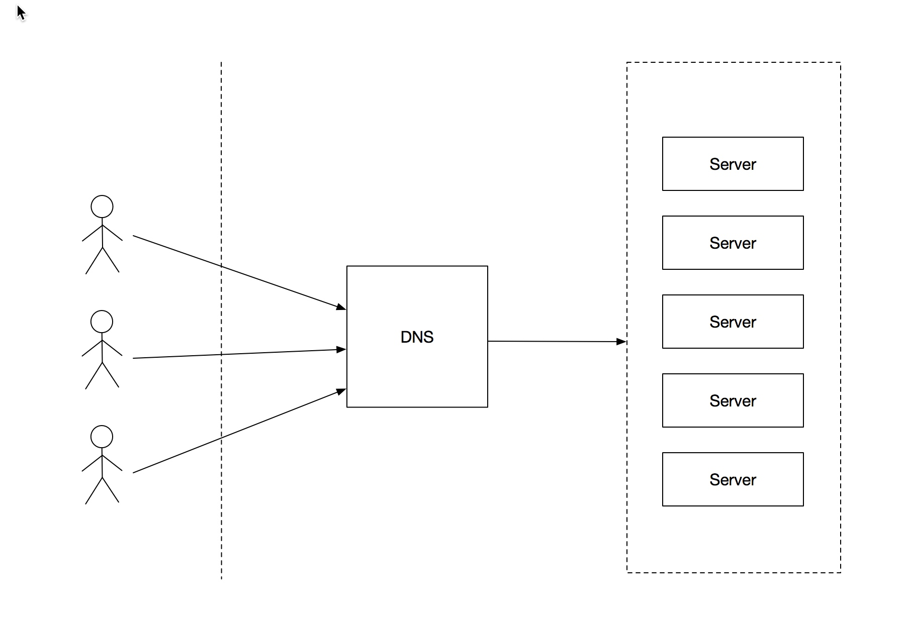

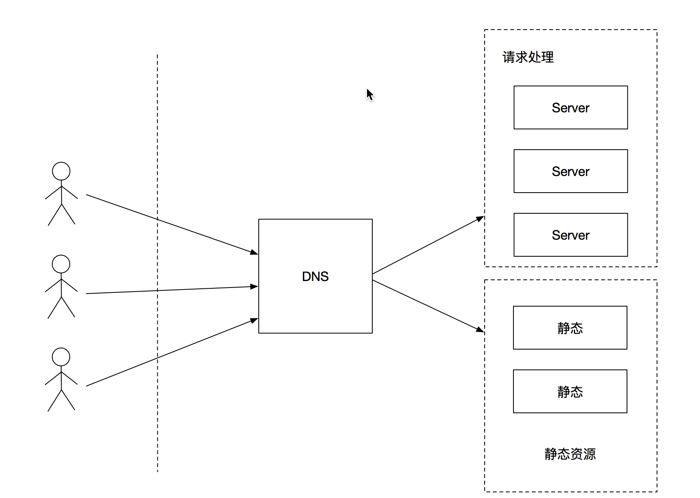

我们上一章讲解了DNS 解析，通过域名解析IP地址到我们的服务器；
我们现在往下一步走，请求到了我们的服务器。

我们将一个场景

从我们开发的角度看，我们服务的压力承受不住了，最简单办法，需要对一些请求做分流；
这个时候我们把请求分为两类,我们看一下network
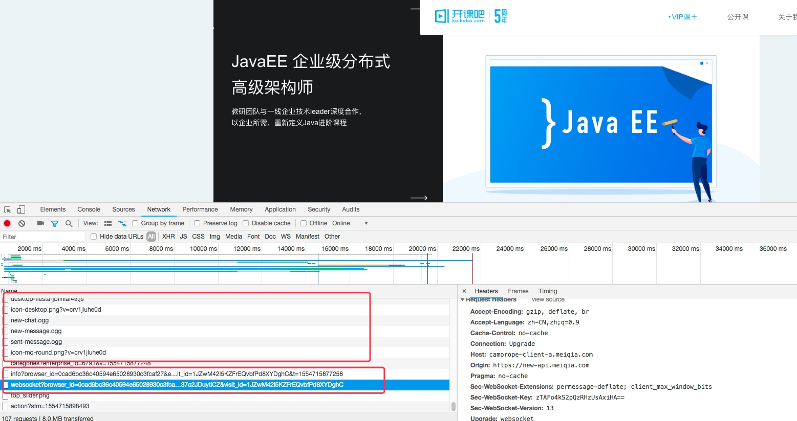 

这个时候就分出来了一些类别， 图片和数据请求；

看一下左边返回内容的信息，无论谁请求图片都是一样的吧，登录请求就不一样了，每次返回sessionId 什么的都不一样。

这样我们是不是可以把

服务减压方式--静态资源

### 为什么要有静态资源

什么是静态资源

### 分布式架构中静态资源都有哪些构成

静态资源定义
一次写入永久读取的资源
淘宝商品图片
微信语音
微信视频
前端文件
CSS、JS、HTML等
特点
静态资源一次写入，不再修改（Update等操作）
可以删除（把静态资源Delete掉）

### 分布式架构中静态资源构成
前端（Web端、App）静态资源
CSS样式文件
JavaScript脚本文件
HTML静态文件
配置项
前端页面缓存生效时间、和服务器连接超时、读写超时时间

客户端需要展示的富媒体数据
图片
商品的图片、用户头像、朋友圈图片等
.jpg、.jpeg、.gif、.png、.bmp等格式
语音
微信语音、QQ语音等
.amr、.wav、.FLAC、.APE、.ALAC、.WavPack等格式
视频
微信短视频、朋友圈视频
.mpeg4、.rm、.rmvb、.avi、.dat、.amv等格式
流媒体
直播实时视频数据流
.m3uf8（HLS协议）、.flv（RTMP协议）等格式

### 分布式架构中静态存储系统选型

上述静态资源特点
用户访问分散在全国各地，用户请求不聚焦
资源大小不均衡
一个资源项小到几个f字节，大到几个GB		
用户对资源请求的响应延迟要求较低
技术如何选型
传统的Redis等缓存技术无法满足
资源大小超过缓存项大小
缓存服务部署在同一IDC机房内，无法满足全国各地用户请求对响应较低延迟的需求
CDN技术
很好地满足上述静态资源的存储需求	

### CDN系统是什么？应用场景有哪些

CDN系统
CDN(Content Delivery Network)内容分发网络，对静态资源进行缓存，并将内容从CDN传输到用户端，从而加速网站访问速度；
使用CDN会极大地简化系统维护工作量，网站管理人员只需将网站内容注入CDN的系统，通过CDN部署在各个物理位置的服务器进行全网分发，就可以实现跨运营商、跨地域的用户覆盖。由于CDN将内容推送到网络边缘，大量的用户访问被分散在网络边缘，不再构成网站出口、互联互通点的资源挤占，也不再需要跨越长距离IP路由通信，从而极大提升用户体验。

### CDN系统部署前后对比（如图）
CDN部署前请求流程
①用户在自己的浏览器中输入要访问的网站域名（www.web.com）。
②浏览器向本地DNS服务器（Local DNS）请求对该域名的解析。
③本地DNS服务器中如果缓存有这个域名的解析结果，则直接响应用户的解析请求。
④本地DNS服务器中如果没有关于这个域名的解析结果的缓存，则以递归或迭代方式向整个DNS系统请求解析，获得应答后将结果反馈给浏览器。
⑤浏览器得到域名解析结果，就是该域名相应的服务设备的IP地址。
⑥浏览器向服务器请求内容。
⑦服务器将用户请求内容传送给浏览器。
CDN部署后请求流程
①用户在自己的浏览器中输入要访问的网站域名（www.web.com）。
②浏览器向本地DNS服务器（Local DNS）请求对该域名的解析CName CDN地址。
③浏览器访问CDN的CName域名服务请求，获取最优的CDN边缘节点IP返回给用户
④用户从返回的嘴用CDN边缘节点IP获取到对应的静态资源

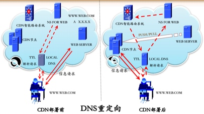

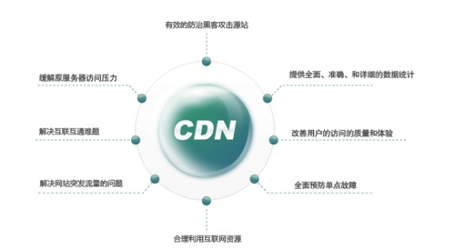

### 应用场景
场景一：一个企业的网站服务器在北京，运营商是联通，在广东的电信用户访问企业网站时，因为跨地区，跨运营商的原因，网站打开速度就会比北京当地的联通客户访问速度慢很多，很容易造成这个企业的客户流失；
场景二：热点、重大事件带来的流量突发问题网站上展示的某种最新产品吸引了很多人的关注热点事件、体育赛事的网络视频直播，电商网站热点产品促销活动(比如双十一时的淘宝天猫京东等)
场景三：一些中小企业租用的虚拟主机，因为和好几个网站共用一台服务器，每个网站所分带宽有限，带宽过小经常导致流量稍微一多，网站打开速度就很慢，甚至打不开。
场景四：……

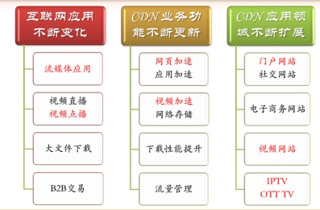

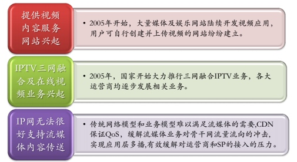

CDN应用场景
App端静态对象的加速与发布
网址尽量动态内容静态化
页面、脚本等
静态内容、动态内容分离
静态图片、视频、音频等
动态数据等

CDN应用场景
APP端静态数据
页面
htm、html、shtml等格式
图片
jpg、gif、png等格式
流媒体
mp3、flv、wmv、3gp等格式
样式脚本
css、js、xml等格式

CDN典型技术架构剖析

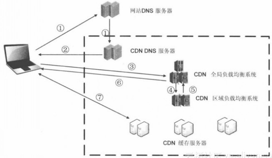
CDN典型技术架构
最简单的CDN网络由一个DNS服务器和几台缓存服务器组成（如图）：
①当用户点击网站页面上的内容URL，经过本地DNS系统解析，DNS系统会最终将域名的解析权交给CNAME指向的CDN专用DNS服务器。
②CDN的DNS服务器将CDN的全局负载均衡设备IP地址返回用户。
③用户向CDN的全局负载均衡设备发起内容URL访问请求。
④CDN全局负载均衡设备根据用户IP地址，以及用户请求的内容URL，选择一台用户所属区域的区域负载均衡设备，告诉用户向这台设备发起请求。
⑤区域负载均衡设备会为用户选择一台合适的缓存服务器提供服务，选择的依据包括：根据用户IP地址，判断哪一台服务器距用户最近；根据用户所请求的URL中携带的内容名称，判断哪一台服务器上有用户所需内容；查询各个服务器当前的负载情况，判断哪一台服务器尚有服务能力。基于以上这些条件的综合分析之后，区域负载均衡设备会向全局负载均衡设备返回一台缓存服务器的IP地址。
⑥全局负载均衡设备把服务器的IP地址返回给用户。
⑦用户向缓存服务器发起请求，缓存服务器响应用户请求，将用户所需内容传送到用户终端。如果这台缓存服务器上并没有用户想要的内容，而区域均衡设备依然将它分配给了用户，那么这台服务器就要向它的上一级缓存服务器请求内容，直至追溯到网站的源服务器将内容拉到本地。

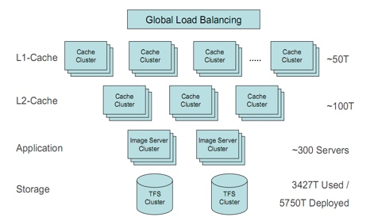

### CDN部署架构（淘宝早期CDN分级）
一级缓存（成本高、缓存量小）
满足最热资源缓存
二级缓存（成本中等，缓存量较大）
满足大多数资源缓存
持久化存储（成本低，存储量巨大）
所有资源的持久化

CDN典型技术架构关键技术点
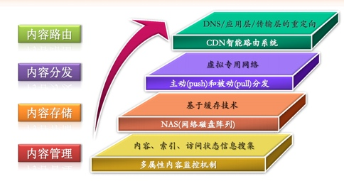

### CDN典型技术架构关键技术点

内容路由技术
CDN负载均衡系统实现CDN的内容路由功能
将用户的请求分配到CDN中的最佳节点
两个层次
全局负载均衡系统（GSLB）Global Server Load Balance
区域负载均衡系统（LLB）Localtion Load Balance
实现方法
DNS
应用层重定向
传输层重定向

### 内容分发技术

源内容到CDN节点的Cache过程
将内容数据发布到距离用户最近的边缘服务器中
主流内容分发实现方式
PUSH
主动分发
内容管理系统发起
将内容从源存储系统分发到CDN的Cache节点
PULL
被动分发技术
用户请求驱动
用户请求内容CDN中miss，从源存储系统中或者其他CDN节点中实时获取内容

### 内容存储技术

源内容存储（回源那节详细展开介绍）
内容存储规模较大
分布式存储文件系统
MFS
FastDFS
Ceph
CDN节点存储
存储介质
PCIe SSD
功能和性能
内容格式支持
缓存命中率高
可靠性
稳定性

内容管理技术
内容进入CDN Cache点后的内容管理，即本地内容管理
主要目标是提高内容服务的效率，提高本地节点的存储利用率。
主要包括如下三个方面
本地内容索引
本地内容拷贝
本地内容访问状态信息收集

### 市面上CDN技术层面考查对比点（见备注里参考）
拥有 DNS 优化策略的 CDN 提供商，会有更好的用户体验
CDN内部独立DNS域名系统
HttpDSN解析
Http 302跳转
拥有自治系统(Autonomous system, AS)的 CDN 提供商，数据包跨越最少的网络边界，能获得更快的传输速度
CDN用于独立AS自治系统，从而大大提升数据传输效率
CDN 服务商所在自治系统 AS 的相邻 AS 越多，离运营商骨干网越近，数据传输也会更有优势
拥有运营商AS的数量，数据越多，传输速度越快
市面上CDN产品层面考查对比点
CDN速度更快
CDN功能更全
CDN付费最划算

市面上CDN产品层面考查对比点
CDN速度更快（对比Top 10的CDN产品服务提供商）
第一梯队
阿里云、腾讯云、百度云、网宿科技支持HttpDNS在技术上领先优势明显，
第二梯队
蓝讯、Ucloud 、网易云。它们所在 AS 和两个以上运营商主干网 AS 相邻，也具有一定优势
第三梯队
金山云、七牛云、京东云

市面上CDN产品层面考查对比点
CDN功能更全（对比Top 10的CDN产品服务提供商）
对比维度：HTTP2.0加速、文件压缩、源站推送、点播加速、直播加速、实时监控、原始日志、防盗链、IP黑白名单、OCSP装订、SNI
腾讯云和网宿科技得分最高，其它厂商各有优劣。 9 分以上的厂商占了前 50%，分别是腾讯云、网宿科技、阿里云、百度云、蓝汛。后 50% 的厂商分数在 8-7 分之间。（如图）

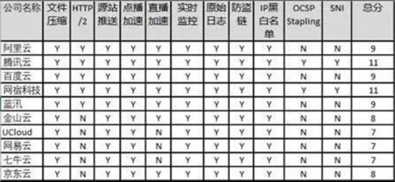

市面上CDN产品层面考查对比点
CDN付费最划算（对比Top 10的CDN产品服务提供商）

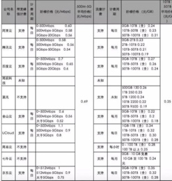

市面上CDN产品层面考查对比点
综合对比（对比Top 10的CDN产品服务提供商），对比维度如下：
速度评分中，第一梯队记 3 分，以此类推第二梯队 2 分，第三梯队 1 分；
功能评分中，大于 9 分的 CDN 服务商得 1 分，其他不得分；
价格评分中，峰值带宽计费 500M-5G 带宽低于平均市场价格 0.69 元的 CDN 服务商得 1 分，流量计费低于 0.25 元 /G 的得 1 分。
结果总结（如图）
阿里云和腾讯云 6 分并列第一，在 CDN 服务上优势明显；
百度，网宿科技，蓝讯都是 4 分并列第二，百度价格有优势，网宿科技在访问速度上有势，蓝讯各方面比较平均；
金山云列第三。其他 CDN 服务商得分小于 3 分，不到总分（6 分）的 50%，在 CDN 行业的竞争中处于劣势。
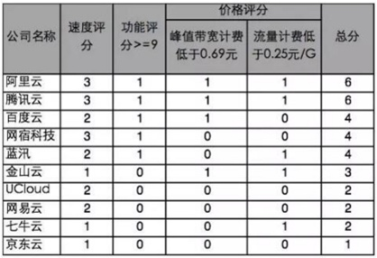

市面上CDN产品选型建议
阿里云、腾讯云、百度云选择其一即可

### CDN系统发展进程

CDN最早源于代理服务器、服务器集群技术

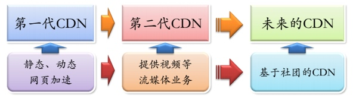

国内使用情况
大型网站
自建CDN
BAT、京东等
中小型网站
第三方合作
蓝X、网X、世纪XX等
小网站
不使用CDN

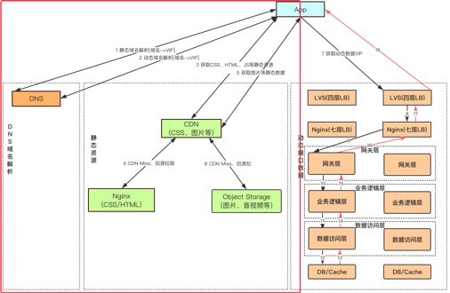

CDN系统数据回源是怎么回事

CDN系统回源定义
回源域名一般是CDN领域的专业术语
当有用户访问某一个URL资源（比如：c.kkbcdn.com.cn/static/pics/kkb.jpg）的时候，如果被解析到的那个CDN节点没有缓存响应的内容，或者是缓存已经到期，就会回源站去获取。如果没有人访问，那么CDN节点不会主动去源站拿的；
通常情况下，回源是直接用IP进行回源的，但是如果客户源站有多个IP，并且IP地址会经常变化，对于CDN厂商来说，为了避免经常更改配置（回源IP），会采用回源域名方式进行回源，这样即使源站的IP变化了，也不影响原有的配置；
CDN目的是进行网站访问加速的，但是有时会因为不合适的回源策略会让用户的访问速度变慢，同时给源站服务器带来负担，只有保证CDN资源的请求命中率，才能给网站的访问带来更高的访问效率；
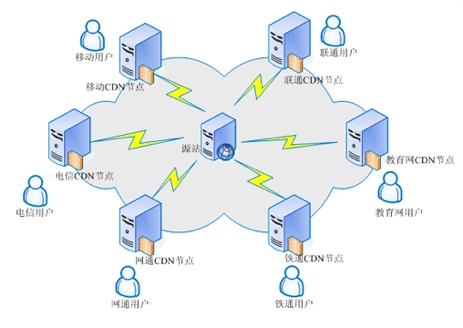

CDN回源率计算方法
回源比分为回源请求数比例及回源流量比例两种：
回源请求数比：
统计数据来自所有边缘节点上的请求记录，其中，对于没有缓存或缓存过期的请求以及不可缓存的请求，均计入回源请求中，其他直接命中缓存的，则为命中请求。
回源请求数比 = 回源请求数 ／ （回源请求数 + 命中请求数）

回源流量比：
回源流量是回源请求文件大小产生的流量和所有请求本身产生的流量的比。
 回源流量比=回源流量／用户请求访问的所有流量
 
 
 分布式架构中源存储系统如何选型

源存储系统技术选型
源存储系统用于对静态资源的海量存储，当用户请求CDN资源未命中时，从源存储系统获取到缺失的资源；
源存储系统是二进制数据的存储（图片、音视频、Word／Excel／PPT等格式文件、CSS／JS／HTML等文件），在技术选型层面重点考虑支持二进制数据的开源存储系统
MooseFS
FastDFS
Ceph
......
对绝大数公司来说，MooseFS足以满足静态资源的存储需求，并且MooseFS系统运维极其简单
如果公司有更海量的存储需求（比如P级别+），并且运维技术能力强，可以选用FastDFS或者Ceph
本文基于MooseFS的搭建来讲述源存储系统

源存储系统基于MooseFS搭建（如图）
请求回源
四台Nginx作为一个Nginx集群对外提供静态资源的访问入口
静态资源存放，采用MooseFS文件分布式系统存储
上传静态资源
各业务线通过FTP方式上传静态资源到MooseFS分布式存储系统中
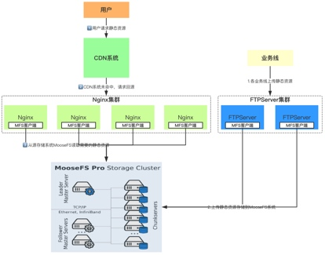

源存储系统基于MooseFS搭建架构解析
Nginx集群
CDN回源请求的入口，提供HTTP请求格式
同时作为反向代理，请求MooseFS存储系统
一共四台，部署无状态化，提供高可用的服务入口
MooseFS集群
静态资源实际存储的分布式集群（如图）
元数据服务器（Master Server）：负责管理文件系统，维护元数据
至少一台，一般部署3台，一台为Leader Master Server，另外2台为Follower Master Server
元数据日志服务器（MetaLogger）：备份Master服务器的变化日志文件；
至少部署一台
数据存储服务器（ Chunk Server）：真正存储数据的服务器；
至少部署3台
客户端（Client）可像挂载NFS一样挂载MFS文件系统

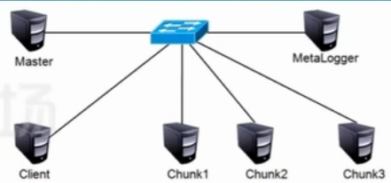

源存储系统基于MooseFS搭建架构解析
FTP
FTP Client
用于业务线上传静态资源文件的FTP客户端
FTP Server
用于业务线上传静态资源文件的FTP服务端

源存储系统基于MooseFS搭建架构解析
FTP
FTP Client
用于业务线上传静态资源文件的FTP客户端
FTP Server
用于业务线上传静态资源文件的FTP服务端

源存储系统基于MooseFS搭建架（动手搭建）
Linux环境下搭建源存储系统
Nginx版本选择
Nginx-1.14.2
https://github.com/nginx/nginx/tree/branches/stable-1.14
MooseFS版本选择
V3.0.100
https://github.com/moosefs/moosefs
FTP服务端选择
vsftpd
https://www.cnblogs.com/shenxiaolin/p/5723962.html

源存储系统基于MooseFS搭建架（动手搭建）
Linux环境下搭建源存储系统
部署要求（一共3台虚拟机Centos机器即可）
Nginx 1台
FTP Server 1台
MooseFS集群
Master Server 1台
Metalogger 1台
Chunkserver 3台
Client 1台（机器同Nginx和FTP Server）
安装参考
https://blog.51cto.com/13490688/2092672

CDN系统和源存储系统的数据一致性
CDN系统是源存储系统的缓存
保证源存储系统的资源数据和CDN缓存数据同步
当数据在源存储系统中“更新”，如何及时分发给CDN系统
数据分发方法
主动分发
CDN系统提供资源资源上传接口
当用户在源存储系统中上传了静态资源，实时通过CDN系统的上传接口上处资源
主动分发不存在数据一致性的问题
被动分发
静态资源在CDN系统缓存后，再通过回源的方式从源存储系统获取静态资源
数据不一致最长时间周期即CDN缓存时间
如何解决数据更新不及时的问题？！

CDN系统和源存储系统的数据一致性
被动分发
追求最终一致性
设置缓存项失效时间
CDN边缘节点缓存策略因服务商不同而不同，但一般都会遵循HTTP标准协议，通过HTTP响应头中的Cache-control: max-age的字段来设置CDN边缘节点数据缓存时间。
比如设置2个小时，最长2个小时缓存项自动过期
追求强一致性
设置数据不同版本号
kkb_1.jpg
kkb_2.jpg
通过c.kkbcdn.com.cn/static/pics/kkb_1.jpg URL从CDN系统中获取静态资源，当kkb_1.jpg图片被替换成新的图片后，如果继续采用kkb_1.jpg，就会造成CDN缓存数据的不能及时失效。通过把替换后的图片的版本号增加，变成kkb_2.jpg，从而客户端请求时能够第第一时间获取到最新的图片，此时访问的URL为c.kkbcdn.com.cn/static/pics/kkb_2.jpg ；
问题思考
客户端如何获取到变更后的图片名字，也就是如何及时获取到kkb_2.jpg

APP安装包快速获取
Apps分发
APP APK安装包放到源存储系统
当用户下载APP APK安装包时，CDN系统从源存储系统获取到APK安装包，并返回给用用户
用户量千万级别，如果同时从CDN下载APK安装包，就会把CDN带宽跑满，如何解决
错峰分发
客户端随机Random一段时间sleep（比如在6个小时内客户端让用户下载线程随机Sleep，保证用户下载的时间足够离散化），再进行请求APK安装包
保证了用户从CDN下载APK安装包的用户体验，同时也保证了CDN带宽不满

典型案例PC安装包如何快速获取
CDN分发需求
多种渠道PC安装包分发
几百个渠道
PC包的基本内容一样，需要区分渠道号
不同来源的渠道下载，需要区分开，便于统计分析
怎么办？
放到CDN上，版本号区分
下载静态页面一样，版本号区分

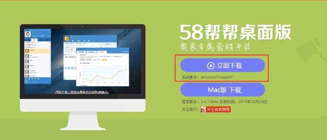

让学员能够快速使用CDN系统
一切尽在官网
https://cloud.tencent.com/document/product/228/3149
使用免费版本
快速入门
操作指南
API文档
……
功能要求
基于课上讲的Nginx、MooseFS、FTP搭建源存储系统
在腾讯免费的CDN上绑定s.kkbcdn.com.cn域名，并把回源的IP指向上述部署的Nginx的IP
通过ftp client上传kkb.jpg到源存储系统
用户通过访问c.kkbcdn.com.cn/static/kkb.jpg能够获取到静态图片资源

什么是CDN

CDN如何选型

#### What

#### Why

#### How

#### 课堂练习1
#### 课堂练习n
#### 小结1
#### 小结n

## 拓展点、未来计划、行业趋势

## 总结

## 作业

