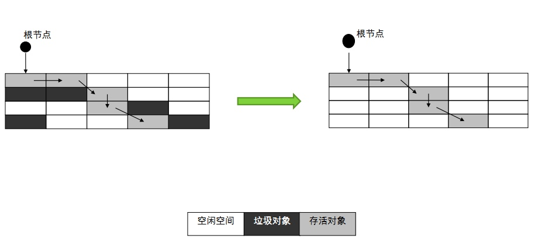
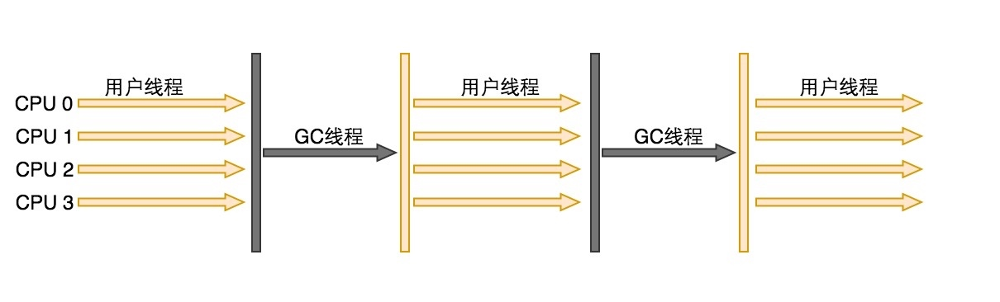

面试知识点
[TOC] 

# 简介

## 参考图书
### java
《实战Java虚拟机》、《Java高并发程序设计》葛一鸣，《码出高效Java开发手册》阿里出品，《Java性能调优指南》

### 架构

### 算法
《》


# 基础

## 数据结构算法

### 排序

### 数据结构
布隆过滤器，HyperLogLog


#### AVL/红黑树

红黑树的规则
AVL和红黑树的区别

#### hashMap/ConcurrentHashMap

##### 问题

hashMap数据结构
hashMap会有什么问题
环形链表如何形成
hashMap丢数据问题
ConcurrentHashMap如何实现线程安全
ConcurrentHashMap如何统计size，有没有什么高效的方法

##### 哈希冲突

* 开放地址
 * 线性探测再散列
dii=1，2，3，…，m-1
顺序查看表中下一单元，直到找出一个空单元或查遍全表
 * 二次探测再散列
 di=1²，-1²，2²，-2²，…，k²，-k²    ( k<=m/2 )
 冲突时前后找，先找后边1的平方，再找前边1的平方，没有就加1继续找
 * 伪随机探测再散列
 随机找一个hash值
* 再哈希
重新用其他的方式计算一遍hash，计算hash的方法好多种算法
* 链地址
hashMap
* 建立公共溢出区
把冲突的放到一个地方，统一用其他方案处理

##### 环形链表形成 


由于非线程安全在扩容的时候，多个线程操作引起：
hashMap在达到扩容因子的时候会扩容（length*0.75）；
扩大一倍，扩容时会重新计算在数组中得位置，
当第一个线程开始扩容的时候，读取了hash值对应链表顺序读取复制到新的hash位置的链头；原来的顺序是A、B，复制过去后的顺序就是B、A，对线程一来说A的next是null，B的next是A；
这时第二个线程进来，读取的可能就是A的next是B，这样就造成了环形链表死循环。


### 加密算法


### 算法题

深度广度遍历二叉树
倒排LinkedList
LRU算法，slab分配
算法开方求N位
开亮一百个灯
上电梯算法
页面淘汰算法

找出n多数中最小的几个数组


创建堆，然后小的元素替换堆里的元素
N*logK.


## JAVA基础 

### 常用框架

spring,AOP,IOC
BeanFactory和FactoryBean
所有的Bean都是由BeanFactory(也就是IOC容器)来进行管理的；FactoryBean而言，这个Bean不是简单的Bean，而是一个能生产或者修饰对象生成的工厂Bean,它的实现与设计模式中的工厂模式和修饰器模式类似 
spring事务
springMVC，mybatis
springBoot

### JDK改进项

#### 元空间
在JDK8之前的HotSpot实现中，类的元数据如方法数据、方法信息（字节码，栈和变量大小）、运行时常量池、已确定的符号引用和虚方法表等被保存在永久代中，32位默认永久代的大小为64M，64位默认为85M，可以通过参数-XX:MaxPermSize进行设置，一旦类的元数据超过了永久代大小，就会抛出OOM异常。

虚拟机团队在JDK8的HotSpot中，把永久代从Java堆中移除了，并把类的元数据直接保存在<font color=#FF0000>**本地内存区域（堆外内存）**</font> ，称之为元空间


### 并发
synchronized和volatile,lock
Concurrent包
Threadlocal作用与实现 
多线程
线程池工作原理
### jvm


分区，数据流转过程
老年代的对象中，有一小部分是因为在新生代回收时，老年代做担保，进来的对象；绝大部分对象是因为很多次GC都没有被回收掉而进入老年代。
参数优化
常用jvm命令
jvm监控
top, iostat, vmstat, sar, tcpdump, jvisualvm, jmap, jconsole
如何用Java分配一段连续的1G的内存空间

#### 构成


##### 类加载器子系统

###### 介绍

加载JAVA类，运行的时候（不是编译时），把类加载、链接、初始化

###### 加载

启动类加载器 (BootStrap class Loader)、扩展类加载器(Extension class Loader)和应用程序类加载器(Application class Loader) 这三种类加载器负责加载；
类加载器会遵循委托层次算法（Delegation Hierarchy Algorithm）加载类文件；

* 启动类加载器 (BootStrap class Loader)
从启动类路径中加载类（rt.jar）。这个加载器会被赋予最高优先级。
* 扩展类加载器 (Extension class Loader)
加载ext 目录(jre\lib)内的类
* 应用程序类加载器(Application class Loader)
加载应用程序级别类路径，涉及到路径的环境变量等etc

###### 链接

* 校验
字节码校验器会校验生成的字节码是否正确，如果校验失败，我们会得到校验错误。

* 准备
分配内存并初始化默认值给所有的静态变量。

* 解析
所有符号内存引用被方法区(Method Area)的原始引用所替代。

###### 初始化

所有的静态变量会被赋初始值, 并且静态块将被执行

##### 运行时数据区
!!!


###### 方法区（Method Area）
###### 堆（Heap Area）
###### 栈（Stack Area）
###### PC寄存器
###### 本地方法栈

###### Java8中MetaSpace


##### 执行引擎

###### 解释器!!

解释器能快速的解释字节码，但执行却很慢。 解释器的缺点就是,当一个方法被调用多次，每次都需要重新解释。
 
###### 编译器!!

JIT编译器消除了解释器的缺点。执行引擎利用解释器转换字节码，但如果是重复的代码则使用JIT编译器将全部字节码编译成本机代码。本机代码将直接用于重复的方法调用，这提高了系统的性能。

a. 中间代码生成器 – 生成中间代码
b. 代码优化器 – 负责优化上面生成的中间代码
c. 目标代码生成器 – 负责生成机器代码或本机代码
d.  探测器(Profiler) – 一个特殊的组件，负责寻找被多次调用的方法。


###### 垃圾回收器

垃圾回收，看其他专门章节有详解

###### Java本地接口 (JNI)

JNI 会与本地方法库进行交互并提供执行引擎所需的本地库。

###### 本地方法库

它是一个执行引擎所需的本地库的集合

##### 参考文献

* 博客

 ```java
https://blog.csdn.net/aijiudu/article/details/72991993
```

#### GC概念

##### 回收算法

###### 引用计数器（java不用）

* 介绍
对象有一个地方引用就加1，失效时就减1，当计数器为0的时候回收。
* 应用
Python，ActionScript3
* 问题
 * 效率低
 一直加减计算效率低
 * 循环无法确定
 循环引用无法确定
 
###### 根路径搜索
 
* 介绍
以GC roots为根搜索可达对象,如果对象之间循环应用没有根引用则为不可达对象；
* 可达性
从GC roots出发搜索，经过的路径是"引用链"，不在引用链的对象不可达。

垃圾回收机制
垃圾回收确保回收的对象必然是不可达对象，但是不确保所有的不可达对象都会被回收。

###### 标记-清除



* 介绍
 * 标记阶段
 根路径搜索（遍历所有的GC Roots）可达对象标记
 * 清除阶段
 清理不可达的对象，没有被标记的全部清除
 
* Full GC
内存到临近点（即将被耗尽），GC线程会暂停程序，清理后再开始程序
 
* 缺点
 * 效率低
 全堆对象遍历效率低，而且停顿时间影响使用
 * 空间碎片多
 清理的空间不是连续空间，空间碎片多，有时总得来说空间有，但是都是零碎空间，对象无法使用，还是会触发Full GC

###### 复制算法（新生代）


* 简介
把内存分为两块，把存活的对象复制到新的空间里，全部清空老的。
因为不需要考虑空间碎片等情况，只需要指针顺序移动指针，比标记清除要效率高好多，但是对于<font color=#FF0000>存活对象多</font>的老年代不适用
* 缺点
 * 浪费空间
 这样一份可用的空间就只有一半了；
 Eden和survivor默认是8：1，回收时会对Eden和一个Survivor对象向另外一个Survivor上复制这样只浪费了十分之一；（S0和S1或From和To）
 当遇到大的对象的时候直接复制进入老年代。

###### 标记-整理（老年代的GC）


* 介绍
标记之后将存活对象按照内存顺序排列，把其他都清除掉；
相比较复制算法，这个不是维护的一个区，<font color=#FF0000>维护的是一个起始地址</font>，这样开销小很多

* 缺点
 * 效率低
 维护两套引用地址，效率明显要低于复制算法
 
##### 知识点

###### 简介

都是根据根搜索判断的，所以开发过程中要注意对象的作用域，控制好了作用域也可以防止内存溢出。
时间可空间不可兼得，需要根据情况去衡量。

###### 比较

* 效率（时间复杂度）
复制  >  标记/整理  >  标记/清除
* 整齐度
复制  =  标记/整理  >  标记/清除算法
* 利用率
标记/整理  =  标记/清除  >  复制

###### 应用场景

少了对象存活的，适合复制算法；
大量对象就是标记清除和整理

###### 可触性

* 可触
引用链中的数据都是可触的
* 可复活
释放的引用在finalize()中可能会复活对象
* 不可触
finalize()对象不可触，要回收

* finalize
不要使用finalize，调用不确定，用try-catch-finally来替代它

###### Stop-The-World

* 解释
全世界停止，全局暂停
所有的java代码停止，native代码可执行，但是不能和JVM 交互

* 场景
基本上都是GC清理照成的；
其他的有：Dump线程、死锁检查、堆Dump

* 起因
确保清理工作的完善，清理目标的一致性

* 危害
无法工作，外部认为宕机，监控服务切换服务，请求无法返回信息

##### 参考文献

* 博客

 ```java
http://www.cnblogs.com/smyhvae/p/4744233.html
```

#### 回收器汇总介绍wyd!

##### 介绍


* 并行使用
连线的都可以并行使用
* 年轻代
Serial收集器、ParNew收集器、Parallel Scavenge收集器解析
* 年老代
Serial old、Parallel Old、CMS
* 新GC
G1，ZGC

##### 年轻代
###### Serial



串行回收器，所有的回收都是一个线程完成的,回收的时候"Stop The World"；

是Client模式下的默认收集器

适合用户交互比较少（容易停顿），后台任务较多的系统，CPU和内存消耗不是很大

###### ParNew


并行回收器，多线程工作，多线程版Serial，回收的时候也是"Stop The World"；

多线程工作，平均效率肯定低于单线程工作

Server模式下的默认收集器

###### Parallel Scavenge


吞吐量 = 程序运行时间/(JVM执行回收的时间+程序运行时间)


##### 年老代
###### Serial old
###### Parallel Old
###### CMS


不能和Parallel Scavenge 同时使用
##### G1

E、S、O、H 四种Region的分区类型
Eden、Survivor、Old、Humongous

Card Table 和Remember Set
Remembered Sets, 用来记录外部指向本Region的所有引用，每个Region维护一个RSet。
Card：JVM将内存划分成了固定大小的Card。这里可以类比物理内存上page的概念，每个Region被分成了多个Card。

G1将垃圾收集和内存整理活动专注于那些几乎全是垃圾的区域，并建立停顿预测模型来决定每次GC时回收哪些区域，以满足用户设定的停顿时间


##### ZGC
##### 小结

##### 参考文献

* 图书
《Java性能调优指南》

* 博文

 ```url
https://www.cnblogs.com/maohuidong/p/7991877.html
```

#### GC Roots

##### 什么说GC Roots

GC只对堆进行管理，其他的方法区、栈和本地方法区不被GC所管理，这些区的对象是GC Roots对象，被引用的将不会被回收。
堆内被堆外引用的对象，对外的对象属于GC Roots；因为堆内的对象是要被堆外使用的，如果没有堆外使用则是不可达对象。

##### 跨代引用GC Roots

* 说明
因为jvm分代了，堆对外都是GC Roots 记录引用，但是为了快速找到新老年代之间引用，加入了记忆集（跨代引用），也是GC Roots。

比如：找引用先从堆外引用开始，然后再通过跨代引用

* 缺点
如果没有外部引用只是新老年代之间引用，将无法确认回收，因为新老年底直接各自回收，都有GC Roots（跨代引用）可达。

垃圾回收确保回收的对象必然是不可达对象，但是不确保所有的不可达对象都会被回收。

* 参考博客

 ```url
https://www.jianshu.com/p/671495682e46
```
 
##### GC Roots 种类

* Class 
由系统类加载器(system class loader)加载的对象，这些类是不能够被回收的，他们可以以静态字段的方式保存持有其它对象。我们需要注意的一点就是，通过用户自定义的类加载器加载的类，除非相应的java.lang.Class实例以其它的某种（或多种）方式成为roots，否则它们并不是roots。

* Thread 
活着的线程

* Stack Local 
Java方法的local变量或参数

* JNI Local
JNI方法的local变量或参数

* JNI Global
全局JNI引用

* Monitor Used
用于同步的监控对象

* Held by JVM 
用于JVM特殊目的由GC保留的对象，但实际上这个与JVM的实现是有关的。可能已知的一些类型是：系统类加载器、一些JVM知道的重要的异常类、一些用于处理异常的预分配对象以及一些自定义的类加载器等。然而，JVM并没有为这些对象提供其它的信息，因此需要去确定哪些是属于"JVM持有"的了

##### GC Roots 中的对象
本地变量表中引用的对象
方法区中静态变量引用的对象
方法区中常量引用的对象
Native方法引用的对象

#### GC日志分析

##### 年轻代

[GC (Allocation Failure) [PSYoungGen:2336K->288K(2560K)] 8274K->6418K(9728K), 0.0112926 secs] [Times:user=0.06 sys=0.00, real=0.01 secs]

* [PSYoungGen:2336K->288K(2560K)]
 PSYoungGen是新生代类型，新生代日志收集器，2336K表示使用新生代GC前，占用的内存，->288K表示GC后占用的内存，(2560K)代表整个新生代总共大小
 
* 8274K->6418K(9728K), 0.0112926 secs] 
8274K（GC前整个JVM Heap对内存的占用）->6418K（MinorGC后内存占用总量）(9728K)（整个堆的大小）0.0112926 secs（Minor GC消耗的时间）] 

* [Times:user=0.06 sys=0.00, real=0.01 secs]
 用户空间，内核空间时间的消耗，real整个的消耗

##### Full GC

[Full GC (Ergonomics) [PSYoungGen: 984K->425K(2048K)] [ParOldGen:7129K->7129K(7168K)] 8114K->7555K(9216K), [Metaspace:2613K->2613K(1056768K)], 0.1022588 secs] [Times: user=0.56 sys=0.02,real=0.10 secs]


* [Full GC (Ergonomics) 
（表明是Full GC）

* [PSYoungGen: 984K->425K(2048K)]
[PSYoungGen:FullGC会导致新生代Minor GC产生]984K->425K(2048K)]

* [ParOldGen:7129K->7129K(7168K)] 8114K->7555K(9216K)
[ParOldGen:（老年代GC）7129K（GC前多大）->7129K（GC后，并没有降低内存占用，因为写的程序不断循环一直有引用）(7168K) （老年代总容量）] 8114K（GC前占用整个Heap空间大小）->7555K （GC后占用整个Heap空间大小） (9216K) （整个Heap大小，JVM堆的大小）

* [Metaspace:2613K->2613K(1056768K)], 0.1022588 secs]
[Metaspace: （java6 7是permanentspace，java8改成Metaspace，类相关的一些信息） 2613K->2613K(1056768K) （GC前后基本没变，空间很大）], 0.1022588 secs（GC的耗时，秒为单位）] 

* [Times: user=0.56 sys=0.02, real=0.10 secs]
用户空间耗时，内核空间耗时，真正的耗时时间


#### jvm参数

##### -XX:NewRatio    
年老代和新生代比例
比如NewRatio=2，表明年老代是新生代的2倍。老年代占了堆的2/3，新生代占了1/3
如果指定NewRatio还可以指定NewSizeMaxNewSize，
NewRatio=2，这个时候新生代会尝试分配整个Heap大小的1/3的大小，但是分配的空间不会小于-XX:NewSize也不会大于 –XX:MaxNewSize

##### -XX:SurvivorRatio 
新生代里面Eden和一个Servive的比例

##### -XX:NewSize –XX:MaxNewSize

NewRatio=2，这个时候新生代会尝试分配整个Heap大小的1/3的大小，但是分配的空间不会小于-XX:NewSize也不会大于 –XX:MaxNewSize

实际设置比例还是设置固定大小，固定大小理论上速度更高。

-XX:NewSize –XX:MaxNewSize理论越大越好，但是整个Heap大小是有限的，一般年轻代的设置大小不要超过年老代。


### 设计模式

#### 创建型模式（5种）
##### 工厂方法模式
##### 抽象工厂模式
##### 单例模式
##### 建造者模式
##### 原型模式
#### 结构型模式（7种）
##### 适配器模式
##### 装饰器模式
##### 代理模式
##### 外观模式
##### 桥接模式
##### 组合模式
##### 享元模式。
#### 行为型模式（11种）
##### 策略模式
##### 模板方法模式
##### 观察者模式
##### 迭代子模式
##### 责任链模式
##### 命令模式
##### 备忘录模式
##### 状态模式
##### 访问者模式
##### 中介者模式
##### 解释器模式。

## 数据库基础

### 索引实现
InnoDB、Mysaim
### 事务实现
隔离机制
### 主从同步
### 分表分库

### 优化


# 架构

## 容器

tomcat，jetty

## 服务交互


### http/TCP
TCP断开连接
TCP的滑动窗口协议
Socket交互的基本流程
http/https
长短链接
http/TCP协议种类实现
    建连过程，慢启动
rest协议
### nio

适用场景
NIO模型，select/epoll的区别，多路复用的原理 

### natty
reactor proactor 
Reactor模式是一种被动的处理，即有事件发生时被动处理。而Proator模式则是主动发起异步调用，然后循环检测完成事件
零拷贝

## 缓存
### redis
存储结构
持久化方式
集群方式
迁移方式
并发模型

### mc


## 消息
rabbitmq
kafka

### 比较

#### TPS


## 一致性
实现方式redis，zk

## 负载均衡
lvs，nginx，Apache
F5等

## 服务治理
zk，etcd
一致性算法，选主算法

## 技术选型

# 开放问题

