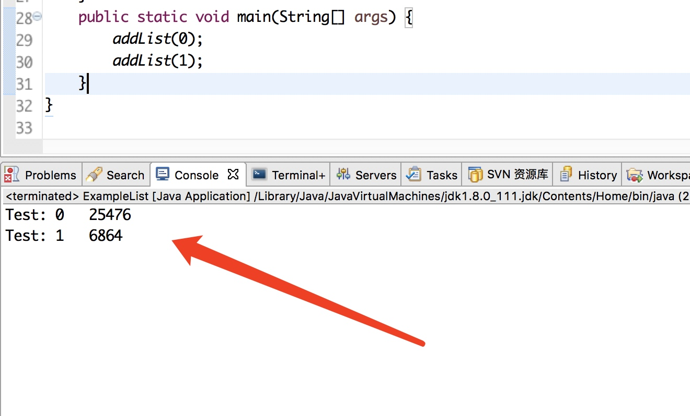
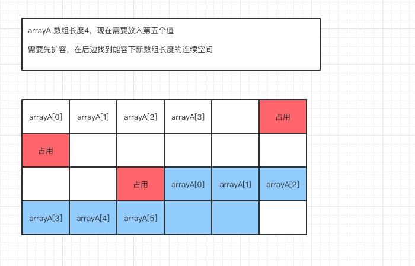
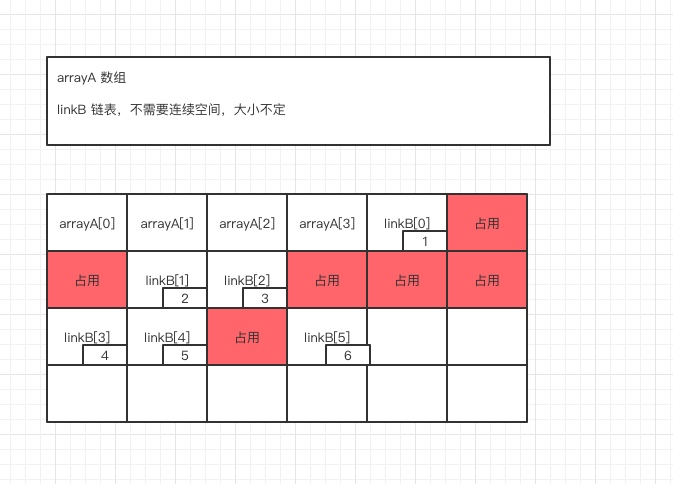
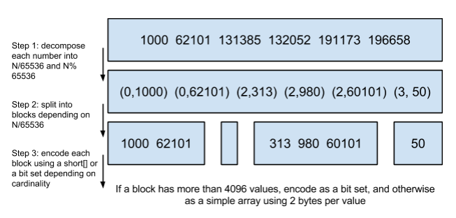
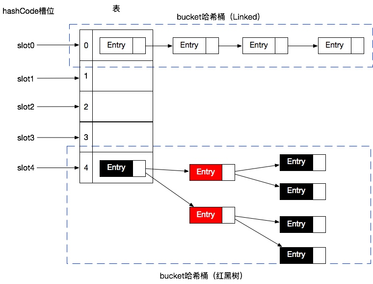

# （课堂）Java Core 技术揭秘之-数据结构与算法原理

[TOC]

## 一、课前准备

清除杂念好好听课
回顾：无

## 二、课堂主题

数据结构和算法的讲解

## 三、课堂目标

进一步学习数据结构和算法；
对数据结构算法有很贴合实际的理解；
打开学习和提升的思路

## 四、知识要点

本章节内容主要参考书籍
《图解算法》、《程序员学数据结构》、《java数据结构和算法》、《剑指offer》、《算法导论》
排序由浅入深，最好能自己看看这些内容

### 为什么（15-20分钟）

`为什么程序员要学数据结构和算法`
`为什么面试过程中好问算法`
`数据结构和算法是不是只有面试中有用`
`算法学不会而且老是忘怎么办`
`已经是架构、总监、CTO了就不需要学这些简单东西了`


接下来我们一一讲解
#### 简介

往大方面讲
程序=数据结构+算法

数据结构和算法在我们生活中无处不在

#### 举例

简单举几个例子
先说数据结构

##### 例子1--钢铁侠

钢铁侠大家看过吧，给大家举个可能不是很恰当的例子。


##### 例子2--List

```java
public static List<String> list = new ArrayList<>();
```

我们看下代码，只做一点点改变。

```java
/**
 * 此类描述的是：  
 * 数据结构算法重要性实例
 * @author: Coder_Wang 
 * @version: 2019年1月28日 下午5:03:44
 */
public class ExampleList {
	static int length = 16;
	public static List<String> listNoLength = new ArrayList<>();
	public static List<String> listLength = new ArrayList<>(length);
	public static void addList(int sign){
		long start = System.currentTimeMillis();
		for (int i = 0; i < length; i++) {
			if(sign==0){
				listNoLength.add("asdf");
			}else{
				listLength.add("asdf");
			}
		}
		long end =  System.currentTimeMillis();
		System.out.println("sign: "+ sign+"   "+(end - start));
	}
	public static void main(String[] args) {
		addList(0);
		addList(1);
	}
}
```

简单几句说下代码；




因为写的数据样本小，数字肯定会有出入。

* 细节优化
长度尽量使用2的幂作为长度，计算机分配空间大都使用次幂去分配，减少碎片空间


##### 例子3--切割字符串

平时我们的用法
```java
str.split(sign);
```
不嫌弃麻烦的有，循环substring查找
```java
str.substring(0, i)
```

我们对比下几个例子

```java
public class StringSplit {
	String str = "192.168.10.1";
	String sign = ".";
	int num = 1024;
	public void split(int num){
		long start = System.nanoTime();
		switch (num) {
		case 0:
			jdkSplit();
			break;
		case 1:
			commonSplit();
			break;
		case 2:
			tokenizerSplit();
			break;
		case 3:
			patternSplit();
			break;
		case 4:
			substringSplit();
			break;
		default:
			break;
		}
		long end = System.nanoTime();
		System.out.println("Test "+num+": " + (end - start));
	}
	//java自带的split
	public void jdkSplit() {
		str.split(sign);
	}
	//common工具包下
	public void commonSplit(){
		StringUtils.split(str,"\\.");
	}
	//tokenizer
	public void tokenizerSplit(){
		new StringTokenizer(str,".");
	}
	//pattern
	public void patternSplit(){
		Pattern pattern = Pattern.compile("\\.");
		pattern.split(str);
	}
	//substring
	public void substringSplit(){
		int k=0,count=0;
		  for (int i = 0; i < str.length(); i++) {
		   if(str.substring(i, i+1).equals(".")){
		    if(count==0){
		     System.out.print(str.substring(0, i)+"  ");
		    }else if(count==1){
		     System.out.print(str.substring(k+1, i)+"  ");
		    }else{
		     System.out.print(str.substring(k+1, i)+"  ");
		     System.out.print(str.substring(i+1, str.length())+"  ");
		    }
		    k=i;count++;
		   }
		  }
		  System.out.println();
	}
	public static void main(String[] args) {
		StringSplit split = new StringSplit();
		for (int i = 0; i < 5; i++) {
			split.split(i);
		}
	}
}
```

运行结果


* split
正则表达式切割,在所以的都完了之后返回整个数组
* tokennizer
分组返回
* substring
空间换时间,根据下标
* charAT
根据原始的String由char数组组成,所以最高效

这里就不具体讲解为什么了，每个都有自己的适用场景，大家私下可以点进去看看实现方法，截取规则算法、存储对象、对象复用等方面自己衡量下各自的好处。

还有一直更快捷的charAt 方法，自己可以下去试试效果更好


##### 例子4--田忌赛马

最简单的例子
田忌赛马

```java
import java.util.ArrayList;
import java.util.Collections;
import java.util.List;
/**
 * 
 * 此类描述的是：  
 * 贪心算法简单实现：田忌赛马
 * @author: Coder_Wang 
 * @version: 2019年1月28日 下午1:31:08
 */
public class Greedy {
	public static void main(String args[]) {
		int num = 3;
		//田忌的马
		List<Integer> list1 = new ArrayList<>(num);
		//插入值为速度
		list1.add(1);
		list1.add(3);
		list1.add(5);
		//齐威王的马
		List<Integer> list2 = new ArrayList<>(num);
		list2.add(2);
		list2.add(4);
		list2.add(6);
		while (true) {
			if (num == 0)
				break;
			// 处理数据
			Collections.sort(list1);
			Collections.sort(list2);
			int i = 0, j = 0, x = num - 1, y = num - 1, count = 0;
			boolean bLast = true;
			while (bLast) {
				// 是否是最后一匹马
				if (x == i || num<=0 ){
					bLast = false;
				}
				// 如果田忌当前最好的马可以胜齐王最好的马，那么比一场
				if (list1.get(x) > list2.get(y)) {
					num--;
					x--;
					y--;
					count += 200;
				// 如果田忌当前最差的马可以胜齐王最差的马，那么比一场
				} else if (list1.get(i) > list2.get(j)) {
					num--;
					i++;
					j++;
					count += 200;
				// 否则，让田忌最差的马和齐王最好的好比一场
				} else {
					if (list1.get(i) < list2.get(y)){
						count -= 200;
					}
					i++;
					y--;
					num--;
				}
			}
			System.out.println(count);
			list1.clear();
			list2.clear();
		}

	}
}
```

#### 归纳

架构、总监就不需要这些东西了？

* 程序中的一些点
集合对象，内容处理，对象转换；
数据库字段类型，对jvm的影响
等等太多了。。。

* 架构中的一些点
DB，缓存，索引；
数据分片，负载，选主；
各种框架、中间件和底层系统；
等等太多了。。。


#### 问题解答

接下来我们再解释下刚才的几个问题

`为什么程序员要学数据结构和算法`
`为什么面试过程中好问算法`
`数据结构和算法是不是只有面试中有用`
`算法学不会而且老是忘怎么办`
`已经是架构、总监、CTO了就不需要学这些简单东西了`

#### 小结--每一行代码都是心血

做为一个程序员或者架构，要对代码用心，有工匠精神！

把代码洁癖当初一种习惯！

好的代码或者架构，数据结构和算法必须考虑到位，否则会bug百出。


### 讲解步骤

时间复杂度>数据结构>算法>面试题

### 时间复杂度（10-15分钟）

####  大O符号

wiki能翻墙的可以看看这个解释

```url
https://zh.wikipedia.org/wiki/%E6%97%B6%E9%97%B4%E5%A4%8D%E6%9D%82%E5%BA%A6
```

写的还可以的博客

```url
https://blog.csdn.net/yuhk231/article/details/60099774
https://blog.csdn.net/u010297957/article/details/51016782
```

图表
```url
http://bigocheatsheet.com/
```
生成图表地址
```url
https://zh.numberempire.com/graphingcalculator.php
```

##### 简介

大O是个数学符号，对于我们程序员来说就可以直接理解为时间复杂度的记录符号

百度百科大O的解释

```url
https://baike.baidu.com/item/%E5%A4%A7O%E7%AC%A6%E5%8F%B7/656100
```

| 符号              | 名称                               |
| ------------------- | ------------------------------------ |
| O(1)                | 常数（阶，下同）             |
| O(log*n)            | 迭代对数                         |
| O(log n)            | 对数                               |
| O[(log n)^c]        | 多对数                            |
| O(n)                | 线性，次线性                   |
| O(n log n)          | 线性对数，或对数线性、拟线性、超线性 |
| O(n^2)              | 平方                               |
| O(n^c),Integer(c>1) | 多项式，有时叫作“代数”（阶） |
| O(c^n)              | 指数，有时叫作“几何”（阶） |
| O(n!)               | 阶乘，有时叫做“组合”（阶） |
| 符号              | 名称                               |
| O(1)                | 常数（阶，下同）             |
| O(log*n)            | 迭代对数                         |
| O(log n)            | 对数                               |
| O[(log n)^c]        | 多对数                            |
| O(n)                | 线性，次线性                   |
| O(n log n)          | 线性对数，或对数线性、拟线性、超线性 |
| O(n^2)              | 平方                               |
| O(n^c),Integer(c>1) | 多项式，有时叫作“代数”（阶） |
| O(c^n)              | 指数，有时叫作“几何”（阶） |
| O(n!)               | 阶乘，有时叫做“组合”（阶） |


```java
```
**工程文件见 `com.kkb.`**

##### O(1)


###### 讲解


* 解释
时间复杂度和原数据模型无关，哪怕上亿数据也是一次取出

* 应用
数组中根据下标查找数据就是O(1)
哈希表就是理论上也是，只需要换算下hash值

* 执行次数
N=10，大约执行1次
N=100，大约执行1次
N=1000，大约执行1次
N=10000，大约执行1次

###### 代码实现

```java
/**
	 * O(1)
	 * 常数阶，无论数据多大只需要一次
	 */
	Integer getO1(){
		return orgInts[0];
	}
```
**工程文件见 `com.kkb.`**

##### O(n)


* 解释
算法复杂度和问题规模是线性关系。数据越大次数越多，成正比增长。

* 应用
链表的读取某个值就是O(n)

* 执行次数
N=10，大约执行10次
N=100，大约执行100次
N=1000，大约执行1000次
N=10000，大约执行10000次

```java
/**
	 * O(n)
	 * 线性阶，运算次数等同数据大小（案例的最坏评估）
	 */
	Integer getOn(){
		for (int i = 0; i < orgInts.length; i++) {
			if(orgInts[i]==10){
				return orgInts[i];
			}
		}
		return null;
	}
```
**工程文件见 `com.kkb.`**

##### O(logn)


* 解释
算法复杂度和问题规模是对数关系。
当数据增大时消耗的时间少量增加，比如2增加到2^10时，消耗时间/空间只增加10倍


* 应用
二叉树查找


* 执行次数
底数为2的情况
N=10，大约执行3次
N=100，大约执行7次
N=1000，大约执行10次
N=10000，大约执行13次

```java
/**
	 * O(logn)
	 */
	Integer getLogN(){
		int n = 1000;
		int number = 1;
		// 语句执行logn次
		while (number < n) { 
		  /**
		   * 这里的2是log的底数
		   * 底数在大O符号中是省去的
		   */
		  number *= 2;
		}
		return number;
	}
```
**工程文件见 `com.kkb.`**

##### O(nlogn)


* 解释
二分的话说logn,二分之后再往下分就是nlogn

n(1 +1/2+1/3 +1/4 + 1/5+ 1/6+1/7+1/8 +...1/n)
=n(ln(n+1) + r)
=nln(n+1)+rn

* 应用
快速排序是nlogn；下边详细讲解排序。

* 执行次数
底数为2的情况
N=10，大约执行30次
N=100，大约执行700次
N=1000，大约执行10000次
N=10000，大约执行130000次


##### O(n²/n^2)


* 解释
计算的复杂度随着样本个数的平方数增长。

* 应用
这个例子在算法里面，就是那一群比较挫的排序，比如冒泡等等。 

* 执行次数
N=10，大约执行100次
N=100，大约执行10000次
N=1000，大约执行1000000次
N=10000，大约执行100000000次

```java
/**
	 * O(n²/n^2)
	 * 如果是三层循环就是n的三次方，n次就是n次方
	 */
	Integer getN2(){
		for (int i = 0; i < orgInts.length; i++) {
			for (int j = orgInts.length -1 ; j >= 0; j--) {
				if(orgInts[i]==orgInts[j]){
					return orgInts[i];
				}
			}
		}
		return null;
	}
```
**工程文件见 `com.kkb.`**

##### O(2^n)


* 解释
一个算法的运行时间是指数级的
* 应用

* 执行次数
N=10，大约执行1024次
N=100，大约执行2^100次
N=1000，大约执行2^1000次
N=10000，大约执行2^10000次

```java
/**
	 * O(2^n)
	 * 表示数字每增大一次运算会增大两倍
	 */
	Integer get2n(int number)
	{
	    if (number <= 1){ 
	    	return number;
	    }
	    return get2n(number - 2) + get2n(number - 1);
	}
```
**工程文件见 `com.kkb.`**


O(1) < O(logn) < O(n) < O(nlogn) < O(n^2) < O(n^3) <O(2^n) < O(n!) <O(n^n)


### 数据结构（30-40分钟）

java常见数据结构
数组Array，栈Stack，队列Queue，链表Linked List，树Tree，哈希表Hash，堆Heap，图Graph


#### 线性结构

##### 数组和链表（10分钟）

一篇写的不错的博客(内容来着《图解算法》)
```url
https://www.cnblogs.com/jiqing9006/p/7615467.html
```


###### 基础介绍

数组在内存中的地址是连续相邻的，而链表在内存的地址是散列的，不连续的。

###### 数组

以下是数组在内存中存储结构，和扩容过程。



* 新增数据空间判断
新增数据的时候需要判断当前是否有空闲空间存储数据
* 扩容需要申请新的连续空闲空间
上图为例，长度4需要扩容到8。必须找到长度为8的空间才能新建扩容数组。
* 把老的数组复制过去
* 新加内容
* 回收老的数组空间


###### 链表



* 不需要连续空间
* 大小不定


###### 对比

* 时间复杂度

| 操作   | 数组 | 链表 |
| -------- | ---- | ---- |
| 随机访问 | O(1) | O(N) |
| 头部插入 | O(N) | O(1) |
| 头部删除 | O(N) | O(1) |
| 尾部插入 | O(1) | O(1) |
| 尾部删除 | O(1) | O(1) |

* 同样查找都是O(n)数组遍历比链表快
因为数组的连续内存，会有一部分或全部数据一起进入到CPU缓存，而链表还需要再去内存中根据上下标查找；CPU缓存比内存快太多。

* 小结
数组大小固定，不适合动态存储，动态添加，内存为一连续的地址，可随机访问，查询较快，
而链表大小可变，扩展性强，只能顺着指针的方向查询，速度较慢

###### 应用

* 数组
有序数组，无序数组，多维数组，矩阵等等
* 链表
单链表，双向链表，循环链表，双向循环链表


##### 栈和队列（3到5分钟）

栈和队列是都是可以基于数组或链表实现的数据结构

###### 栈


先进后出，FILO（First-In Last-Out）
插入、删除操作都只能在对顶端数据操作


* 应用
顺序栈（数组），链式栈（链表）
前、中、后缀式表达式用于计算（私下看）


###### 队列
先进先出，FIFO（First-In First-Out）


* 应用
普通队列（数组和链表都可以实现），双端队列，阻塞队列，并发队列等

#### 散列表

##### 位图

#### bitmap

该数据结构是以空间换时间为概念
例如：
    [1,3,5,6,9,10]
转换后为
    [1,0,1,0,1,1,0,0,1,1]
就是把存储最大数长的大数组，每个数字对应自己数字的位数，5对应第5位，10对应第10位，0或表示是否存在。
* 优点
 省下大数字占的空间，查询快
* 缺点
 数字太大空间会变大，而且如果数字间空隙大太浪费空间

#### Roaring bitmaps

解决了bitmap空间不断拉长的缺点
将数据按照区块划分，第一个存储0~65535，第二个存储65536~131071，以此类推。然后再用<商，余数>的结构存储。

* 具体步骤
 1. 计算出数字N/65536和N%65536
 2. 根据商划分区块
 3. 分块存储

* 应用
上边最后一句话
```
If a block has more than 4096 values, encode as a bit set, and otherwise as a simple array using 2 bytes per value”
```
如果是大块超过4096，用节省点用bitset存，小块就豪爽点，2个字节我也不计较了，用一个short[]存着方便。
4096 因为bitmap需要的空间是恒定的: 65536/8 = 8192bytes
8192能存4096大小的数组，如果大于4096那么空间肯定使用比bitmap大


###### 应用

redis，es
大的方面：布隆过滤器，HeperLogLog

##### 哈希表


###### 哈希冲突解决方案

* 开放地址
 * 线性探测再散列
dii=1，2，3，…，m-1
顺序查看表中下一单元，直到找出一个空单元或查遍全表
 * 二次探测再散列
 di=1²，-1²，2²，-2²，…，k²，-k²    ( k<=m/2 )
 冲突时前后找，先找后边1的平方，再找前边1的平方，没有就加1继续找
 * 伪随机探测再散列
 随机找一个hash值
* 再哈希
重新用其他的方式计算一遍hash，计算hash的方法好多种算法
* 链地址
hashMap
* 建立公共溢出区
把冲突的放到一个地方，统一用其他方案处理

##### hashMap

###### 实现结构


* 继承关系

 ```java
public class HashMap<K,V>extends AbstractMap<K,V>
    implements Map<K,V>, Cloneable, Serializable
```

* 接口实现

 ```java
Serializable, Cloneable, Map<K,V> 
```

* 基本属性

 ```java
static final int DEFAULT_INITIAL_CAPACITY = 1 << 4; //默认初始化大小 16 
static final float DEFAULT_LOAD_FACTOR = 0.75f;     //负载因子0.75
static final Entry<?,?>[] EMPTY_TABLE = {};         //初始化的默认数组
transient int size;     //HashMap中元素的数量
int threshold;          //判断是否需要调整HashMap的容量
```


###### 存储结构

* 结构图


* 解释
数组加链表存储结构，1.8以后当后边链表大于8的时候转换成红黑树（树章节中专门讲解红黑树）

* 插入逻辑图


###### 环形链表

* 扩容代码

 ```java
 void resize(int newCapacity) {
        Entry[] oldTable = table;
        int oldCapacity = oldTable.length;
        if (oldCapacity == MAXIMUM_CAPACITY) {
            threshold = Integer.MAX_VALUE;
            return;
        }
         Entry[] newTable = new Entry[newCapacity];
        transfer(newTable, initHashSeedAsNeeded(newCapacity));
        table = newTable;
        threshold = (int)Math.min(newCapacity * loadFactor, MAXIMUM_CAPACITY + 1);
    }
```
 
 ```java
 /**
     * Transfers all entries from current table to newTable.
     */
    void transfer(Entry[] newTable, boolean rehash) {
        int newCapacity = newTable.length;
        for (Entry<K,V> e : table) {
            while(null != e) {
                Entry<K,V> next = e.next;
                if (rehash) {
                    e.hash = null == e.key ? 0 : hash(e.key);
                }
                int i = indexFor(e.hash, newCapacity);
                e.next = newTable[i];
                newTable[i] = e;
                e = next;
            }
        }
    }
```


* 原理
hashMap在达到扩容因子的时候会扩容（length*0.75）；
扩大一倍，扩容时会重新计算在数组中得位置，
当第一个线程开始扩容的时候，读取了hash值对应链表顺序读取复制到新的hash位置的链头；原来的顺序是A、B，复制过去后的顺序就是B、A，对线程一来说A的next是null，B的next是A；
这时第二个线程进来，读取的可能就是A的next是B，这样就造成了环形链表死循环。

* 图解


设原始长度为4，现在有3个对象，添加第四个的时候达到了扩容阀值；

线程A正常扩容，数据正确复制到新表，但是线程B，在读取EntryB的时候读取到了线程A刚刚修改的Entry，应该读取的原EntryB的next说C，但是现在是A；EntryA还是原来的EntryA，指向了B，所以造成了环形链表。

引起错误的原因是transfer方法中table不是局部变量；
以下代码直接造成两条线程读取错乱
 ```java
e.next = newTable[i];
newTable[i] = e;
```


###### 其他问题

并发操作，扩容时，老表允许插入，新插入的对象在迁移对象中没有，会造成数据丢失
并发操作，每个线程都会建立新表对象然后往共享变量赋值，会造成其他线程的新表数据丢失
并发操作，导致链表头数据被覆盖，数据丢失
并发操作，next赋值错误，为null，或者链接到头部造成环形链表


###### 改进办法

* 扩容顺序
7 是先扩容后增加元素，8是先增加元素后扩容

* 插入顺序
在jdk8之前是插入头部的，在jdk1.8中是插入尾部的

###### 小结

虽然jdk8对HashMap的几个明显bug做了修复，但是介于不是安全线程，并发情况下还是会有很多问题，<font color=#FF0000> 如果涉及到并发一定要使用concurrenthashmap</font> 。

concurrenthashmap会在并发课程中讲解。

<font color=#FF0000> 最好点进去看看源码</font>

#### 树状结构

字典树 
##### 二叉树

!!!画图

##### AVL

!!!画图
##### 红黑树
!!!画图
规则
旋转过程
!!!画图
于AVL区别

#### 图状结构
!!!画图
##### 最小生成树
!!!画图
##### 最短路径

!!!画图

### 常规算法

#### 排序

像冒泡插、插入、选择排序这些简单的排序就不讲了

##### 快速（10分钟）

面试中可能会遇到让手写快排

动态图

讲解下代码实现，步骤图片讲解
!!!画图


##### 归并


#### 贪心
#### 分治
#### 动态规则
#### 回溯
#### 搜索 （5分钟）
深度搜索，广度搜索，A*

加几个图简单说一下搜索逻辑


### 面试题分析

数字重复次数

判断链表回环
https://blog.csdn.net/lonelyrains/article/details/49334141

求幂


#### 求平方根

二分法、牛顿迭代法

最下边是最优解，动态规划

```java
public static void main(String[] args) {
        long start = System.currentTimeMillis();
        double target=9876543212345d;
        double result =sqrt(target);
        System.out.println("sqrt耗时："+(System.currentTimeMillis()-start)+",result:"+result);
        
        start=System.currentTimeMillis();
        result =SqrtByBisection(target, 0);
        System.out.println("SqrtByBisection耗时："+(System.currentTimeMillis()-start)+",result:"+result);
        
        start=System.currentTimeMillis();
        result = SqrtByNewton(target, 0);
        System.out.println("SqrtByNewton耗时："+(System.currentTimeMillis()-start)+",result:"+result);

    }
    
    //牛顿迭代法
    public static double SqrtByNewton(double target,double eps){
        double Xa=target,Xb;
        do {
            Xb = Xa;
            Xa = (Xa+target/Xa)/2;
        } while (fabsf(Xa,Xb)>eps);
        return Xa;
    }

    //二分法  精度是指两次mid值的差值
    public static double SqrtByBisection(double target,double eps){
        double min=1,max=target;
        double mid =(min+max)/2;
        double anMid;
        do {
            if(mid*mid>target){
                max=mid;
            }else{
                min=mid;
            }
            anMid=mid;
            mid=(max+min)/2;
        } while (fabsf(anMid,mid)>eps);
        return mid;
    }
    
    
    public static double sqrt(double d){
        double a = 0.1;
        double x1,x2=0;
        while (a*a<=d) {
            a+=0.1;
        }
         x1=a;
        for (int i = 0; i < 10; i++) {
            x2=d;
            x2/=x1;
            x2+=x1;
            x2/=2;
            x1=x2;
        }
        return x2;
    }
    
    public static double fabsf(double a,double b){
        if(a>b){
            return a-b;
        }else
            return b-a;
    }
```

#### 判断循环链表

最优的时间复杂度，两个指针，一个快一个慢，如果遇到了就是环形。
```java
 public boolean isLoop(Node head){
        Node slow = head;
        Node fast = head;
        while(fast!=null && fast.next!=null)
        {
            slow = slow.next;
            fast = fast.next.next;
            if(slow==fast)
                return true;
        }

        return false;
    }
```

#### 能否快速找出一个数组中的两个数字的和

最优解法，先排好序，然后从两个中位数开始相加，如果小了大的一边的数字往大的方向移动，小了小的数组往小的方向移动。时间复杂度是O（n）
```java
int getSumNum(int[] arr,int Sum)，   //arr为数组，Sum为和
{
    int i,j;
    for(i = 0, j = n-1; i < j ; )
    {
        if(arr[i] + arr[j] == Sum)
            return ( i , j );
        else if(arr[i] + arr[j] < Sum)
            i++;
        else
            j--;
    }
    return ( -1 , -1 );
}
```

* 参考文献

 ```url
https://www.cnblogs.com/kongk/p/8673837.html
```

画图软件
PPT，在线的processon，苹果下的Omnigraffle


## 课后作业
string几种切割方式，看看源码对比下
课堂上讲的快速排序，熟练的写出来
后边的几道面试题，自己写出来